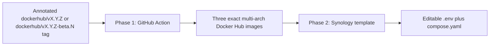

# Tagged Docker Hub and Synology Template Design

Status: Draft
Requirements: [requirements.md](requirements.md)

## Delivery shape

The work has two tracer-bullet phases. Each phase has one observable outcome, a narrow file boundary, and no publication beyond the action authorized in that phase.

## Phase 1 — Tagged Docker Hub publication

**Outcome:** creating an accepted annotated Git tag publishes exactly three immutable multi-platform images to Docker Hub.

The new, independent `.github/workflows/publish-dockerhub.yml` workflow runs on a Git tag push only. It does not modify, invoke, or replace the current private-registry/self-hosted publication route. Its first job checks the annotated-tag object, strict semantic-tag grammar, `main` ancestry, and whether each Docker Hub destination image tag already exists. Only after those checks pass may a GitHub-hosted runner log in to Docker Hub and run Buildx.

The build matrix is fixed to `linux/amd64,linux/arm64`. It produces API, PWA, and database-migration images, each tagged only with the exact version derived from the Git tag. It does not add `latest`, major/minor aliases, or beta promotion behavior.

The workflow requires a Docker Hub username and token stored as GitHub secrets. It has no Docker Hub, GitHub Release, or NAS mutation during implementation tests; a real accepted tag is the separately authorized production publication action.

`task release:dockerhub:tag` is the operator entry point for the next stable release; `task release:dockerhub:beta` is the corresponding beta entry point. Both fetch tags, calculate the next SemVer tag, perform local and remote preflight checks, show the derived tag and `HEAD`, then ask for confirmation before creating and pushing the annotated tag. They do not build or push an image themselves; GitHub Actions owns image publication after the tag push.

## Phase 2 — Synology Project template

**Outcome:** a user can download or copy one small directory, edit its `.env`, and create one Synology Container Manager Project.

The release-template source keeps `compose.yaml` and `.env.example` together. Because repository policy ignores real `.env` files, a release-assembly step copies the safe example to `.env` in the distributable directory. The tracked source never contains an operator secret.

The `.env` starts with the three required operator values—`POSTGRES_PASSWORD`, `HEARTH_SECRET`, and `GEMINI_API_KEY`—with clear placeholder values and no intervening defaults. A second defaults block follows, prefilled with the release version, HTTP port, and release-tested model identifiers.

Compose is intentionally self-contained:

- Traefik is the sole ingress and binds one configurable HTTP port.
- Traefik routes `/api` and `/api/stream` to the API; it routes all remaining paths to the PWA.
- API, PWA, migration, and PostgreSQL communicate over an internal network.
- PostgreSQL and application files use relative bind mounts below `./data`.
- API waits for a healthy database and completed migration.
- The application images use `brisebois/...:${WFS_VERSION}`; PostgreSQL/pgvector and Traefik use explicit, recorded tags or digests selected during this phase.

The template is LAN HTTP only. It makes no assertion about remote access or cookie security.

## Deliberately deferred seams

Existing contributor Compose files, Taskfile publication tasks, the private-registry/self-hosted publication workflow, and live NAS configuration remain unchanged unless a phase explicitly needs a small read-only compatibility input. They are not the source of truth for the new template.

The later public-release work may add recovery, security, Cloudflare, runtime PWA configuration, artifact signing, and physical NAS qualification as separate tracer bullets. It must not be smuggled into either phase here.

## Verification boundary

Workflow/unit assertions establish tag and workflow behavior. Compose rendering establishes only the template’s declared structure. Neither proves Docker Hub availability, a real pull, a running NAS, authentication, Gemini access, or recovery.
