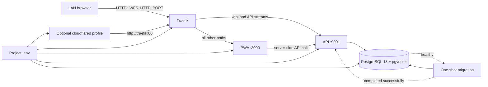
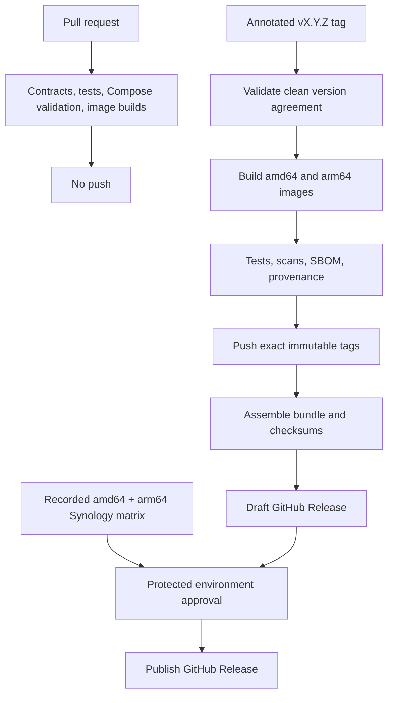

# Public Synology Release Design

Status: Draft implementation design  
Requirements: [requirements.md](requirements.md)

## 1. Deployment architecture

Traefik is the only public ingress. Its rules must use paths, not a required hostname. Cloudflare joins the same internal network only when its profile is enabled. The Cloudflare dashboard owns DNS/public-hostname routing.

## 2. Compose design

Create a release-owned canonical `compose.yaml`; do not expose generated contributor Compose as the public contract.

Required properties:

- fixed Docker Hub repository names and `${WFS_VERSION:?}` exact tags;
- one port binding, `${WFS_HTTP_PORT:-9100}:80`, on Traefik;
- no Docker socket or insecure Traefik dashboard exposure;
- internal-only service ports via `expose` only where useful for documentation;
- one private application network;
- relative bind mounts `./data/postgres`, `./data/app`, and `./backups`;
- health checks for database, API, and PWA;
- migration dependency using `service_completed_successfully` before API start;
- optional cloudflared service under `profiles: [cloudflare]`;
- Compose validation that rejects a selected Cloudflare profile with no token;
- exact pins for Traefik, cloudflared, and PostgreSQL/pgvector, preferably manifest digests recorded in release metadata;
- no LAN dependency on `DOMAIN_NAME`, CORS lists, cookie domain, internal host variables, or private registry variables.

The release assembly process substitutes the release version into `.env.example` and verifies that the archive, Compose image tags, Git tag, image labels, and GitHub Release version agree.

## 3. Runtime configuration design

### 3.1 Server-owned configuration

Move browser-visible runtime choices out of build-time `NEXT_PUBLIC_*` variables. A single PWA server module must:

1. parse `WFS_DEFAULT_LOCALE`, `WFS_AISLE_ORDER`, `WFS_ENABLE_AGENT_SEARCH`, and `WFS_ENABLE_PHOTO_SEARCH` from `process.env` at server runtime;
2. validate them with one schema and apply only documented defaults;
3. pass the resulting non-secret object from the root server layout into a client `RuntimeConfigProvider`;
4. ensure the route/layout is dynamically evaluated so image-build values cannot be captured;
5. make components consume the provider rather than direct `process.env.NEXT_PUBLIC_*` references.

This server-to-provider design keeps SSR and hydration aligned and does not create a public configuration endpoint. Tests must start the same built image with two different environment sets and observe changed UI behavior without rebuilding.

### 3.2 Derived internal configuration

Compose supplies fixed internal values directly to containers:

- PWA server API URL: `http://api:9001`;
- browser API base: same origin;
- API data root: `/data`;
- database host/port: `postgres:5432`;
- connection string: composed from `POSTGRES_USER`, `POSTGRES_PASSWORD`, and `POSTGRES_DB`;
- production runtime modes.

Do not place the full connection string in `.env`. Add validation/tests preventing `/` from producing protocol-relative `//api/...` URLs.

## 4. Authentication and proxy behavior

Traefik must replace the client-supplied forwarding headers and pass trusted `X-Forwarded-Proto`/host information. Authentication code must determine secure-cookie behavior from the effective trusted protocol:

- LAN HTTP: host-only cookie without `Secure`, with the existing appropriate `HttpOnly` and `SameSite` controls;
- Cloudflare HTTPS: host-only `Secure` cookie;
- untrusted direct forwarding headers must not downgrade or upgrade cookie security.

Before exposure outside the LAN, implement and verify Hearth passphrase strength rules, login throttling, invite expiry/revocation, secret redaction, and a minimal anonymous liveness response. Detailed dependency/schema state belongs behind authentication or in container logs.

## 5. First-run and readiness design

The database is initialized empty. Migration completes before API readiness. The first unauthenticated application visit follows the existing first-member onboarding seam; normal installs never enable demo restore behavior implicitly.

Readiness is layered:

- container health: process responds;
- database health: PostgreSQL accepts connections;
- schema readiness: migration for the target version completed;
- application readiness: API and PWA can serve the supported path;
- integration diagnostics: Gemini and optional Cloudflare are reported separately and do not make the core application crash after startup.

The setup guide must tell the operator what state to wait for and exactly where Container Manager shows it.

## 6. Gemini design

Keep the current Gemini Developer API integration, with runtime key and model identifiers. Add a protected configuration test that performs the smallest safe request needed to categorize:

- missing/malformed key;
- API/key restriction or permission failure;
- billing/quota exhaustion;
- unavailable or unauthorized model;
- network/endpoint failure.

Never return the key or place it in a request URL/log. The application continues serving non-AI features during later Gemini failures. Release qualification records the tested model IDs because preview identifiers can change independently of the application.

## 7. Storage, backup, restore, and rollback

PostgreSQL owns relational state; `data/app` owns application files. The beta documentation must use version-matched PostgreSQL client tooling to create a custom-format logical dump in `backups/`, record a checksum, and restore into a clean database before running target migrations.

The restore proof must verify more than container health: authenticate, count/inspect representative household and recipe data, load a recipe, and run a post-restore application smoke test. Document that an application export is not a complete database dump and that Hyper Backup of a live database directory is not automatically transaction-consistent.

Each release classifies its schema change:

- **Backward-compatible:** previous application image may be redeployed without database restore.
- **Restore-required:** rollback means stopping the Project, restoring the pre-upgrade logical backup, setting the previous `WFS_VERSION`, and redeploying.

Automated helpers and UI controls remain roadmap items.

## 8. Release pipeline design

The workflow must authenticate to Docker Hub using repository/environment secrets, never credentials committed to the repository. It must fail if a remote exact tag already exists. Image metadata must identify source repository, revision, version, license, and description. Security scanning policy needs explicit severity handling and a documented exception process rather than silent ignores.

## 9. Documentation information architecture

- Root `README.md`: product overview, beta warning, supported platforms, link to latest release—not raw Compose instructions.
- Bundle `README.md`: choose LAN quick start or optional Cloudflare.
- `SETUP-SYNOLOGY.md`: numbered happy path only, including Gemini prerequisites and first login.
- `CLOUDFLARE.md`: dashboard-managed tunnel and public hostname steps.
- `BACKUP-RESTORE.md`: manual logical backup, verification, clean restore, Hyper Backup distinction.
- `UPDATE-ROLLBACK.md`: backup-first manual redeploy, smoke checks, schema compatibility.
- `TROUBLESHOOTING.md`: symptom-first checks for ports, permissions, migrations, database, Gemini, and tunnel.
- Docker Hub descriptions: image role, no standalone run instructions, canonical bundle link.

Critical commands and UI labels must be exercised from a clean extracted bundle. Screenshots are optional.

## 10. Documentation drift program

### Beta-blocking reconciliation

| Surface | Required update |
|---|---|
| `README.md` | Replace clone/private-deployment assumptions with the public bundle path; repair moved `.kiro/specs` links; align versions and prerequisites. |
| `DEPLOY.md` | Replace contradictory working directories, `git pull` updates, incomplete backup claims, and private Compose assumptions with links to the canonical release guides. |
| `docker/.env.example` | Replace private registry/dev credentials, typoed model defaults, redundant connection string, build-time-only settings, and personal paths with the R5 contract. |
| `docker/docker-compose.nas.yml` | Reconcile with or retire in favor of canonical public Compose; remove exposed internal ports and mandatory Cloudflare/domain assumptions. |
| `docker/docker-compose.prod.yml` | Fix nonexistent dynamic-config mount and declare whether generated/internal; prevent it competing with public Compose. |
| `docker/compose/*.yml` | Align modular source, generated output, mounts, pins, profiles, health, and env propagation. |
| `.github/workflows/publish.yml` | Remove maintainer repository guard, private BuildKit registry, self-hosted-only assumptions, default-amd64 behavior, mutable aliases, and absent Docker Hub authentication. |
| `Taskfile.yml` | Separate contributor/private tasks from public release assembly and exact-tag publication; remove LAN registry as public default. |
| `LOCAL_DEV_LOOP.md` | Remove personal `file:///Users/...`, private IP/registry, and obsolete `/backend` guidance. Keep it explicitly contributor-only. |
| `specs/01_FRONTEND/frontend-pwa.spec.md` | Reconcile “authoritative” claims, Next version, runtime config, routing, and current UI behavior. |
| `specs/02_BACKEND/backend-api.spec.md` | Reconcile runtime, health/auth, database, workflow, and deployment claims. |
| `specs/03_AI_WORKER/ai-worker.spec.md` | Remove or supersede Ollama/local-worker architecture in favor of current Gemini/workflow behavior. |
| `specs/00_STRATEGY/ROADMAP.md` | Align .NET 11 status, Gemini architecture, public beta, backup automation roadmap, and PostgreSQL 19 migration. |
| ADR 004 | Mark the accepted local Gemma/Redis direction superseded where it conflicts with current Gemini/database-polling implementation. |
| ADR 006 | Reconcile .NET/container versions with ADR 043 and current runtime. |
| ADR 011 | Supersede proposed polling-only/no-SSE claims that conflict with current SSE behavior. |
| ADR 036 | Update downstream documents still referring to removed `/backend` routing. |
| ADR 043 | Add beta/stable publication implications and .NET 11 GA exit criterion. |
| Public user/flow guides | Repair moved/archive links and verify current navigation, Recycle Bin location, and feature status. |

### Post-beta archive normalization

- inventory `specs/prompts` for obsolete Ollama/provider assumptions and personal paths;
- consolidate multiple archive locations, including the misspelled `specs/plans/arcive`;
- label historical specifications as historical and remove false authority claims;
- execute approved Death Proposals only after verbatim salvage and reference scans.

### Recurrence prevention

CI must run a Markdown link checker plus deterministic assertions that compare documented versions, image repositories, Compose variables, release bundle contents, and `.env.example` keys to their machine-readable sources.

## 11. Verification strategy

Automated checks:

- render canonical Compose for LAN and Cloudflare profiles;
- reject blank/placeholder secrets and invalid runtime configuration;
- build and inspect both application architectures;
- exercise fresh database initialization and repeated idempotent startup;
- verify migration failure blocks API readiness;
- test LAN/Cloudflare proxy and cookie behavior;
- run runtime-config tests against one built PWA image with different environments;
- test Gemini error mapping without exposing credentials;
- check bundle contents, checksums, image/version agreement, links, and forbidden private strings;
- scan images and generate/verify SBOM and provenance artifacts.

Manual physical-NAS checks are defined in R15 and recorded in a versioned release-candidate checklist.

## 12. Design constraints and stop conditions

- Do not retrofit the maintainer's private deployment as the public installer.
- Do not add an installation wizard for the beta.
- Do not implement automated or UI backup/restore in the beta.
- Do not expose internal service ports as a convenience.
- Do not claim Cloudflare or Gemini readiness from Compose rendering alone.
- Stop and amend this design if runtime configuration requires exposing secrets, if rollback cannot be made deterministic, or if an infrastructure image lacks a supported architecture.
