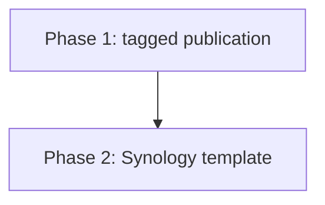

# Tagged Docker Hub and Synology Template Workstream Map

## Spec manifest

- [Requirements](requirements.md)
- [Design](design.md)
- [Tasks](tasks.md)

## Dependency and ownership

| Phase | Single outcome | Primary ownership | Stop boundary |
|---|---|---|---|
| 1 | Exact stable/beta multi-arch Docker Hub images from an annotated Git tag | New independent Docker Hub workflow and its focused tests | Do not alter the existing private publication route or create a real tag while implementing. |
| 2 | LAN-only Synology Project template with one editable `.env` | New template directory and focused Compose tests | Do not modify contributor deployment, application code, or a live NAS. |

## Launch rule

Execute Phase 1 first. Select Phase 2 only after its image-name and version-mapping outputs are recorded. A later public-release specification owns all deferred hardening and qualification work.
