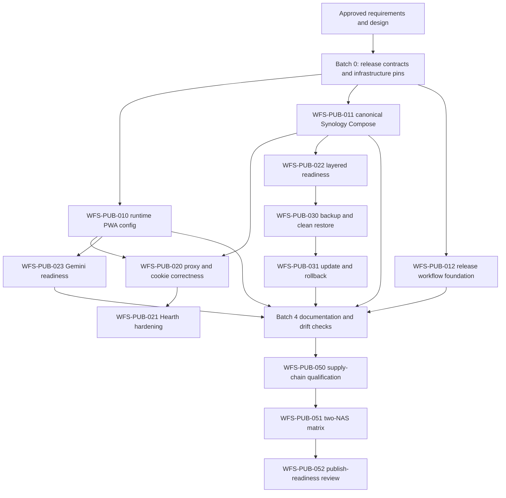

# Public Synology Release Workstream Map

## Dependency graph



## Spec manifest

- [Requirements](requirements.md)
- [Design](design.md)
- [Tasks](tasks.md)

## Batch model map

| Workstream | Model | Reason |
|---|---|---|
| WFS-PUB-001 | `MEDIUM_REQUIRED` | Several release files must form one deterministic contract. |
| WFS-PUB-002 | `MEDIUM_REQUIRED` | External manifest/licensing evidence and two architectures require judgment. |
| WFS-PUB-010 | `MEDIUM_REQUIRED` | A focused PWA slice crosses server rendering, client context, and consumers. |
| WFS-PUB-011 | `MEDIUM_REQUIRED` | Compose, routing, storage, profiles, and Synology semantics interact. |
| WFS-PUB-012 | `MEDIUM_REQUIRED` | CI release logic has external-state and supply-chain boundaries. |
| WFS-PUB-020 | `MEDIUM_REQUIRED` | Trusted proxy and cookie behavior spans runtime and browser tests. |
| WFS-PUB-021 | `LARGE_REQUIRED` | Auth hardening may change API contracts and security behavior. |
| WFS-PUB-022 | `MEDIUM_REQUIRED` | Readiness spans API, migration, Compose, and failure injection. |
| WFS-PUB-023 | `MEDIUM_REQUIRED` | External error semantics require careful mapping and stubs. |
| WFS-PUB-030 | `MEDIUM_REQUIRED` | Data recovery needs operator docs plus physical proof. |
| WFS-PUB-031 | `MEDIUM_REQUIRED` | Schema compatibility controls the rollback path. |
| WFS-PUB-040 | `MEDIUM_REQUIRED` | Broad prose surface, but bounded to public/operator docs. |
| WFS-PUB-041 | `LARGE_REQUIRED` | Authority and ADR reconciliation has repo-wide historical implications. |
| WFS-PUB-042 | `MEDIUM_REQUIRED` | UI truth and moved references must be jointly verified. |
| WFS-PUB-043 | `MEDIUM_REQUIRED` | Several machine-readable sources require coordinated assertions. |
| WFS-PUB-050 | `MEDIUM_REQUIRED` | Multi-platform supply-chain evidence spans several tools. |
| WFS-PUB-051 | `LARGE_REQUIRED` | Physical two-device qualification is long-running and stateful. |
| WFS-PUB-052 | `LARGE_REQUIRED` | Final traceability and external publication authority have high blast radius. |

## First executable batch — engine Task payloads

These payloads are intentionally implementation-bounded. WFS-PUB-001 must establish the exact release-source paths before launching WFS-PUB-010 through WFS-PUB-012; replace path placeholders below with its recorded outputs.

### WFS-PUB-010

```yaml
id: WFS-PUB-010
title: Make public PWA settings runtime configurable
model_label: MEDIUM_REQUIRED
why_this_model: Server rendering, hydration, four consumers, and image-runtime proof require coordinated PWA reasoning.
launch_targets: [kiro, antigravity, claude]
owner_skill: nextjs-dev
objective: Make locale, aisle order, agent search, and photo search respond to WFS runtime variables without rebuilding the PWA image.
target:
  - pwa/src/app/layout.tsx
  - pwa/src/lib/i18n/index.ts
  - pwa/src/lib/grocery/aisleOrder.ts
  - pwa/src/app/(app)/recipes/page.tsx
  - focused new runtime-config provider/schema and tests under pwa/src
forbidden:
  - api/
  - specs/openapi.yaml
  - generated Kiota files
  - unrelated PWA components
required_context:
  - .kiro/specs/01-public-synology-release/design.md#3-runtime-configuration-design
  - .kiro/specs/01-public-synology-release/requirements.md#r7--runtime-pwa-configuration
  - pwa/src/app/layout.tsx root server-layout boundary
  - current NEXT_PUBLIC reads in the listed consumers
context_injection: WFS_DEFAULT_LOCALE, WFS_AISLE_ORDER, WFS_ENABLE_AGENT_SEARCH, and WFS_ENABLE_PHOTO_SEARCH must take effect after restart without rebuilding; SSR and hydration must receive one validated non-secret object.
tdd_gate:
  - Add schema/provider/consumer tests using WFS variables first.
  - Confirm the new tests fail against build-time NEXT_PUBLIC behavior.
  - Implement the smallest server-to-provider path until they pass.
task:
  - Parse and validate the four WFS settings in a server-only module.
  - Pass the parsed object from the dynamic root layout into one client provider.
  - Replace only the four current consumer paths and remove their obsolete NEXT_PUBLIC reads.
  - Prove the same production build responds to two runtime env sets.
verification:
  - cd pwa && npm run test -- --run
  - cd pwa && npm run typecheck
  - cd pwa && npm run build
  - task gate
escalate_if:
  - A public API contract is required.
  - Hydration cannot be kept deterministic.
  - More consumer locations appear than the scoped audit identified.
  - Unrelated tests fail.
micro_handover: [changed_files, tests_run_and_results, runtime_image_evidence, deviations, risks_or_drift]
```

### WFS-PUB-011

```yaml
id: WFS-PUB-011
title: Build the host-agnostic Synology Project bundle
model_label: MEDIUM_REQUIRED
why_this_model: The slice coordinates Compose routing, profiles, storage, health, and Synology behavior without changing application contracts.
launch_targets: [kiro, antigravity, claude]
owner_skill: testing
objective: Produce one canonical Synology Compose deployment that works on LAN and with the optional Cloudflare profile.
target:
  - <release-source>/compose.yaml
  - <release-source>/.env.example
  - <release-source>/tests/<compose-contract-test>
forbidden:
  - pwa/src/
  - api/src/
  - live NAS project directories
  - Docker Hub publication
required_context:
  - .kiro/specs/01-public-synology-release/design.md#1-deployment-architecture
  - .kiro/specs/01-public-synology-release/design.md#2-compose-design
  - .kiro/specs/01-public-synology-release/requirements.md#r3--one-project-and-one-public-port
  - .kiro/specs/01-public-synology-release/requirements.md#r5--public-env-contract
context_injection: Traefik is the only NAS-published service; LAN routing is host-agnostic; Cloudflare is an optional profile targeting http://traefik:80; data mounts are relative to one Project directory.
tdd_gate:
  - Add assertions for exact image names, only one published port, required relative mounts, and cloudflare profile behavior.
  - Confirm assertions fail against the current NAS Compose.
  - Implement the canonical Compose and env template until both profile renders pass.
task:
  - Use exact public image repositories and WFS_VERSION.
  - Derive internal URLs and the database connection string inside Compose.
  - Gate API on PostgreSQL health and successful migration.
  - Reject cloudflare profile selection without a tunnel token.
  - Keep secrets blank/placeheld and never copy maintainer values.
verification:
  - docker compose --env-file <release-source>/.env.test -f <release-source>/compose.yaml config
  - COMPOSE_PROFILES=cloudflare docker compose --env-file <release-source>/.env.cloudflare.test -f <release-source>/compose.yaml config
  - task gate
escalate_if:
  - Synology ignores COMPOSE_PROFILES from the Project env file.
  - Any upstream image lacks amd64 or arm64.
  - More than one host port appears necessary.
  - A destructive operation against existing data is proposed.
micro_handover: [changed_files, rendered_service_summary, tests_run_and_results, deviations, risks_or_drift]
```

### WFS-PUB-012

```yaml
id: WFS-PUB-012
title: Create the approval-gated public image workflow
model_label: MEDIUM_REQUIRED
why_this_model: A bounded workflow edit still needs careful tag immutability, multi-platform, artifact, and external-state handling.
launch_targets: [kiro, antigravity, claude]
owner_skill: testing
objective: Make PR validation non-publishing and annotated release tags produce exact multi-platform Docker Hub images plus a draft release bundle.
target:
  - .github/workflows/publish.yml
  - <release-source>/bundle-manifest
  - focused workflow validation script/test
forbidden:
  - application runtime code
  - AWS deployment workflow
  - mutable latest tags
  - real tag, image, or release publication during implementation
required_context:
  - .kiro/specs/01-public-synology-release/design.md#8-release-pipeline-design
  - .kiro/specs/01-public-synology-release/requirements.md#r14--release-pipeline
  - current .github/workflows/publish.yml private runner and registry assumptions
context_injection: An annotated exact version tag builds amd64 and arm64, emits SBOM/provenance/checksums and a draft GitHub Release, and awaits protected approval backed by the physical NAS matrix.
tdd_gate:
  - Add static assertions rejecting self-hosted-only runners, private registry values, mutable tags, single-platform builds, or missing approval/bundle artifacts.
  - Confirm they fail against the current workflow.
  - Update the workflow until validation passes without publishing.
task:
  - Add no-push PR validation and exact-tag release behavior.
  - Authenticate with environment/repository secrets and fail if the tag exists remotely.
  - Build and push the three agreed repository names for both architectures.
  - Generate OCI metadata, SBOM, provenance, bundle, checksums, and draft release.
  - Require the protected publication environment after physical validation.
verification:
  - task gate
  - git diff --check
  - workflow YAML and repository action-lint command documented by the implementation
escalate_if:
  - Any command would publish a real artifact or create a real tag.
  - Docker Hub immutability cannot be enforced or checked.
  - Required secrets or protected environments are not configured.
  - The bundle version can diverge from image tags.
micro_handover: [changed_files, tests_run_and_results, non_publication_evidence, required_repository_settings, deviations, risks_or_drift]
```

## Launch condition

The workstream map is launch-ready for planning purposes. Implementation launch remains blocked until the owner reviews/adjusts this spec and WFS-PUB-001 records the canonical release-source path and exact upstream infrastructure pins. Publication itself always requires a separate explicit authorization.
