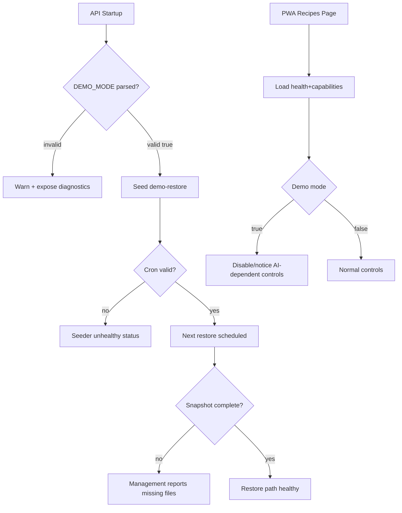

# Demo Mode AWS Deploy Hardening Design

## UX Implementation Contract

1. Demo UX must never leave the user in a misleading state.
2. If an AI feature is blocked in demo mode, the triggering control must be visibly disabled or show an immediate explanatory notice.
3. Notices must be stable and testable with explicit test IDs.

## State Ownership

- **Backend truth**: `DEMO_MODE` and snapshot readiness state are owned by API runtime and exposed through existing health/management surfaces.
- **Frontend truth**: Demo UI state derives from health response (`demoMode`) plus a capabilities endpoint/field (new) for AI-dependent feature availability.
- **No duplicated inference**: PWA does not infer demo capabilities from env vars alone.

## Data and Contract Changes

1. Extend management status response with demo readiness payload:
   - `demoSnapshotReady: boolean`
   - `demoSnapshotMissing: string[]`
   - `demoRestoreSeederHealthy: boolean`
   - `demoRestoreSeederErrorCode: string | null`
2. Add diagnostics field for environment parsing:
   - `demoModeRawValue: string | null`
   - `demoRestoreCronValid: boolean`
3. Define frontend-consumable capability flags:
   - `allowAgentSearch: boolean`
   - `allowPhotoSearch: boolean`

## Experience Architecture

## Mock Contract (`pwa/e2e/mock-api.ts`)

Add deterministic mock variants:

1. Demo healthy:
   - `demoMode: true`
   - `allowAgentSearch: false`
   - `allowPhotoSearch: false` (or explicitly true with demo response path, per final decision)
2. Demo seeder unhealthy:
   - `demoRestoreSeederHealthy: false`
   - `demoRestoreSeederErrorCode: "INVALID_CRON"`
3. Demo snapshot missing:
   - `demoSnapshotReady: false`
   - `demoSnapshotMissing: ["manifest.json", "recipes.json"]`

All mock timestamps must use fixed ISO values (example: `2026-05-04T12:00:00Z`).

## data-testid Index

- `demo-agent-search-toggle`
- `demo-photo-search-toggle`
- `demo-ai-notice`
- `demo-photo-notice`
- `demo-mode-banner`
- `management-demo-snapshot-ready`
- `management-demo-seeder-status`
- `management-demo-diagnostics`

## Testing Strategy Matrix

1. Unit (API)
   - Demo mode parsing table tests (valid/invalid values).
   - Cron validation tests.
   - Snapshot readiness file-check tests.

2. Integration (API)
   - Startup seeder status recorded when cron invalid.
   - Restore blocked with machine-readable status when snapshot incomplete.
   - Management status includes demo readiness and diagnostics.

3. Unit (PWA)
   - Recipes page disables or guards agent/photo controls based on capabilities.
   - Notice rendering paths for blocked controls.

4. E2E (PWA)
   - Demo mode: clicking blocked controls shows notice and no AI request emitted.
   - Selector policy: `page.getByTestId(...)` only.
   - Fixed time via Playwright clock.

## Race Condition Pre-Mortem

1. Health fetch fails before capabilities fetch:
   - Mitigation: single combined load or fallback defaults with explicit loading state.
2. UI control enabled before demo flags resolve:
   - Mitigation: render controls in disabled/loading state until capabilities loaded.
3. Seeder fails after startup and state drifts from UI assumptions:
   - Mitigation: management status polling for admin surface; health remains runtime truth for user surface.
