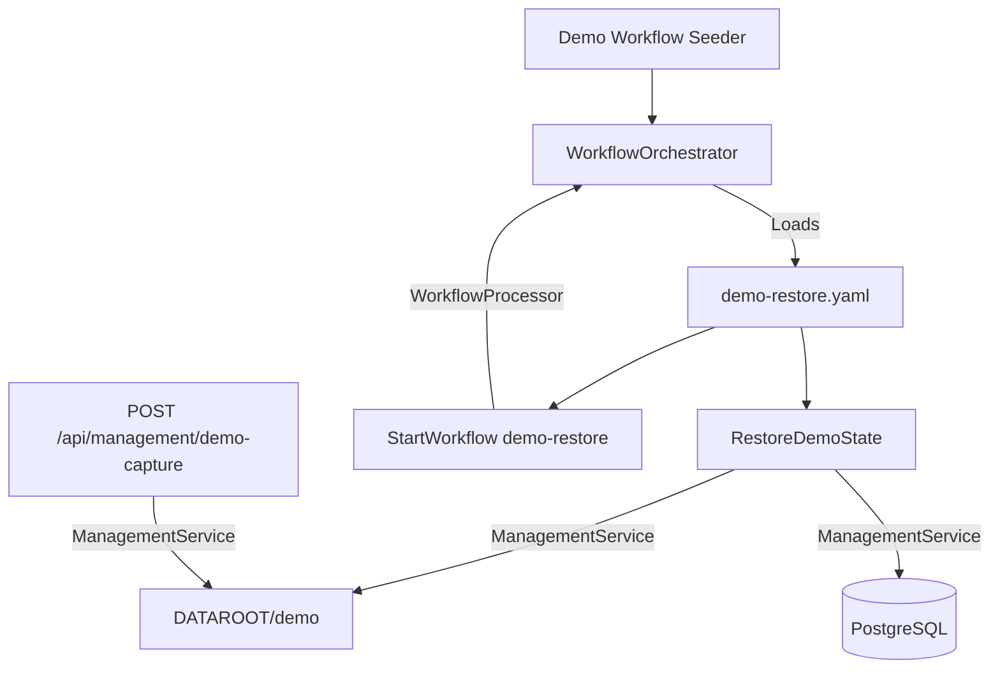

# Demo Mode Design

## Experience Architecture

The Demo Mode feature provides a repeatable, low-cost showcase environment. It consists of a capture/restore mechanism and a runtime "soft disable" for AI features.



## Technical Specification

### 1. Management Service Extensions (`ManagementService.cs`)

Add the following methods to handle demo state lifecycle:

- **`CaptureDemoStateAsync()`**:
    - Creates `DATAROOT/demo/` if missing.
    - Serializes `FamilyMembers`, `Recipes`, and `RecipeSearchDocuments` to JSON/CSV in `DATAROOT/demo/`.
    - Recursively copies the `recipes/` directory to `DATAROOT/demo/recipes/`.
    - **Excludes**: `RecipeVotes`, `WeeklyPlans`, `CalendarEvents`, `WorkflowInstances`, `WorkflowTasks`.
    - Writes a small manifest containing capture time, schema/version metadata, entity counts, and recipe directory file counts for restore validation.
- **`RestoreDemoStateAsync()`**:
    - Validates the manifest and required snapshot files before deleting or truncating anything.
    - Truncates `RecipeVotes`, `WeeklyPlans`, `CalendarEvents` in the database.
    - Clears stale `WorkflowInstances` and `WorkflowTasks` from the previous demo window while preserving the active restore execution and the successor scheduled by the workflow.
    - Wipes the active `recipes/` directory.
    - Restores database records and the `recipes/` directory from the `demo/` snapshot.
    - Restores `RecipeSearchDocuments` including embeddings so browse/search avoids live AI calls.
    - Does not restore or synthesize `WeeklyPlans`; planner starts empty after each reset.

### 2. AI Soft Disable Logic

#### `IWorkflowProcessor`
Honor `DEMO_MODE=true` at processor execution boundaries, where processor names are already explicit:
- If Demo Mode is active, the following processors return a completed "Demo Mode Bypass" payload without calling external AI:
    - `ExtractRecipe`
    - `GenerateDescription`
    - `SynthesizeRecipe`
    - `WebAcquisition`
    - `CategorizeIngredients`
    - `ClassifyDietaryProfile`
- The workflow instance/task should still complete successfully so UI flows that enqueue imports or generation do not hang.
- Prefer a small shared guard/decorator for AI processors over broad workflow-engine branching, so non-AI processors like backup, restore, pruning, reporting, and scheduling still run normally.

#### `IChatClient` (Optional but Recommended)
A decorator can be added to `IChatClient` in `Program.cs` to fail all generative calls with a specific exception if `DEMO_MODE` is enabled, ensuring zero API leakage.

### 3. API & Controllers

- **`ManagementController`**:
    - Add `POST /api/management/demo-capture` and enqueue a `demo-capture` workflow.
    - Add `POST /api/management/demo-restore` and enqueue a `demo-restore` workflow for manual reset.
    - Include demo workflows in management status.
- **`FamilyController`**:
    - If `DEMO_MODE=true`, `POST /api/family` returns `403 Forbidden`.
- **`HealthController`**:
    - Expose `demoMode: true` in the health check response so the PWA can adjust its UI.
    - This requires `demoMode` to be added to `HealthCheckResponseDto` and `specs/openapi.yaml` before implementation.

### 4. PWA UI Adjustments

- **Login Page**: Pre-populate the "Passphrase" field with `"Swipe-Match-Cook"` if `demoMode` is detected in the health check.
- **Search Page**: 
    - Disable the "Agent Mode" toggle.
    - Add a `data-testid="demo-ai-notice"` tooltip or pop-out explanation.
- **Recipe Details**: Add a banner if a recipe was created during the current demo window, noting it will be erased during the next reset.
  - This is optional for the first vertical slice unless the API exposes a reliable "created during current demo window" signal.

### 5. Demo Restore Workflow (`demo-restore.yaml`)

```yaml
name: demo-restore
parameters: []
tasks:
  - name: restore
    processor: RestoreDemoState
    payload: {}
    
  - name: reschedule
    processor: StartWorkflow
    payload:
      workflowId: demo-restore
      schedule:
        cron: "${DEMO_RESTORE_CRON_UTC:-0 3 * * *}"
    depends_on:
      - restore
```

Add a matching `demo-capture.yaml`:

```yaml
name: demo-capture
parameters: []
tasks:
  - name: capture
    processor: CaptureDemoState
    payload: {}
```

This intentionally follows the current repository workflow schema (`name`, task `name`, and `depends_on`) used by `WorkflowDefinition` and `dreaming.yaml`.
Seed `demo-restore` only when `DEMO_MODE=true`, using the same idempotent "pending or processing instance already exists" behavior as `DreamingWorkflowSeeder`.

## Testing Strategy

### Automated Tests
- **Integration**: Verify `CaptureDemoStateAsync` creates the expected files in `DATAROOT/demo`.
- **Integration**: Verify `RestoreDemoStateAsync` erases votes/plans/calendar events/workflow history but restores recipes, family members, recipe files, and search documents.
- **Integration**: Verify restore fails without mutating data when the snapshot is missing or incomplete.
- **Workflow**: Verify `demo-restore.yaml` uses `depends_on`, reschedules itself through `StartWorkflow`, and the seeder only activates in Demo Mode.
- **API**: Verify health exposes `demoMode`, family creation returns 403 in Demo Mode, and management endpoints enqueue the expected workflows.
- **E2E**: Verify PWA login pre-population.
- **E2E**: Verify AI search notice/disable behavior.

## Dead-End & Blind Spot Pre-mortem
- **The "Empty Demo"**: If `Capture` is never run, `Restore` will fail.
    - **Mitigation**: Add a check in `RestoreDemoStateAsync` that fails gracefully with a clear log if the `demo/` directory is missing.
- **Schema Drift**: If the demo snapshot is old, restoration might cause EF errors.
    - **Mitigation**: Ensure `demo-capture` is part of the deployment pipeline or run manually after migrations.
- **Search Index Sync**: Restoring embeddings from sidecars is critical.
    - **Mitigation**: Ensure `RestoreDemoStateAsync` re-inserts into `RecipeSearchDocuments` to maintain semantic search capability.
- **Workflow Self-Erasure**: A restore that truncates workflow tables can delete the workflow currently executing it.
    - **Mitigation**: Preserve the active restore instance until it completes, then prune old demo-window history as part of the next restore or with explicit exclusion logic.
- **False AI Confidence**: A UI feature may still trigger an LLM through a path that is not labeled "Agent".
    - **Mitigation**: Add the optional `IChatClient` guard in `Program.cs` as a final circuit breaker and cover it with a test.
