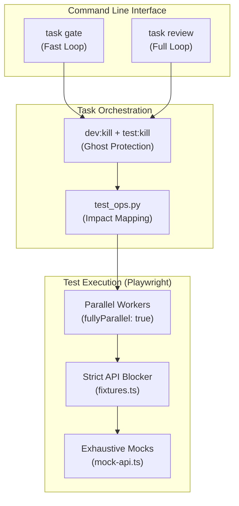

# Design: Dev Loop Optimization & Digital Twin Testing

## 1. Architectural Overview

The optimization strategy shifts the development loop from a sequential, brittle process to a parallel, impact-aware, and strictly isolated system.

## 2. Component Design

### 2.1 Impact Mapping (`test_ops.py`)
- Maps `git diff` changes to test files:
    - `Controllers/*.cs` → `{name}.spec.ts`
    - `pwa/src/app/**` → `{feature}*.spec.ts`
    - `pwa/src/components/**` → `{feature}*.spec.ts`
- Detects high-impact changes (spec, config, fixtures) and triggers full suite runs.

### 2.2 Strict Isolation (fixtures.ts)
- A global `page.route` interceptor matches all `**/api/**` requests.
- This route is registered FIRST, ensuring it is matched LAST (as a catch-all).
- It fulfills with 403 if no previous mock matched, failing the test and protecting the real DB.

### 2.3 Ghost Protection (Taskfile.yml)
- `dev:kill`: Uses `lsof` and `pkill` to clear ports 3000, 9001 and dotnet-watch processes.
- `test:kill`: Clears Playwright workers and lingering npm test commands.
- These run before every `gate` or `review` to ensure clean environment state.

### 2.4 Digital Twin Helpers (Future)
- `delayResponse(ms)`: Intercepts a route and waits `ms` before fulfilling, allowing tests to verify UI state during the "In-Flight" window.
- `workerIndex` Isolation: Uses Playwright's `workerIndex` to inject unique `familyMemberId` cookies, ensuring parallel workers don't share "today" state.

## 3. Alternative Considered
- **Running a Test Database**: Rejected. It adds complexity, requires setup/teardown time, and increases the risk of accidental production data loss. Strict mocking is faster and 100% safe.
- **Sequential Suites**: Rejected. Modern multi-core machines are wasted if tests run one-by-one. Isolation at the mock level makes parallelism safe.
