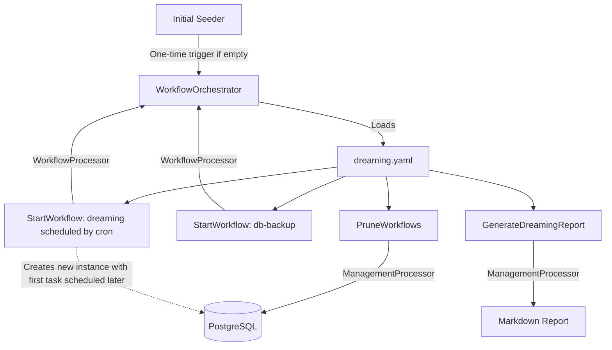

# Dreaming Workflow Design

## Experience Architecture

The "Dreaming" feature operates as a self-sustaining, recurring workflow. It is orchestrated by the workflow engine, which has been extended to support deferred scheduling and workflow-to-workflow triggering.



## Technical Specification

### 1. Engine Extensions

#### `IWorkflowOrchestrator`
Update `TriggerAsync` to support an optional `scheduledAt` timestamp. When `scheduledAt` is supplied, the orchestrator applies it to root tasks that would otherwise be `Pending`; dependent tasks remain `Waiting`.
```csharp
Task<WorkflowInstance> TriggerAsync(string workflowId, Dictionary<string, string> parameters, DateTimeOffset? scheduledAt = null);
```

#### `WorkflowProcessor`
A new processor implemented in `WorkflowProcessor.cs` to handle engine-level tasks.
- **`StartWorkflow`**: Triggers another workflow, optionally scheduled for a future time.
    - Immediate payload: `payload: { workflowId: string, parameters: object }`
    - Scheduled payload:
      ```yaml
      payload:
        workflowId: dreaming
        schedule:
          cron: "${DREAMING_CRON_UTC:-0 3 * * *}"
      ```
    - `schedule.cron` is interpreted in UTC.
    - `${VAR:-default}` resolves from environment configuration at task execution time, allowing schedule changes without redeploying workflow YAML.
    - Scheduled starts reuse the existing task-level `WorkflowTask.ScheduledAt` mechanism already used by retry/backoff scheduling.

#### Cron calculation
Add a small UTC cron occurrence calculator for `StartWorkflow` scheduled payloads. Use a proven parser rather than hand-rolled cron math if a dependency is acceptable in this repo. The calculator must return the next occurrence strictly after the current UTC instant.

### 2. Dreaming Workflow (`dreaming.yaml`)

```yaml
name: dreaming
parameters: []
tasks:
  - name: prune
    processor: PruneWorkflows
    payload: { retentionDays: 7 }
    
  - name: backup
    processor: StartWorkflow
    payload: 
      workflowId: "db-backup"
    
  - name: report
    processor: GenerateDreamingReport
    payload: {}
    depends_on: [prune, backup]

  - name: reschedule
    processor: StartWorkflow
    payload:
      workflowId: "dreaming"
      schedule:
        cron: "${DREAMING_CRON_UTC:-0 3 * * *}"
    depends_on: [report]
```

### 3. Management Service Extensions
Modify `ManagementService.cs` to add:
- `PruneWorkflowsAsync(int retentionDays)`:
    - Deletes `WorkflowInstances` where `Status` in (`Completed`, `Failed`) AND `UpdatedAt < now - retentionDays`.
- `GenerateDreamingReportAsync()`:
    - Queries `WorkflowInstances` updated in the last 24h.
    - Aggregates failures and long-running tasks.
    - Writes to `DataRoot/reports/dreaming-yyyy-MM-dd.md`.

### 4. Dreaming Initial Seeder
Update `WorkflowWorker` or create a small startup task that checks if a `dreaming` workflow is already pending, processing, or scheduled. If not, it triggers the first one for the next occurrence of `DREAMING_CRON_UTC`, defaulting to `0 3 * * *`.

## Testing Strategy

### Unit Tests
- `CronScheduleCalculatorTests`: Verify `DREAMING_CRON_UTC`-style expressions resolve to the next UTC occurrence.
- `WorkflowProcessorTests`: Verify `StartWorkflow` can trigger immediate workflows and scheduled workflows.
- `ManagementServiceTests`: Verify pruning logic.

### Integration Tests
- `DreamingWorkflowTests`: Execute the full `dreaming` workflow and verify that a *new* instance of `dreaming` is created in the database with a `scheduled_at` time in the future.

## Dead-End & Blind Spot Pre-mortem
- **The "Chain Break"**: If the final scheduled `StartWorkflow` task fails, the nightly routine stops.
    - **Mitigation**: The task has built-in retries. If it fatally fails, the `GenerateDreamingReport` (which ran just before) will be the last report, and the human will see the failure of the previous night's "reschedule" task.
- **Cron Complexity**: `DREAMING_CRON_UTC` is always interpreted in UTC. This intentionally avoids local timezone and DST behavior in the first version.
