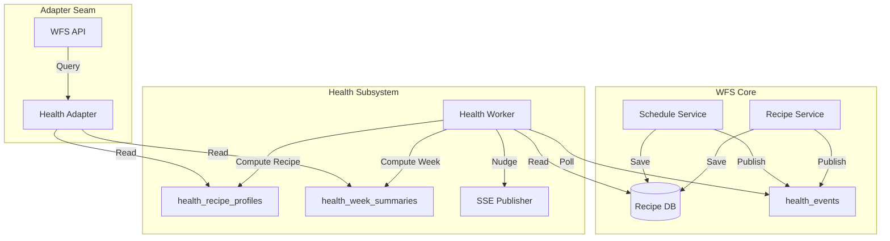

# Health Service Extraction - Design

## Experience Architecture

The health subsystem acts as a background observer of WFS entity changes.



## Data Model

### New Tables (PostgreSQL)

#### `health_events`
Used as a durable outbox/queue.
- `id`: `UUID` (PK)
- `entity_type`: `VARCHAR(50)` ('recipe', 'week')
- `entity_id`: `VARCHAR(100)` (GUID for recipes, 'YYYY-MM-DD' for weeks)
- `status`: `VARCHAR(20)` ('pending', 'processing', 'completed', 'failed')
- `attempts`: `INT` (DEFAULT 0)
- `last_error`: `TEXT`
- `created_at`: `TIMESTAMPTZ` (DEFAULT NOW())
- `scheduled_for`: `TIMESTAMPTZ` (DEFAULT NOW())

#### `health_recipe_profiles`
- `recipe_id`: `UUID` (PK, FK to recipes.id)
- `dietary_profile`: `JSONB` (Stores `RecipeDietaryProfile`)
- `fop_flags`: `JSONB` (Stores `FopFlags`)
- `last_recomputed_at`: `TIMESTAMPTZ`
- `version`: `INT` (For cache busting or logic versions)

#### `health_week_summaries`
- `week_start_date`: `DATE` (PK)
- `balance_summary`: `JSONB` (Stores `WeeklyBalanceSummary`)
- `fop_week_summary`: `JSONB` (Stores `FopWeekSummary`)
- `last_recomputed_at`: `TIMESTAMPTZ`

## Internal Contracts

### `IHealthAdapter`
```csharp
public interface IHealthAdapter
{
    Task<RecipeDietaryProfile?> GetRecipeHealthAsync(Guid recipeId, CancellationToken ct);
    Task<WeeklyBalanceSummary?> GetWeekHealthAsync(DateOnly monday, CancellationToken ct);
}
```

### Neutral Event Publication
`RecipeService` and `ScheduleService` (or `GroceryRecomputeService`) must ensure that a `health_event` is created whenever:
- A recipe's name, ingredients, or metadata changes.
- A schedule slot is updated (recipe assigned, removed, or moved).

## Implementation Details

### Health Worker Logic
- **Recipe Event**:
    1. Load recipe from `recipes` table.
    2. If `DietaryProfile` is already in `recipes` (legacy), migration can just copy it to `health_recipe_profiles`.
    3. If not, call LLM using the **salvaged dietitian persona** (migrated from `ClassifyDietaryProfileProcessor.cs`).
    4. Write to `health_recipe_profiles`.
- **Week Event**:
    1. Load all recipes for the week from `calendar_events`.
    2. Try to load health profiles for all assigned recipes from `health_recipe_profiles`.
    3. If any are missing, the week event should be rescheduled (increment `attempts`, update `scheduled_for`).
    4. Once all inputs are ready, call `WeeklyBalanceScorer.Compute(...)`.
    5. Write to `health_week_summaries`.
    6. Check if a discovery nudge is needed and publish via SSE.

### Adapter Fallback
The `HealthAdapter` should return `null` if the data is not present.
Existing WFS services (like `ScheduleService` or `RecipeSearchService`) should be updated to use this adapter.

```csharp
// Example Adapter Usage in ScheduleService
var health = await _healthAdapter.GetWeekHealthAsync(monday, ct);
return new WeeklyPlanDto {
    // ...
    BalanceSummary = health != null ? MapToDto(health) : null
};
```

## Testing Strategy
- **Unit Tests**:
    - `WeeklyBalanceScorer` (already exists, ensure it remains pure).
    - `HealthAdapter` fallback logic.
    - `HealthWorker` retry/stagger logic.
- **Integration Tests**:
    - Verify `health_event` insertion on recipe/schedule changes.
    - Verify `HealthWorker` processes events and populates new tables.
    - Verify `HealthAdapter` reads from new tables.
- **E2E Tests**:
    - Confirm planner still shows health balance summary after extraction.
    - Confirm search still applies planner-fit reranking.

## Workflow Decoupling (De-Zombification)

To achieve full extraction, the following **parasitic steps** must be removed from WFS core workflows:

1. **`recipe-import.yaml`**: Remove `classify_dietary_profile` step. Import is now considered complete as soon as core metadata is saved; health recompute follows via the `recipe_changed` event.
2. **`goto-synthesis.yaml`**: Remove `classify_dietary_profile` step.
3. **`url-import.yaml`**: Remove `classify_dietary_profile` step.
4. **`classify-recipe.yaml`**: Delete entire workflow. Manual re-classification will now trigger a `recipe_changed` event with `forceReclassify: true`.

This ensures the AI workflow engine is not blocked by health-specific logic, and the PWA remains responsive during recipe acquisition.

## Ghost Field Pruning

The following fields are identified as **Zombies** and will be eliminated to reduce context bloat:

1. **`prepTimeMinutes`**: Removed from `openapi.yaml`, `ImportedRecipeDto.cs`, and `extract-recipe.md`.
2. **`cookTimeMinutes`**: Removed from `openapi.yaml`, `ImportedRecipeDto.cs`, and `extract-recipe.md`.

*Note: `servings` is kept as it is intended for future scaling logic, although currently unmapped to the core DB model.*
