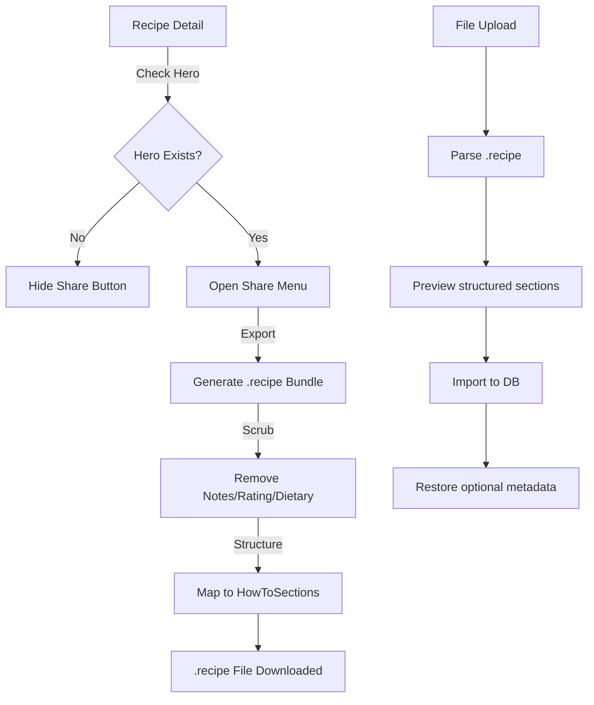

# High Fidelity Recipe Sharing & Portable Format - Design

## Experience Architecture
The flow ensures that only "High Fidelity" recipes (those with a hero) enter the sharing loop, while ensuring the underlying file format is robust enough for full library backups.



## Data Model

### The "Fidelity Adapter" Pattern
To keep the API contract (`ImportedRecipeDto`) clean and strictly typed as `List<HowToSectionDto>`, the PWA's `parseRecipeBundleFile` will act as a **Fidelity Adapter**. 

If it reads a legacy `.recipe` file containing `instructions: string[]`, it will automatically wrap them into the new structured format before sending the payload to the API. This ensures the Backend never has to handle "polymorphic" instruction lists.


```csharp
public class HowToStepDto {
    public string Type => "HowToStep";
    public string Text { get; set; }
}

public class HowToSectionDto {
    public string Type => "HowToSection";
    public string Name { get; set; }
    public List<HowToStepDto> ItemListElement { get; set; }
}

public class ImportedRecipeDto {
    // Existing fields...
    public List<HowToSectionDto> Instructions { get; set; } // AC 1.2
    public string? Notes { get; set; } // Optional for backup
    public int? Rating { get; set; } // Optional for backup
}
```

## Mock Contract

### `pwa/e2e/mock-api.ts`
Update the `import-bundle` mock to handle structured instructions.

```typescript
await page.route('**/api/recipes/import-bundle', async (route) => {
  const bundle = route.request().postDataJSON();
  // Verify instructions[0].itemListElement[0].text exists
  await route.fulfill({
    status: 201,
    contentType: 'application/json',
    body: JSON.stringify({
      data: {
        id: "550e8400-e29b-41d4-a716-446655440000",
        name: bundle.recipe.name,
        isReady: true,
        // ...
      }
    })
  });
});
```

## Testing Strategy

| Level | Focus | Files to Modify | Key Assertions |
| :--- | :--- | :--- | :--- |
| **Backend Integration** | Round-trip Integrity | `RecipeShareIntegrationTests.cs` | Export(Recipe) -> JSON -> Import(JSON) -> DB. Compare DB fields. |
| **PWA Unit (API)** | Parsing Resilience | `recipes.test.ts` | `parseRecipeBundleFile` handles both string steps and structured objects correctly. |
| **PWA Unit (UI)** | Capture Flow | `MinimalCapture.recipe-import.test.tsx` | Bundle preview shows sections and handles structured data. |
| **E2E (Mocking)** | API Fidelity | `mock-api.ts` | Update `import-bundle` mock to use structured instructions. |
| **E2E (Playwright)** | "High Fidelity" UX | `recipe-share.spec.ts`, `sharing-fidelity.spec.ts` | Share button hidden when Hero missing. Bundle preview rendering. |

## data-testid Index

| Element | ID | Purpose |
| :--- | :--- | :--- |
| Share Button | `recipe-share-btn` | Trigger the export flow. |
| Section Heading | `bundle-preview-section-title` | Display name of a HowToSection. |
| Instruction Step | `bundle-preview-step-text` | Display text of a HowToStep. |
| Notes Preview | `bundle-preview-notes` | Display optional notes (if present in backup). |
