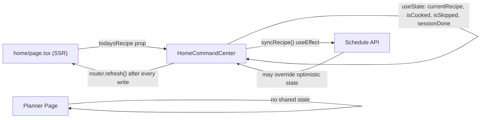
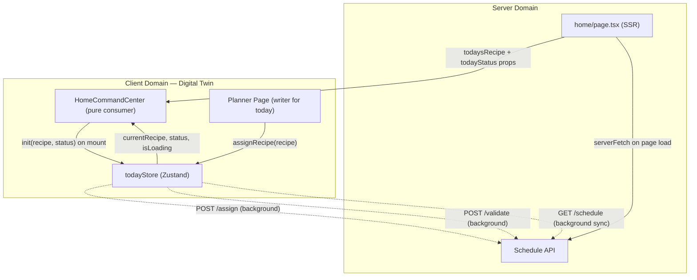

# Design Document — home-command-center-hardening

## Overview

This spec consolidates three bodies of work that share a single root cause: the home page's "today" state is scattered across SSR props and client-side `useState` with no shared layer, and `router.refresh()` is the only bridge between them. The result is race conditions, stale renders, and a UI that lags on every tap.

The fix is a **digital twin**: a Zustand store (`todayStore`) that owns today's schedule day as a domain object, accepts optimistic writes immediately (zero UI lag), and reconciles with the server silently in the background. `HomeCommandCenter` becomes a pure consumer of `todayStore`. `router.refresh()` is removed from every action handler's critical path.

Alongside the architectural fix, three visual bugs in `TonightPivotCard` are corrected: the misleading header and badge in the empty state, the buried CTA link, and the button label and hierarchy when a GOTO is ready.

The architecture diagram already exists at `docs/flows/client-domain-model.md` (created as part of Group D pre-work).

---

## Architecture

### Current architecture (broken)



Problems:
- `router.refresh()` is a full SSR round-trip (300–800 ms on mobile) in the critical render path.
- `syncRecipe()` can override an optimistic write if the backend hasn't committed yet (Bug 1).
- `isScheduleRecipe()` passes `{ id: null }` objects, producing blank cards (Bug 2).
- "Order In" with no recipe skips the backend write entirely (Bug 3).
- "Order In" from the pivot card bypasses `SkipRecoveryDialog` (Bug 4).
- `isSkipped`/`sessionDone` reset on reload because they are React state only (Bug 5).
- Planner and home page have no shared state — planner assignments only reach home via `router.refresh()`.

### Target architecture (digital twin)



Key properties of the target architecture:
- All user-visible state transitions happen via `todayStore` mutations — zero network wait.
- `router.refresh()` is removed from every action handler's critical path.
- `sync()` protects optimistic writes younger than 10 seconds.
- `todayStatus` prop seeds the store from SSR so reload state is correct.
- Planner and home page share `todayStore` — no navigation required for cross-page consistency.

---

## Components and Interfaces

### `pwa/src/store/todayStore.ts` (new)

The central domain store. Owns today's schedule day state.

```typescript
import { create } from 'zustand';
import type { ScheduleRecipeDto } from '@/lib/api/generated/models';

interface TodayState {
  // State
  currentRecipe: ScheduleRecipeDto | null;
  status: 0 | 2 | 3;
  isLoading: boolean;
  lastSyncedAt: number;           // epoch ms of last successful sync()
  optimisticWriteAt: number | null; // epoch ms of last assignRecipe() call; null when no in-flight write

  // Actions
  init: (recipe: ScheduleRecipeDto | null, status: 0 | 2 | 3) => void;
  assignRecipe: (recipe: ScheduleRecipeDto) => void;
  markCooked: () => void;
  markOrderedIn: () => void;
  sync: () => Promise<void>;
}

export const useTodayStore = create<TodayState>((set, get) => ({ ... }));
```

**`init(recipe, status)`** — Called by `HomeCommandCenter` on mount with SSR-derived values. Sets `currentRecipe`, `status`, and clears `optimisticWriteAt`. Idempotent.

**`assignRecipe(recipe)`** — Optimistic write: sets `currentRecipe` and `optimisticWriteAt = Date.now()` synchronously, then fires `POST /api/schedule/assign` in the background. Does not call `router.refresh()`.

**`markCooked()`** — Sets `status = 2` synchronously, then fires `POST /api/schedule/day/{date}/validate` with `{ status: 2 }` in the background.

**`markOrderedIn()`** — Sets `status = 3` synchronously, then fires `POST /api/schedule/day/{date}/validate` with `{ status: 3 }` in the background.

**`sync()`** — Calls `GET /api/schedule?weekOffset=0`, finds today's entry, then reconciles:
- If `optimisticWriteAt` is `null`: update `currentRecipe` from server unconditionally.
- If `optimisticWriteAt` is non-null and `Date.now() - optimisticWriteAt < 10_000`: skip `currentRecipe` update (protect in-flight write).
- If `optimisticWriteAt` is non-null and `Date.now() - optimisticWriteAt >= 10_000`: update `currentRecipe` from server (write confirmed or timed out).
- Always update `status` from server if server returns `2` or `3` (these are authoritative).
- Sets `lastSyncedAt = Date.now()` on success.

### `pwa/src/lib/api/planner.ts` — `isScheduleRecipe()` fix

Change the guard from:
```typescript
if (recipe.id != null || 'id' in recipe) return true;
```
to:
```typescript
if (typeof recipe.id === 'string' && recipe.id.length > 0) return true;
```

Same fix applied to the `recipe.data` branch. This ensures objects with `id: null` (Kiota-deserialized but not yet populated) are rejected.

### `pwa/src/app/(app)/home/page.tsx` — `todayStatus` prop

Add `todayStatus` derivation from the SSR schedule fetch:

```typescript
const todayStatus: 0 | 2 | 3 =
  todaysEntry?.status === 2 ? 2 :
  todaysEntry?.status === 3 ? 3 : 0;

return (
  <>
    <StoreInitializer familyMembers={familyMembers} />
    <HomeCommandCenter todaysRecipe={todaysRecipe} todayStatus={todayStatus} />
  </>
);
```

Note: `todaysRecipe` is already set to `null` when `isDone` — this is preserved. The `todayStatus` prop carries the signal that was previously lost.

### `pwa/src/components/home/HomeCommandCenter.tsx` — refactor

**Props change:**
```typescript
interface HomeCommandCenterProps {
  todaysRecipe: ScheduleRecipeDto | null;
  todayStatus?: 0 | 2 | 3;  // new
}
```

**State changes:**
- Remove `useState` for: `currentRecipe`, `isCooked`, `isSkipped`, `sessionDone`, `isLoading`.
- Retain `useState` for UI-only state: `showCooksMode`, `showRecovery`, `showQuickFind`.
- Read `currentRecipe`, `status`, `isLoading` from `useTodayStore()`.
- Derive `isCooked = status === 2`, `isSkipped = status === 3`, `sessionDone = status === 2 || status === 3`.

**Mount effect:**
```typescript
useEffect(() => {
  todayStore.init(todaysRecipe, todayStatus ?? 0);
  loadSetting('family_goto');
  todayStore.sync(); // background, non-blocking
}, []); // run once on mount
```

**Action handlers:**
- `onConfirmGoto` → calls `todayStore.assignRecipe(optimisticRecipe)` instead of `setCurrentRecipe` + `assignRecipeToDay` + `router.refresh()`.
- `handleCookedMark` → calls `todayStore.markCooked()` instead of direct API call + `setIsCooked` + `router.refresh()`.
- `onOrderIn` (from pivot, no recipe) → calls `todayStore.markOrderedIn()` directly (always writes to backend).
- `onOrderIn` (from pivot, with recipe) → opens `SkipRecoveryDialog` first.
- `handleQuickFindSelect` → calls `todayStore.assignRecipe(recipe)` instead of `setCurrentRecipe` + `assignRecipeToDay` + `router.refresh()`.
- `handleRecoveryAction('order_in')` → calls `todayStore.markOrderedIn()`.

**`router.refresh()` removal:** All `router.refresh()` calls are removed from action handlers. The `pendingConfirmRef` hack is removed — `todayStore`'s optimistic write protection replaces it.

### `pwa/src/components/home/TonightPivotCard.tsx` — visual fixes

**Header and badge (A1):**
```tsx
// Before: always "Tonight's Menu" + badge
// After: conditional on hasGoto
<h2>
  {hasGoto ? "Tonight's Menu" : "What's for Supper?"}
</h2>
{hasGoto && (
  <span className="...">30-45 Mins</span>
)}
```

**Image area (A2):**
- Remove the `<a>` tag from inside the image area.
- Remove the gradient overlay when `!hasGoto`.
- Show only the centered `<Utensils>` icon when `!hasGoto`.

**Footer CTA (A2):**
```tsx
{!hasGoto && (
  <a href="/profile/settings">
    <button className="flex items-center justify-center h-12 rounded-[1.5rem] bg-ochre text-white w-full ...">
      Add your family&apos;s GOTO recipe
    </button>
  </a>
)}
```

**Button rename and hierarchy (A3):**
```tsx
{gotoReady && (
  <button
    onClick={onConfirmGoto}
    data-testid="confirm-goto-btn"
    className="... bg-ochre text-white ..."  // dominant ochre
  >
    Make This Tonight  {/* renamed from "Confirm GOTO" */}
  </button>
)}
<div className={gotoReady ? 'grid grid-cols-2 gap-2' : 'flex flex-col gap-2'}>
  <button
    onClick={onDiscover}
    className="... border border-indigo/30 bg-transparent text-indigo ..."  // ghost/outline
  >
    Quick Find
  </button>
  <button
    onClick={onOrderIn}
    className="... border border-charcoal/20 bg-transparent text-charcoal/60 ..."  // ghost/outline
  >
    Order In
  </button>
</div>
```

### `pwa/src/app/(app)/planner/page.tsx` — todayStore integration

In `handleQuickFindSelect`, after the optimistic local state update, add:

```typescript
import { useTodayStore } from '@/store/todayStore';

// Inside handleQuickFindSelect, when assigning today's slot:
const todayStr = new Date().toISOString().split('T')[0];
if (showPivot !== null && schedule[showPivot.dayIndex]?.date === todayStr) {
  useTodayStore.getState().assignRecipe({
    id: recipe.id,
    name: recipe.name,
    image: recipe.image,
  });
}
```

This replaces the need for `router.refresh()` to propagate planner assignments to the home page.

---

## Data Models

### `TodayState` (todayStore)

| Field | Type | Description |
|-------|------|-------------|
| `currentRecipe` | `ScheduleRecipeDto \| null` | Today's assigned recipe, or null if none |
| `status` | `0 \| 2 \| 3` | 0=Draft/no action, 2=Cooked, 3=Skipped/Ordered-in |
| `isLoading` | `boolean` | True while `sync()` is in-flight |
| `lastSyncedAt` | `number` | Epoch ms of last successful `sync()` call |
| `optimisticWriteAt` | `number \| null` | Epoch ms of last `assignRecipe()` call; null when no in-flight write |

### `ScheduleRecipeDto` (existing, from generated models)

| Field | Type | Description |
|-------|------|-------------|
| `id` | `Guid \| null` | Recipe UUID — must be a non-empty string to be valid |
| `name` | `string \| null` | Display name |
| `image` | `string \| null` | Relative image path |
| `description` | `string \| null` | Short description |
| `ingredients` | `string[] \| null` | Ingredient list |
| `voteCount` | `number \| null` | Family vote count |

### `HomeCommandCenterProps` (updated)

| Prop | Type | Description |
|------|------|-------------|
| `todaysRecipe` | `ScheduleRecipeDto \| null` | SSR-derived recipe for today |
| `todayStatus` | `0 \| 2 \| 3` | SSR-derived status for today (new) |

### `TonightPivotCardProps` (updated)

No new props. The `onConfirmGoto` callback is renamed semantically to "Make This Tonight" in the UI only — the prop name stays `onConfirmGoto` to avoid a breaking rename across callers.

---

## Correctness Properties

*A property is a characteristic or behavior that should hold true across all valid executions of a system — essentially, a formal statement about what the system should do. Properties serve as the bridge between human-readable specifications and machine-verifiable correctness guarantees.*

### Property 1: Empty-state header and badge are mutually exclusive with GOTO state

*For any* `TonightPivotCard` rendered with `gotoRecipeId = null`, the header text SHALL be "What's for Supper?" and the prep-time badge SHALL be absent. *For any* `TonightPivotCard` rendered with a non-null `gotoRecipeId`, the header text SHALL be "Tonight's Menu" and the prep-time badge SHALL be present.

**Validates: Requirements A1.1, A1.2, A1.3**

### Property 2: Empty-state CTA is a tappable footer button; GOTO state has gradient overlay

*For any* `TonightPivotCard` rendered with `gotoRecipeId = null`, the "Add GOTO" CTA SHALL appear as a button in the footer section with ochre background, and the image area SHALL NOT contain a gradient overlay. *For any* `TonightPivotCard` rendered with a non-null `gotoRecipeId`, the image area SHALL contain the gradient overlay.

**Validates: Requirements A2.1, A2.2, A2.3**

### Property 3: GOTO-ready button label and hierarchy

*For any* `TonightPivotCard` rendered with `gotoStatus = "ready"`, the primary action button SHALL have the label "Make This Tonight" with ochre background, and the "Quick Find" and "Order In" buttons SHALL NOT have ochre background (ghost/outline style).

**Validates: Requirements A3.1, A3.2, A3.3**

### Property 4: `isScheduleRecipe` rejects null/empty ids and accepts non-empty string ids

*For any* object where `id` is `null`, `undefined`, or an empty string, `isScheduleRecipe()` SHALL return `false`. *For any* object where `id` is a non-empty string, `isScheduleRecipe()` SHALL return `true`.

**Validates: Requirements B1.1, B1.2, B1.3**

### Property 5: Optimistic recipe survives sync with empty schedule

*For any* valid `ScheduleRecipeDto`, after `todayStore.assignRecipe(recipe)` is called and `optimisticWriteAt` is set to the current time, if `sync()` is called and the schedule response contains no recipe for today, `currentRecipe` SHALL remain equal to the optimistically assigned recipe.

**Validates: Requirements B2.1, B2.2, B2.3, C6.4**

### Property 6: `sync()` updates currentRecipe when no optimistic write is in-flight

*For any* schedule response containing a valid recipe for today, if `optimisticWriteAt` is `null`, calling `sync()` SHALL update `currentRecipe` to match the server's recipe.

**Validates: Requirements C6.1, C6.2**

### Property 7: `sync()` updates currentRecipe when optimistic write is older than 10 seconds

*For any* schedule response containing a valid recipe for today, if `optimisticWriteAt` is non-null and `Date.now() - optimisticWriteAt >= 10_000`, calling `sync()` SHALL update `currentRecipe` to match the server's recipe.

**Validates: Requirements C6.3**

### Property 8: `assignRecipe` sets currentRecipe and optimisticWriteAt before network call

*For any* valid `ScheduleRecipeDto`, immediately after calling `todayStore.assignRecipe(recipe)` (before the background POST resolves), `currentRecipe` SHALL equal `recipe` and `optimisticWriteAt` SHALL be a non-null timestamp.

**Validates: Requirements C3.1, B6.2**

### Property 9: `markCooked` and `markOrderedIn` set status optimistically

*For any* call to `todayStore.markCooked()`, `status` SHALL equal `2` immediately (before the background POST resolves). *For any* call to `todayStore.markOrderedIn()`, `status` SHALL equal `3` immediately (before the background POST resolves).

**Validates: Requirements C4.1, C5.1, B3.2**

### Property 10: `todayStatus` prop correctly initialises session state

*For any* `HomeCommandCenter` mounted with `todayStatus = 2`, `status` in `todayStore` SHALL be `2` (isCooked=true, sessionDone=true). *For any* `HomeCommandCenter` mounted with `todayStatus = 3`, `status` SHALL be `3` (isSkipped=true, sessionDone=true). *For any* `HomeCommandCenter` mounted with `todayStatus = 0`, `status` SHALL be `0` (normal state).

**Validates: Requirements B5.2, B5.3, B5.4**

### Property 11: Planner assignment propagates to HomeCommandCenter via todayStore

*For any* recipe assigned to today's slot in the planner page, `todayStore.assignRecipe(recipe)` SHALL be called, and `HomeCommandCenter` SHALL reflect the updated `currentRecipe` via Zustand subscription without navigation or `router.refresh()`.

**Validates: Requirements C8.1, C8.2**

---

## Error Handling

### Network failures in background writes

All background writes (`assignRecipe`, `markCooked`, `markOrderedIn`) fire-and-forget. If the POST fails:
- The optimistic state remains in the store for the session (the user sees the correct UI).
- `sync()` will reconcile on the next call — if the write truly failed, the server state will override after the 10-second protection window expires.
- No error toast is shown for background write failures (consistent with the existing pattern in `HomeCommandCenter`).
- Console errors are logged for debugging.

### `sync()` failures

If `GET /api/schedule` fails in `sync()`:
- `isLoading` is set back to `false`.
- `currentRecipe` and `status` are not changed (preserve last known good state).
- `lastSyncedAt` is not updated.
- The failure is logged but not surfaced to the user.

### `isScheduleRecipe()` with malformed input

The updated guard (`typeof recipe.id === 'string' && recipe.id.length > 0`) handles all malformed inputs:
- `null` / `undefined` → caught by the `if (!recipe)` guard at the top.
- `{ id: null }` → `typeof null === 'object'`, not `'string'` → returns `false`.
- `{ id: '' }` → `''.length === 0` → returns `false`.
- `{ id: 'abc-123' }` → returns `true`.
- `{ data: { id: null } }` → same logic applied to `recipe.data`.

### `todayStatus` prop missing or undefined

`HomeCommandCenter` treats `todayStatus` as optional with a default of `0`. If the SSR fetch fails and `todayStatus` is not passed, the component initialises to the normal (no-action) state — the same behaviour as before this spec.

### Order In with no recipe — backend failure

If `markOrderedIn()` fires and the POST fails:
- `status` is already `3` in the store (optimistic).
- The pivot card does not reappear for the session.
- On the next page reload, the SSR fetch will return `status: 0` (the write failed), so the pivot card will reappear — this is the correct degraded behaviour.

---

## Testing Strategy

### Unit tests (example-based)

Focus on specific scenarios, integration points, and edge cases that are not covered by property tests.

**`todayStore.test.ts`:**
- Store shape: all fields exist with correct initial values after `create`.
- All action functions exist and are callable.
- `init()` is idempotent when called twice with the same values.
- `sync()` always updates `status` from server when server returns `2` or `3`, regardless of `optimisticWriteAt`.

**`planner.test.ts`:**
- `isScheduleRecipe(null)` → `false`.
- `isScheduleRecipe(undefined)` → `false`.
- `isScheduleRecipe({ id: null })` → `false`.
- `isScheduleRecipe({ id: '' })` → `false`.
- `isScheduleRecipe({ id: 'abc-123' })` → `true`.
- `isScheduleRecipe({ data: { id: 'abc-123' } })` → `true`.

**`HomeCommandCenter.test.tsx`:**
- Mounted with `todayStatus=2`: renders `CookedSuccessCard`, not `TonightPivotCard`.
- Mounted with `todayStatus=3`: renders "Ordered In" state, not `TonightPivotCard`.
- Tapping "Order In" from pivot with `currentRecipe=null`: calls `markOrderedIn()` directly.
- Tapping "Order In" from pivot with `currentRecipe` set: opens `SkipRecoveryDialog`.
- `todayStore.init()` is called on mount with the SSR props.
- `todayStore.sync()` is called on mount.

**`TonightPivotCard.test.tsx`:**
- Rendered with `gotoRecipeId=null`: header is "What's for Supper?", badge absent, CTA button in footer.
- Rendered with `gotoRecipeId='abc'` and `gotoStatus='ready'`: header is "Tonight's Menu", badge present, "Make This Tonight" button present.
- Rendered with `gotoRecipeId='abc'` and `gotoStatus='pending'`: "Make This Tonight" button absent.

### Property-based tests

Property-based testing is appropriate for this feature. The core logic — `isScheduleRecipe()`, `todayStore` state transitions, and `TonightPivotCard` rendering — are pure functions or near-pure with clear input/output behavior and large input spaces.

**Library:** [fast-check](https://github.com/dubzzz/fast-check) (already available in the JS/TS ecosystem; consistent with the project's TypeScript stack).

**Configuration:** Minimum 100 iterations per property test.

**Tag format:** `// Feature: home-command-center-hardening, Property {N}: {property_text}`

**Property test file: `pwa/src/store/todayStore.property.test.ts`**

```typescript
// Feature: home-command-center-hardening, Property 5: Optimistic recipe survives sync with empty schedule
// Feature: home-command-center-hardening, Property 6: sync() updates currentRecipe when no optimistic write is in-flight
// Feature: home-command-center-hardening, Property 7: sync() updates currentRecipe when optimistic write is older than 10s
// Feature: home-command-center-hardening, Property 8: assignRecipe sets currentRecipe and optimisticWriteAt before network call
// Feature: home-command-center-hardening, Property 9: markCooked and markOrderedIn set status optimistically
// Feature: home-command-center-hardening, Property 10: todayStatus prop correctly initialises session state
```

Generators needed:
- `fc.record({ id: fc.uuidV4(), name: fc.string(), image: fc.string() })` — valid `ScheduleRecipeDto`.
- `fc.constantFrom(0, 2, 3)` — valid `todayStatus` values.
- `fc.integer({ min: 0, max: 9_999 })` — elapsed ms < 10s (for optimistic write protection tests).
- `fc.integer({ min: 10_000, max: 60_000 })` — elapsed ms >= 10s (for sync override tests).

**Property test file: `pwa/src/lib/api/planner.property.test.ts`**

```typescript
// Feature: home-command-center-hardening, Property 4: isScheduleRecipe rejects null/empty ids and accepts non-empty string ids
```

Generators needed:
- `fc.string({ minLength: 1 })` — non-empty string id (should return `true`).
- `fc.constantFrom(null, undefined, '')` — invalid id values (should return `false`).
- `fc.record({ id: fc.string({ minLength: 1 }) })` — direct `ScheduleRecipeDto` shape.
- `fc.record({ data: fc.record({ id: fc.string({ minLength: 1 }) }) })` — wrapped shape.

**Property test file: `pwa/src/components/home/TonightPivotCard.property.test.tsx`**

```typescript
// Feature: home-command-center-hardening, Property 1: Empty-state header and badge are mutually exclusive with GOTO state
// Feature: home-command-center-hardening, Property 2: Empty-state CTA is a tappable footer button; GOTO state has gradient overlay
// Feature: home-command-center-hardening, Property 3: GOTO-ready button label and hierarchy
```

Generators needed:
- `fc.string({ minLength: 1 })` — non-empty `gotoRecipeId`.
- `fc.constantFrom('ready', 'pending', null)` — `gotoStatus` values.
- `fc.option(fc.string())` — optional `gotoDescription` and `gotoImageUrl`.

**Property test file: `pwa/src/components/home/HomeCommandCenter.property.test.tsx`**

```typescript
// Feature: home-command-center-hardening, Property 10: todayStatus prop correctly initialises session state
// Feature: home-command-center-hardening, Property 11: Planner assignment propagates to HomeCommandCenter via todayStore
```

### E2E regression tests

The existing E2E test files are updated (not new files):

**`pwa/e2e/home-goto.spec.ts`** — covers:
- Empty state: correct header, no badge, ochre CTA button in footer.
- GOTO ready: "Make This Tonight" button, ghost secondary buttons.
- "Make This Tonight" tap: `TonightMenuCard` appears immediately (no network wait).
- Page reload after "Make This Tonight": `TonightMenuCard` still shown.

**`pwa/e2e/home-recipe.spec.ts`** — covers:
- "Order In" from pivot with no recipe: pivot card disappears, backend write confirmed.
- "Order In" from pivot with recipe: `SkipRecoveryDialog` opens.
- Page reload after "Order In": pivot card does not reappear.
- Planner assignment for today: home page reflects recipe without navigation.

### What is NOT tested with PBT

- GOTO recipe status polling (`gotoRecipeStatus` state) — external API behavior, use example tests.
- `SkipRecoveryDialog` internal flow — UI interaction, use example tests.
- `CooksMode` step progression — UI interaction, use example tests.
- Documentation file existence — smoke check only.
- `router.refresh()` absence — structural/code review concern, not a runtime property.
