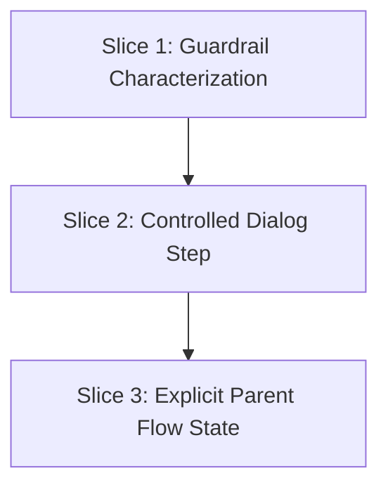

# Design: Home Recovery Flow Hardening

## Goal

Replace implicit flow control based on component remount timing with explicit parent-owned flow state, while preserving the exact current Home recovery experience.

## Existing Seam Map

Current ownership is split like this:

- `HomeCommandCenter.tsx`
  - owns `showRecovery`
  - owns `showQuickFind`
  - owns `recoveryIntent`
  - owns `pendingRecipe`
  - performs API side effects
- `SkipRecoveryDialog.tsx`
  - owns local `step`
  - advances itself to Step 2 even when the parent immediately closes it

That means the `pick_else` path is only correct if these events line up:

1. parent closes Recovery Flow
2. parent opens Quick Find
3. user selects a recipe
4. parent stores the pending recipe
5. parent remounts Recovery Flow
6. child seeds its local step from the remount input

The target is to keep the same sequence on screen while removing the hidden dependency on step seeding during remount.

## Proposed State Model

Keep the model local to the Home feature. Do not create a global store.

Use one parent-owned recovery flow state with an explicit shape:

```ts
type RecoveryFlowState =
  | { kind: 'closed' }
  | { kind: 'step1' }
  | { kind: 'quick_find'; intent: 'pick_else' }
  | { kind: 'step2'; intent: 'order_in'; pendingRecipe: null }
  | {
      kind: 'step2';
      intent: 'pick_else';
      pendingRecipe: { id: string; name: string | null; image?: string | null };
    };
```

Notes:
- `closed` preserves the current "nothing visible" state.
- `quick_find` remains a separate overlay state because the visible UX already behaves that way.
- `step2` carries the selected replacement recipe only for the `pick_else` branch.
- This can live inline in `HomeCommandCenter.tsx` unless a tiny local helper is needed for testability.

## Rendering Rules

Keep rendering behavior identical:

- Recovery Flow is visible only when the state is `step1` or `step2`.
- Quick Find is visible only when the state is `quick_find`.
- `SkipRecoveryDialog` receives an explicit `step` prop.
- `SkipRecoveryDialog` no longer owns authoritative flow state.

## Side-Effect Rules

Keep all side effects in `HomeCommandCenter.tsx`.

1. `order_in`
   - keep the same `markOrderedIn()` behavior
   - transition to parent-owned Step 2

2. `pick_else`
   - transition to `quick_find`
   - do not assign anything yet

3. `quick_find select`
   - transition to Step 2 with the selected recipe attached

4. `tomorrow`, `next_week`, `drop`
   - keep the same move/remove call shapes and the same assign-after-reschedule behavior for `pick_else`
   - keep the same cleanup behavior after success

## File-Level Plan

Primary files:
- `pwa/src/components/home/HomeCommandCenter.tsx`
- `pwa/src/components/home/SkipRecoveryDialog.tsx`

Optional test-only file if needed:
- a small local Home flow unit test or reducer test under `pwa/src/components/home/`

Forbidden files for this change:
- `specs/openapi.yaml`
- `pwa/src/lib/api/generated/**`
- `pwa/src/store/**`
- planner page or planner modal implementation files, unless the existing Home flow already depends on them directly

## Tracer-Bullet Slices

### Slice 1: Guardrail Characterization

Purpose:
- freeze the exact observable UX before refactoring

Allowed files:
- `pwa/e2e/home-recipe.spec.ts`
- one focused local Home test file only if it reduces ambiguity without broad setup

Expected output:
- explicit test coverage for the existing `pick_else -> Quick Find -> Step 2` path
- explicit test coverage for preserving current cancel/close behavior if it is not already locked down

Why this slice exists:
- a smaller model needs a strong behavioral fence before touching the orchestration code

### Slice 2: Controlled Dialog Step

Purpose:
- move authoritative step ownership out of `SkipRecoveryDialog` without changing the overall parent orchestration yet

Allowed files:
- `pwa/src/components/home/SkipRecoveryDialog.tsx`
- `pwa/src/components/home/HomeCommandCenter.tsx`
- tests touched by the changed props

Expected output:
- `SkipRecoveryDialog` renders a parent-provided step
- no child-local `useState(initialStep)` remains as the source of truth
- on-screen behavior remains identical

Why this slice is safe:
- it only changes the parent-child seam and leaves API semantics alone

### Slice 3: Collapse Boolean Soup Into Explicit Flow State

Purpose:
- replace scattered booleans and nullable fields with one explicit flow state in `HomeCommandCenter`

Allowed files:
- `pwa/src/components/home/HomeCommandCenter.tsx`
- tests needed to preserve the same UX

Expected output:
- one local recovery flow state drives both overlays and Step 2 data
- side-effect ordering stays the same
- `showRecovery`, `recoveryIntent`, and `pendingRecipe` are either removed or reduced to derived data

Why this slice is safe:
- Step ownership is already controlled from Slice 2, so this slice only simplifies the parent orchestration

## Dependency Graph



## Success Criteria

1. The Home recovery flow can be described without referring to remount timing.
2. `SkipRecoveryDialog` is presentational with respect to step progression.
3. The user-visible behavior and API behavior remain unchanged.
4. The file touch surface stays local to the Home feature.
