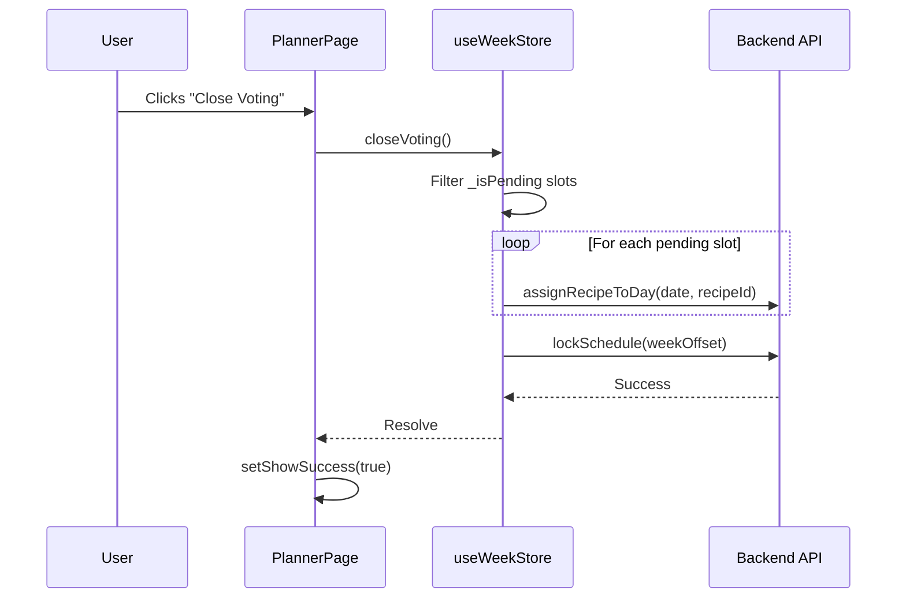

# Planner Finalization Consolidation - Design

## UX Implementation Contract
- **Trigger**: The existing "Close Voting" button in the top action row (`data-testid="close-voting-btn"`).
- **Feedback**: A success toast (using the existing `setShowSuccess` state) should confirm the week is finalized.
- **Removed Elements**:
    - `finalize-button` (Button block at bottom).
    - `finalized-status` (Banner block at bottom).
- **Consistency**: Ensure the top action row correctly pivots to the "Ask the Family" state for the current week once locked (as it already does for status 2).

## State Ownership
- **`useWeekStore.status`**: The primary state driver. 1 = Voting Open, 2 = Locked.
- **`useWeekStore.schedule`**: Updated locally as pending items are promoted.

## Experience Architecture

## Mock Contract
Update `pwa/e2e/mock-api.ts` if needed to ensure `lockSchedule` and `assignRecipeToDay` handle the sequence correctly. Currently, the mocks are already robust enough for this flow.

## Testing Strategy
- **Unit (Red-Green)**: Update `pwa/src/store/weekStore.test.ts` to mock `assignRecipeToDay` and `lockSchedule`. Verify that calling `closeVoting` triggers the assignments for pending slots before the lock.
- **E2E**:
    - **`planner-full-cycle.spec.ts`**: Replace assertions for `finalized-status` with assertions that `ask-family-cta` is visible (which appears when status is 2 for non-past weeks).
    - **`planner.spec.ts`**: Update the "finalization" flow to use the top button.

## data-testid Index
- `close-voting-btn`: The trigger.
- `ask-family-cta`: The post-lock confirmation anchor.
- `planner-action-row`: The container for the top controls.
