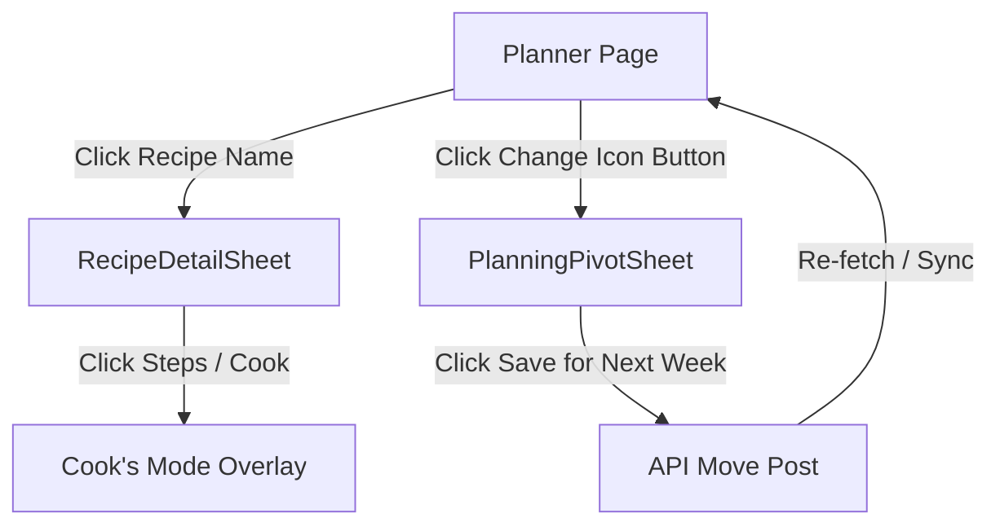

# Planner Page Enhancements - Design

## UX Implementation Contract
- **Hearth Aesthetic**: The change icon button next to the drag handle uses Sage Green or Ochre theme highlights:
  - Background: `bg-ochre/8 text-ochre active:scale-90 transition-transform` (looks matching the Outfit/Inter visual hierarchy).
- **Responsive Layout**: On mobile viewports (<1024px), buttons must reside in the natural thumb arc on a 6.7" device (the bottom-aligned sheet/drawer).
- **No Dead Ends**: Closing the detailed recipe sheet or the pivot sheet returns the user to the active planner page without loss of state.
- **Ordered In Card**: Option A is applied. The "Ordered In" card remains a full-width clickable button. No drag dots or separate change buttons are shown on it.

## State Ownership
- **Active Recipe details**: Managed via Zustand store `openDetailRecipeId` in the page component.
- **Week Schedule State**: Managed via the `useWeekStore` state engine.
- **Planner State**: Managed via the `usePlannerStore` state engine.

## Experience Architecture

## Mock Contract
No new mock endpoints are required since the `apiClient.api.schedule.move.post` is already supported by the mock API server.

## Testing Strategy

| Target | Test Type | Coverage Area |
| :--- | :--- | :--- |
| `PlanningPivotSheet` | Unit (Vitest) | Verifies rendering of "Save for Next Week" option as the first choice, clicking triggers `onPlanLater`, hides when `hasRecipe` is false. |
| `PlannerDayCard` | Unit (Vitest) | Verifies recipe name click calls `onViewRecipe`, change button click calls `onPivot`, no cook mode or view buttons are rendered on the card. |
| `PlannerPage` E2E | E2E (Playwright) | Verifies full E2E flow: opening details, initiating Cook's Mode from details sheet, and moving recipe to next week via "Save for Next Week" pivot action. |

## data-testid Index

| Element | Description | Location |
| :--- | :--- | :--- |
| `edit-recipe-button` | Recipe name button on the day card. Clicking opens recipe details. | `PlannerDayCard` in `page.tsx` |
| `change-recipe-button` | Swaps the old view/cook buttons next to the drag handle. Clicking opens the pivot sheet. | `PlannerDayCard` in `page.tsx` |
| `pivot-plan-later` | "Save for Next Week" action button on the pivot sheet. | `PlanningPivotSheet.tsx` |
| `recipe-detail-sheet` | The detailed recipe view modal/sheet. | `RecipeDetailSheet.tsx` |
| `time-cook-btn` | Cook steps button in detailed recipe card. | `RecipeDetailSheet.tsx` |
