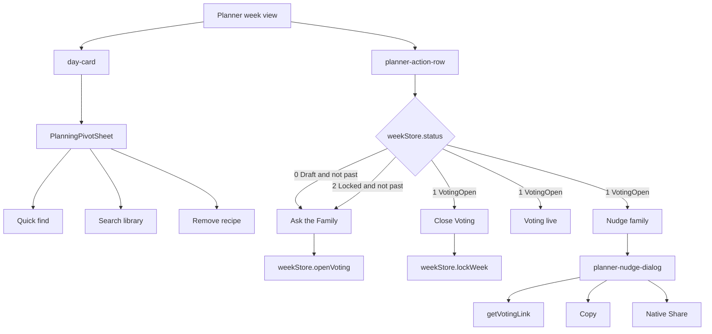

# Design Document

## Scope

This spec relocates whole-week voting controls from `PlanningPivotSheet` into the planner action row. It is a PWA-only UI ownership cleanup using existing week-store and voting-link behavior.

Out of scope:

- No changes to `specs/openapi.yaml`.
- No backend controller or database changes.
- No generated client regeneration.
- No changes to the meaning of schedule `status`.

## UX Implementation Contract

The planner must make voting scope obvious at thumb speed:

- Slot pivot: choose, search, or remove a meal for one day.
- Planner action row: coordinate the family for the whole week.

Mere-Designer review:

- **Why:** Whole-week actions belong in a persistent week-level zone, not inside a contextual meal-slot sheet. This reduces affordance mismatch.
- **How:** A busy parent can open voting, see live voting, nudge the family, or close voting without drilling into a specific day.

Use existing Solar Earth styling patterns from the planner action row:

- `Ask the Family`: sage, rounded full CTA.
- `Nudge family`: sage, rounded full CTA with the existing nudge/share behavior.
- `Voting live`: ochre status badge.
- `Close Voting`: terracotta outlined button.

Action ordering is part of the contract: `Nudge family` must take the first button position when voting is live, directly replacing the `Ask the Family` CTA. The status badge and close action follow it.

## State Ownership

- `status` lives in `pwa/src/store/weekStore.ts`.
- `isVotingOpen` is derived in planner page as `status === 1`.
- `isLocked` is derived in planner page as `status === 2`.
- `weekIsPast` is derived in `pwa/src/app/(app)/planner/page.tsx` from `schedule[6].date < getTodayString()`.
- Nudge dialog UI state is local to planner-level UI:
  - `showNudgeDialog: boolean`
  - `shareUrl: string`
  - `copied: boolean`

Implementation: reuse the existing nudge dialog markup and behavior currently inside `PlanningPivotSheet` by moving that dialog state and UI to `pwa/src/app/(app)/planner/page.tsx`. Do not create a new component for this slice unless the move exposes meaningful duplication. The dialog must not own week status; it only uses planner-local dialog/link/copy state.

## Existing Code Anchors

- Planner page: `pwa/src/app/(app)/planner/page.tsx`
- Pivot sheet: `pwa/src/components/planner/PlanningPivotSheet.tsx`
- Pivot unit tests: `pwa/src/components/planner/PlanningPivotSheet.test.tsx`
- Planner voting E2E: `pwa/e2e/planner-full-cycle.spec.ts`
- Voting link helper: `pwa/src/lib/auth.ts`
- Week status store: `pwa/src/store/weekStore.ts`

## Experience Architecture



## Component Contracts

### PlanningPivotSheet

Props after cleanup:

```ts
interface PlanningPivotSheetProps {
  isOpen: boolean;
  onClose: () => void;
  dayIndex: number;
  onQuickFind: () => void;
  onSearchLibrary: () => void;
  onRemoveRecipe?: () => void;
  hasRecipe: boolean;
}
```

Remove:

- `onAskFamily`
- `isVotingOpen`
- `getVotingLink` import
- `shareUrl`, `showNudgeDialog`, and `copied` state
- `handleNudge`, `handleCopy`, and `handleShare`
- `pivot-ask-family`, `pivot-nudge-family`, and `pivot-nudge-dialog` UI

### Planner Action Row

Planner page action visibility:

```ts
const canOpenVoting = !weekIsPast && (status === 0 || status === 2);
const isVotingOpen = status === 1;
```

Render rules:

- `canOpenVoting`: render `ask-family-cta`.
- `isVotingOpen`: render controls in this order: `nudge-family-cta`, `voting-status-badge`, `close-voting-btn`.
- Always keep `planned-count-badge`.

### Planner Nudge Dialog

The nudge dialog already exists in `PlanningPivotSheet`. Move that existing behavior to planner-level code and keep the interaction model intact:

- Generate URL when dialog opens.
- Display a loading/generating state until the URL is ready.
- Copy button disabled until URL exists.
- Share button shown only when `navigator.share` is available and disabled until URL exists.
- Copied feedback appears after successful clipboard write.

## Mock Contract

No OpenAPI mock change is required.

For component tests:

```ts
vi.mock('@/lib/auth', () => ({
  getVotingLink: vi.fn().mockResolvedValue('http://example.com/discovery'),
}));
```

For browser APIs:

```ts
Object.defineProperty(navigator, 'clipboard', {
  configurable: true,
  value: { writeText: vi.fn().mockResolvedValue(undefined) },
});

Object.defineProperty(navigator, 'share', {
  configurable: true,
  value: vi.fn().mockResolvedValue(undefined),
});
```

For E2E:

- Use static schedule fixtures with `status: 0`, `status: 1`, and `status: 2`.
- Use static dates where Sunday is not past for CTA visibility tests.
- Use `page.getByTestId(...)` for every interaction.

## Testing Strategy

| Layer | File | Coverage |
| --- | --- | --- |
| Component | `pwa/src/components/planner/PlanningPivotSheet.test.tsx` | Pivot renders slot actions and never renders Ask/Nudge controls |
| Component or page unit | Planner page test file, existing or new colocated test | Action row visibility for draft, locked, voting-open, and past week states |
| Component or page unit | Planner page test file, existing or new colocated test | `nudge-family-cta` opens dialog and preserves copy/share behavior |
| E2E | `pwa/e2e/planner-full-cycle.spec.ts` | Planner action row owns Nudge after Ask opens voting; pivot does not contain Nudge |

Required red tests before implementation:

- Existing pivot tests that expect `pivot-ask-family` or `pivot-nudge-family` must fail after expectations are inverted.
- Planner coverage for locked status must fail until `canOpenVoting` includes `status === 2`.
- Planner coverage for action-row Nudge must fail until `nudge-family-cta` and `planner-nudge-dialog` exist.

## Race Condition Guard

The nudge URL is asynchronous. Tests must:

- Click `nudge-family-cta`.
- Assert `planner-nudge-dialog` is visible.
- Wait for the generated URL or enabled copy button.
- Then click copy/share.

Implementation must:

- Ignore stale async result if the dialog closes before `getVotingLink` resolves, or keep the state update harmless by checking dialog visibility before setting state.
- Clear `copied` when opening the dialog.

## data-testid Index

Existing retained IDs:

- `planner-action-row`
- `ask-family-cta`
- `planned-count-badge`
- `voting-status-badge`
- `close-voting-btn`
- `pivot-sheet`
- `pivot-sheet-backdrop`
- `pivot-quick-find`
- `pivot-search-library`
- `pivot-remove-recipe`

New planner-level IDs:

- `nudge-family-cta`
- `planner-nudge-dialog`
- `planner-nudge-close`
- `planner-nudge-link`
- `planner-nudge-copy`
- `planner-nudge-share`
- `planner-nudge-copied-feedback`

Removed or forbidden in pivot:

- `pivot-ask-family`
- `pivot-nudge-family`
- `pivot-nudge-dialog`

## Definition Of Done

- Slot pivot contains no whole-week voting controls.
- Planner action row shows Ask for draft and locked non-past weeks.
- Planner action row shows Voting live, Close Voting, and Nudge family for voting-open weeks.
- Nudge link generation, copy, native share, and copied feedback still work.
- Tests use stable `data-testid` locators.
- `task agent:test:impact` and `task gate` pass.
