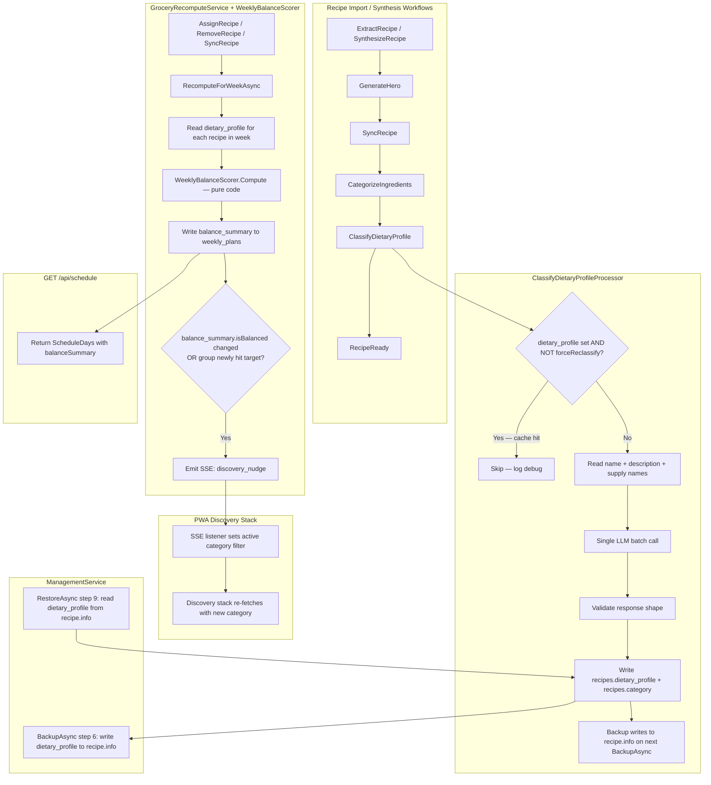

# Design Document: Recipe Dietary Categorization

## Overview

This feature adds a permanent dietary classification to every recipe in the library, aligned with the 2019 Canada's Food Guide (CFG). Classification runs once per recipe at import time via a background workflow processor. Results are cached on the recipe row and on disk (`recipe.info`) — no re-processing on subsequent imports. A deterministic balance scorer reads the cached profiles to produce a weekly summary. That summary drives a planner indicator and an SSE nudge that steers the discovery voting stack toward under-represented food groups.

**No LLM is involved in balance scoring.** The LLM is used exactly once per recipe, at import time, to produce the `DietaryProfile`. All downstream logic is pure code.

---

## Architecture



---

## Seam inventory

The following are the exact points where this feature touches existing code. Each one is a potential breakage site. Read each before implementing the task that touches it.

| Seam | Existing shape | What we add | Risk |
|---|---|---|---|
| `ScheduleDays` C# record | Positional record with 6 params, last two optional | Add `BalanceSummary` as 7th optional param | Positional record — wrong position breaks callers |
| `WeeklyPlan` model | Has `GroceryItems string = "[]"` | Add `BalanceSummary string? = null` | Must match schema.sql DEFAULT exactly |
| `ScheduleService.GetScheduleAsync` | Reads `plan.GroceryItems`, constructs `ScheduleDays` | Reads `plan.BalanceSummary`, passes to constructor | Constructor param order |
| `GroceryRecomputeService.RecomputeForWeekAsync` | Writes `grocery_items` to `weekly_plans` | Also writes `balance_summary`; emits SSE when changed | New `IScheduleEventPublisher` method needed |
| `IScheduleEventPublisher` interface | 8 methods | Add `PublishDiscoveryNudgeAsync` | All implementors must be updated (SseEventPublisher + test fakes) |
| `DiscoveryService.GetRecipesForDiscoveryAsync` | Filters on `r.Category` (string match) | Add optional `cuisine` filter via JSONB query on `dietary_profile` | `vw_discovery_recipes` view does NOT include `dietary_profile` — view must be updated first |
| `vw_discovery_recipes` view | Selects fixed columns from `recipes` | Must include `dietary_profile` for cuisine filter | Schema change — view must be updated in schema.sql |
| `DiscoveryRecipe` model | Maps `vw_discovery_recipes` columns | Add `DietaryProfile string?` column mapping | Must match view column name exactly |
| `ManagementService.BackupAsync` | Steps 1–5 | Add step 6: write `dietary_profile` to `recipe.info` | RecipeInfo already has backup loop — extend in-place |
| `ManagementService.RestoreAsync` | Reads `recipe.info` fields | Add step 9: upsert `dietary_profile` and `category` from `recipe.info` | Must not trigger workflow re-run |
| `RecipeInfo` model | File at `recipe.info`, various fields | Add `DietaryProfile RecipeDietaryProfile?` | Serialization: nullable, no default |
| `ClassifyDietaryProfileProcessor` payload | `{recipeId}` | Add optional `forceReclassify: bool` | Parsed from existing JSON payload — must be backward-compatible (default false) |

---

## Components and Interfaces

### New C# records (new files)

#### `RecipeDietaryProfile.cs`

```csharp
namespace RecipeApi.Models;

public record RecipeDietaryProfile(
    string PrimaryFoodGroup,
    string[] SecondaryFoodGroups,
    string ProteinSource,
    string CuisineType,
    string[] MealTypes,
    string PrimaryMealType,
    bool WholeGrainConfident,
    double Confidence,
    string Source,
    FopFlags? FopFlags        // null when raw_metadata.nutrition is absent or unparseable
);
```

Valid values:
- `PrimaryFoodGroup`: `"VegetablesAndFruits"`, `"WholeGrains"`, `"ProteinFoods"`, `"Mixed"`
- `SecondaryFoodGroups`: subset of the above, never includes `PrimaryFoodGroup`, never includes `"WholeGrains"` when `WholeGrainConfident = false`
- `ProteinSource`: `"RedMeat"`, `"Poultry"`, `"Seafood"`, `"PlantProtein"`, `"Dairy"`, `"Mixed"`, `"None"`
- `CuisineType`: free text — e.g. `"Italian"`, `"French-Canadian"`, `"Asian"`, `"Canadian"`, `"Mexican"`
- `MealTypes` / `PrimaryMealType`: `"Breakfast"`, `"Lunch"`, `"Dinner"`, `"Snack"`, `"Dessert"`
- `Source`: `"llm"` or `"manual"`
- `FopFlags`: computed deterministically from `raw_metadata.nutrition` at import time using `FopThresholds` constants — **no LLM involved, no guessing**. `null` is the common case — nutrition data is only present when the recipe's source URL published it as structured schema.org markup (e.g. meal-kit sites). Synthesized recipes, photo imports, and most blog imports will have `null`. Phase 2 CNF integration will fill gaps via `forceReclassify`.

#### `FopThresholds.cs` (new static class — **single source of truth, shared with Phase 2**)

```csharp
namespace RecipeApi.Services;

/// <summary>
/// Health Canada front-of-package (FOP) "High in" symbol thresholds.
/// 15% of the Daily Value per serving for each nutrient.
/// Source: https://www.canada.ca/en/health-canada/services/food-nutrition/nutrition-labelling/front-package.html
/// DO NOT duplicate these constants. All rules and scorers reference this class.
/// </summary>
public static class FopThresholds
{
    public const double SaturatedFatG = 4.0;   // DV 27g × 15%
    public const double SugarsG       = 15.0;  // DV 100g × 15%
    public const double SodiumMg      = 345.0; // DV 2300mg × 15%
}
```

#### `FopFlags.cs` (new record)

```csharp
namespace RecipeApi.Models;

/// <summary>
/// Per-recipe Health Canada FOP "High in" flags.
/// Computed from raw_metadata.nutrition at import time. null is the common case —
/// nutrition is only present when the source URL published structured schema.org nutrition markup.
/// Synthesized recipes, photo imports, and most blog imports produce null.
/// Phase 2 CNF integration fills gaps via forceReclassify.
/// Never inferred or guessed by the LLM.
/// </summary>
public record FopFlags(
    bool HighInSaturatedFat,
    bool HighInSugars,
    bool HighInSodium
);
```

#### `NutritionParser.cs` (new static class)

```csharp
namespace RecipeApi.Utils;

/// <summary>
/// Parses Schema.org NutritionInformation string values (e.g. "370 mg", "9 g") into doubles.
/// Returns null when the string is absent or unparseable — never throws.
/// </summary>
public static class NutritionParser
{
    public static double? ParseGrams(string? value)   // strips " g", handles null
    public static double? ParseMilligrams(string? value) // strips " mg", handles null

    public static FopFlags? ComputeFopFlags(NutritionInformation? nutrition)
    // Returns null when nutrition is null or all three relevant fields are null.
    // Otherwise computes each flag independently — a field being null does not block
    // the others. E.g. sodium present but saturated fat absent → highInSodium set,
    // highInSaturatedFat = false (cannot confirm, defaults conservative to false).
}
```

#### `WeeklyBalanceSummary.cs`

```csharp
namespace RecipeApi.Models;

public record WeeklyBalanceSummary(
    int ProteinDays,
    int VeggieDays,
    int GrainDays,
    int PlantProteinDays,
    int RedMeatDays,
    int MaxConsecutiveSame,
    bool IsBalanced,
    string[] Recommendations,
    FopWeekSummary FopWeekSummary   // pulled forward from Phase 2 — pure aggregation, no CNF needed
);
```

#### `FopWeekSummary.cs` (new record — **pulled forward from Phase 2**)

```csharp
namespace RecipeApi.Models;

/// <summary>
/// Count of dinner slots this week that triggered each Health Canada FOP "High in" flag.
/// Computed from recipes' FopFlags (which come from raw_metadata.nutrition).
/// null FopFlags (nutrition not published by source) contribute 0 to all counts.
/// Expect most recipes to have null until Phase 2 CNF integration runs forceReclassify.
/// Phase 2 upgrades accuracy via CNF-sourced FopFlags.
/// </summary>
public record FopWeekSummary(
    int HighInSaturatedFatDays,
    int HighInSugarsDays,
    int HighInSodiumDays
);
```

---

### Modified C# models

#### `Recipe.cs` — add one column property

```csharp
[Column("dietary_profile", TypeName = "jsonb")]
public string? DietaryProfile { get; set; } = null;
```

Pattern: same as `RawMetadata`. Stored as raw JSON string. Deserialized at read time using `JsonSerializer.Deserialize<RecipeDietaryProfile>`.

#### `WeeklyPlan.cs` — add one column property

```csharp
[Column("balance_summary", TypeName = "jsonb")]
public string? BalanceSummary { get; set; } = null;
```

Pattern: same as `GroceryItems` but nullable (no default empty array — null means "not yet computed").

#### `RecipeInfo.cs` — add one field

```csharp
public RecipeDietaryProfile? DietaryProfile { get; set; } = null;
```

#### `ScheduleDays.cs` — add one optional parameter at the end

Current signature:
```csharp
public record ScheduleDays(
    [property: JsonPropertyName("weekOffset")] int WeekOffset,
    [property: JsonPropertyName("locked")] bool Locked,
    [property: JsonPropertyName("status")] int Status,
    [property: JsonPropertyName("days")] List<ScheduleDayDto> Days,
    [property: JsonPropertyName("groceryState")] Dictionary<string, bool>? GroceryState = null,
    [property: JsonPropertyName("groceryItems")] List<GroceryLineItemDto>? GroceryItems = null);
```

Add `BalanceSummary` as the 7th parameter:
```csharp
    [property: JsonPropertyName("balanceSummary")] WeeklyBalanceSummary? BalanceSummary = null);
```

**Do not reorder any existing parameters.** The positional record pattern means every existing call site (tests, ScheduleService) passes arguments positionally — reordering breaks silently.

#### `DiscoveryRecipe.cs` — add one column property

```csharp
[Column("dietary_profile", TypeName = "jsonb")]
public string? DietaryProfile { get; set; } = null;
```

This is only needed for cuisine filtering. The `ToRecipe()` method does NOT need to map it — `DiscoveryRecipe.ToRecipe()` produces a `Recipe` for the API response, and dietary profile is not part of the discovery card payload.

---

### New C# class: `ClassifyDietaryProfileProcessor`

**File:** `api/src/RecipeApi/Services/Processors/ClassifyDietaryProfileProcessor.cs`

**Pattern:** Follow `CategorizeIngredientsProcessor` exactly for structure, registration, error handling, and retry behavior.

```
ExecuteAsync(WorkflowTask task, CancellationToken ct):
  1. Parse recipeId from payload (same pattern as CategorizeIngredientsProcessor).
  2. Parse optional forceReclassify bool from payload (default false if absent).
  3. Load recipe from DB via db.Recipes.FindAsync. If not found → log warning → return.
  4. If recipe.DietaryProfile != null AND forceReclassify == false → log debug "already classified" → return.
  5. If forceReclassify == true → set recipe.DietaryProfile = null before proceeding.
  6. Read: recipe.Name, recipe.Description (first 150 chars), supply names from recipe.RawMetadata.
  7. If RawMetadata null or supply[] empty → log debug → return (no LLM call).
  8. Call LLM with structured system prompt (see below).
  9. Deserialize and validate response:
     - primaryFoodGroup must be in {"VegetablesAndFruits","WholeGrains","ProteinFoods","Mixed"}
     - proteinSource must be in {"RedMeat","Poultry","Seafood","PlantProtein","Dairy","Mixed","None"}
     - if wholeGrainConfident == false → remove "WholeGrains" from secondaryFoodGroups
  10. On validation failure → log warning → return without writing (workflow continues).
  11. Parse NutritionInformation from recipe.RawMetadata (null-safe).
  12. Call NutritionParser.ComputeFopFlags(nutrition) → FopFlags? (null when nutrition absent).
  13. Attach FopFlags to the RecipeDietaryProfile before serialization.
  14. Serialize RecipeDietaryProfile to JSON → write to recipe.DietaryProfile.
  15. Write recipe.Category = profile.PrimaryFoodGroup.
  16. db.SaveChangesAsync(ct).
  17. On any exception → log error → return without throwing (workflow continues to RecipeReady).

Note: steps 11–13 are deterministic and never call the LLM. They cannot fail the workflow — any parse error produces null FopFlags, which is acceptable.
```

**Payload shape** (backward-compatible extension of existing `{recipeId}` pattern):
```json
{ "recipeId": "...", "forceReclassify": true }
```
`forceReclassify` is optional. If absent, `TryGetProperty` returns false → default false.

**System prompt (constant in the class):**

```
You are a culinary dietitian. Classify the recipe using Canada's 2019 Food Guide.

Rules:
- primaryFoodGroup: the food group that contributes most calories/nutrition.
  Must be exactly one of: VegetablesAndFruits, WholeGrains, ProteinFoods, Mixed.
- secondaryFoodGroups: other food groups meaningfully present. Never include primaryFoodGroup.
  Omit WholeGrains unless wholeGrainConfident is true.
- wholeGrainConfident: true ONLY when the ingredient list contains an explicit whole-grain
  name: brown rice, whole wheat, quinoa, oats, barley, spelt, farro, bulgur.
  pasta, linguine, noodles, rice (without qualifier), flour = false.
- proteinSource: must be exactly one of:
  RedMeat (beef/lamb/pork/veal/venison),
  Poultry (chicken/turkey/duck),
  Seafood (fish/shrimp/salmon/cod/tuna/scallop/crab/lobster),
  PlantProtein (legumes/tofu/tempeh/lentils/beans/chickpeas),
  Dairy (cheese/eggs/milk-dominant),
  Mixed (two or more of the above in meaningful quantity),
  None (no significant protein source).
- cuisineType: the culinary tradition. Use common names such as:
  Italian, French-Canadian, Canadian, Asian, Mexican, Mediterranean,
  Middle-Eastern, Indian, American, Japanese, Thai, Greek. Free text if none match.
- mealTypes: all applicable from [Breakfast, Lunch, Dinner, Snack, Dessert].
- primaryMealType: the single most likely meal slot.
- confidence: your confidence 0.0 to 1.0.
- source: always "llm".

Respond with JSON only. No explanation. No markdown.
```

**LLM request:**
```json
{
  "name": "Grilled Sweet Mustard Chicken Thighs",
  "description": "A family favourite with juicy grilled chicken in a sweet mustard glaze...",
  "ingredients": ["Chicken Thighs", "Dijon Mustard", "Brown Sugar", "Brown Rice", "Carrot", "Apple"]
}
```

**LLM response:**
```json
{
  "primaryFoodGroup": "ProteinFoods",
  "secondaryFoodGroups": ["WholeGrains", "VegetablesAndFruits"],
  "proteinSource": "Poultry",
  "cuisineType": "Canadian",
  "mealTypes": ["Dinner", "Lunch"],
  "primaryMealType": "Dinner",
  "wholeGrainConfident": true,
  "confidence": 0.95,
  "source": "llm"
}
```

**Registration in `Program.cs`:** Add alongside `CategorizeIngredientsProcessor` — no new DI configuration required.

---

### New C# class: `WeeklyBalanceScorer`

**File:** `api/src/RecipeApi/Services/WeeklyBalanceScorer.cs`

```csharp
namespace RecipeApi.Services;

public static class WeeklyBalanceScorer
{
    public static WeeklyBalanceSummary Compute(IEnumerable<RecipeDietaryProfile?> profiles)
    // Pure function. No DB access. No LLM.
    // Input: dietary profiles of the week's dinner-slot recipes (null = unclassified).
    // Null profiles contribute to no group credits — treated as Mixed.
    // FopWeekSummary is computed from profiles[i].FopFlags — null FopFlags contributes 0 to counts.
}
```

**Phase 1 targets and recommendation strings (fixed order, all must pass for `isBalanced: true`):**

| Field | Target | Recommendation when not met |
|---|---|---|
| `ProteinDays` | >= 3 | `"Add more protein-rich meals this week (meat, fish, legumes, eggs)."` |
| `VeggieDays` | >= 4 | `"Try to include vegetables or fruit in at least 4 dinners."` |
| `GrainDays` | >= 2 | `"Add whole grains (brown rice, quinoa, oats) to at least 2 dinners."` |
| `PlantProteinDays` | >= 1 | `"Include one plant-based protein dinner this week (beans, lentils, tofu)."` |
| `MaxConsecutiveSame` | <= 3 | `"You have several similar meals in a row — mix in a different food group."` |

**Counting rules:**
- `ProteinDays`: days where `ProteinFoods` is `PrimaryFoodGroup` OR appears in `SecondaryFoodGroups`
- `VeggieDays`: days where `VegetablesAndFruits` is `PrimaryFoodGroup` OR appears in `SecondaryFoodGroups`
- `GrainDays`: days where `WholeGrains` is `PrimaryFoodGroup` OR appears in `SecondaryFoodGroups` AND `WholeGrainConfident = true`
- `PlantProteinDays`: days where `ProteinSource` is `"PlantProtein"` or `"Mixed"`
- `RedMeatDays`: days where `ProteinSource` is `"RedMeat"`
- `MaxConsecutiveSame`: longest run of identical `PrimaryFoodGroup` values (nulls break the run)

---

### Modified C# service: `GroceryRecomputeService`

**Only `RecomputeForWeekAsync` is modified.** After writing `grocery_items`, add:

```
1. Load previous balance_summary from the weekly_plans row (before overwriting).
2. Load dietary_profile for each recipe assigned to the week's dinner slots.
   - Deserialize each recipe.DietaryProfile (string?) to RecipeDietaryProfile? (null-safe).
3. Call WeeklyBalanceScorer.Compute(profiles).
4. Serialize result to JSON → write to weeklyPlan.BalanceSummary.
5. SaveChangesAsync (already called for grocery_items — combine into one save).
6. Compare new summary to previous:
   - If a food group newly reached its target (e.g. proteinDays went from 2 to 3)
     OR isBalanced changed from false to true
     → call publisher.PublishDiscoveryNudgeAsync(nextFoodGroup, reason).
   - "nextFoodGroup" = the group furthest below its target in the new summary.
   - If isBalanced is true, nextFoodGroup = null.
   - If previous summary was null (first recompute), do NOT emit — no comparison possible.
```

**Determining `nextFoodGroup`:** rank unmet targets by how far below the minimum they are (as a fraction of the target). The most under-represented group wins.

---

### Modified interface: `IScheduleEventPublisher`

Add one method:

```csharp
Task PublishDiscoveryNudgeAsync(string? nextFoodGroup, string reason);
```

**Update `SseEventPublisher`:**

```csharp
public Task PublishDiscoveryNudgeAsync(string? nextFoodGroup, string reason)
    => _manager.BroadcastAsync("discovery_nudge", new { nextFoodGroup, reason });
```

**Update all test fakes** that implement `IScheduleEventPublisher` — they will fail to compile otherwise. Add a no-op implementation to each.

**SSE event name:** `discovery_nudge` (underscore — consistent with `slot_updated`, `vote_updated`, `grocery_updated`).

---

### Modified service: `DiscoveryService`

Add optional `cuisine` parameter to `GetRecipesForDiscoveryAsync`:

```csharp
public async Task<List<Recipe>> GetRecipesForDiscoveryAsync(
    Guid familyMemberId,
    string? category = null,
    string? cuisine = null)
```

**Cuisine filter — JSONB query:**

```csharp
if (!string.IsNullOrEmpty(cuisine))
{
    query = query.Where(r => EF.Functions.JsonContains(
        r.DietaryProfile,
        JsonSerializer.Serialize(new { cuisineType = cuisine })));
}
```

**Prerequisite:** `vw_discovery_recipes` must include `dietary_profile` (see schema changes below) and `DiscoveryRecipe` must map it (see model changes above).

**`DiscoveryController` update:** Add `[FromQuery] string? cuisine` parameter, pass to service.

---

### Modified service: `ScheduleService.GetScheduleAsync`

After deserializing `groceryItems`, add:

```csharp
var balanceSummary = plan?.BalanceSummary != null
    ? JsonSerializer.Deserialize<WeeklyBalanceSummary>(plan.BalanceSummary)
    : null;
```

Pass as 7th argument to the `ScheduleDays` constructor.

---

### Modified service: `ManagementService`

**`BackupAsync` — extend the existing recipe loop (step 2):**

In the section that constructs/updates `RecipeInfo` before calling `WriteInfoAsync`, add:

```csharp
if (recipe.DietaryProfile != null)
{
    var profile = JsonSerializer.Deserialize<RecipeDietaryProfile>(recipe.DietaryProfile);
    existing.DietaryProfile = profile; // or new RecipeInfo { DietaryProfile = profile, ... }
}
```

**`RestoreAsync` — add step 9 after existing recipe restore steps:**

```csharp
// Step 9: Restore dietary_profile from recipe.info
foreach (var info in recipeInfos)  // recipeInfos already loaded in restore loop
{
    if (info.DietaryProfile == null) continue;
    var recipe = await db.Recipes.FindAsync(info.Id, ct);
    if (recipe == null) continue;
    recipe.DietaryProfile = JsonSerializer.Serialize(info.DietaryProfile, JsonDefaults.CamelCase);
    recipe.Category = info.DietaryProfile.PrimaryFoodGroup;
}
await db.SaveChangesAsync(ct);
```

---

## Database Schema Changes

Add to `api/database/schema.sql` (psqldef declarative — no migration scripts):

```sql
-- recipes table: add dietary classification column
ALTER TABLE recipes ADD COLUMN IF NOT EXISTS
    dietary_profile jsonb DEFAULT NULL;

-- weekly_plans table: add balance summary column
ALTER TABLE weekly_plans ADD COLUMN IF NOT EXISTS
    balance_summary jsonb DEFAULT NULL;

-- vw_discovery_recipes view: add dietary_profile for cuisine filtering
-- Drop and recreate the view to include the new column.
-- The existing SELECT must be preserved exactly; only add dietary_profile.
CREATE OR REPLACE VIEW vw_discovery_recipes AS
SELECT r.id, r.name, r.category, r.description, r.ingredients,
       r.image_count, r.difficulty, r.total_time, r.is_vegetarian,
       r.is_healthy_choice, r.last_cooked_date, r.created_at,
       r.dietary_profile,
       -- existing vote_count subquery preserved unchanged
       ...
```

**Important:** Do not change the existing columns or their order in the view. Read the current `CREATE OR REPLACE VIEW` in `schema.sql` before editing — only append `r.dietary_profile` to the SELECT list and add it to the view's column definition.

---

## OpenAPI Contract Delta

### New schemas

```yaml
FopFlagsDto:
  type: object
  required: [highInSaturatedFat, highInSugars, highInSodium]
  properties:
    highInSaturatedFat: { type: boolean }
    highInSugars:       { type: boolean }
    highInSodium:       { type: boolean }

FopWeekSummaryDto:
  type: object
  required: [highInSaturatedFatDays, highInSugarsDays, highInSodiumDays]
  properties:
    highInSaturatedFatDays: { type: integer }
    highInSugarsDays:       { type: integer }
    highInSodiumDays:       { type: integer }

RecipeDietaryProfileDto:
  type: object
  required: [primaryFoodGroup, secondaryFoodGroups, proteinSource, cuisineType,
             mealTypes, primaryMealType, wholeGrainConfident, confidence, source]
  properties:
    primaryFoodGroup:    { type: string }
    secondaryFoodGroups: { type: array, items: { type: string } }
    proteinSource:       { type: string }
    cuisineType:         { type: string }
    mealTypes:           { type: array, items: { type: string } }
    primaryMealType:     { type: string }
    wholeGrainConfident: { type: boolean }
    confidence:          { type: number }
    source:              { type: string }
    fopFlags:
      nullable: true
      oneOf:
        - { $ref: '#/components/schemas/FopFlagsDto' }
        - { type: 'null' }

WeeklyBalanceSummaryDto:
  type: object
  required: [proteinDays, veggieDays, grainDays, plantProteinDays, redMeatDays,
             maxConsecutiveSame, isBalanced, recommendations, fopWeekSummary]
  properties:
    proteinDays:        { type: integer }
    veggieDays:         { type: integer }
    grainDays:          { type: integer }
    plantProteinDays:   { type: integer }
    redMeatDays:        { type: integer }
    maxConsecutiveSame: { type: integer }
    isBalanced:         { type: boolean }
    recommendations:    { type: array, items: { type: string } }
    fopWeekSummary:     { $ref: '#/components/schemas/FopWeekSummaryDto' }
```

### Updated `ScheduleDays` schema

Add after existing `groceryItems` property:

```yaml
        balanceSummary:
          nullable: true
          oneOf:
            - { $ref: '#/components/schemas/WeeklyBalanceSummaryDto' }
            - { type: 'null' }
```

### Updated `RecipeDto` schema

Add after existing `category` property:

```yaml
        dietaryProfile:
          nullable: true
          oneOf:
            - { $ref: '#/components/schemas/RecipeDietaryProfileDto' }
            - { type: 'null' }
```

### Updated `GET /api/discovery`

Add `cuisine` query parameter alongside existing `category`:

```yaml
        - name: cuisine
          in: query
          schema: { type: string }
```

### SSE event `discovery_nudge`

Document in the SSE endpoint description (narrative only — SSE events are not formally typed in OpenAPI 3.1):

```yaml
# SSE event: discovery_nudge
# data: { "nextFoodGroup": "WholeGrains" | null, "reason": "string" }
# Emitted when a food group reaches its weekly target during plan recomputation.
# nextFoodGroup is the most under-represented remaining group, or null when isBalanced.
```

---

## Workflow YAML Changes

### Standard tail — applied to `recipe-import`, `url-import`, `goto-synthesis`

Insert between the last `sync_recipe` task and `recipe_ready`:

```yaml
    - name: categorize_ingredients
      processor: CategorizeIngredients
      depends_on:
          - sync_recipe
      payload:
          recipeId: "{{ recipeId }}"
    - name: classify_dietary_profile
      processor: ClassifyDietaryProfile
      depends_on:
          - categorize_ingredients
      payload:
          recipeId: "{{ recipeId }}"
    - name: recipe_ready
      processor: RecipeReady
      depends_on:
          - classify_dietary_profile
      payload:
          recipeId: "{{ recipeId }}"
```

Note: `recipe-import.yaml` already has `categorize_ingredients` in the pending changes. Only add `classify_dietary_profile` before `recipe_ready` in that file.

### `recipe-description-regeneration.yaml` — exception

Insert `classify_dietary_profile` after `sync_recipe`. **Do NOT add `recipe_ready`.** **Do NOT add `categorize_ingredients`.**

```yaml
    - name: classify_dietary_profile
      processor: ClassifyDietaryProfile
      depends_on:
          - sync_recipe
      payload:
          recipeId: "{{ recipeId }}"
          forceReclassify: true
```

---

## Token Cost Model

| Step | Tokens (estimate) | Frequency |
|---|---|---|
| System prompt | ~300 tokens (eligible for prompt caching) | Once per cache TTL |
| Recipe input (name + description + ingredient names) | ~150–400 tokens | **Once per recipe, ever** |
| LLM response | ~80–120 tokens | Once per recipe, ever |
| **Total per recipe** | **~230–520 tokens** | **Once. Cached on disk forever.** |
| Balance scoring | 0 tokens | Every assign/remove |

At Gemini Flash pricing (~$0.075/1M input tokens): classifying 1,000 recipes ≈ **$0.04**. The system prompt is eligible for prompt caching — repeated calls within the cache TTL cost ~75% less on the input side.

---

## Testing Strategy

### What to test at each seam

| Seam | Test type | What to assert |
|---|---|---|
| `ScheduleDays` constructor | Unit | 7-argument construction compiles and serializes `balanceSummary` correctly |
| `WeeklyBalanceScorer.Compute` | Unit (property-based) | All 5 targets, null profiles, consecutive-same detection |
| `ClassifyDietaryProfileProcessor` | Unit (mocked `IChatClient`) | Idempotence, `forceReclassify`, validation, error paths |
| `GroceryRecomputeService` + scorer | Unit (mocked DB) | `balance_summary` written; SSE emitted only on state change; not emitted on first run |
| `IScheduleEventPublisher` fakes | Compilation | All test fakes implement new `PublishDiscoveryNudgeAsync` method |
| `ScheduleService.GetScheduleAsync` | Integration | `balanceSummary` present in `GET /api/schedule` response after assign |
| Discovery cuisine filter | Integration | `GET /api/discovery?cuisine=Italian` returns only Italian recipes |
| Backup/restore round-trip | Integration | backup → wipe `dietary_profile` → restore → profile matches original |
| Workflow: all four paths | Integration | Each workflow produces non-null `dietaryProfile` on recipe after completion |

### Test commands

```bash
task test:api     # C# unit + integration
task test:unit    # PWA unit tests
task test         # full suite
```
