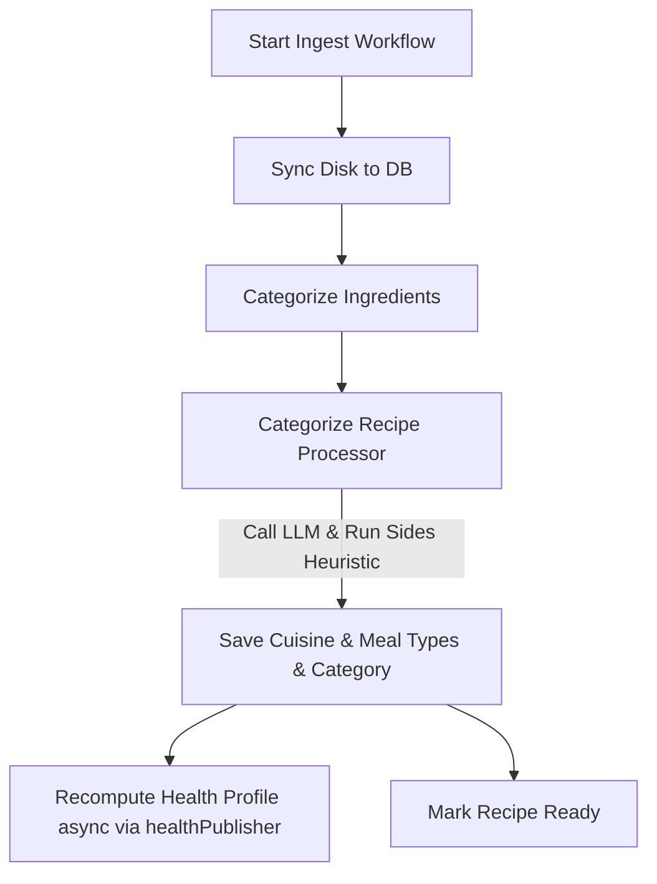

# Design: Recipe Categorization Refactoring

## UX Implementation Contract
* **One-Thumb Operation**: The meal types editor MUST use large toggleable pill buttons (height $\ge$ 44px, horizontal padding $\ge$ 16px) instead of checkboxes or select dropdowns.
* **Proximity Rule**: Metadata (Cuisine and Meal Types) must form a single visual cluster above the description.
* **UI Validation**:
  - The "Save" button in edit mode MUST be disabled if `draftMealTypes.length === 0`.
* **Color Harmony & Styling**: 
  - **Selected Meal Types Pill (Edit Mode)**: High-legibility pill styled in Sage Green:
    ```tsx
    className="px-4 py-2.5 rounded-full text-sm font-semibold transition-all duration-200 bg-sage text-white shadow-md active:scale-95"
    ```
  - **Unselected Meal Types Pill (Edit Mode)**: Muted pill styled in Soft Cream / light gray:
    ```tsx
    className="px-4 py-2.5 rounded-full text-sm font-semibold transition-all duration-200 bg-white border border-charcoal/10 text-charcoal/60 hover:bg-cream/20 active:scale-95"
    ```
  - **Cuisine Type Input (Edit Mode)**: A standard round-cornered text field placed directly below the Name field:
    ```tsx
    className="w-full px-4 py-2.5 rounded-xl border border-charcoal/10 bg-white text-charcoal focus:border-sage focus:outline-none text-sm transition-all duration-200"
    ```
  - **Cuisine Badge (View Mode)**: Styled in Ochre/cream:
    ```tsx
    className="inline-flex items-center gap-1 rounded-full bg-ochre/10 text-ochre px-3 py-1.5 shadow-sm text-[11px] font-black uppercase tracking-widest"
    ```
  - **Meal Types Badges (View Mode)**: Styled with a Soft Cream background and Sage Green borders:
    ```tsx
    className="rounded-full bg-white border border-sage/30 text-sage/80 px-3 py-1 text-xs font-bold"
    ```

## State Ownership
* **Component Local State**: `draftCuisineType` (string) and `draftMealTypes` (string array) are owned locally by `RecipeDetailSheet` during edit mode.
* **Global Sync**: On save, they are sent to the backend and update the recipe store so they are synchronized across views.

## Data Model

### 1. Database Schema
```sql
ALTER TABLE recipes ADD COLUMN cuisine_type text;
ALTER TABLE recipes ADD COLUMN meal_types text[];

CREATE INDEX idx_recipes_cuisine_type ON recipes (cuisine_type) WHERE (cuisine_type IS NOT NULL);

CREATE OR REPLACE VIEW vw_discovery_recipes AS
SELECT r.id, r.name, r.category, r.cuisine_type, r.meal_types, r.description, r.ingredients, r.image_count, r.total_time, r.is_vegetarian, r.is_healthy_choice, r.last_cooked_date, r.created_at, r.dietary_profile, r.finished_dish_index,
COALESCE(v.vote_count, 0) AS vote_count
FROM recipes r
LEFT JOIN (SELECT recipe_id, count(recipe_id) AS vote_count FROM recipe_votes WHERE vote = 1 GROUP BY recipe_id) v ON r.id = v.recipe_id
WHERE r.is_discoverable = true AND r.is_ready = true AND r.deleted_at IS NULL;
```

### 2. C# Models
```csharp
// Recipe.cs
[Column("cuisine_type")]
public string? CuisineType { get; set; }

[Column("meal_types")]
public string[]? MealTypes { get; set; }

// RecipeInfo.cs
public string? CuisineType { get; set; }
public string[]? MealTypes { get; set; }

// DiscoveryRecipe.cs
public string? CuisineType { get; set; }
public string[]? MealTypes { get; set; }
```

### 3. API Contract (OpenAPI)
```yaml
RecipeDto:
  type: object
  properties:
    ...
    category: { type: [string, 'null'] }
    cuisineType: { type: [string, 'null'] }
    mealTypes:
      type: [array, 'null']
      items:
        type: string
        enum: [Breakfast, Brunch, Snack, Lunch, Supper, Sides, Dessert, Appetizer, Beverage]

UpdateRecipeDto:
  type: object
  properties:
    ...
    cuisineType: { type: [string, 'null'] }
    mealTypes:
      type: [array, 'null']
      items:
        type: string
        enum: [Breakfast, Brunch, Snack, Lunch, Supper, Sides, Dessert, Appetizer, Beverage]
```

## Experience Architecture



## Mock Contract (Playwright Mock API)
In `pwa/e2e/mock-api.ts`, update mock responses for `GET /api/recipes/{id}` and `GET /api/discovery`:
```typescript
{
  id: "550e8400-e29b-41d4-a716-446655440010",
  name: "Spaghetti Carbonara",
  category: "Supper",
  cuisineType: "Italian",
  mealTypes: ["Supper", "Lunch"],
  rating: 3,
  isDiscoverable: true,
  isReady: true,
  ...
}
```

## Testing Strategy

| Layer | Component | Test File | Target Coverage |
| :--- | :--- | :--- | :--- |
| **Backend Unit** | Serialization | `RecipeDietaryProfileTests.cs` | JSON roundtrip validation. |
| **Backend Integration**| Workflows | `WorkflowStandardizationIntegrationTests.cs` | Synchronous run of `CategorizeRecipe` processor. |
| **Backend Integration**| Services | `RecipeServiceTests.cs` | Mapping of DTOs and database columns on update/detail; validation of empty/null mealTypes falling back to Supper. |
| **Backend Integration**| Backup/Restore | `ManagementServiceTests.cs` | Verify backup writes cuisine/mealTypes, restore reads them and supports fallback from JSON. |
| **Frontend Unit** | Detail Sheet | `RecipeDetailSheet.test.tsx` | Badges cluster presence, edit pill toggles, PATCH call args, disable Save when empty. |
| **E2E** | Discovery | `discovery.spec.ts` | Verify discovery stack filtering by category works when pinned to Supper and ignores any legacy steering nudges. |

## data-testid Index
* `recipe-detail-cuisine-badge`: Cuisine badge in view mode.
* `recipe-detail-meal-type-<type>`: Individual meal type badges (e.g. `recipe-detail-meal-type-supper`).
* `recipe-edit-cuisine-input`: Text input for cuisine type in edit mode.
* `recipe-edit-meal-type-pill-<type>`: Toggle pill button for meal types (e.g. `recipe-edit-meal-type-pill-supper`).
