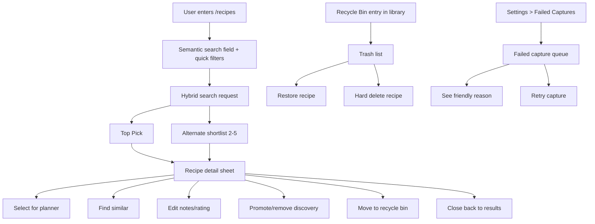

# Design Document: Semantic Recipe Search

## Overview

Semantic recipe search should feel like a calm command palette for supper, not a search engine.

The experience centers on the existing `/recipes` route and keeps the interaction loop deliberately short:
1. describe the meal in normal language,
2. get one strong `Top Pick` and a few alternates,
3. open a full recipe card without losing place,
4. take the next action immediately.

This feature also closes two recovery gaps that currently create anxiety:
- accidental recipe deletion,
- failed recipe capture with no follow-up path.

### Design posture — The Mère-Designer

- **Why (design theory):** Recovery actions must live near the object they affect. People do not think of deleted recipes as an app setting; they think of them as missing library items.
- **How (parental utility):** Recycle Bin belongs near the recipe library, where "I deleted the wrong one" happens. Failed captures belong in Settings because that is maintenance work, not meal-picking work.
- **Noise rule:** Search returns a short list with explainable reasons. The detail surface exposes only the next useful actions.

### UX implementation contract for agents

This section exists so smaller implementation models do not improvise a second design language.

1. **Keep the flow on the existing `/recipes` canvas.**
   - Do not create a second branded search route.
   - Do not fork the planner-search experience into a separate UI.
2. **Match existing PWA interaction patterns before inventing new ones.**
   - reuse the current search field treatment,
   - reuse existing pill/filter styling,
   - reuse sheet/card presentation for recipe detail,
   - reuse the planner-mode banner pattern when search is entered from Planner.
3. **Protect thumb-zone actions.**
   - primary result action,
   - close/back action,
   - filter pills,
   - stars trigger,
   - camera trigger,
   - Recycle Bin entry
   should all stay reachable on a large phone without two-handed gymnastics.
4. **Prefer native-feeling capture behavior.**
   - The camera path should open as a lightweight popup/sheet and hand off to live camera quickly.
   - Do not add a long wizard before taking the photo.
5. **Keep the result rhythm stable.**
   - one hero `Top Pick`,
   - up to four alternates,
   - one obvious next step from the detail sheet.
6. **Use truthful copy.**
   - The page says `Top Picks` unless the system is explicitly showing an agent-specific surface.
   - The stars affordance signals "help me search deeper," not "start a chat."
7. **Honor the existing visual system.**
   - Follow the established spacing, card density, and color usage already present in the app.
   - Do not introduce a new ornamental motif just for search.

If an implementation choice conflicts with these rules, the agent should simplify rather than decorate.

---

## Resolved Decisions

### 1. Recycle Bin location

**Decision:** The Recycle Bin's primary entry point lives on the recipe library/search surface, not in Settings.

**Rationale:**
- It is a library recovery action.
- It avoids a dead end where a user has to remember that deleted content was buried under Settings.
- It keeps the recovery loop one thumb away from the content that disappeared.

**Secondary affordance:** Settings MAY show a lightweight library-maintenance link later, but it is not the primary location.

### 2. Failed Captures location

**Decision:** Failed Captures live in Settings under a recovery/maintenance section.

**Rationale:**
- Capture failure handling is operational.
- It is usually a lower-frequency task than selecting supper.
- A stable queue with retry affordance fits Settings better than the library canvas.

### 3. Search detail surface

**Decision:** Search results open a full recipe detail sheet/card on top of `/recipes` rather than forcing a separate detail page in Phase 1.

**Rationale:**
- preserves search context,
- reduces navigation churn,
- keeps Planner selection tight,
- supports one-thumb close/act loops.

### 4. Search rollout strategy

**Decision:** Build search as progressive hybrid search.

**Phases:**
1. UI contract + lexical/fuzzy search + planner-aware reranking.
2. Detail actions + quick filters.
3. pgvector search documents + indexing workflow seam.
4. Backup/restore-compatible index persistence through the management endpoints.
5. Hybrid retrieval + agent-mode super-search + similar-recipe search.
6. Pantry/fridge/freezer photo search.
7. Recycle Bin + Failed Captures recovery surfaces.

This avoids a giant all-or-nothing search system and gives small models bounded slices.

### 5. Household permissions and elevated actions

**Decision:** This feature does not use an admin role model.

**Rationale:**
- the household is small,
- normal curation and recovery actions should stay lightweight,
- only irreversible destructive actions need extra friction.

**Rule:**
- all household members can search, view, edit notes, change ratings, toggle discovery, retry failed captures, soft delete, and restore,
- dangerous irreversible actions require an elevated PIN,
- the elevated PIN is deployment-configured via environment variable,
- if the PIN is not configured, dangerous actions are unavailable.

### Small-model delivery contract

This spec is expected to be implemented with smaller-capacity coding models such as Haiku, GPT-5.4 mini, and Gemini 3 Flash.

That means the phase design must stay strict:

1. Each phase should introduce at most one new contract seam, one new workflow seam, and one new UI seam.
2. Each task should be independently shippable and testable.
3. Agents should prefer deterministic heuristics before adding model-dependent behavior.
4. Agents should not invent UX beyond what this document and the flow docs authorize.
5. If a slice needs both API and PWA work plus a workflow change and cannot be explained in one page of instructions, it should be split again.

---

## Experience Architecture



### Primary search page layout

1. **Primary search input**
   - search icon + search field,
   - `Enter` submits search,
   - no separate user-facing lane name.
2. **Long-form agent trigger**
   - star/sparkle affordance,
   - opens or expands a longer text input for super-search,
   - still returns normal result cards rather than chat.
3. **Camera trigger**
   - camera icon,
   - opens an inventory-photo popup for pantry/fridge/freezer capture,
   - optimized for live camera + submit,
   - does not create a browsable photo history.
4. **Quick filters row**
   - `New`, `Never Tried`, `Family Favorite`, `Quick`, `It's Been a While`
   - with up to two contextual pills when useful.
5. **Top Pick card**
   - large visual hero,
   - one planner-aware explanation,
   - one tap to detail.
6. **Alternates rail/grid**
   - four compact cards max.
7. **Utility row**
   - Recycle Bin entry,
   - optionally a light capture-recovery shortcut later, but not in Phase 1.

### Search modes without user confusion

The product should behave as one search surface with three input paths:

1. **Default search field**
   - short-form search,
   - Enter to search,
   - cheapest path.
2. **Stars-triggered long-form input**
   - for agent-mode super-search,
   - best for fuzzy descriptions or compound constraints,
   - still returns ordinary result cards.
3. **Camera-triggered inventory capture**
   - for pantry/fridge/freezer ingredient-led search,
   - can feed both standard and agent-mode reranking.
   - uses temporary request-scoped artifacts only.

This keeps the interaction model unified while preserving cost control.

### Recipe detail sheet

The detail surface should feel like a decision card, not a dense admin form.

**Visible by default:**
- hero image,
- recipe title,
- why it matched,
- quick facts (time, difficulty, family-fit note),
- ingredients,
- notes,
- rating,
- discovery toggle,
- primary CTA.

**Primary CTA changes by context:**
- Planner mode: `Use For Day X`
- Library mode: `Save For Tonight` or `Close`
- Similar mode: `Use This One`

**Secondary actions:**
- `Find Similar`
- `Move to Bin`
- `Remove from Discovery` / `Promote for Discovery`

This avoids dead ends and keeps the next step obvious.

---

## Data And Service Architecture


---

## Proposed Seams

| Seam | Current state | Proposed extension | Risk |
|---|---|---|---|
| `/recipes` page | Recommendations shell | Semantic search destination with detail sheet | Low |
| `GET /api/recipes/{id}` + `PATCH /api/recipes/{id}` | Detail + notes/rating | Add discoverable toggle support to the detail editing flow | Medium |
| Planner search handoff | `/recipes?addToDay=...&weekOffset=...` | Reuse for planner-aware search selection | Low |
| `GET /api/schedule/fill-the-gap` logic | planner shortlist | Reuse ranking ideas for planner-aware top pick | Low |
| `Recipe` model | notes/rating/discoverable + dormant embedding comment | Add delete fields and separate search index table | Medium |
| Capture flows | failures surfaced transiently | Persist failed capture queue in Settings | Medium |

---

## Route And Contract Shape

### Public API additions

1. `POST /api/recipes/search`
   - main hybrid search contract for UI.
2. `POST /api/inventory-captures`
   - submit pantry/fridge/freezer photo batch.
3. `GET /api/inventory-captures/{id}`
   - retrieve parsed ingredient snapshot / processing status.
4. `GET /api/recipes/trash`
   - list soft-deleted recipes.
5. `POST /api/recipes/{id}/restore`
   - restore a soft-deleted recipe.
6. `DELETE /api/recipes/{id}/purge`
   - permanently delete a soft-deleted recipe.
7. `GET /api/captures/failures`
   - list persisted failed captures.
8. `POST /api/captures/failures/{id}/retry`
   - retry failed capture.

### Elevated action contract

The feature should use a simple elevated-PIN model instead of an admin role.

- Suggested deployment-time environment variable: `ELEVATED_ACTIONS_PIN`.
- The PIN represents elevated privileges for dangerous irreversible actions.
- The initial dangerous action in this feature is permanent delete / purge from Recycle Bin.
- Additional destructive management actions may reuse the same mechanism later.
- If `ELEVATED_ACTIONS_PIN` is missing, dangerous actions should be disabled.

### Existing management integration

1. `POST /api/management/backup`
   - must export search-index backup artifacts alongside the existing recipe backup material.
2. `POST /api/management/seed`
   - must restore search-index artifacts when present and compatible.

The semantic index should not require a separate backup/restore endpoint.

### Existing contract extensions

1. `PATCH /api/recipes/{id}` should be extended so the detail surface can update:
   - notes,
   - rating,
   - discoverable status.
2. `RecipeDto` for search responses should include grounded ranking reasons and state useful for quick actions.

### Agent integration

The agent should call the same underlying `RecipeSearchService`, but as an explicit super-search input mode, not as a chatbot layer. It does not require a separate conversational UI. Its output remains recipe results with grounded reasons.

---

## Data Model Proposal

### 1. `recipes`

Add:
- `deleted_at timestamptz null`
- `deleted_by uuid null`
- `delete_note text null` (optional, future-proof)

These fields allow soft delete without immediately destroying assets.

### 2. `recipe_search_documents`

Proposed one-to-one companion table:

```sql
recipe_id uuid primary key references recipes(id) on delete cascade,
document_text text not null,
search_metadata jsonb not null,
embedding vector not null,
embedding_model text not null,
embedding_version text null,
index_status text not null,
last_indexed_at timestamptz null,
source_fingerprint text null
```

**Why a companion table instead of overloading `recipes`:**
- keeps indexing concerns isolated,
- easier to reindex safely,
- supports status and versioning,
- easier hard-delete cleanup and debug.

`source_fingerprint` is the idempotency key for index work. If a queued job no longer matches the recipe's current fingerprint, it is stale and must not write.

### 3. `search.index.json` sidecar artifact

Add one sidecar file per recipe directory for management backup/restore compatibility.

```json
{
   "schemaVersion": 1,
   "recipeId": "uuid",
   "documentText": "normalized searchable text",
   "searchMetadata": {},
   "embedding": [0.123, 0.456],
   "embeddingModel": "configured-model-id",
   "embeddingVersion": "optional-version",
   "sourceFingerprint": "hash",
   "exportedAt": "timestamp"
}
```

**Why a sidecar file instead of stuffing this into `recipe.info`:**
- avoids bloating the main recipe metadata file,
- keeps vector/index schema versioning explicit,
- lets restore rehydrate semantic search without forcing a new embedding call,
- fits the repository's existing disk-first backup/restore posture.

### 4. `capture_failures`

Proposed recovery queue table:

```sql
id uuid primary key,
family_member_id uuid null,
source_type text not null,        -- upload | capture-url | describe
retry_payload jsonb not null,
preview_text text null,
friendly_reason text not null,
technical_reason text null,
failure_code text null,
status text not null,             -- failed | retrying | resolved
retry_count integer not null default 0,
recipe_id uuid null,
created_at timestamptz not null,
last_failed_at timestamptz not null,
last_retried_at timestamptz null
```

This queue is the durable source for Settings > Failed Captures.

---

## Backup And Restore Compatibility

### Backup

When `POST /api/management/backup` runs:
1. recipe metadata continues to write through the existing backup path,
2. semantic search exports `search.index.json` for each indexed recipe,
3. the artifact includes enough data to restore `recipe_search_documents` without a new embedding request,
4. artifact schema version and model ID are persisted for compatibility checks,
5. temporary pantry-photo files and request-scoped pantry snapshots are excluded.

### Restore

When `POST /api/management/seed` runs:
1. recipes restore through the existing management flow,
2. if `search.index.json` is present and compatible, restore upserts `recipe_search_documents`,
3. if the artifact is missing or incompatible, restore still succeeds for the recipe and marks `index_status=pending` or `stale`,
4. a later backfill workflow can regenerate embeddings only for the affected recipes,
5. no pantry-photo history is restored because none is persisted.

### Why this matters

The current repository already treats disk backup/restore as a management workflow. The semantic index must fit that contract so disaster recovery does not trigger a full model-cost rebuild before search becomes useful again.

For pantry-photo search, the correct posture is the opposite: raw images are temporary processing inputs, not durable household history.

---

## Concurrency And Idempotency Rules

### Job identity

- Every index job is keyed by `recipeId + source_fingerprint`.
- If the fingerprint has not changed, duplicate enqueue operations are safe no-ops.

### Stale-job protection

- Before writing `recipe_search_documents` or `search.index.json`, the worker must compare the queued fingerprint with the recipe's current fingerprint.
- If they do not match, the job is stale and must exit without writing.

### Hard delete wins

- Hard delete invalidates queued or retrying index jobs for that recipe.
- No later async job may recreate `recipe_search_documents` or `search.index.json` for a purged recipe.

### Restore establishes current state

- Restore writes the current valid index state for the recipe.
- Older queued jobs may not overwrite restored data if their fingerprint no longer matches.

### Backfill behavior

- Backfill and reindex operations must be idempotent.
- Re-running them should not duplicate artifacts or churn healthy rows unnecessarily.

---

## Ranking Strategy

### Candidate retrieval

**Lexical retrieval:**
- PostgreSQL trigram / fuzzy text search on document text.
- Strong weight on name, moderate on description/ingredients, moderate on notes.

**Vector retrieval:**
- cosine similarity or inner-product search on `embedding`.
- top `N` vector candidates merged with lexical candidates.

### Reranking dimensions

1. **Query fit**
   - lexical score,
   - semantic score,
   - ingredient/diet match.
2. **Household fit**
   - notes hit,
   - rating boost/demotion,
   - discovery votes/family interest,
   - recency/last cooked.
3. **Planner fit**
   - exclude already planned that week,
   - prefer underrepresented food groups,
   - prefer quick meals when query implies urgency,
   - avoid week monotony where possible.
4. **Inventory fit**
   - boost recipes with high overlap against pantry/fridge/freezer inferred ingredients,
   - down-rank recipes with many missing core ingredients,
   - surface "mostly on hand" reasoning in result metadata.

### Top Pick rule

`Top Pick` is the highest reranked item after planner fit is applied. It needs a short explanation such as:
- `Best match for “fresh and quick”`
- `Helps add vegetables to this week`
- `Notes mention the kids loved it`

The explanation makes the system feel grounded instead of arbitrary.

---

## Operational Defaults And Instrumentation

These values are deliberate starting defaults for this feature. They are expected to be challenged and tuned after the first real telemetry pass.

### Latency defaults

- Standard lexical search: p95 under 350ms.
- Hybrid lexical + vector search: p95 under 800ms.
- Agent-mode long-form search: p95 under 1200ms.
- Pantry-photo assisted search: return within 15 seconds or fail with a friendly busy / retry-later response.

### Freshness defaults

- Search-meaningful recipe edits should become semantically searchable within 3 minutes.
- Restored recipes should be lexically searchable immediately.
- Semantic restore/backfill may complete after lexical availability, but `pending` / `stale` index records older than 10 minutes should be treated as unhealthy.

### Fallback rule

- Vector retrieval gets a 300ms budget inside the request path.
- If vector lookup exceeds that budget, the request should return lexical results for that execution rather than stall the UI.

### Instrumentation contract

This feature should establish the first instrumentation pattern that later work can extend across the rest of the app.

At minimum, emit structured telemetry for:
- search request duration,
- search mode (`standard`, `agent`, `similar`, `pantry-assisted`),
- result path (`lexical-only`, `hybrid`, `fallback-lexical`),
- empty-result rate,
- top-pick generation success,
- index job duration,
- index job success/failure,
- index queue depth,
- counts of `pending`, `stale`, and `failed` search documents,
- pantry-photo processing duration,
- pantry-photo busy/failure rate,
- restore artifact compatibility failures.

Suggested event names:
- `recipe_search_requested`
- `recipe_search_completed`
- `recipe_search_fallback_served`
- `recipe_search_empty_results`
- `recipe_index_job_started`
- `recipe_index_job_completed`
- `recipe_index_job_failed`
- `recipe_index_restore_rehydrated`
- `recipe_index_restore_marked_pending`
- `pantry_photo_processing_started`
- `pantry_photo_processing_completed`
- `pantry_photo_processing_busy`

### Operator visibility

The system should make it easy to answer:
- how often search is serving fallback,
- how many recipes are `pending`, `stale`, or `failed`,
- what the current index lag is,
- whether pantry-photo requests are timing out,
- whether restore is successfully rehydrating search artifacts.

---

## Soft Delete / Hard Delete Behavior

### Soft delete

When the user chooses delete from an active recipe surface:
1. validate the recipe is not assigned to an active/future planner slot,
2. set `deleted_at` / `deleted_by`,
3. hide the recipe from all active lists,
4. keep files and DB relations intact for restore.

### Restore

When the user restores from Recycle Bin:
1. clear `deleted_at` / `deleted_by`,
2. re-include in active library,
3. restore any saved search-index artifact when present,
4. enqueue search reindex only when the saved artifact is missing, stale, or incompatible,
5. preserve notes/rating/discovery state.

### Hard delete

When the user permanently deletes from Recycle Bin:
1. verify the recipe is already soft-deleted,
2. require a successful elevated-PIN challenge,
3. remove disk assets,
4. remove sidecar metadata files, including `search.index.json`,
5. remove DB rows and dependent rows,
6. remove search-index document,
7. return success only when purge completes or a purge workflow safely owns the operation.

**Recommendation:** perform hard delete through a dedicated purge service with explicit filesystem cleanup responsibilities.

---

## Failed Capture Recovery Design

### Why Settings

Failed capture handling is a maintenance queue, not a recipe-selection moment.

### UI behavior

Settings > Failed Captures shows a clean list:
- source badge (`URL`, `Photos`, `Describe`),
- preview text or URL/domain,
- friendly reason,
- timestamp,
- `Retry` button,
- optional `Details` disclosure for technical reason.

### Friendly message examples

| Failure type | Friendly message |
|---|---|
| URL unreadable | `We couldn't read the recipe page. The site may be blocking import right now.` |
| extraction incomplete | `We found the page, but not enough recipe details to save it cleanly.` |
| model timeout | `The recipe took too long to process. Try again in a moment.` |
| image parse failure | `The photos were too unclear to turn into a recipe.` |

These messages should lower anxiety and give the user a next step.

---

## Testing Strategy

### Contract

- OpenAPI updates for search, trash, restore, purge, failed capture queue, retry.
- generated client regeneration.
- drift validation.
- management backup/restore contract coverage for semantic index artifacts.

### API unit/integration

- lexical search ranking,
- planner-aware reranking,
- notes/rating/vote boosts,
- backup/restore round-trip for `recipe_search_documents`,
- restore fallback when search-index artifact is missing or incompatible,
- similar search,
- soft delete exclusion,
- restore behavior,
- hard delete DB+disk purge,
- failed capture persistence and retry.

### PWA tests

- planner-mode search handoff,
- search result detail sheet preserves state,
- Recycle Bin utility entry and restore flow,
- delete-blocked-on-planner friendly error,
- Failed Captures settings queue and retry.

### E2E

- Search from planner -> select result -> planner success loop.
- Search result -> detail -> notes/rating edit -> close -> state preserved.
- Soft delete -> recipe disappears -> restore -> recipe returns.
- Hard delete from bin -> item no longer exists.
- Failed capture listed in Settings -> retry works.

---

## Risks And Tradeoffs

1. **Vector-first search is tempting but risky as a first slice.** Start with lexical/fuzzy + reranking to get a stable contract and UX loop.
2. **Comfort-food filtering is a weak signal initially.** Treat it as a heuristic until dedicated metadata exists.
3. **Hard delete must own filesystem cleanup carefully.** A naive DB-first delete risks orphaned files or partial purge failures.
4. **Failed capture retry payloads can drift.** Keep retry payloads versioned and minimal.
5. **Agent integration must not fork search ranking.** One search service, different callers.
6. **Index backup artifacts increase disk footprint.** The artifact format should stay compact and versioned to avoid backup bloat and schema drift.

---

## Additional Ideas

These should not block the core feature, but they fit the product direction:

1. **Weather-aware chips** like `Fresh Tonight` or `Cozy Supper` if weather context exists later.
2. **Inventory photo search** via pantry/fridge/freezer capture popup.
3. **Household memory chips** like `Elias loved this` once notes/person affinity is structured.
4. **Batch reindex dashboard** for future operational visibility.
5. **Ranking quality evaluation set** once enough real household query data exists to build a coherent golden dataset.

### Roadmap deferral: ranking quality governance

Formal ranking-quality governance is intentionally deferred.

- The current product does not yet have enough seed query data to build a coherent evaluation dataset.
- Early iterations should rely on correctness tests, operational instrumentation, and human review of obvious ranking failures.
- A later roadmap item should introduce a golden query set, expected result bands, and regression gates once real usage data exists.

---

## Flow References

- User flow: `docs/flows/user-flows/recipe-search-and-library-recovery.md`
- Data flow: `docs/flows/data-flows/recipe-search-index-and-recovery.md`
