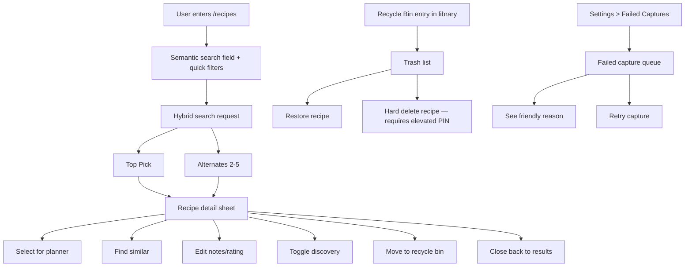
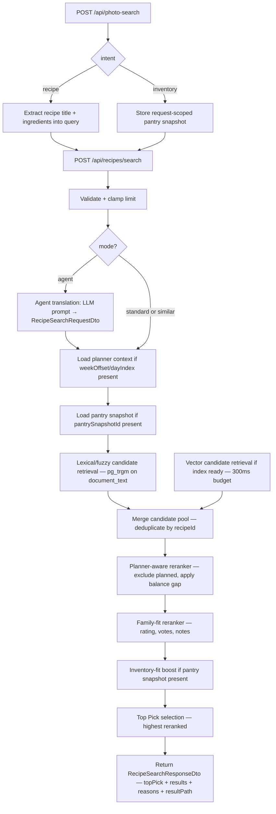
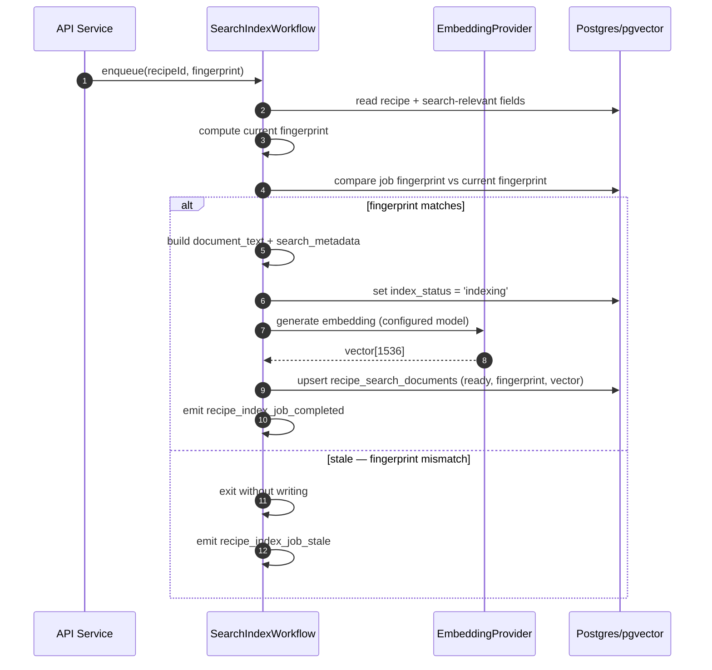
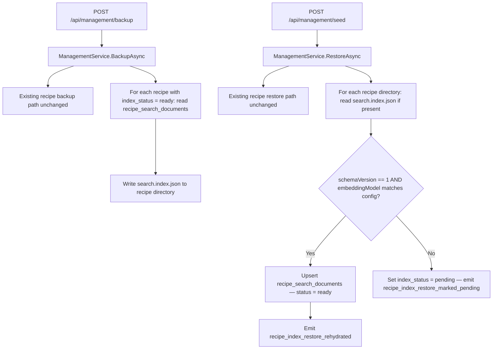
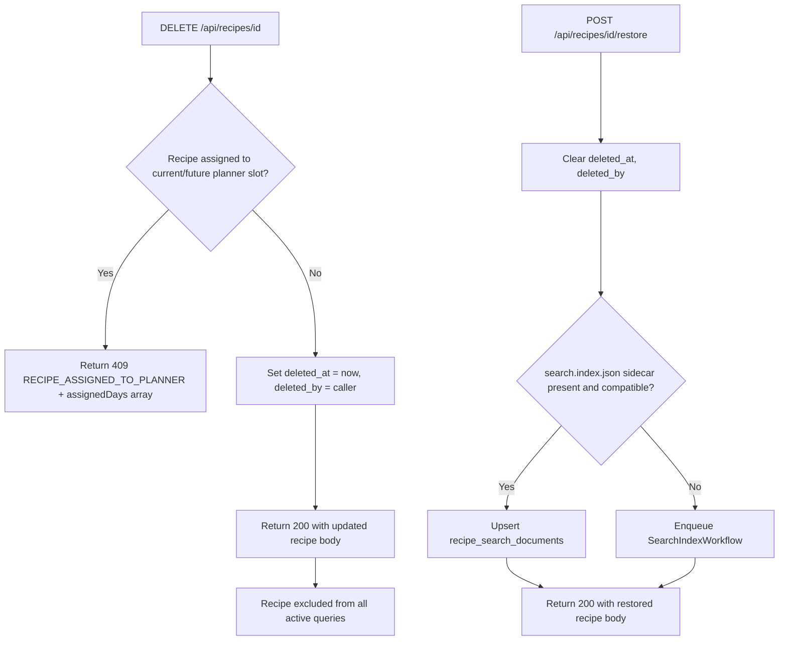
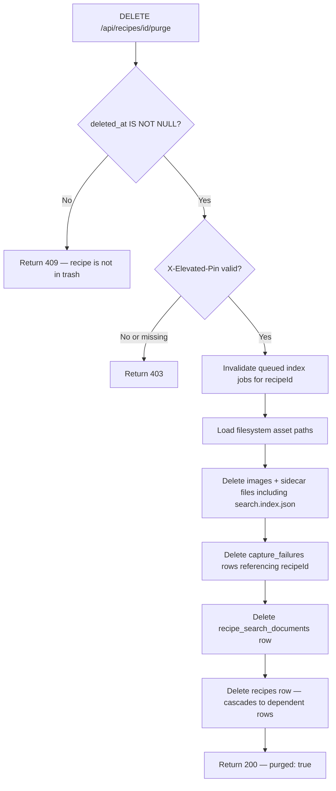
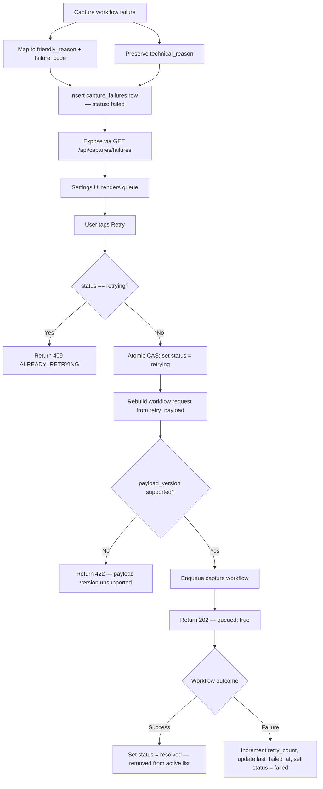

# Design v2: Semantic Recipe Search

## Revision Notes

This is the high-fidelity v2 of the design document.
It preserves all intent from v1 and fills every gap a small model could exploit to invent
incompatible behaviour: missing HTTP shapes, unspecified state ownership, ambiguous mock
contracts, and underspecified concurrency rules.

---

## Overview

Semantic recipe search should feel like a calm command palette for supper, not a search engine.

The experience centers on the existing `/recipes` route and keeps the interaction loop short:
1. describe the meal in normal language (or tap a filter, or point the camera),
2. get one strong `Top Pick` and up to four alternates,
3. open a full recipe card without losing place,
4. take the next action immediately.

This feature also closes two recovery gaps that create anxiety:
- accidental recipe deletion,
- failed recipe capture with no follow-up path.

---

## Design Posture — The Mère-Designer

- **Why (design theory):** Recovery actions must live near the object they affect.
  People do not think of deleted recipes as an app setting.
- **How (parental utility):** Recycle Bin belongs near the recipe library.
  Failed captures belong in Settings because that is maintenance work, not meal-picking work.
- **Noise rule:** Search returns a short list with explainable reasons.
  The detail surface exposes only the next useful actions.

---

## UX Implementation Contract For Agents

This section stops smaller models from inventing a second design language.

1. **Keep the flow on the existing `/recipes` canvas.**
   Do not create a second branded search route.
   Do not fork the planner-search experience into a separate UI.

2. **Match existing PWA interaction patterns before inventing new ones.**
   - Reuse the current search field treatment.
   - Reuse existing pill/filter styling and spacing.
   - Reuse the sheet/card presentation for recipe detail.
   - Reuse the planner-mode banner pattern when search is entered from Planner.

3. **Protect thumb-zone actions.**
   All of the following must stay reachable in the natural thumb arc on a 6.7" screen:
   - primary result action,
   - close/back action,
   - filter pills row,
   - stars/sparkle trigger,
   - camera trigger,
   - Recycle Bin entry.

4. **Prefer native-feeling capture behavior.**
   The camera path opens as a lightweight popup/sheet and hands off to live camera quickly.
   Do not add a multi-step wizard before taking the photo.

5. **Keep the result rhythm stable.**
   - one hero Top Pick,
   - up to four alternates,
   - one obvious next step from the detail sheet.

6. **Use truthful copy.**
   The page says "Top Picks" unless the system is showing an agent-specific surface.
   The stars affordance signals "help me search deeper," not "start a chat."

7. **Honor the existing visual system.**
   Follow established spacing, card density, and color usage already present in the app.
   Do not introduce a new ornamental motif just for search.

8. **data-testid is mandatory on every interactive and state-bearing element.**
   See the full `data-testid` index at the end of this document.
   If an element does not have a `data-testid`, it cannot be tested, so it cannot be shipped.

If an implementation choice conflicts with these rules, simplify rather than decorate.

---

## State Ownership Contract

This resolves the v1 gap where state preservation was mentioned but not specified.

### Search page state

The `/recipes` page SHALL own the following state in component-local React state
(or a page-scoped Zustand slice if the team prefers):

```ts
interface RecipeSearchPageState {
  query: string;
  agentQuery: string;
  activeFilters: RecipeSearchFiltersDto;
  topPick: RecipeSearchResultDto | null;
  results: RecipeSearchResultDto[];
  isLoading: boolean;
  resultPath: 'lexical-only' | 'hybrid' | 'fallback-lexical' | null;
  openDetailRecipeId: string | null; // null = sheet closed
  similarToRecipeId: string | null;  // set when Find Similar is tapped
}
```

**Rules:**
- `openDetailRecipeId` being set MUST NOT clear `topPick`, `results`, or `query`.
- Closing the detail sheet (setting `openDetailRecipeId = null`) MUST NOT trigger
  a new search API call.
- Filter toggles update `activeFilters` and trigger a new search API call.
- Typing in the main field updates `query` only. Search fires on `Enter` or submit.
- Tapping `Find Similar` sets `similarToRecipeId` and fires a new search call with
  `similarToRecipeId` set and `query` cleared.
- Planner context (`addToDay`, `weekOffset`) is read from URL params on mount and
  stored in component state. It does NOT drive re-renders on URL change.

### Detail sheet state

The detail sheet is a child component (sheet/drawer overlay).
It receives `recipeId` as a prop and fetches `GET /api/recipes/{id}` independently.
It does NOT share state with the search result list.
Its own local edit state (notes draft, rating draft) is discarded when the sheet unmounts.

---

## Resolved Decisions

### 1. Recycle Bin location

The Recycle Bin's primary entry point lives on the recipe library/search surface.
It is a library recovery action. Dead end risk if buried in Settings.

### 2. Failed Captures location

Failed Captures live in Settings under a recovery/maintenance section.
Capture failure handling is operational. A stable retry queue fits Settings better.

### 3. Search detail surface

Search results open a full recipe detail sheet on top of `/recipes`.
Preserves search context. Reduces navigation churn. Supports one-thumb close/act loops.

### 4. Search rollout strategy

Build search as progressive hybrid search:
1. UI contract + lexical/fuzzy search + planner-aware reranking.
2. Detail actions + quick filters.
3. pgvector search documents + indexing workflow seam.
4. Backup/restore-compatible index persistence.
5. Hybrid retrieval + agent-mode + similar-recipe search.
6. Pantry/fridge/freezer photo search.
7. Recycle Bin + Failed Captures recovery surfaces.

### 5. Household permissions

- All household members: search, view, edit notes, change rating, toggle discovery,
  retry failed captures, soft delete, restore.
- Dangerous irreversible actions (purge): require elevated PIN.
- PIN is `ELEVATED_ACTIONS_PIN` env var, sent in `X-Elevated-Pin` header.
- If the PIN env var is not configured, purge returns HTTP 503.

### 6. HTTP contract for delete-related operations

| Operation | Endpoint | Method | Success | Blocked |
|---|---|---|---|---|
| Soft delete | `/api/recipes/{id}` | DELETE | 200 (soft-deleted recipe body) | 409 if planned |
| Restore | `/api/recipes/{id}/restore` | POST | 200 (restored recipe body) | — |
| Purge (hard delete) | `/api/recipes/{id}/purge` | DELETE | 200 `{ purged: true }` | 409 if not soft-deleted; 403 if PIN wrong; 503 if PIN not configured |

### 7. `source_fingerprint` algorithm

SHA-256 hex digest of canonical JSON. Field set and sort order defined in requirements.md R8-AC5.
The same algorithm MUST be used in all server-side code paths (index job, compare-before-upsert,
restore compatibility check).

### 8. Agent mode is a server-side translation, not a second endpoint

Agent mode (`mode: "agent"`) runs through `POST /api/recipes/search`.
The server-side translation from free-form text to `RecipeSearchRequestDto` is an internal
concern. The API contract is identical for all callers.

### 9. Small-model delivery contract

Each phase introduces at most:
- one new contract seam,
- one new workflow seam,
- one new UI seam.

Each task must be independently shippable: pass `task agent:drift` + `task gate` on its own.

---

## Experience Architecture



---

## Primary Search Page Layout

### Structural zones (top to bottom)

1. **Planner-mode banner** (renders only when `addToDay` is in URL)
   - `data-testid="planning-mode-banner"`
   - `data-testid="planning-mode-cancel"` button

2. **Primary search input row**
   - search icon (left of field),
   - `data-testid="recipe-search-input"` text field,
   - `Enter` executes search,
   - sparkle/Sparkles icon appears inside field when query is non-empty (cosmetic only).

3. **Agent/super-search trigger**
   - `data-testid="agent-search-trigger"` (star/sparkle icon to the right of search field
     or below it, per existing spacing),
   - tapping opens/expands the long-form `data-testid="agent-search-input"` textarea,
   - submitting long-form runs `mode: "agent"` search.

4. **Camera/photo-search trigger**
   - `data-testid="inventory-camera-trigger"` (camera icon),
   - opens `data-testid="inventory-capture-popup"` sheet,
   - submits photos to `POST /api/photo-search`,
   - recipe photos search the existing library using the extracted query,
   - pantry/fridge/freezer photos return a `pantrySnapshotId` for inventory-fit search.

5. **Quick filter pills row**
   - `data-testid="filter-new-recipes"` — "New"
   - `data-testid="filter-never-tried"` — "Never Tried"
   - `data-testid="filter-family-favorite"` — "Family Favorite"
   - `data-testid="filter-quick"` — "Quick"
   - `data-testid="filter-not-cooked-long-time"` — "It's Been a While"
   - Active pill variant: `data-testid="filter-<name>-active"`

6. **Results section**
   - `data-testid="recipe-card-top-pick"` — large hero card
   - `data-testid="recipe-card-<recipeId>"` — each alternate card
   - `data-testid="search-empty-state"` — visible when results are empty

7. **Utility row**
   - `data-testid="recycle-bin-entry"` — Recycle Bin link/button

---

## Recipe Detail Sheet

The detail surface feels like a decision card, not a dense admin form.

### Container

- `data-testid="recipe-detail-sheet"` on the root sheet/drawer element.

### Visible by default

- Hero image
- Recipe title
- Match reasons (from `reasons` array)
- Quick facts: total time, difficulty
- Ingredients list
- Notes (inline editable, `data-testid="recipe-notes-input"`)
- Rating selector (`data-testid="recipe-rating-selector"`)
- Discovery toggle (`data-testid="action-toggle-discovery"`)
- Primary CTA (context-dependent)

### Primary CTA by context

| Context | `data-testid` | Label |
|---|---|---|
| Planner mode (`addToDay` set) | `action-use-for-day` | "Use for Day X" |
| Library/search mode | `action-save-for-tonight` | "Save for Tonight" |
| Similar mode (from Find Similar) | `action-use-this-one` | "Use This One" |

### Secondary actions

- `data-testid="action-find-similar"` — "Find Similar"
- `data-testid="action-move-to-bin"` — "Move to Bin"
- `data-testid="action-close-sheet"` — close/dismiss button

---

## Route And Contract Shape

### New API endpoints

| Endpoint | Method | Phase | Purpose |
|---|---|---|---|
| `/api/recipes/search` | POST | 1 | Hybrid search |
| `/api/photo-search` | POST | 6 | Classify recipe vs inventory photos and extract search input |
| `/api/inventory-captures` | POST | 6 | Legacy/direct pantry snapshot capture |
| `/api/inventory-captures/{id}` | GET | 6 | Retrieve pantry snapshot status |
| `/api/recipes/trash` | GET | 5 | List soft-deleted recipes |
| `/api/recipes/{id}/restore` | POST | 5 | Restore soft-deleted recipe |
| `/api/recipes/{id}/purge` | DELETE | 5 | Hard delete from recycle bin |
| `/api/captures/failures` | GET | 6 | List failed captures |
| `/api/captures/failures/{id}/retry` | POST | 6 | Retry failed capture |

### Modified existing endpoints

| Endpoint | Change | Phase |
|---|---|---|
| `DELETE /api/recipes/{id}` | Returns 200 (soft delete) instead of 204 (hard delete) | 5 |
| `PATCH /api/recipes/{id}` | `UpdateRecipeDto` gains `isDiscoverable: boolean \| null` | 2 |
| `POST /api/management/backup` | Exports `search.index.json` sidecar per recipe | 3 |
| `POST /api/management/seed` | Restores `recipe_search_documents` from sidecar when present | 3 |

### Elevated action contract

```
Header: X-Elevated-Pin: <pin>
Applies to: DELETE /api/recipes/{id}/purge
Behavior when missing: HTTP 403
Behavior when incorrect: HTTP 403
Behavior when ELEVATED_ACTIONS_PIN env var unset: HTTP 503
```

---

## Data Model

### `recipes` table additions

```sql
deleted_at  timestamptz null,
deleted_by  uuid null,           -- references family_members(id)
delete_note text null            -- reserved, not exposed in Phase 5 UI
```

### `recipe_search_documents` table

```sql
recipe_id        uuid primary key references recipes(id) on delete cascade,
document_text    text not null,
search_metadata  jsonb not null,
embedding        vector(1536),   -- null = pending or not yet indexed
embedding_model  text not null,
embedding_version text null,
index_status     text not null,  -- pending | indexing | ready | failed | stale
last_indexed_at  timestamptz null,
source_fingerprint text null,
schema_version   integer not null default 1
```

### `capture_failures` table

```sql
id                uuid primary key,
family_member_id  uuid null,
source_type       text not null,       -- url | photos | describe
retry_payload     jsonb not null,
payload_version   integer not null default 1,
preview_text      text null,
friendly_reason   text not null,
technical_reason  text null,
failure_code      text null,
status            text not null default 'failed', -- failed | retrying | resolved
retry_count       integer not null default 0,
recipe_id         uuid null,
created_at        timestamptz not null,
last_failed_at    timestamptz not null,
last_retried_at   timestamptz null
```

### `search.index.json` sidecar

```json
{
  "schemaVersion": 1,
  "recipeId": "<uuid>",
  "documentText": "<normalized text>",
  "searchMetadata": {},
  "embedding": [0.0],
  "embeddingModel": "<model-id>",
  "embeddingVersion": "<version or null>",
  "sourceFingerprint": "<sha256-hex>",
  "exportedAt": "<ISO 8601>"
}
```

Compatibility check on restore: `schemaVersion == current` AND `embeddingModel == configured model`.
Mismatch on either → mark `index_status = 'pending'`, do not upsert stale vectors.

---

## Data Flow: Hybrid Search Pipeline



### Retrieval stages

**Lexical/fuzzy:**
- `pg_trgm` trigram similarity on `document_text`.
- Weighted: name match > notes match ≈ description match > ingredients match.
- Returns up to `limit * 3` candidates for reranking pool.

**Vector:**
- Cosine similarity on `embedding` column via pgvector.
- Budget: 300 ms.
- If budget exceeded: skip, emit `recipe_search_fallback_served`, set `resultPath = "fallback-lexical"`.
- Returns up to `limit * 3` candidates.
- Merged with lexical candidates; duplicates deduped, higher score kept.

---

## Data Flow: Search Index Workflow



### Failure handling

| Failure | Action |
|---|---|
| Embedding provider timeout | Set `index_status = 'failed'`, emit `recipe_index_job_failed` |
| DB write conflict | Retry once; if it fails again, set `failed` |
| Hard-deleted recipe | Job detects `deleted_at IS NOT NULL` and exits without writing |
| Stale fingerprint | Job exits without writing; no error raised |

---

## Data Flow: Backup And Restore



### Why this matters

Disaster recovery must not require a full re-embed pass before search becomes useful.
Recipes restored with compatible sidecar artifacts are immediately lexically AND semantically
searchable. Recipes without compatible sidecars are lexically searchable immediately and
semantically searchable after the background backfill job runs.

---

## Data Flow: Soft Delete And Restore



### Active query exclusion rule

ALL queries returning recipes to active surfaces MUST include:
```sql
WHERE recipes.deleted_at IS NULL
```
This applies to: library listing, search candidate retrieval, discovery sources,
planner default/suggestion/fill-the-gap.

---

## Data Flow: Hard Delete Purge



### Safety requirement

Hard delete MUST be owned by a dedicated `RecipePurgeService`.
The purge operation is NOT a casual controller-level delete.
Filesystem cleanup MUST be attempted before DB row deletion. If filesystem deletion fails,
the operation returns an error and does not delete the DB row.

---

## Data Flow: Failed Capture Persistence And Retry



---

## Concurrency And Idempotency Rules

### Index job identity

- Every index job is keyed by `recipeId + source_fingerprint`.
- Duplicate enqueue operations for the same `recipeId + fingerprint` are safe no-ops
  (check `index_status != 'pending' AND source_fingerprint == job_fingerprint` before re-enqueue).

### Stale-job protection

Before writing `recipe_search_documents` or `search.index.json`, the worker MUST verify
the current recipe fingerprint still matches the job fingerprint.
Mismatch → exit without writing.

### Hard delete wins

Hard delete invalidates queued/retrying index jobs for that recipe.
After purge, no later async job may recreate `recipe_search_documents` or `search.index.json`.
Implementation: set a `purged` flag in the job registry OR check `deleted_at IS NOT NULL` before writing.

### Restore establishes current state

Restore writes the current valid index state.
Older queued jobs may not overwrite restored data if their fingerprint no longer matches.

### Retry idempotency

The `capture_failures.status = 'retrying'` guard MUST be implemented as an atomic
compare-and-set (a single `UPDATE ... WHERE status = 'failed' RETURNING id`),
not as a read-then-write. This prevents double-enqueue from concurrent taps.

---

## Ranking Strategy

### Candidate pool

```
pool = union(lexical_candidates, vector_candidates)
deduplicated by recipeId, max score kept
```

### Scoring dimensions

1. **Query fit score** (0–1.0)
   - Weighted average of lexical trigram similarity and cosine vector distance.
   - Name match weight: 0.4, notes+description weight: 0.3, ingredients weight: 0.2, other: 0.1.

2. **Household fit modifier** (additive)
   - `+boost_love = 0.15` for `rating == 3`
   - `+boost_like = 0.08` for `rating == 2`
   - `−boost_dislike = 0.10` for `rating == 1`
   - `+boost_votes = min(0.15, normalizedVoteCount * 0.05)` for positive discovery votes

3. **Planner fit modifier** (additive, only when planner context provided)
   - `+0.20` if recipe closes a known weekly balance gap
   - `−1.00` (exclude) if recipe is already assigned in the target week
   - `+0.10` if recipe `totalTime` ≤ 30 min AND query implies urgency

4. **Inventory fit modifier** (additive, only when pantry snapshot provided)
   - `+min(0.20, overlapRatio * 0.25)` where `overlapRatio = matchedIngredients / totalIngredients`

### Top Pick rule

Top Pick is the highest-scoring item after all modifiers are applied.
It MUST have a non-null `plannerFitNote` when planner context is present.

These score values are initial defaults. They MUST be exposed as named constants
(not magic numbers) so they can be tuned after the first telemetry pass.

---

## Mock Contract: `setupCommonRoutes` Extensions Required Per Phase

Builders MUST add these routes to `mock-api.ts` as part of the tasks that introduce them.
**Never use `route.continue()` in mocks.**

### Phase 1 (Task 1/2)

```ts
// POST /api/recipes/search
await page.route('**/api/recipes/search', async (route) => {
  await route.fulfill({
    status: 200,
    contentType: 'application/json',
    body: JSON.stringify({
      data: {
        topPick: null,
        results: [],
        appliedFilters: {},
        searchMode: 'standard',
        resultPath: 'lexical-only',
      },
    }),
  });
});
```

### Phase 5 (Task 14) — CRITICAL

The existing `DELETE /api/recipes/*` mock MUST be changed from `{ status: 204 }` to:
```ts
await route.fulfill({
  status: 200,
  contentType: 'application/json',
  body: JSON.stringify({
    data: builders.recipe({ id: extractedId, deletedAt: new Date().toISOString() }),
  }),
});
```
**Failing to update this mock causes all existing E2E tests to pass with wrong assumptions.**

### Phase 5 (Task 15)

```ts
// GET /api/recipes/trash
await page.route('**/api/recipes/trash', async (route) => {
  await route.fulfill({
    status: 200,
    contentType: 'application/json',
    body: JSON.stringify({ data: { items: [] } }),
  });
});

// POST /api/recipes/*/restore
await page.route('**/api/recipes/*/restore', async (route) => {
  await route.fulfill({
    status: 200,
    contentType: 'application/json',
    body: JSON.stringify({ data: builders.recipe() }),
  });
});
```

### Phase 5 (Task 16)

```ts
// DELETE /api/recipes/*/purge
await page.route('**/api/recipes/*/purge', async (route) => {
  await route.fulfill({
    status: 200,
    contentType: 'application/json',
    body: JSON.stringify({ data: { purged: true } }),
  });
});
```

### Phase 6 (Task 17/18)

```ts
// GET /api/captures/failures
await page.route('**/api/captures/failures', async (route) => {
  await route.fulfill({
    status: 200,
    contentType: 'application/json',
    body: JSON.stringify({ data: { items: [] } }),
  });
});

// POST /api/captures/failures/*/retry
await page.route('**/api/captures/failures/*/retry', async (route) => {
  await route.fulfill({
    status: 202,
    contentType: 'application/json',
    body: JSON.stringify({ data: { queued: true } }),
  });
});
```

---

## Testing Strategy

### Contract tests (per phase)

Each phase that introduces a new endpoint MUST add:
- OpenAPI spec entry for the endpoint and all new schemas.
- Client regeneration (`task api:generate`).
- Drift validation (`task agent:drift`).
- Snapshot tests for new DTO shapes.

### API unit/integration tests (per phase)

| Phase | Test coverage required |
|---|---|
| 1 | Lexical search returns results; empty results when no match; excludes deleted recipes |
| 2 | Rating boost, notes match boost, discovery vote boost; reasons returned |
| 2 | Detail sheet fetch; PATCH notes/rating/isDiscoverable; state preserved after PATCH |
| 3 | Indexing workflow enqueued on recipe create/update/restore |
| 3 | `source_fingerprint` matches expected SHA-256 for canonical input |
| 3 | Stale-job guard: worker exits when fingerprint mismatches |
| 3 | Duplicate enqueue for same fingerprint is a no-op |
| 4 | Backup writes `search.index.json` for indexed recipe |
| 4 | Restore with compatible sidecar upserts `recipe_search_documents` |
| 4 | Restore with missing sidecar sets `index_status = pending` |
| 4 | Restore with incompatible sidecar (wrong model) sets `index_status = pending` |
| 5 | Soft delete sets `deleted_at`; recipe excluded from active queries |
| 5 | Soft delete blocked (409) when recipe is in active planner slot |
| 5 | Delete-blocked response body includes `assignedDays` |
| 5 | Restore clears `deleted_at`; recipe returns to active queries |
| 5 | Purge removes DB rows and filesystem assets atomically |
| 5 | Purge blocked (409) for non-trash recipe |
| 5 | Purge blocked (403) for missing/wrong PIN |
| 5 | Purge blocked (503) when `ELEVATED_ACTIONS_PIN` not configured |
| 6 | Failed capture persisted with friendly reason |
| 6 | Retry sets status to `retrying`; duplicate retry returns 409 |
| 6 | Successful retry resolves record |
| 6 | Failed retry increments `retry_count` |

### PWA unit tests (per phase)

| Phase | Test coverage required |
|---|---|
| 1 | Search input renders with `data-testid="recipe-search-input"` |
| 1 | Planner-mode banner renders with correct `data-testid` when `addToDay` is in URL |
| 1 | Enter key triggers search API call |
| 1 | Results render with correct `data-testid` values |
| 1 | Empty state renders with `data-testid="search-empty-state"` |
| 2 | Detail sheet opens without clearing search state |
| 2 | Closing sheet does not trigger new search API call |
| 2 | Notes edit calls PATCH and does not navigate away |
| 2 | Filter toggle updates request payload |
| 2 | Combined filters reduce result set |
| 5 | Recycle Bin entry visible on search surface |
| 5 | Trash list renders items with correct `data-testid` |
| 5 | Restore action calls correct endpoint |
| 5 | Purge shows PIN dialog before calling purge endpoint |
| 6 | Settings shows failed-captures section |
| 6 | Retry button calls correct endpoint |
| 6 | Retry-in-progress state shown after tap |

### E2E tests (per phase)

| Phase | Scenario |
|---|---|
| 1 | Navigate to `/recipes` → search renders → mock results appear |
| 1 | Navigate to `/recipes?addToDay=2&weekOffset=0` → banner visible → cancel → back to planner |
| 1 | Type query and press Enter → search API called → results render |
| 2 | Tap result → detail sheet opens → close → same results still visible |
| 2 | Edit notes in sheet → PATCH called → sheet still open |
| 2 | Tap Find Similar → search re-runs with `similarToRecipeId` |
| 5 | Move to bin (soft delete) → recipe disappears from results → bin entry visible |
| 5 | Open bin → restore → recipe reappears |
| 5 | Open bin → purge → PIN dialog → confirm → item gone |
| 6 | Settings → Failed Captures section → empty state visible |
| 6 | Failed capture present → Retry → `queued: true` response |
| 7 | Full planner loop: search from planner → select result → planner shows assignment |

---

## data-testid Index

This is the authoritative list of all `data-testid` values introduced by this feature.
Builders MUST use these exact strings. No variations, no abbreviations.

### Search page

| Element | `data-testid` |
|---|---|
| Search text input | `recipe-search-input` |
| Agent/super-search trigger | `agent-search-trigger` |
| Agent text area (expanded) | `agent-search-input` |
| Agent submit button | `agent-search-submit` |
| Agent close/hide button | `agent-search-close` |
| Camera/photo-search trigger | `inventory-camera-trigger` |
| Planner-mode banner | `planning-mode-banner` |
| Planner-mode cancel button | `planning-mode-cancel` |
| Top Pick card | `recipe-card-top-pick` |
| Alternate result card | `recipe-card-<recipeId>` |
| Search empty state | `search-empty-state` |
| Recycle Bin entry | `recycle-bin-entry` |
| Search loader | `recipe-loader` (existing, keep) |

### Quick filter pills

| Filter | Inactive `data-testid` | Active `data-testid` |
|---|---|---|
| New Recipes | `filter-new-recipes` | `filter-new-recipes-active` |
| Never Tried | `filter-never-tried` | `filter-never-tried-active` |
| Family Favorite | `filter-family-favorite` | `filter-family-favorite-active` |
| Quick | `filter-quick` | `filter-quick-active` |
| Not Cooked Long Time | `filter-not-cooked-long-time` | `filter-not-cooked-long-time-active` |
| Over-constrained empty | `filter-no-results` | — |

### Recipe detail sheet

| Element | `data-testid` |
|---|---|
| Sheet container | `recipe-detail-sheet` |
| Recipe name heading | `recipe-detail-name` |
| Notes input | `recipe-notes-input` |
| Rating selector | `recipe-rating-selector` |
| Discovery toggle | `action-toggle-discovery` |
| Find Similar action | `action-find-similar` |
| Move to Bin action | `action-move-to-bin` |
| Close sheet button | `action-close-sheet` |
| Planner-mode CTA | `action-use-for-day` |
| Library-mode CTA | `action-save-for-tonight` |
| Similar-mode CTA | `action-use-this-one` |

### Inventory capture popup

| Element | `data-testid` |
|---|---|
| Popup container | `inventory-capture-popup` |
| Submit button | `inventory-capture-submit` |
| Cancel/close button | `inventory-capture-cancel` |

### Recycle Bin

| Element | `data-testid` |
|---|---|
| Recycle Bin entry (search surface) | `recycle-bin-entry` |
| Trash list container | `trash-list` |
| Each trash item | `trash-item-<recipeId>` |
| Restore button per item | `action-restore-<recipeId>` |
| Purge button per item | `action-purge-<recipeId>` |
| Elevated-PIN dialog | `elevated-pin-dialog` |
| PIN input field | `elevated-pin-input` |
| PIN error message | `elevated-pin-error` |
| Trash empty state | `trash-empty-state` |

### Failed Captures (Settings)

| Element | `data-testid` |
|---|---|
| Section container | `failed-captures-section` |
| Each failure row | `failed-capture-<id>` |
| Friendly reason text | `failed-capture-reason-<id>` |
| Retry button per row | `action-retry-<id>` |
| Retry in-progress indicator | `action-retry-<id>-retrying` |
| Retry error (e.g. 409) | `action-retry-error-<id>` |
| Empty state | `failed-captures-empty` |

---

## Risks And Tradeoffs

1. **Vector-first is tempting but risky as a first slice.** Start with lexical/fuzzy + reranking.
2. **Hard delete must own filesystem cleanup carefully.** Filesystem first, then DB row.
3. **Failed capture retry payloads can drift.** `payload_version` field prevents silent breakage.
4. **Agent integration must not fork search ranking.** One service, different callers.
5. **The `setupCommonRoutes` DELETE mock change in Phase 5 will break existing tests if not done correctly.** This is the highest-risk mock migration in the feature. Treat it as a first-class task item, not a footnote.
6. **Ranking score constants are magic numbers until extracted.** Extract as named constants before Phase 5 ships.
7. **`source_fingerprint` algorithm must be centralized.** Two builders computing fingerprints independently will diverge. Put it in one shared utility, tested in isolation.

---

## Flow References

- User flow: `docs/flows/user-flows/recipe-search-and-library-recovery.md`
- Data flow: `docs/flows/data-flows/recipe-search-index-and-recovery.md`
