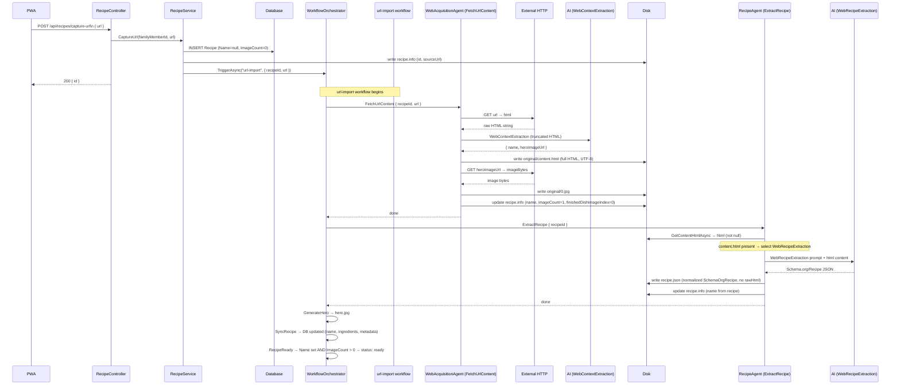

# Design Document — url-import-html-capture

## Overview

This feature changes how the `url-import` workflow stores and uses raw HTML during recipe capture. The current implementation embeds the full HTML inside `recipe.json` as a `rawHtml` property, which inflates the file, couples the extraction prompt to the wrong input modality, and prevents reuse of the captured HTML by other processors.

The change introduces three coordinated modifications:

1. **`WebAcquisitionAgent`** saves the fetched HTML to `original/content.html` via a new `RecipeRepository` method, and stops writing `rawHtml` into `recipe.json`.
2. **`RecipeAgent.DoExtractRecipeAsync`** detects which source artifacts are present on disk and selects the appropriate extraction prompt: `WebRecipeExtraction` when `content.html` exists, `RecipeExtraction` when only images exist.
3. **A new `extract-web-recipe.md` prompt** is added, registered as `PromptType.WebRecipeExtraction`, and loaded at startup by `EmbeddedPromptRepository`.

No changes are required to `url-import.yaml` or `recipe-import.yaml`. The workflow DAG already enforces the correct ordering: `FetchUrlContent` completes before `ExtractRecipe` is eligible to run.

### Research Summary

The Schema.org Recipe type is well-established. Most major recipe sites embed structured data as `<script type="application/ld+json">` blocks or as microdata attributes (`itemtype="https://schema.org/Recipe"`). The new prompt should exploit this: JSON-LD is the highest-fidelity source (already machine-readable), microdata is second, and semantic HTML parsing is the fallback. This mirrors the extraction priority used by search engines and recipe aggregators.

Key finding: the existing `SchemaOrgRecipe` C# model already defines all required fields. The new prompt must produce JSON that deserializes cleanly into that model — no model changes are needed.

---

## Architecture

The feature is entirely within the API backend. No frontend changes, no database schema changes, no workflow YAML changes.

```
url-import workflow (unchanged YAML)
│
├── FetchUrlContent  →  WebAcquisitionAgent
│     Fetches HTML, saves original/content.html,
│     downloads hero image, writes recipe.info.
│     Does NOT write rawHtml to recipe.json.
│
├── ExtractRecipe    →  RecipeAgent (DoExtractRecipeAsync)
│     Detects artifacts on disk:
│       content.html present  →  WebRecipeExtraction prompt
│       images only           →  RecipeExtraction prompt
│       neither               →  log warning, return
│     Writes normalized recipe.json (SchemaOrgRecipe).
│
├── GenerateHero     →  (unchanged)
├── SyncRecipe       →  (unchanged)
└── RecipeReady      →  (unchanged)
```

The artifact detection logic in `RecipeAgent` is the single decision point. It is purely disk-based — no flags, no database columns, no workflow parameters.

---

## Components and Interfaces

### RecipeRepository — new methods

```csharp
/// <summary>
/// Persists the raw HTML of a recipe webpage to original/content.html using UTF-8 encoding.
/// </summary>
Task SaveContentHtmlAsync(Guid recipeId, string html, CancellationToken ct);

/// <summary>
/// Returns the HTML string from original/content.html, or null if the file does not exist.
/// </summary>
Task<string?> GetContentHtmlAsync(Guid recipeId, CancellationToken ct);
```

Both methods use the existing `IStorageProvider` abstraction. The path is `recipes/{recipeId}/original/content.html`.

`SaveContentHtmlAsync` writes the string as UTF-8 bytes. `GetContentHtmlAsync` reads the bytes and decodes as UTF-8. No BOM, no transformation.

### PromptType enum — new value

```csharp
public enum PromptType
{
    RecipeExtraction,
    DescriptionGeneration,
    RecipeSynthesis,
    WebContextExtraction,
    WebRecipeExtraction      // ← new
}
```

### EmbeddedPromptRepository — new mapping

```csharp
{ PromptType.WebRecipeExtraction, "RecipeApi.Prompts.extract-web-recipe.md" }
```

The constructor preloads all mapped prompts at startup. If `extract-web-recipe.md` is not embedded in the assembly, the constructor throws `FileNotFoundException` immediately — fail-fast, no silent degradation.

### WebAcquisitionAgent — changes to ProcessUrlAsync

Replace step 5 (the current `rawHtml` write) with:

```csharp
// 5. Save HTML as a first-class artifact
await recipeRepository.SaveContentHtmlAsync(recipeId, html, ct);

// 6. Write recipe.info with name and sourceUrl (no rawHtml in recipe.json)
var info = await recipeRepository.GetInfoAsync(recipeId, ct);
info.SourceUrl = url;
await recipeRepository.SaveInfoAsync(info, ct);
```

`recipe.json` is no longer written by `WebAcquisitionAgent`. It is written exclusively by `RecipeAgent.DoExtractRecipeAsync`, which already normalizes the output to `SchemaOrgRecipe` before saving.

> **Note on `RecipeInfo.SourceUrl`**: The `recipe.info` file already stores `Name`. The `SourceUrl` field should be added to `RecipeInfo` if not already present, so the source URL is preserved as metadata without touching `recipe.json`.

### RecipeAgent.DoExtractRecipeAsync — source detection logic

Replace the current `rawHtml` read from `recipe.json` with artifact detection:

```csharp
// Detect source artifacts
var contentHtml = await recipeRepository.GetContentHtmlAsync(recipeId, ct);
var imageFiles = await GetImageFilesAsync(recipeId, ct);

if (contentHtml == null && imageFiles.Count == 0)
{
    logger.LogWarning("No artifacts found for recipe {RecipeId}", recipeId);
    return;
}

// Select prompt based on artifact presence
var promptType = contentHtml != null
    ? PromptType.WebRecipeExtraction
    : PromptType.RecipeExtraction;

var prompt = promptRepository.GetPrompt(promptType);
```

When `contentHtml` is present, it is appended to the user message (truncated to 50 000 chars as before). When only images are present, the existing image-attachment logic runs unchanged.

### extract-web-recipe.md — new prompt

See the Data Models section for the full prompt text specification.

---

## Data Models

### Artifact layout (confirmed)

```
{recipesRoot}/{recipeId}/
  original/
    content.html     ← saved by WebAcquisitionAgent (new)
    0.jpg            ← hero image downloaded from site
  recipe.info        ← name, sourceUrl (written by WebAcquisitionAgent)
  recipe.json        ← Schema.org/Recipe (written by RecipeAgent)
  hero.jpg           ← AI-generated hero (written by GenerateHero)
```

`recipe.json` after this change contains only `SchemaOrgRecipe` fields. It never contains `rawHtml`.

### SchemaOrgRecipe (unchanged)

Both extraction prompts must produce JSON that deserializes into the existing `SchemaOrgRecipe` C# model:

```json
{
  "@context": "https://schema.org/",
  "@type": "Recipe",
  "languageCode": "FR",
  "name": "Recipe Title",
  "recipeYield": "4 portions",
  "totalTime": "PT35M",
  "recipeIngredient": ["1 cup flour", "2 eggs"],
  "supply": [ ... ],
  "recipeInstructions": [ ... ],
  "nutrition": { ... }
}
```

Missing fields must be set to `null`, not omitted.

### extract-web-recipe.md — prompt specification

```markdown
Role: High-Precision Web Recipe Extractor.
Task: Extract a recipe from the HTML of a webpage and return a Schema.org/Recipe JSON object.

EXTRACTION PRIORITY (follow in order):

1. JSON-LD FIRST: Look for <script type="application/ld+json"> blocks. If one contains
   "@type": "Recipe" (or an array containing a Recipe), extract it directly.
   Normalise field names to match the schema template below.

2. MICRODATA SECOND: If no JSON-LD Recipe is found, look for elements with
   itemtype containing "schema.org/Recipe". Extract itemprop values.

3. SEMANTIC HTML FALLBACK: If neither JSON-LD nor microdata is found, parse the
   page semantically: recipe name from <h1>/<h2>, ingredients from <ul>/<li> near
   "ingredients", instructions from numbered lists or <ol> near "instructions"/"method".

RULES:
1. LANGUAGE LOCK: Detect the language of the content. Set languageCode to "FR" or "EN".
   All text (name, ingredients, instructions) MUST remain in the original language. Zero translation.
2. DATA SOVEREIGNTY: Only extract what is present. Do not invent ingredients or steps.
3. CONTENT FIDELITY: Extract 100% of ingredients and instruction steps. No compression.
4. NULL FIELDS: If a field is not available in the source, set it to null. Do not omit fields.
5. TIME FORMAT: Convert any time values to ISO 8601 duration (e.g., "PT30M").
6. YIELD: Extract yield exactly as written (e.g., "4 portions", "serves 6").

SCHEMA TEMPLATE (MUST FOLLOW EXACTLY):
{
  "@context": "https://schema.org/",
  "@type": "Recipe",
  "languageCode": "FR",
  "name": "Recipe Title",
  "recipeYield": "4 portions",
  "totalTime": "PT35M",
  "recipeIngredient": ["1 cup flour", "2 eggs"],
  "supply": [
    {
      "@type": "HowToSupply",
      "name": "Ingredient Name",
      "requiredQuantity": {
        "@type": "QuantitativeValue",
        "value": 1.5,
        "unitText": "tsp"
      }
    }
  ],
  "recipeInstructions": [
    {
      "@type": "HowToSection",
      "name": "Section Name",
      "itemListElement": [
        { "@type": "HowToStep", "text": "Step text..." }
      ]
    }
  ],
  "nutrition": {
    "@type": "NutritionInformation",
    "calories": "500 kcal",
    "fatContent": "20 g",
    "saturatedFatContent": "5 g",
    "sodiumContent": "500 mg",
    "carbohydrateContent": "50 g",
    "fiberContent": "5 g",
    "sugarContent": "10 g",
    "proteinContent": "30 g"
  }
}

STRICT OUTPUT: Return ONLY valid JSON. No markdown. No preamble. No explanation.
Use null for missing fields.
```

---

## Flow Documentation

### Updates to `docs/flows/data-flows/recipe-readiness.md`

Add the URL-import path as a third capture mode. The readiness rule for URL import is:
`Name != null/empty AND ImageCount > 0` (same as photo-upload, because `WebAcquisitionAgent` downloads the hero image and sets `ImageCount = 1`).

The updated computed rule section becomes:

```
Photo-upload:  Name != null/empty  AND  ImageCount > 0
Describe:      Name != null/empty  AND  IsSynthesized = true
URL-import:    Name != null/empty  AND  ImageCount > 0
```

The flowchart gains a third branch from `B{Capture mode}`:

```
B -->|URL import| E[POST /api/recipes/capture-url\nurl]
E --> E1[url-import workflow triggered\nrecipe.info written, ImageCount = 1]
E1 --> E2[FetchUrlContent\nfetch HTML → original/content.html\ndownload hero → original/0.jpg]
E2 --> E3[ExtractRecipe\ncontent.html detected → WebRecipeExtraction prompt\n→ recipe.json]
E3 --> E4[GenerateHero → hero.jpg]
E4 --> E5[SyncRecipe → DB updated]
E5 --> E6[RecipeReady\nName set AND ImageCount > 0]
E6 --> R([Status: ready])
```

### New file: `docs/flows/data-flows/url-import-path.md`

A dedicated sequence diagram for the full URL-import pipeline:



---

## Correctness Properties

*A property is a characteristic or behavior that should hold true across all valid executions of a system — essentially, a formal statement about what the system should do. Properties serve as the bridge between human-readable specifications and machine-verifiable correctness guarantees.*

### Property 1: HTML round-trip integrity

*For any* HTML string (including Unicode characters, special characters, and large strings), calling `SaveContentHtmlAsync` followed by `GetContentHtmlAsync` on the same recipe ID SHALL return a string equal to the original input.

**Validates: Requirements 7.1, 7.2, 1.4, 1.5**

### Property 2: recipe.json never contains rawHtml after WebAcquisitionAgent

*For any* URL and any HTML content returned by that URL, after `WebAcquisitionAgent.ProcessUrlAsync` completes, the `recipe.json` file for that recipe SHALL NOT contain a `rawHtml` property.

**Validates: Requirements 1.2, 5.1**

### Property 3: recipe.json never contains rawHtml after RecipeAgent

*For any* recipe extraction run (web path or photo path), after `RecipeAgent.DoExtractRecipeAsync` completes and writes `recipe.json`, the saved JSON SHALL NOT contain a `rawHtml` property.

**Validates: Requirements 5.2, 5.3**

### Property 4: Prompt selection is determined solely by artifact presence

*For any* recipe ID, the prompt selected by `RecipeAgent.DoExtractRecipeAsync` SHALL satisfy:
- If `original/content.html` exists → `PromptType.WebRecipeExtraction` is used
- If `original/content.html` does not exist AND at least one image file exists in `original/` → `PromptType.RecipeExtraction` is used
- If neither exists → no prompt is used and no `recipe.json` is written

**Validates: Requirements 2.1, 2.2, 2.3**

### Property 5: Both extraction prompts produce valid Schema.org/Recipe output

*For any* extraction run using either `WebRecipeExtraction` or `RecipeExtraction`, the resulting `recipe.json` SHALL deserialize into a valid `SchemaOrgRecipe` object with a non-null, non-empty `name` field and a non-null `recipeIngredient` array.

**Validates: Requirements 3.4, 6.1, 6.2**

---

## Error Handling

### WebAcquisitionAgent

| Failure | Behaviour |
|---------|-----------|
| HTTP fetch fails (network error, 4xx/5xx) | Exception propagates; workflow task fails; recipe stays in `pending` |
| AI context extraction returns no name | Falls back to `"Recipe from {host}"` (existing behaviour, unchanged) |
| Hero image download fails | Logged as error; `ImageCount` stays 0; extraction proceeds without image |
| `SaveContentHtmlAsync` fails | Exception propagates; workflow task fails |

### RecipeAgent.DoExtractRecipeAsync

| Failure | Behaviour |
|---------|-----------|
| No artifacts on disk | Log warning, return without writing `recipe.json` |
| AI returns invalid JSON | Refinement pass triggered (existing behaviour, unchanged) |
| Refinement also fails | Exception thrown; workflow task fails |
| `GetContentHtmlAsync` returns null but images exist | Falls back to `RecipeExtraction` prompt with images |

### EmbeddedPromptRepository

| Failure | Behaviour |
|---------|-----------|
| `extract-web-recipe.md` not embedded | `FileNotFoundException` thrown at startup (fail-fast) |

---

## Testing Strategy

### Unit tests (example-based)

- `RecipeRepository.SaveContentHtmlAsync` writes to the correct path (`{recipeId}/original/content.html`)
- `RecipeRepository.GetContentHtmlAsync` returns `null` when the file does not exist
- `EmbeddedPromptRepository` loads `WebRecipeExtraction` without throwing
- `EmbeddedPromptRepository` constructor throws `FileNotFoundException` when resource is missing (tested via a test double or reflection)
- `WebAcquisitionAgent` does not call `SaveRecipeJsonAsync` with a payload containing `rawHtml`
- `RecipeAgent.DoExtractRecipeAsync` logs a warning and returns when no artifacts exist
- `extract-web-recipe.md` prompt text contains instructions for JSON-LD, microdata, and semantic HTML fallback
- `extract-web-recipe.md` prompt text contains language preservation instruction
- `extract-web-recipe.md` prompt text instructs `null` for missing fields

### Property-based tests

Property-based testing is appropriate here because the core operations (HTML persistence, prompt selection, JSON normalization) are pure or near-pure functions with large input spaces where edge cases matter (Unicode, large payloads, varied HTML structures).

**Library**: [FsCheck](https://fscheck.github.io/FsCheck/) (F#/C# property-based testing library, already compatible with xUnit).

Each property test runs a minimum of **100 iterations**.

Tag format: `// Feature: url-import-html-capture, Property {N}: {property_text}`

#### PBT 1 — HTML round-trip integrity
```
// Feature: url-import-html-capture, Property 1: HTML round-trip integrity
For any non-null string html and any Guid recipeId:
  SaveContentHtmlAsync(recipeId, html)
  result = GetContentHtmlAsync(recipeId)
  Assert: result == html
```
Generators: arbitrary strings including Unicode, empty string, strings with `<`, `>`, `&`, multi-line, strings up to 200 000 chars.

#### PBT 2 — recipe.json never contains rawHtml after WebAcquisitionAgent
```
// Feature: url-import-html-capture, Property 2: recipe.json never contains rawHtml after WebAcquisitionAgent
For any HTML string and any mocked AI response:
  Run WebAcquisitionAgent.ProcessUrlAsync (with mocked HTTP + AI)
  json = ReadRecipeJson(recipeId)
  Assert: JsonDocument.Parse(json).RootElement does not have property "rawHtml"
```
Generators: arbitrary HTML strings, arbitrary AI-returned name/heroImageUrl pairs.

#### PBT 3 — recipe.json never contains rawHtml after RecipeAgent
```
// Feature: url-import-html-capture, Property 3: recipe.json never contains rawHtml after RecipeAgent
For any recipe with content.html or images on disk, and any mocked AI extraction response:
  Run RecipeAgent.DoExtractRecipeAsync
  json = ReadRecipeJson(recipeId)
  Assert: JsonDocument.Parse(json).RootElement does not have property "rawHtml"
```
Generators: arbitrary SchemaOrgRecipe-shaped AI responses (with and without extra fields).

#### PBT 4 — Prompt selection determined by artifact presence
```
// Feature: url-import-html-capture, Property 4: Prompt selection determined by artifact presence
For any combination of (hasContentHtml: bool, imageCount: int):
  Set up recipe artifacts accordingly
  Spy on IPromptRepository.GetPrompt
  Run RecipeAgent.DoExtractRecipeAsync
  If hasContentHtml:
    Assert: GetPrompt called with PromptType.WebRecipeExtraction
  Else if imageCount > 0:
    Assert: GetPrompt called with PromptType.RecipeExtraction
  Else:
    Assert: GetPrompt never called AND recipe.json not written
```
Generators: boolean for content.html presence, integer 0–5 for image count.

#### PBT 5 — Both prompts produce valid SchemaOrgRecipe output
```
// Feature: url-import-html-capture, Property 5: Both prompts produce valid SchemaOrgRecipe output
For any mocked AI response that returns a valid SchemaOrgRecipe JSON:
  Run RecipeAgent.DoExtractRecipeAsync (both web and photo paths)
  json = ReadRecipeJson(recipeId)
  recipe = JsonSerializer.Deserialize<SchemaOrgRecipe>(json)
  Assert: recipe.Name is not null/empty
  Assert: recipe.RecipeIngredient is not null
```
Generators: arbitrary valid SchemaOrgRecipe objects serialized as AI responses, including minimal (name + ingredients only) and full (all fields populated) variants.
