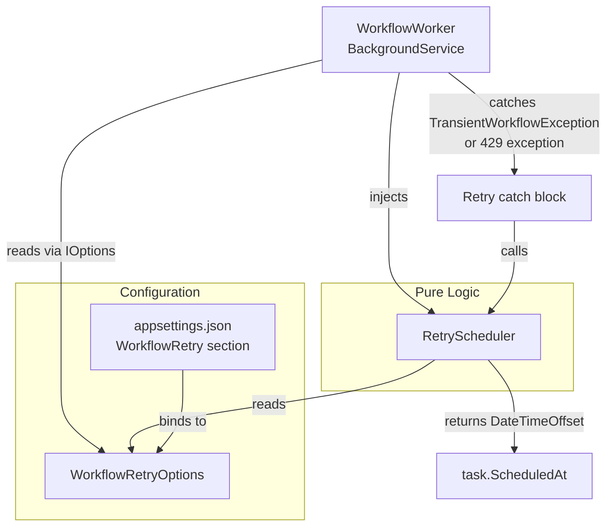

# Design Document: Workflow Retry Backoff

## Overview

The `WorkflowWorker` background service currently retries transient failures using a hardcoded exponential backoff (`2^retryCount` minutes) with a maximum of 3 retries, exhausting all attempts within 14 minutes. This is inadequate for AI image-generation workloads where model overload can persist for hours.

This design replaces the hardcoded retry logic with a configurable, schedule-driven system. Early retries use a spread-out fixed schedule (e.g. 1 min, 5 min, 20 min, 1 hr, 5 hr). Once the schedule is exhausted, deeply-retried tasks are deferred to a configurable overnight quiet window (default 01:00–05:00 UTC) where AI model load is lower and users are unlikely to notice a delay.

The core change is extracting a pure, stateless `RetryScheduler` class that encapsulates all scheduling logic, making it independently testable without any database or worker infrastructure.

---

## Architecture



The key architectural decision is the separation of concerns:

- **`WorkflowRetryOptions`** — a plain POCO that maps to the `WorkflowRetry` config section. No logic.
- **`RetryScheduler`** — a pure, stateless class. Takes options and a `DateTimeOffset utcNow`, returns a `DateTimeOffset`. No DB access, no side effects, no DI dependencies beyond the options.
- **`WorkflowWorker`** — orchestrates task execution. Delegates all scheduling decisions to `RetryScheduler`. Injects `IOptions<WorkflowRetryOptions>`.

This separation means the scheduling logic can be unit-tested exhaustively without spinning up a worker, database, or service provider.

---

## Components and Interfaces

### `WorkflowRetryOptions`

Configuration POCO bound to the `WorkflowRetry` section of `appsettings.json`.

```csharp
namespace RecipeApi.Services;

public class WorkflowRetryOptions
{
    public int[] RetryScheduleMinutes { get; set; } = [1, 5, 20, 60, 300];
    public int MaxRetries { get; set; } = 10;
    public int QuietWindowStartHour { get; set; } = 1;
    public int QuietWindowEndHour { get; set; } = 5;
}
```

Registered in `Program.cs` via:

```csharp
builder.Services.Configure<WorkflowRetryOptions>(
    builder.Configuration.GetSection("WorkflowRetry"));
```

### `RetryScheduler`

Pure, stateless class. Constructed with `WorkflowRetryOptions`. Exposes a single public method.

```csharp
namespace RecipeApi.Services;

public class RetryScheduler(WorkflowRetryOptions options)
{
    /// <summary>
    /// Computes the next ScheduledAt for a retried task.
    /// </summary>
    /// <param name="retryCount">
    ///   The NEW retry count (already incremented by the caller before this call).
    ///   Index into RetryScheduleMinutes is retryCount - 1.
    /// </param>
    /// <param name="utcNow">The current UTC time (injected for testability).</param>
    /// <returns>The DateTimeOffset at which the task should next be attempted.</returns>
    public DateTimeOffset ComputeNextScheduledAt(int retryCount, DateTimeOffset utcNow);
}
```

**Scheduling algorithm:**

1. Let `index = retryCount - 1`.
2. If `index < options.RetryScheduleMinutes.Length`:
   - Return `utcNow + TimeSpan.FromMinutes(options.RetryScheduleMinutes[index])`.
3. Otherwise (schedule exhausted, retryCount < MaxRetries):
   - Return `ComputeQuietWindowStart(utcNow)`.

**Quiet-window algorithm (`ComputeQuietWindowStart`):**

```
todayWindowStart = utcNow.Date + TimeSpan.FromHours(QuietWindowStartHour)
todayWindowEnd   = utcNow.Date + TimeSpan.FromHours(QuietWindowEndHour)

if utcNow < todayWindowStart:
    base = todayWindowStart          // schedule today
else:
    base = todayWindowStart + 1 day  // schedule tomorrow (covers: inside window OR after window)

jitter = Random(0, windowDurationMinutes) minutes
return base + jitter
```

The jitter spreads tasks across the window to avoid thundering-herd at exactly 01:00 UTC.

### `WorkflowWorker` changes

1. Inject `IOptions<WorkflowRetryOptions>` via primary constructor.
2. Construct a `RetryScheduler` from the resolved options during `InitializeThrottles`.
3. Replace both retry catch blocks (transient and 429) with a single unified block that calls `RetryScheduler.ComputeNextScheduledAt(task.RetryCount, DateTimeOffset.UtcNow)`.
4. Log at `Warning` level with: task ID, processor name, `RetryCount`, `MaxRetries`, failure type (`"transient"` or `"rate-limit"`), and `ScheduledAt`. Include `"quiet-window"` label when the schedule is exhausted.
5. On startup, log the loaded schedule and quiet-window boundaries at `Information` level.
6. Validate the loaded `RetryScheduleMinutes` for monotonicity; log a `Warning` if violated (do not reorder or reject).

---

## Data Models

### `WorkflowTask` (unchanged)

No schema changes. The existing `RetryCount` (int) and `ScheduledAt` (DateTimeOffset?) columns are sufficient.

### `appsettings.json` update

```json
"WorkflowRetry": {
    "RetryScheduleMinutes": [1, 5, 20, 60, 300],
    "MaxRetries": 10,
    "QuietWindowStartHour": 1,
    "QuietWindowEndHour": 5
}
```

The default schedule provides retries at: +1 min, +5 min, +20 min, +1 hr, +5 hr. After 5 retries the task is deferred to the overnight quiet window for up to 5 more attempts (MaxRetries = 10), then permanently failed.

---

## Correctness Properties

*A property is a characteristic or behavior that should hold true across all valid executions of a system — essentially, a formal statement about what the system should do. Properties serve as the bridge between human-readable specifications and machine-verifiable correctness guarantees.*

`RetryScheduler.ComputeNextScheduledAt` is a pure function with no side effects, making it an ideal candidate for property-based testing. The four properties below are derived from the acceptance criteria and cover the complete behavioral contract of the scheduler.

### Property 1: Schedule-Index Fidelity

*For any* non-empty `RetryScheduleMinutes` array and any `retryCount` in `[1..N]` where `N ≤ RetryScheduleMinutes.Length`, `ComputeNextScheduledAt(retryCount, utcNow)` SHALL return exactly `utcNow + TimeSpan.FromMinutes(RetryScheduleMinutes[retryCount - 1])`.

**Validates: Requirements 2.1, 2.5**

### Property 2: Future-Only

*For any* `utcNow`, the `ScheduledAt` produced by quiet-window scheduling SHALL be strictly greater than `utcNow` — including when `utcNow` falls inside the quiet window itself (which forces scheduling to tomorrow).

**Validates: Requirements 3.6**

### Property 3: Window-Containment

*For any* `utcNow`, the UTC time-of-day of the quiet-window `ScheduledAt` SHALL satisfy `QuietWindowStartHour ≤ hour < QuietWindowEndHour`. This subsumes the three time-of-day edge cases (before window, inside window, after window) by requiring the generator to cover all hours of the day.

**Validates: Requirements 3.2, 3.3, 3.4, 3.5, 3.7**

### Property 4: Monotonicity

*For any* non-decreasing `RetryScheduleMinutes` array and any two indices `N < M` both within the array bounds, `ComputeNextScheduledAt(N + 1, t) ≤ ComputeNextScheduledAt(M + 1, t)` — i.e. a later retry is never scheduled sooner than an earlier one.

**Validates: Requirements 4.1**

---

## Error Handling

| Scenario | Behaviour |
|---|---|
| `TransientWorkflowException`, `RetryCount < MaxRetries` | Increment `RetryCount`, compute `ScheduledAt` via `RetryScheduler`, set status `Pending`, log `Warning`. |
| HTTP 429 / rate-limit exception, `RetryCount < MaxRetries` | Same as above (unified catch block). |
| Any transient failure, `RetryCount >= MaxRetries` | Set status `Failed`, set instance status `Paused`, log `Error`. Publish `recipe_failed` SSE event. |
| Fatal exception (non-transient, non-429) | Existing behaviour unchanged: `Failed` + `Paused` + SSE event. |
| `RetryScheduleMinutes` violates monotonicity at startup | Log `Warning` with the offending values; use as-is (do not reorder or reject). |
| `SaveChangesAsync` fails after computing retry state | Log `Error` for the save failure; task remains in `Processing` state and will be picked up again on the next poll cycle. |

---

## Testing Strategy

### Unit Tests (xUnit, existing test project)

Focus on specific examples, edge cases, and the `WorkflowWorker` integration path:

- `RetryScheduler` returns correct `ScheduledAt` for each index in the default schedule (example per index).
- `RetryScheduler` falls through to quiet-window when `retryCount > schedule.Length`.
- `RetryScheduler` quiet-window: before window → today; inside window → tomorrow; after window → tomorrow.
- `WorkflowWorker` unified catch block: both `TransientWorkflowException` and 429 produce the same `ScheduledAt` for the same `retryCount`.
- `WorkflowWorker` exhausted retries: task marked `Failed`, instance marked `Paused`.
- `WorkflowWorker` startup log contains schedule and quiet-window boundaries.
- `WorkflowWorker` logs `"quiet-window"` label when schedule is exhausted.
- Non-monotonic schedule logs a `Warning` and values are used unchanged.
- `WorkflowRetryOptions` defaults: `RetryScheduleMinutes = [1,5,20,60,300]`, `MaxRetries = 10`, `QuietWindowStartHour = 1`, `QuietWindowEndHour = 5`.

### Property-Based Tests (FsCheck via `FsCheck.Xunit`)

Add `FsCheck.Xunit` to `RecipeApi.Tests.csproj`. Each property test runs a minimum of 100 iterations.

Tag format: `// Feature: workflow-retry-backoff, Property {N}: {property_text}`

**Property 1 — Schedule-Index Fidelity**

```csharp
// Feature: workflow-retry-backoff, Property 1: schedule-index fidelity
[Property(MaxTest = 500)]
public Property ScheduleIndexFidelity(
    PositiveInt[] scheduleRaw, DateTimeOffset utcNow)
{
    var schedule = scheduleRaw.Select(x => x.Get).ToArray();
    if (schedule.Length == 0) return true.ToProperty();

    var options = new WorkflowRetryOptions { RetryScheduleMinutes = schedule };
    var scheduler = new RetryScheduler(options);

    return Prop.ForAll(
        Gen.Choose(1, schedule.Length).ToArbitrary(),
        retryCount =>
        {
            var result = scheduler.ComputeNextScheduledAt(retryCount, utcNow);
            var expected = utcNow.AddMinutes(schedule[retryCount - 1]);
            return result == expected;
        });
}
```

**Property 2 — Future-Only**

```csharp
// Feature: workflow-retry-backoff, Property 2: future-only
[Property(MaxTest = 500)]
public Property QuietWindowIsFuture(DateTimeOffset utcNow)
{
    var options = new WorkflowRetryOptions(); // defaults
    var scheduler = new RetryScheduler(options);
    // retryCount > schedule length forces quiet-window path
    var retryCount = options.RetryScheduleMinutes.Length + 1;
    var result = scheduler.ComputeNextScheduledAt(retryCount, utcNow);
    return (result > utcNow).ToProperty();
}
```

**Property 3 — Window-Containment**

```csharp
// Feature: workflow-retry-backoff, Property 3: window-containment
[Property(MaxTest = 500)]
public Property QuietWindowContainment(DateTimeOffset utcNow)
{
    var options = new WorkflowRetryOptions(); // start=1, end=5
    var scheduler = new RetryScheduler(options);
    var retryCount = options.RetryScheduleMinutes.Length + 1;
    var result = scheduler.ComputeNextScheduledAt(retryCount, utcNow);
    var hour = result.UtcDateTime.Hour;
    return (hour >= options.QuietWindowStartHour && hour < options.QuietWindowEndHour)
        .ToProperty();
}
```

**Property 4 — Monotonicity**

```csharp
// Feature: workflow-retry-backoff, Property 4: monotonicity
[Property(MaxTest = 500)]
public Property MonotonicScheduleProducesMonotonicDelays(DateTimeOffset utcNow)
{
    // Generate a non-decreasing schedule of length >= 2
    return Prop.ForAll(
        NonDecreasingScheduleArb(minLength: 2),
        schedule =>
        {
            var options = new WorkflowRetryOptions { RetryScheduleMinutes = schedule };
            var scheduler = new RetryScheduler(options);
            return Prop.ForAll(
                IndexPairArb(schedule.Length),
                pair =>
                {
                    var (n, m) = pair; // n < m, both in [1..length]
                    var delayN = scheduler.ComputeNextScheduledAt(n, utcNow);
                    var delayM = scheduler.ComputeNextScheduledAt(m, utcNow);
                    return delayN <= delayM;
                });
        });
}
```

### Integration Tests

The existing `WorkflowWorkerTests` integration tests (in-memory EF Core) cover the end-to-end retry path. Update `Worker_TransientError_RetriesWithExponentialBackoff` to assert against the new schedule values (`+1 min` for first retry, `+5 min` for second) rather than the old exponential values.
