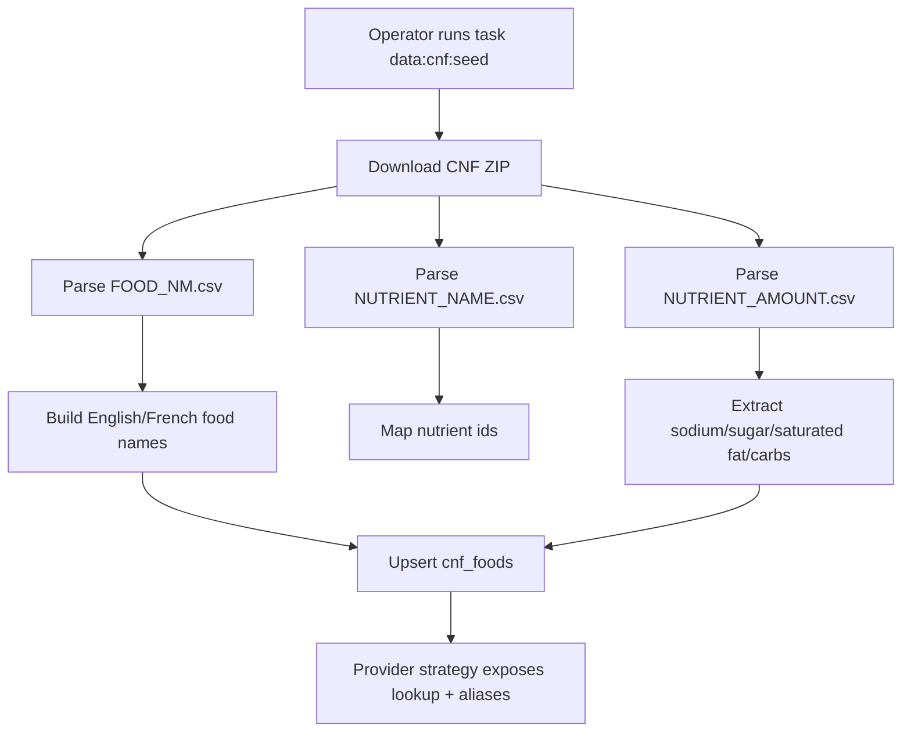
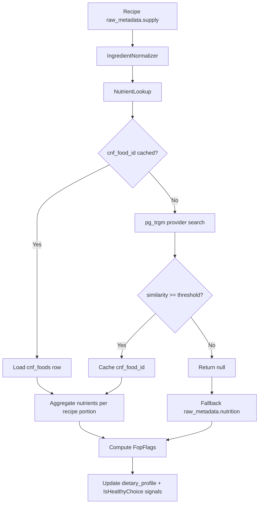
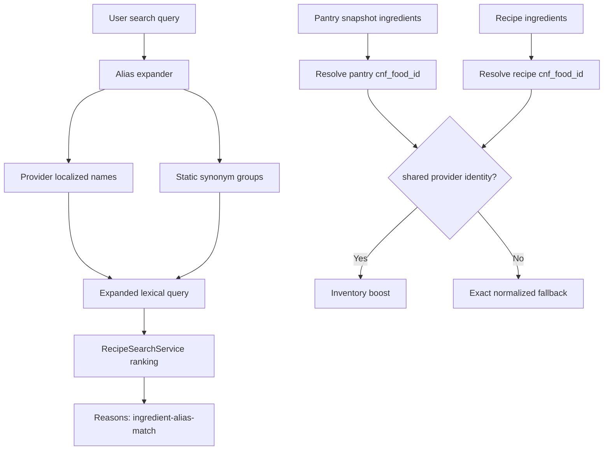
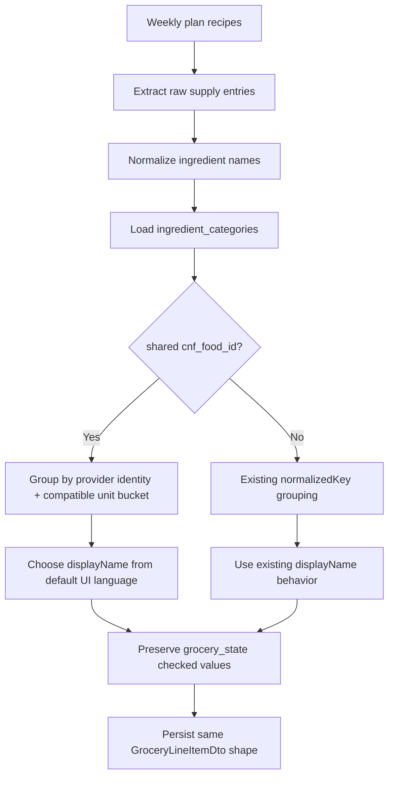
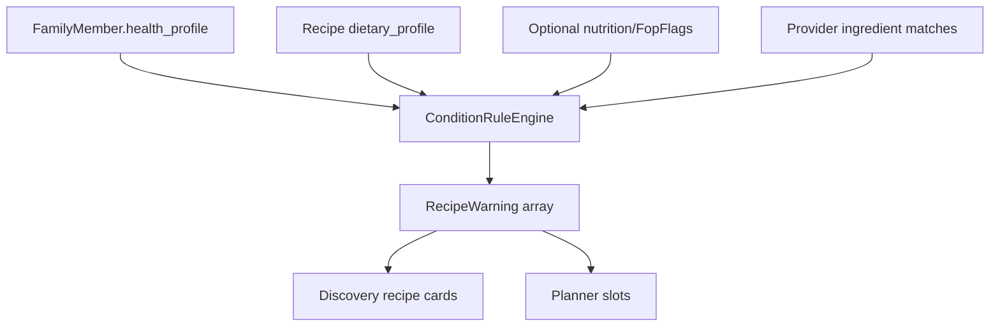
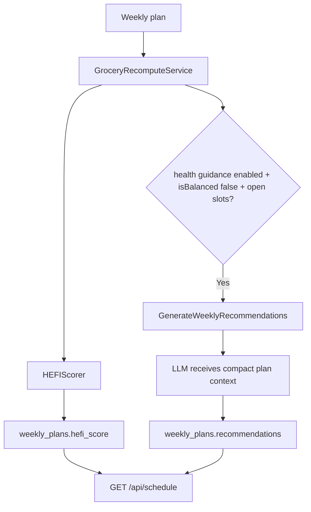

# Data Flows Reference: CNF Health Orchestration

This document captures the data flows that connect CNF/provider data, recipe categorization, search, grocery lists, family health profiles, and dietitian recommendations.

---

## 1. CNF Provider Seed Flow

Owned by: `cnf-data-ingestion`

Key decisions:
- `food_name_en` is required.
- `food_name_fr` is optional.
- CNF is the first provider strategy, not the app's permanent only provider.
- No runtime external calls.

---

## 2. Recipe Categorization And Nutrition Flow

Owned by: `cnf-data-ingestion`

Key decisions:
- EF InMemory tests fake the provider/search seam.
- Production uses parameterized raw SQL for Postgres-specific trigram features.
- Nutrition estimates must be labelled when shown to users.

---

## 3. Search Alias And Pantry Flow

Owned by: `cnf-search-augmentation`

Key decisions:
- Query expansion is bounded and deterministic.
- No OpenAPI shape change for basic bilingual expansion.
- Search reasons must stay contract-aligned.

---

## 4. Grocery Reconciliation Flow

Owned by: `cnf-search-augmentation`

Key decisions:
- Recipe language is not changed.
- Grocery display language follows the existing default UI language configuration.
- `IMPORT_TARGET_LANGUAGE=NONE` does not affect grocery display.
- Existing grocery DTO shape is preserved unless a separate contract task changes it.

---

## 5. Family Health Warning Flow

Owned by: `family-health-profiles`

Key decisions:
- Allergy/intolerance reminders are provider-backed when possible.
- Allergy copy is member-specific and non-blocking: "check ingredients" / "possible match".
- A planned meal is still allowed when a warning exists.
- Absence of a warning is not an allergy-safe claim.

Key decisions:
- No LLM.
- Warnings are informational and non-blocking.
- Allergies, intolerances, preferences, and warning levels are owned here.

---

## 6. Dietitian Phase 2 Flow

Owned by: `dietitian-agent-phase2`

Key decisions:
- HEFI scoring is deterministic.
- Ingredient-level allergy/intolerance matching is deterministic.
- LLM is used only for weekly recommendation text/selection.
- Recommendations are suggestions, not automatic assignments.
- Health guidance disabled stops recommendation generation before the LLM call.
- Recommendation justification details flow to the UI as detail metadata behind an information affordance.
