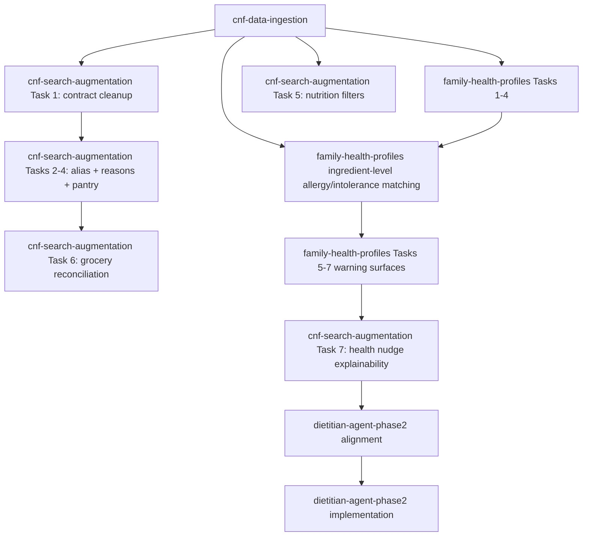

# Design Document: CNF Health Orchestration

## Overview

This is a sequencing design, not a runtime architecture. It defines the order in which related specs should be implemented and the gates between them.



---

## Wave Plan

| Wave | Spec / scope | Why now | Exit gate |
|---|---|---|---|
| 0 | Align docs before implementation | Prevents old CNF naming/provider drift from leaking into code | Specs mention provider strategy and `food_name_en` / `food_name_fr` consistently |
| 1 | `cnf-data-ingestion` Tasks 1-6 | Creates schema, seed, provider seam, lookup, health setting | CNF fixture ingest, provider seam, `pg_trgm` compatibility pass |
| 2 | `cnf-data-ingestion` Tasks 7-9 | Connects categorization, bilingual search foundation, docs | CNF-backed `FopFlags`, category, `IsHealthyChoice`, docs complete |
| 3 | `family-health-profiles` Tasks 1-4 | Creates the household profile contract and CRUD before warning surfaces | Health profile DTOs, routes, and persistence are contract-aligned |
| 4 | `family-health-profiles` pulled-forward provider ingredient matching plus Tasks 5-7 | Delivers the first deterministic, member-specific allergy/intolerance reminders before broader search polish | Schedule/discovery warnings pass; allergy reminder copy is non-blocking and provider-backed; backup/restore pass |
| 5 | `cnf-search-augmentation` Tasks 1-4 | Fixes search contract, extends the shared alias seam, and adds pantry identity without blocking family-health reminders | No search DTO drift; alias/pantry tests pass |
| 6 | `cnf-search-augmentation` Task 6 | Delivers cleaned-up bilingual grocery list | Grocery state preservation and locale tests pass |
| 7 | `cnf-search-augmentation` Tasks 5 and 7 | Adds nutrition filters and explainable health nudges | Opt-out, source/confidence, conservative allergy-copy tests pass |
| 8 | `dietitian-agent-phase2` alignment | Updates older CNF assumptions before implementation | Dietitian spec references provider strategy/current schema |
| 9 | `dietitian-agent-phase2` implementation | HEFI, family-health reminder reuse, LLM suggestions | Contract, workflow, and planner recommendation tests pass |
| 10 | Cross-spec hardening | Ensures the system behaves as one product | Full `task review`; targeted E2E for search/grocery/planner |

---

## Ownership Rules

- `cnf-data-ingestion`: provider data, CNF schema, seed, nutrient lookup, bilingual foundation.
- `cnf-search-augmentation`: search behavior, pantry identity, grocery reconciliation, nutrition filters, health nudge explainability.
- `family-health-profiles`: health profiles, allergies, intolerances, preferences, warning levels, and the first provider-backed ingredient-level allergy/intolerance review reminders. It may start once the provider foundation exists; it does not wait for later search alias/pantry/grocery slices.
- `dietitian-agent-phase2`: HEFI, deeper dietitian scoring, and weekly recommendations. It may reuse or extend ingredient-level matching, but it no longer blocks the first allergy reminder surface.

When a task touches another spec's ownership, update the owning spec first.

---

## Quality Gates

Before moving to the next wave:

```bash
task agent:drift
task agent:test:impact
task review
```

Use `task test` when a wave changes contracts, DTOs, database schema, or shared planner/search behavior.

---

## Documentation References

These files are the source material for future user-facing documentation:

- `user-guide.md` — user-visible behavior and copy principles.
- `data-flows.md` — system data movement across CNF, search, grocery, health, and dietitian work.
- `user-flows.md` — household journeys to validate in product QA and future docs.
