# Design Document: CNF Search Augmentation

## Overview

This feature upgrades recipe search by using provider-backed canonical food identity as a semantic bridge between ingredient strings. It is intentionally downstream of CNF ingestion: `cnf_foods` is already seeded for the default `CanadaCNF` provider, `ingredient_categories.cnf_food_id` exists, health guidance settings exist, and the shared `ICnfIngredientAliasExpander` seam already provides bilingual query expansion.

The design has five vertical seams:

1. Reconcile current search OpenAPI drift.
2. Expand user queries through active-provider aliases and static synonym groups.
3. Improve pantry-assisted search by matching canonical provider food identity.
4. Add nutrition-aware filters based on provider-backed `fopFlags`, gated by health guidance settings.
5. Reconcile grocery list lines by provider identity and display them in the configured system default locale.

No LLM. No runtime network calls. Recipe content stays in its original language. No grocery list DTO change unless a later contract task explicitly chooses one.

---

## Architecture

```mermaid
flowchart TD
    subgraph Contract["Search contract reconciliation"]
        A[OpenAPI reason/filter enum] --> B[DTO + service values]
        B --> C[Contract/drift tests]
    end

    subgraph Alias["CNF alias expansion"]
        D[User query] --> E[ICnfIngredientAliasExpander]
        E --> F[Active provider localized names + static synonym groups]
        F --> G[Expanded lexical query]
        G --> H[RecipeSearchService ranking]
    end

    subgraph Pantry["Pantry-assisted search"]
        I[PantrySnapshot inferred ingredients] --> J[Resolve pantry terms to cnf_food_id]
        K[Recipe ingredients] --> L[ingredient_categories.cnf_food_id]
        J --> M{Shared cnf_food_id?}
        L --> M
        M -->|Yes| N[Bounded pantry boost + reason]
        M -->|No| O[Existing exact normalized fallback]
    end

    subgraph Nutrition["Nutrition-aware filters"]
        HS[health_guidance_enabled] --> Q
        P[Recipe dietary_profile.fopFlags] --> Q[lowSodium / lowSugar / lowSaturatedFat / diabetesFriendly]
        Q --> R[Filter candidates before top-pick]
        P --> HR[Health nudge reason/source/confidence]
    end

    subgraph Grocery["Locale-aware grocery reconciliation"]
        S[Weekly recipe supply entries] --> T[Normalize raw ingredient strings]
        T --> U[ingredient_categories.cnf_food_id]
        U --> V{Shared provider food identity?}
        V -->|Yes| W[Group compatible units]
        W --> X[Choose displayName in system default grocery locale]
        V -->|No| Y[Existing normalizedKey grouping]
        X --> Z[Persist same GroceryLineItemDto shape]
        Y --> Z
    end
```



---

## Seam inventory

| Seam | Existing shape | What we add | Risk |
|---|---|---|---|
| `specs/openapi.yaml` | Filters omit `healthyOnly`; pantry reason docs must stay aligned to `inventory-fit` | Reconcile current drift; add `ingredient-alias-match` and nutrition filters | Contract-first task must go first |
| `RecipeSearchFiltersDto` | Has `healthyOnly`; lacks nutrition filters | Align with OpenAPI; add nutrition filters | PWA generated clients/mocks must stay in sync |
| `RecipeSearchService` | Lexical query, vector search, planner/family/pantry boosts | Alias expansion before lexical ranking; CNF pantry matching; nutrition filters | Must preserve ranking stability when CNF unavailable |
| Food data provider strategy | `CanadaCNF` default provider from ingestion spec | Search consumes provider-facing alias/nutrient identity seams | Avoid hard-coding Canada-only behavior in search consumers |
| Health guidance settings | `health_guidance_enabled` from ingestion spec | Gate nutrition filters and health-oriented ranking/reasons | Users can opt out of health steering |
| Health nudge copy | Existing warnings/reasons are scattered by feature | Add deterministic reason/source/confidence categories for health-facing nudges | Avoid black-box or moralizing health advice |
| `family-health-profiles` | Owns health profiles, allergy, intolerance, preference warning semantics | This spec references those warnings but does not redefine them | Allergy safety claims must stay conservative |
| `InventoryCaptureService` | In-memory pantry snapshots of inferred ingredient strings | No shape change; resolver reads snapshot terms | Do not persist snapshots |
| `ingredient_categories` | `normalized_key`, grocery section, `cnf_food_id` from CNF ingestion | Use `cnf_food_id` for pantry and alias cache reads | Nulls common until seed/reclassify |
| `GroceryRecomputeService` | Groups grocery lines by `(normalizedKey, canonicalUnit)` | Prefer provider identity for grouping equivalent bilingual aliases; display in the configured system default locale | Must preserve grocery state and avoid merging incompatible units |
| `GroceryLineItemDto` | `displayName, normalizedKey, section, quantity, unitText, recipeIds` | No shape change; `displayName` becomes locale-facing when reconciled | State is keyed by display name today |
| Environment/config locale | Recipe import has `IMPORT_TARGET_LANGUAGE`; PWA has UI locale/default language | Reuse existing default UI language configuration for grocery display locale | Must not add a second grocery-specific locale env var, couple grocery locale to recipe import language, or follow per-browser/member locale state |
| `RecipeSearchReasonDto.source` | Closed enum in OpenAPI | Add `ingredient-alias-match`; reconcile pantry value | Existing client expectations |

---

## Contract changes

### `RecipeSearchReasonDto.source`

Required final enum:

```yaml
enum:
  - name-match
  - notes-match
  - rating-boost
  - vote-boost
  - planner-fit
  - inventory-fit
  - semantic-match
  - ingredient-alias-match
```

**Decision:** Keep `inventory-fit` as the single pantry/photo inventory reason source. The OpenAPI already has `inventory-fit`, and photo inventory search is the product-facing concept.

### `RecipeSearchFiltersDto`

Add:

```yaml
healthyOnly: { type: [boolean, 'null'] }
lowSodium: { type: [boolean, 'null'] }
lowSugar: { type: [boolean, 'null'] }
lowSaturatedFat: { type: [boolean, 'null'] }
diabetesFriendly: { type: [boolean, 'null'] }
```

No request/response route change. `POST /api/recipes/search` remains the seam.

---

## Existing service extended: `ICnfIngredientAliasExpander`

**Files:**
- `api/src/RecipeApi/Services/CnfIngredientAliasExpander.cs`
- `api/src/RecipeApi/Services/PostgresCnfIngredientAliasExpander.cs`

This seam is created by `cnf-data-ingestion` Task 8 so `RecipeSearchService` has exactly one public alias-expansion dependency. This spec extends that same seam with static synonyms and explanation matches; it must not add a second bilingual/query expander to search.

```
public interface ICnfIngredientAliasExpander
{
    Task<CnfAliasExpansion> ExpandAsync(string query, CancellationToken ct);
}

public sealed record CnfAliasExpansion(
    IReadOnlyList<string> Terms,
    IReadOnlyList<CnfAliasMatch> Matches);

public sealed record CnfAliasMatch(
    string OriginalTerm,
    string ExpandedTerm,
    string Source); // "cnf-bilingual" | "static-synonym" | "cnf-food-id"
```

**Behavior:**

1. Return empty expansion for null/empty/whitespace query.
2. Normalize query text using `RecipeSearchService` lexical normalization plus `IngredientNormalizer.Normalize` for ingredient terms.
3. Find candidate rows through the active provider. Canada CNF uses parameterized `pg_trgm` over `food_name_en` and `food_name_fr`.
4. Preserve opposite-language/localized terms from provider rows.
5. Add terms from the static synonym dictionary.
6. Deduplicate case-insensitively.
7. Return at most 8 expansion terms and at most 3 explanation matches.
8. On exception, log and return empty expansion.

**Static synonym dictionary:**

```csharp
private static readonly string[][] SynonymGroups =
[
    ["ground beef", "minced beef", "boeuf hache"],
    ["chicken breast", "poitrine de poulet"],
    ["shrimp", "prawn", "crevette"],
    ["scallion", "green onion", "spring onion", "oignon vert"],
    ["zucchini", "courgette"],
    ["bell pepper", "sweet pepper", "poivron"],
];
```

This dictionary is deliberately small. Additions require tests.

---

## Modified: `RecipeSearchService`

Constructor adds optional dependencies:

```
ICnfIngredientAliasExpander? aliasExpander = null,
ICnfPantryMatcher? cnfPantryMatcher = null
```

### Alias ranking flow

1. In `SearchAsync`, before `GetLexicalCandidatesAsync`, call `aliasExpander.ExpandAsync(query, ct)` for non-empty standard/agent/pantry queries.
2. Build `expandedLexicalQuery = query + " " + string.Join(" ", expansion.Terms)`.
3. Pass `expandedLexicalQuery` to lexical candidate ranking.
4. Preserve original `query` for:
   - telemetry,
   - urgent query detection,
   - response echo behavior,
   - agent translation semantics.
5. If an expansion match contributed and candidate score is positive, add at most one:
   ```json
   { "source": "ingredient-alias-match", "label": "Matched poulet to chicken" }
   ```

**Constraint:** If `aliasExpander` is null or returns no terms, output must be identical to current behavior.

### Nutrition filters

Extend `ApplyFilters` for fields that can be translated safely in EF or use a post-query filter helper if JSON shape requires in-memory evaluation.

Filter semantics:

| Filter | Include recipe when |
|---|---|
| `lowSodium` | `dietary_profile.fopFlags.highInSodium == false` |
| `lowSugar` | `dietary_profile.fopFlags.highInSugars == false` |
| `lowSaturatedFat` | `dietary_profile.fopFlags.highInSaturatedFat == false` |
| `diabetesFriendly` | high sugar false and high sodium false |

Recipes with missing/null `dietary_profile` or `fopFlags` are excluded for these filters.

If `health_guidance_enabled` is false, nutrition filters and health-oriented ranking/reasons are not applied. The core query, pantry matching, and non-health search behavior continue normally.

---

## Health nudge explainability

Any health-facing behavior added by this spec must be legible enough for a busy household to trust at a glance. The app should say why it is nudging, what data source informed the nudge, and how strong that signal is.

### Source categories

```csharp
public enum HealthNudgeSource
{
    SourceNutrition,
    EstimatedFromIngredients,
    ProfileRule,
    FoodGuideGroup,
    Unknown
}
```

### Confidence categories

```csharp
public enum HealthNudgeConfidence
{
    High,
    Medium,
    Low
}
```

### Copy rules

- Use calm, specific copy: `"Lower sodium option"`, `"Estimated high sodium from ingredients"`, `"Vegetable-forward recipe"`.
- Avoid moralizing labels: no standalone `"bad"`, `"guilty"`, `"junk"`, or `"unhealthy"`.
- Do not expose `IsHealthyChoice` alone. Pair it with a reason/source/confidence.
- Do not claim allergy safety in this spec. Allergy, intolerance, preference semantics, and the first provider-backed reminder surface are owned by `.kiro/specs/family-health-profiles`.
- If an allergy-related feature is not implemented, omit the claim or use conservative copy such as `"No allergy check available"`.

### Information affordance

The default card/list surface should show only the short nudge. Full justification details live behind a compact information affordance.

Use:
- an `i` information icon or existing icon-system equivalent,
- a tooltip for compact desktop contexts,
- a bottom sheet or popover for mobile/touch contexts.

The detail view may show:
- reason,
- source,
- confidence,
- data limitation,
- whether nutrition was estimated from ingredients.

Do not place reason/source/confidence blocks inline on dense search results, planner cards, or grocery surfaces unless the user asks for details. This preserves the Mère-Designer goal: reduce cognitive load and keep one-thumb planning calm.

### Data quality mapping

| Data condition | Source | Confidence |
|---|---|---|
| Source recipe nutrition supplied the filter/nudge | `source-nutrition` | `high` |
| CNF/provider match with strong similarity and complete relevant nutrient coverage | `estimated-from-ingredients` | `high` |
| CNF/provider partial ingredient coverage or approximate unit conversion | `estimated-from-ingredients` | `medium` |
| CNF/provider sparse coverage, unknown units, or default quantity assumptions | `estimated-from-ingredients` | `low` |
| Family health profile condition/preference rule | `profile-rule` | confidence set by the owning family-health rule |
| Canada Food Guide/provider group balance signal | `food-guide-group` | `medium` unless provider coverage is complete |

This spec should use these categories internally even when no new OpenAPI field is added in the current slice. For provider-backed nutrition nudges, search must consume the shared internal `NutritionEstimateMetadata` produced by `cnf-data-ingestion` rather than inferring confidence ad hoc from `fopFlags` alone.

R10 decision: keep search's default response contract lightweight. Do not widen generic DTOs such as `RecipeSearchResultDto` or `RecipeSearchReasonDto` with broad `source` / `confidence` fields in this branch. If a future search surface needs structured explainability behind an information affordance, add a dedicated surface-specific DTO or nested detail object contract-first and regenerate clients in that feature slice.

---

## New service: `ICnfPantryMatcher`

**Files:**
- `api/src/RecipeApi/Services/CnfPantryMatcher.cs`

```
public interface ICnfPantryMatcher
{
    Task<CnfPantryMatchResult> MatchAsync(
        IReadOnlyList<string> pantryIngredients,
        IReadOnlyList<string> recipeIngredients,
        CancellationToken ct);
}

public sealed record CnfPantryMatchResult(
    int MatchCount,
    IReadOnlyList<string> MatchedLabels);
```

**Behavior:**

1. Normalize pantry and recipe ingredient strings.
2. Resolve pantry terms to provider food identity using the same lookup seam as ingestion/search.
3. Resolve recipe terms by checking `ingredient_categories.cnf_food_id` first for the Canada CNF provider.
4. Match by shared provider food identity.
5. Fall back to exact normalized string matching for unresolved items.
6. Return count and up to 3 display labels for reason text.

**Important:** Pantry snapshots remain in memory. No new DB table.

---

## New service: `IGroceryLocaleReconciler`

**Files:**
- `api/src/RecipeApi/Services/GroceryLocaleReconciler.cs`

```
public interface IGroceryLocaleReconciler
{
    Task<IReadOnlyList<ReconciledGroceryGroup>> ReconcileAsync(
        IReadOnlyList<GroceryIngredientCandidate> candidates,
        string activeLocale,
        CancellationToken ct);
}

public sealed record GroceryIngredientCandidate(
    string DisplayName,
    string NormalizedKey,
    string Section,
    double? Quantity,
    string? UnitText,
    Guid RecipeId);

public sealed record ReconciledGroceryGroup(
    string DisplayName,
    string NormalizedKey,
    string Section,
    double? Quantity,
    string? UnitText,
    IReadOnlyList<Guid> RecipeIds,
    IReadOnlyList<string> SourceDisplayNames);
```

### Behavior

1. Normalize each candidate using the existing `IngredientNormalizer`.
2. Batch-load `ingredient_categories` for all normalized keys, including `cnf_food_id`, section, confidence, and source.
3. For candidates with provider food identity:
   - group by `(providerFoodId, canonicalUnitBucket)`,
   - only merge quantities when `UnitNormalizer` says the unit family is compatible,
   - choose the display name from the configured system default locale using provider localized labels.
4. For candidates without provider food identity, keep the existing `(normalizedKey, canonicalUnitBucket)` grouping.
5. Resolve grocery section:
   - if any merged source has `source = 'human'`, use the human section,
   - otherwise use the highest-confidence cached section,
   - otherwise use `AisleMapper` fallback.
6. Emit `GroceryLineItemDto` with the existing shape:
   - `displayName`: locale-facing reconciled label,
   - `normalizedKey`: stable canonical grouping key for the emitted line. For provider-backed groups, use a deterministic key such as `cnf:{foodId}` or the locale display label normalized through `IngredientNormalizer`.
   - `recipeIds`: union of all source recipe IDs.
7. Preserve raw recipe ingredient strings in recipe metadata. Do not write translated ingredient names back to recipes.

### Active grocery locale

Resolve the active grocery locale with this precedence:

1. Existing app default UI language configuration.
2. If the default UI language is `NONE` or unset, use English.

Do not read per-browser `localStorage` locale overrides and do not derive grocery locale from the selected family member's `preferredLanguage`. Grocery recompute is a shared server-side artifact, so it follows the configured system default only.

This spec intentionally does not introduce a new grocery-specific environment variable. If a future override is added, it must follow the current convention where `NONE` means "not explicitly set / follow the default UI language".

Supported resolved grocery locale values:
- `EN` / `en`
- `FR` / `fr`
- `NONE` / `none`, resolved through the default UI language and ultimately English if still unset

This is intentionally separate from `IMPORT_TARGET_LANGUAGE`. `IMPORT_TARGET_LANGUAGE=NONE` continues to preserve imported recipe language. Grocery reconciliation uses provider aliases only for the grocery list display label.

Recommended API options shape:

```json
{
  "Ui": {
    "DefaultLocale": "en"
  }
}
```

Use the existing default UI locale environment/config name if one already exists. Do not add a new `GROCERY_DISPLAY_LOCALE` variable for this slice.

Supported locale behavior for Canada CNF:
- `en` / `EN`: use `food_name_en`.
- `fr` / `FR`: use `food_name_fr` when available.
- missing localized provider label: fall back to the first source display name.

### Grocery state preservation

`grocery_state` is currently keyed by display name. For this slice, keep that storage shape and preserve check state by remapping prior display-name keys during recompute. When reconciliation changes `"chicken"` and `"poulet"` into one display label, recompute must preserve check state:

1. Before overwriting `weekly_plans.grocery_items`, load the prior grocery state.
2. For each reconciled group, inspect prior state for:
   - the new display name,
   - every `SourceDisplayName`,
   - optionally the previous emitted display name if present in old grocery items.
3. If any source line was checked, mark the reconciled display name checked.
4. Remove stale merged source keys only when replacing the persisted grocery state in the same transaction.

Do not add a new stable grocery-state key contract in this slice. If display-name remapping cannot be done safely in the recompute path, implementation must add a focused helper while keeping the persisted state shape unchanged.

---

## Testing Strategy

| Seam | Test | File |
|---|---|---|
| Search contract drift | OpenAPI reason enum includes emitted values; DTO filters match OpenAPI | `SearchContractTests.cs` or existing drift suite |
| Current pantry reason | Pantry boost emits `inventory-fit` consistently across contract and implementation | `RecipeSearchIntegrationTests.cs` |
| Alias expansion | `boeuf hache` expands to `ground beef` / `minced beef`; bounded and deduped | `CnfIngredientAliasExpanderTests.cs` |
| Alias search | Query `minced beef` returns recipe containing `ground beef` | `RecipeSearchIntegrationTests.cs` |
| Alias reason | Result includes at most one `ingredient-alias-match` reason | `RecipeSearchIntegrationTests.cs` |
| CNF unavailable | Expander throws/returns empty; search output matches baseline | `RecipeSearchIntegrationTests.cs` |
| Pantry CNF match | Pantry `boeuf hache` boosts recipe with `ground beef` through shared `cnf_food_id` | `RecipeSearchIntegrationTests.cs` |
| Pantry fallback | Missing CNF IDs still use exact normalized matching | `RecipeSearchIntegrationTests.cs` |
| Nutrition filters | `lowSodium`, `lowSugar`, `lowSaturatedFat`, `diabetesFriendly` include/exclude by `fopFlags` | `RecipeSearchIntegrationTests.cs` |
| Null nutrition | Nutrition filters exclude recipes with `fopFlags = null` | `RecipeSearchIntegrationTests.cs` |
| Health guidance disabled | Nutrition filters/health boosts are suppressed while normal search still works | `RecipeSearchIntegrationTests.cs` |
| Health nudge explainability | New health nudges include reason/source/confidence and avoid moralizing copy | `HealthNudgeExplainabilityTests.cs` |
| Information affordance | Source/confidence details are hidden behind an information icon/sheet by default | PWA component tests |
| Allergy conservatism | This spec does not claim allergy-safe results; family-health reminders remain the owner and are non-blocking | `HealthNudgeExplainabilityTests.cs` |
| Provider seam | Search alias/pantry logic consumes provider interfaces; fake provider can replace Canada CNF in tests | `CnfIngredientAliasExpanderTests.cs` or provider strategy tests |
| Grocery EN reconciliation | `"chicken"` + `"poulet"` with same `cnf_food_id` produce one line labelled `"chicken"` in English locale | `GroceryRecomputeServiceTests.cs` |
| Grocery FR reconciliation | Same inputs produce one line labelled `"poulet"` in French locale | `GroceryRecomputeServiceTests.cs` |
| Grocery locale config | Existing default UI language drives grocery locale; `NONE` follows current unset convention; `IMPORT_TARGET_LANGUAGE=NONE` does not affect grocery locale | `GroceryLocaleOptionsTests.cs` |
| Grocery no-provider fallback | Missing `cnf_food_id` preserves existing normalized-key grouping | `GroceryRecomputeServiceTests.cs` |
| Grocery incompatible units | Shared `cnf_food_id` but incompatible units remain separate lines | `GroceryRecomputeServiceTests.cs` |
| Grocery state preservation | Checked `"poulet"` remains checked after merging into locale-facing `"chicken"` or `"poulet"` | `ScheduleServiceTests.cs` or `GroceryRecomputeServiceTests.cs` |
| Recipe language lock | Recipe raw metadata remains unchanged after grocery reconciliation | `GroceryRecomputeServiceTests.cs` |

Postgres-specific alias matching uses isolated disposable pgvector/Postgres tests only. EF InMemory tests inject fake expanders/matchers.

---

## Out of scope

- HEFI scoring and weekly recommendation generation.
- Ingredient-level allergy/intolerance matching.
- Redefining family health profile preferences, allergies, or intolerances.
- Claiming a recipe is allergy-safe based only on CNF/search augmentation data.
- PWA redesign of search filters.
- Persisting pantry snapshots.
- Rewriting recipe ingredients into the grocery locale.
- Translating grocery labels with an LLM or external translation API.
- Bypassing the active food data provider strategy.
- Applying health-oriented filters/boosts when health guidance is disabled.
