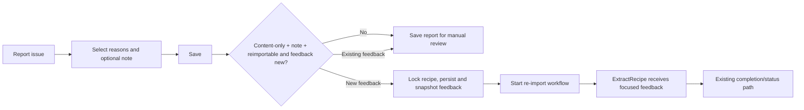

# Design: Contextual Recipe Re-import Feedback

## Intent trace



`duplicate` makes the answer at D **No**, even when content reasons and a note are also present.

## As-is seam

- `ActionGearMenu` immediately calls `onReimport`; `RecipeDetailSheet` subsequently calls `POST /api/recipes/{id}/import` and polls the returned ID.
- `PUT /api/recipes/{id}/import-report` separately persists `reasons` and `note`.
- `RecipeImportService.TriggerImport` currently sends only `recipeId` (and `url` for URL imports) to `recipe-import.yaml` / `url-import.yaml`.
- Both workflows pass only `recipeId` to `ExtractRecipe`; `RecipeAgent` therefore has no report context today.

## Contract command

Replace `PUT /api/recipes/{id}/import-report` with `POST /api/recipes/{id}/import-report`, the sole report-submission command. It requires the existing issue-request body and family-member header.

The controller delegates to one application operation that:

1. normalizes and validates the draft through the report-service rules;
2. rejects a changed draft or resolve request while a contextual workflow is active; otherwise persists the report;
3. verifies the deterministic re-import predicate and that the feedback is a new revision;
4. when eligible, captures the prior snapshot before mutation, compares it, starts or reuses the matching workflow, and marks the matching attempt;
5. returns updated recipe detail, `reimportStarted`, and an `importId` when a newly created or reused contextual workflow is active for the submission; or returns the distinct `reimportLaunchFailed` result after report persistence only when it has not left an untracked active workflow.

The PWA always uses this one `POST /import-report` command. In the single-active-API-process deployment, the application extends the existing in-process per-recipe lock across capture of the prior contextual-workflow snapshot, comparison, persistence, workflow creation/reuse, and attempt marking. Capture must occur *before* a material report update can clear its workflow pointer. It must not compose report persistence and workflow creation from browser-side calls: that split can queue an attempt using stale or mismatched feedback. If workflow creation or attempt marking fails, preserve the report and return the distinct launch-failure result only after compensating any created workflow; otherwise return its active ID. Do not silently fall back to an unfocused import. Cross-replica locking, an outbox, and durable idempotency are explicitly out of scope; adding API replicas requires a new concurrency design.

`POST /api/recipes/{id}/import` and `GET /api/recipes/{id}/import` are intentionally retired for parent-facing use. `GET /api/recipe-imports/{importId}` is the only polling route and must authorize the workflow through its recipe/family relationship.

For an eligible content-only draft, the operation compares its normalized content reasons and trimmed note with the snapshot on the report's most recent contextual workflow. If no snapshot exists, or the values differ, it starts one contextual attempt. If the values match a terminal workflow, it persists/reviews only. If they match a pending or processing workflow, it returns that existing workflow ID. While an active workflow has different feedback, it rejects the request without mutation. This prevents re-import loops and keeps the visible report aligned with the immutable feedback being processed.

## Workflow snapshot

`IWorkflowOrchestrator.TriggerAsync` receives string parameters. Pass an immutable, normalized snapshot such as:

```text
recipeId=<guid>
repairReasons=ingredients,steps
repairNote=<trimmed note>
```

Both import YAML files declare these optional parameters and forward them to `ExtractRecipe`. `RecipeAgent.ExecuteAsync` parses the optional fields and `DoExtractRecipeAsync` appends an untrusted, delimited `USER-REPORTED FOCUS` block to its user message. It must be absent for normal imports.

The block states that:

- the source HTML/images are factual authority;
- the feedback describes areas to scrutinize, not facts to copy;
- the model must still return the complete required recipe JSON;
- the note is data, not executable instructions.

## PWA flow

`RecipeImportIssueSheet` keeps the existing controls and one completion label, `Save`, for both a new and an existing report.

- The sheet always calls `POST /import-report` with the report draft.
- The reason control has two mutually exclusive modes. Selecting `duplicate` clears `ingredients` and `steps`; selecting either content reason clears `duplicate`. In duplicate mode, the sheet shows `This will be saved for review.` In content mode on a re-importable recipe, the existing note disclosure opens without moving focus. Its label becomes `What should we check?`, with `Add a note to re-import this recipe.` as compact helper text. The note remains optional for saving a manual-review report, but a non-empty trimmed note submitted through that same `Save` action is eligible for server-owned contextual re-import. These are draft-driven affordances, not new choices or client-side eligibility decisions. The server remains defensive: a malformed mixed-reason submission is manual review only.
- A response with `reimportStarted=true` and `importId` starts or resumes ID-addressable polling, closes the sheet, and announces `Reimporting in background`. The response does not need another public field to distinguish a newly created workflow from a reused one. The mutually exclusive reason control visibly clears its opposing selections and announces that clearing to assistive technology without moving focus.
- A response with `reimportStarted=false` closes as today and shows the manual-review confirmation.
- A response with `reimportLaunchFailed=true` keeps the sheet open with the persisted draft and shows `We saved your report, but couldn’t start re-import. Try again later.` This is a launch failure before a contextual attempt exists: it is not a terminal workflow failure, does not set `reimportFailureMessage`, and a later identical eligible Save may attempt launch again.
- The UI does not decide eligibility; it follows the command response. API validation and re-import policy remain authoritative.

Recipe detail owns ID-addressable polling after an accepted response and renders the visible active status. While `importIssue.isReimporting` is true, a reopened report sheet remains readable but disables the reason controls, note disclosure, note field, Save, and Mark as resolved. It visibly states `Reimporting recipe… You can update this after it finishes.` The active status, disabled-control explanation, and `Reimporting in background` acknowledgement use an appropriate live status so they are announced without moving focus. The state survives a refresh because it is delivered with recipe detail. The PWA polls only `GET /api/recipe-imports/{importId}` and re-enables controls when its authoritative detail refresh reports a terminal state. For `failed` or `paused`, authoritative detail exposes a parent-safe `reimportFailureMessage`; recipe detail and the report sheet keep it visible as `We couldn’t re-import this recipe. Your report is saved. Add or change a detail, then Save to try again.` until the report changes or resolves. A later Save with the unchanged snapshot closes as manual review and confirms `Saved for review. Add new detail if you want us to try re-importing again.` It never auto-retries an identical snapshot. The failure message is cleared when feedback changes, the report resolves, or a later attempt starts or completes; raw workflow, model, and infrastructure failures are never exposed.

`CooksMode` uses the same submission command and receives the authoritative recipe from its response. It updates its local recipe state, closes the issue sheet, announces `Reimporting in background` when active work is accepted, and retains a compact non-interactive `Reimporting recipe…` acknowledgement until its normal recipe-data refresh or navigation. It does not implement an independent polling loop, and that local acknowledgement never claims completion. On a later recipe-detail load, the persisted `isReimporting` or terminal review state supplies the lock or outcome. If the sheet is reopened while active, it uses the same disabled controls and status copy as recipe detail.

When polling reaches successful completion, refetch authoritative detail and render the existing durable `readyToReview` report state as `Reimported — check recipe` on recipe detail and cards. Keep the review filter's compact category label as `Ready to review`. Do not rename the database or OpenAPI status. The parent-facing outcome remains visible on recipe detail and cards until manual resolution. Reopening the report sheet explains the next step with `Reimport complete. Check the recipe, then mark this resolved when it looks right.` If it still needs repair, the parent may change reasons or add feedback and use the same Save action to request a further eligible contextual attempt.

## Pre-mortem

| Failure | Guard |
|---|---|
| A duplicate report accidentally starts re-import | Enforce the predicate server-side; test duplicate-only and mixed cases. |
| Agent gets a later edited note | Store the snapshot in workflow parameters and test immutability. |
| Reopening a completed report starts another import | Compare normalized feedback to the latest workflow snapshot; unchanged feedback is review-only. |
| Double Save or two devices served by the active API process start duplicate repair | Hold the existing in-process per-recipe operation across comparison and workflow start; reuse the active matching workflow ID. |
| Polling observes another recipe workflow | Poll the returned workflow ID, not the recipe's latest workflow. |
| Mom changes or resolves an in-flight report | Reject the changed request server-side and lock controls until the workflow is terminal. |
| A failed or paused workflow leaves the sheet locked | Existing failure handling marks the report non-active; poll then refetch authoritative detail, show failure copy, and re-enable controls. |
| A note becomes prompt injection | Delimit it as untrusted focus in the dynamic user message; retain source/schema authority. |
| Photo and URL imports diverge | Forward the same optional parameters in both YAML workflows and test both. |
| PWA calls two routes and loses context | Use one report-submission command; no client-side save-then-trigger chain. |
| Cook Mode and recipe detail diverge | Cook Mode consumes the same submission response but defers polling and durable outcome presentation to recipe detail. |
| Old direct re-import bypasses feedback rules | Retire user-facing POST `/import`; only report submission can start a contextual workflow. |
| Workflow launch fails after a valid report | Return the distinct, retryable `reimportLaunchFailed` outcome; keep the sheet open with the persisted report, never mark a nonexistent attempt, and never expose internal errors. |

## Verification map

| Layer | Evidence |
|---|---|
| Contract/client | OpenAPI response generation and drift gate include the changed report-submission command. |
| API | Integration/service tests cover the complete eligibility, report persistence, snapshot comparison/reuse, active-request rejection, and failure-retention matrix. |
| Workflow/agent | Unit tests capture `ExtractRecipe` messages for image and URL paths, normal imports, and snapshot immutability. |
| PWA | Component/detail tests prove no gear reimport, one Save command, response-driven polling, and save/error behavior. |
| Digital twin | Stateful mock and E2E cover four representative parent-visible journeys: eligible start/poll, manual-only save, active lock across reload, and failed/paused unlock. |
