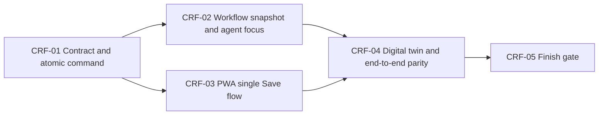

# Tasks: Contextual Recipe Re-import Feedback

## Dependency graph

## CRF-01 — Contract and atomic command

Model label: `LARGE_REQUIRED` — replaces a public report-save contract and retires a manual-import trigger while coordinating report persistence, workflow creation, lifecycle marking, generated client, and API tests.

1. [ ] Update `specs/openapi.yaml` first: replace `PUT /api/recipes/{id}/import-report` with `POST` using `RecipeImportIssueRequest` and a `RecipeImportReportSubmissionResponseDto`; retire both old `/api/recipes/{id}/import` operations and add ID-addressable `GET /api/recipe-imports/{importId}`.
2. [ ] Add failing contract/API tests for every CRF-2/CRF-4 branch, repeated-save snapshot comparison, active-workflow ID reuse, `reimportStarted`/optional-ID response shape, workflow-ID authorization, and workflow-start failure retention.
3. [ ] Implement the controller/service command as one per-recipe exclusive operation: capture prior snapshot before mutation, normalize/validate and persist every report, derive eligibility, reuse a matching active workflow or start one new eligible revision.
4. [ ] Snapshot only content reasons and note onto the new workflow; return `reimportStarted=false` with no `importId` for manual review or unchanged terminal feedback, and expose `isReimporting` on the public report while an attempt is active.
5. [ ] Regenerate the client through the Taskfile and prove contract parity.

Required context: `requirements.md` CRF-2; `RecipeController`; `RecipeImportService`; `RecipeImportReportService`; `specs/openapi.yaml` import-report and import routes.

Escalate if: the orchestrator cannot preserve report/workflow consistency without a new durable outbox or schema change.

Verification: `task test:api`; `task agent:reconcile`; `task agent:drift`.

## CRF-02 — Workflow snapshot and agent focus

Model label: `MEDIUM_REQUIRED` — touches both workflow definitions and the extraction agent but does not alter unrelated agents or prompt resources.

1. [ ] Add failing unit tests proving both workflow variants forward an immutable `repairReasons`/`repairNote` snapshot and normal imports omit it.
2. [ ] Extend `recipe-import.yaml` and `url-import.yaml` to declare/forward the optional snapshot fields.
3. [ ] Extend `RecipeAgent` to add the delimited, untrusted focus block to extraction's dynamic user message.
4. [ ] Test reason-specific focus wording, note inclusion, source/schema authority, immutable payloads, and comparison of the latest snapshot for a repeat re-import.

Required context: `design.md` Workflow snapshot; `RecipeAgent`; both import workflows; `RecipeAgentPromptSelectionTests`.

Forbidden: base embedded extraction prompts, hero/categorization agents, status semantics, and any prompt instruction that lets feedback override source evidence.

Escalate if: workflow parameters cannot safely carry the 500-character note or YAML templating changes its contents.

Verification: `task test:api`.

## CRF-03 — PWA one-Save flow and menu removal

Model label: `MEDIUM_REQUIRED` — adapts the generated client and existing sheet/detail state without changing report controls or introducing a new choice.

1. [ ] Write failing component/detail tests: gear has no reimport action; every Save submits its draft to `POST /import-report`; only responses with `reimportStarted=true` begin ID-addressable polling; active reports disable Save and resolve.
2. [ ] Remove `onReimport`, the refresh menu row, and reimport-only translation/test expectations from `ActionGearMenu`.
3. [ ] In `RecipeDetailSheet` / `RecipeImportIssueSheet`, consume the command response, poll only `GET /api/recipe-imports/{importId}`, honor persisted `isReimporting`, and show the durable `Reimported — review changes` outcome after successful completion.
4. [ ] Preserve focus, Escape, draft retention, manual resolution, 44px targets, and the current three-column reason layout.

Required context: `requirements.md` CRF-1/CRF-2; `ActionGearMenu`; `RecipeImportIssueSheet`; `RecipeDetailSheet`; generated recipe client.

Forbidden: a new confirmation step, two visible completion buttons, auto-reimport based on a blank note, or changing duplicate eligibility.

Escalate if: generated-client shape makes a component bypass the API contract.

Verification: `task test:unit`; `task agent:test:impact`.

## CRF-04 — Digital twin and end-to-end parity

Model label: `SMALL_SAFE` — bounded mock/test extension after the contract and PWA client are stable.

1. [ ] Extend the stateful PWA mock for `POST /import-report`, preserving report reasons/note and returning `reimportStarted` plus an import ID only for eligible drafts.
2. [ ] Add E2E coverage for content-with-note start, active duplicate-save reuse, updated-note repeat start, unchanged-note manual review, blank-note manual review, duplicate/mixed manual review, active-control locking across reload, absent gear reimport, workflow-ID polling, and the durable successful-reimport outcome.
3. [ ] Confirm existing status-polling mocks remain deterministic.

Required context: `requirements.md` CRF-2; `pwa/e2e/mock-api.ts`; existing recipe-report E2E flows.

Forbidden: live API calls, loose selectors, and mock-only behavior that differs from API eligibility.

Escalate if: the mock needs contract fields not generated by CRF-01.

Verification: `task test:e2e`; `task agent:drift`.

## CRF-05 — Completion gate

Model label: `SMALL_SAFE` — no implementation; run repository-owned gates once all prior slices are complete.

1. [ ] Verify the spec task checkboxes and decisions match implementation.
2. [ ] Run `task agent:finish` exactly once and report passed versus blocked gates.

Required context: this spec package and final worktree.

Verification: `task agent:finish`.

## Prompt manifest

Each task above is launch-ready only after its predecessor is complete. Use the listed model label as the smallest viable fit; do not parallelize CRF-01 with CRF-03 because the generated command shape is their shared seam.
