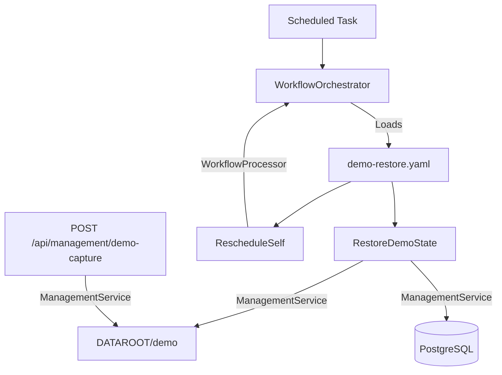

# Demo Mode Design

## Experience Architecture

The Demo Mode feature provides a repeatable, low-cost showcase environment. It consists of a capture/restore mechanism and a runtime "soft disable" for AI features.



## Technical Specification

### 1. Management Service Extensions (`ManagementService.cs`)

Add the following methods to handle demo state lifecycle:

- **`CaptureDemoStateAsync()`**:
    - Creates `DATAROOT/demo/` if missing.
    - Serializes `FamilyMembers`, `Recipes`, and `RecipeSearchDocuments` to JSON/CSV in `DATAROOT/demo/`.
    - Recursively copies the `recipes/` directory to `DATAROOT/demo/recipes/`.
    - **Excludes**: `RecipeVotes`, `WeeklyPlans`, `CalendarEvents`, `WorkflowInstances`, `WorkflowTasks`.
- **`RestoreDemoStateAsync()`**:
    - Truncates `RecipeVotes`, `WeeklyPlans`, `CalendarEvents` in the database.
    - Wipes the active `recipes/` directory.
    - Restores database records and the `recipes/` directory from the `demo/` snapshot.
    - Re-initializes `WeeklyPlans` for the current week (locked status) to ensure a clean planner.

### 2. AI Soft Disable Logic

#### `WorkflowOrchestrator` / `IWorkflowProcessor`
Modify the engine to honor `DEMO_MODE=true`:
- If `DEMO_MODE` is active, the following processors will skip their logic and return a "Demo Mode Bypass" result:
    - `RecipeAgent` (Extract, Synthesize, Describe)
    - `WebAcquisitionAgent`
    - `CategorizeIngredientsProcessor`
    - `ClassifyDietaryProfileProcessor`

#### `IChatClient` (Optional but Recommended)
A decorator can be added to `IChatClient` in `Program.cs` to fail all generative calls with a specific exception if `DEMO_MODE` is enabled, ensuring zero API leakage.

### 3. API & Controllers

- **`ManagementController`**:
    - Add `POST /api/management/demo-capture`.
    - Add `POST /api/management/demo-restore` (manually trigger the restore workflow).
- **`FamilyController`**:
    - If `DEMO_MODE=true`, `POST /api/family` returns `403 Forbidden`.
- **`HealthController`**:
    - Expose `demoMode: true` in the health check response so the PWA can adjust its UI.

### 4. PWA UI Adjustments

- **Login Page**: Pre-populate the "Passphrase" field with `"Swipe-Match-Cook"` if `demoMode` is detected in the health check.
- **Search Page**: 
    - Disable the "Agent Mode" toggle.
    - Add a `data-testid="demo-ai-notice"` tooltip or pop-out explanation.
- **Recipe Details**: Add a banner if a recipe was created during the current demo window, noting it will be erased during the next reset.

### 5. Demo Restore Workflow (`demo-restore.yaml`)

```yaml
name: demo-restore
parameters: []
tasks:
  - name: restore
    processor: ManagementProcessor
    payload: { action: "RestoreDemoState" }
    
  - name: reschedule
    processor: RescheduleSelf
    payload:
      time: "03:00"
      offset: "-04:00"
    dependsOn: [restore]
```

## Testing Strategy

### Automated Tests
- **Integration**: Verify `CaptureDemoStateAsync` creates the expected files in `DATAROOT/demo`.
- **Integration**: Verify `RestoreDemoStateAsync` erases votes/plans but keeps recipes.
- **E2E**: Verify PWA login pre-population.
- **E2E**: Verify new user creation fails with 403 in demo mode.

## Dead-End & Blind Spot Pre-mortem
- **The "Empty Demo"**: If `Capture` is never run, `Restore` will fail.
    - **Mitigation**: Add a check in `RestoreDemoStateAsync` that fails gracefully with a clear log if the `demo/` directory is missing.
- **Schema Drift**: If the demo snapshot is old, restoration might cause EF errors.
    - **Mitigation**: Ensure `demo-capture` is part of the deployment pipeline or run manually after migrations.
- **Search Index Sync**: Restoring embeddings from sidecars is critical.
    - **Mitigation**: Ensure `RestoreDemoStateAsync` re-inserts into `RecipeSearchDocuments` to maintain semantic search capability.
