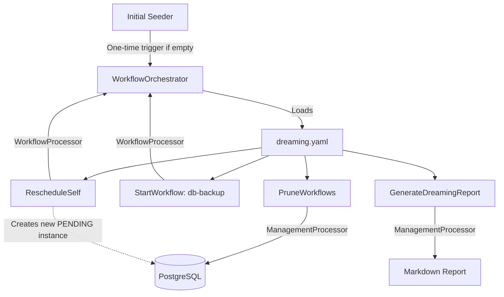

# Dreaming Workflow Design

## Experience Architecture

The "Dreaming" feature operates as a self-sustaining, recurring workflow. It is orchestrated by the workflow engine, which has been extended to support deferred scheduling and workflow-to-workflow triggering.



## Technical Specification

### 1. Engine Extensions

#### `IWorkflowOrchestrator`
Update `TriggerAsync` to support an optional `scheduledAt` timestamp.
```csharp
Task<WorkflowInstance> TriggerAsync(string workflowId, Dictionary<string, string> parameters, DateTimeOffset? scheduledAt = null);
```

#### `WorkflowProcessor`
A new processor implemented in `WorkflowProcessor.cs` to handle engine-level tasks.
- **`StartWorkflow`**: Triggers a different workflow.
    - `payload: { workflowId: string, parameters: object }`
- **`RescheduleSelf`**: Triggers a new instance of the current workflow in the future.
    - `payload: { time: "03:00", offset: "-04:00" }`

### 2. Dreaming Workflow (`dreaming.yaml`)

```yaml
name: dreaming
parameters: []
tasks:
  - name: prune
    processor: PruneWorkflows
    payload: { retentionDays: 7 }
    
  - name: backup
    processor: StartWorkflow
    payload: 
      workflowId: "db-backup"
    
  - name: report
    processor: GenerateDreamingReport
    payload: {}
    dependsOn: [prune, backup]

  - name: reschedule
    processor: RescheduleSelf
    payload:
      time: "03:00"
      offset: "-04:00"
    dependsOn: [report]
```

### 3. Management Service Extensions
Modify `ManagementService.cs` to add:
- `PruneWorkflowsAsync(int retentionDays)`:
    - Deletes `WorkflowInstances` where `Status` in (`Completed`, `Failed`) AND `UpdatedAt < now - retentionDays`.
- `GenerateDreamingReportAsync()`:
    - Queries `WorkflowInstances` updated in the last 24h.
    - Aggregates failures and long-running tasks.
    - Writes to `DataRoot/reports/dreaming-yyyy-MM-dd.md`.

### 4. Dreaming Initial Seeder
Update `WorkflowWorker` or create a small startup task that checks if a `dreaming` workflow is already scheduled. If not, it triggers the first one for the next 3 AM.

## Testing Strategy

### Unit Tests
- `WorkflowProcessorTests`: Verify `RescheduleSelf` correctly calculates the next day if the time has already passed today.
- `ManagementServiceTests`: Verify pruning logic.

### Integration Tests
- `DreamingWorkflowTests`: Execute the full `dreaming` workflow and verify that a *new* instance of `dreaming` is created in the database with a `scheduled_at` time in the future.

## Dead-End & Blind Spot Pre-mortem
- **The "Chain Break"**: If `RescheduleSelf` fails, the nightly routine stops.
    - **Mitigation**: The task has built-in retries. If it fatally fails, the `GenerateDreamingReport` (which ran just before) will be the last report, and the human will see the failure of the previous night's "reschedule" task.
- **Timezone Complexity**: We use `DREAMING_TIME` and `DREAMING_OFFSET` to explicitly define the "night". The `NextOccurrenceCalculator` will handle the math to ensure we don't accidentally skip a day or double-schedule.
