# Design Document: Family Health Profiles

## Overview

This feature adds a JSONB `health_profile` column to `family_members` and a deterministic `ConditionRuleEngine` that maps health conditions + recipe dietary profiles to human-readable warnings. Warnings are computed at read time (on `GET /api/discovery` and `GET /api/schedule`) with no caching — the computation is cheap enough that caching adds complexity with no benefit at family scale.

No LLM is involved anywhere in this feature.

**Hard dependency:** `recipe-categorization` spec complete. `recipes.dietary_profile` populated.

---

## Architecture

```mermaid
flowchart TD
    subgraph Setup["Profile Management"]
        A[PUT /api/family/id/health-profile] --> B[Write family_members.health_profile]
        C[DELETE /api/family/id/health-profile] --> D[Set health_profile = null]
        E[GET /api/family] --> F[Return healthProfile in FamilyMemberDto]
    end

    subgraph RuleEngine["ConditionRuleEngine — pure code, no LLM"]
        G[HealthProfile + RecipeDietaryProfile + NutritionData] --> H[Condition rules]
        H --> I[Allergy rules]
        I --> J[Intolerance rules]
        J --> K[Preference rules]
        K --> L[RecipeWarning list]
    end

    subgraph Discovery["GET /api/discovery"]
        M[Load requesting member health_profile] --> N[Load recipe dietary_profile per result]
        N --> O[ConditionRuleEngine.Evaluate]
        O --> P[Attach warnings to RecipeDto]
    end

    subgraph Schedule["GET /api/schedule"]
        Q[Load all family health_profiles] --> R[Load dietary_profile for each slot's recipe]
        R --> S[ConditionRuleEngine.Evaluate per member per slot]
        S --> T[Attach warnings to ScheduleRecipeDto]
    end

    subgraph BackupRestore["ManagementService"]
        B --> BA[BackupAsync: write health_profile to family-members.json]
        BR[RestoreAsync: read health_profile from family-members.json] --> B
    end
```



---

## Seam inventory

| Seam | Existing shape | What we add | Risk |
|---|---|---|---|
| `family_members` table | `id, name, created_at, updated_at` | `health_profile jsonb DEFAULT NULL` | Schema change — psqldef handles it |
| `FamilyMemberDto` | `id, name, createdAt, updatedAt` | `healthProfile: HealthProfileDto?` | Nullable addition — existing clients receive null, no break |
| `FamilyController` | GET / POST / PUT / DELETE | Add `PUT /{id}/health-profile` and `DELETE /{id}/health-profile` | New routes — no existing route conflict |
| `ScheduleRecipeDto` | Positional record with 7 fields | Add `warnings: List<RecipeWarningDto>?` | Positional record — new param must go at the end |
| `RecipeDto` | Class with many nullable fields | Add `warnings: List<RecipeWarningDto>?` | Class (not record) — safe to add nullable property |
| `DiscoveryService.GetRecipesForDiscoveryAsync` | Returns `List<Recipe>` mapped to DTOs | Must load member health_profile and compute warnings | Adds DB load; must not change discovery ordering |
| `ScheduleService.GetScheduleAsync` | Builds `ScheduleDays` | Must load all health_profiles and compute warnings per slot | Adds DB load per schedule request |
| `ManagementService.BackupAsync` | Writes family members to backup | Extend to include `health_profile` | Must not break existing backup shape |
| `ScheduleDays` C# record | Already has `BalanceSummary` added in recipe-categorization | No change in this feature — warnings live on `ScheduleRecipeDto`, not on `ScheduleDays` | None |

---

## Components and Interfaces

### New C# records (new files)

#### `HealthProfile.cs`

```csharp
namespace RecipeApi.Models;

public record HealthProfile(
    string[] Conditions,    // e.g. ["HighCholesterol", "Hypertension"]
    string[] Allergies,     // e.g. ["Peanuts", "Shellfish"]
    string[] Intolerances,  // e.g. ["Lactose", "Gluten"]
    string[] Preferences    // e.g. ["Vegetarian", "Halal"]
);
```

#### `RecipeWarning.cs`

```csharp
namespace RecipeApi.Models;

public record RecipeWarning(
    Guid FamilyMemberId,
    string FamilyMemberName,
    string Level,       // "hard" | "soft" | "info"
    string Reason,      // plain-language explanation
    string Condition    // the condition/allergy/intolerance/preference that triggered this
);
```

### New DTOs (new files)

#### `HealthProfileDto.cs`

```csharp
namespace RecipeApi.Dto;

public class HealthProfileDto
{
    [JsonPropertyName("conditions")]
    public List<string> Conditions { get; set; } = [];

    [JsonPropertyName("allergies")]
    public List<string> Allergies { get; set; } = [];

    [JsonPropertyName("intolerances")]
    public List<string> Intolerances { get; set; } = [];

    [JsonPropertyName("preferences")]
    public List<string> Preferences { get; set; } = [];
}
```

#### `RecipeWarningDto.cs`

```csharp
namespace RecipeApi.Dto;

public class RecipeWarningDto
{
    [JsonPropertyName("familyMemberId")]
    public Guid FamilyMemberId { get; set; }

    [JsonPropertyName("familyMemberName")]
    public required string FamilyMemberName { get; set; }

    [JsonPropertyName("level")]
    public required string Level { get; set; }

    [JsonPropertyName("reason")]
    public required string Reason { get; set; }

    [JsonPropertyName("condition")]
    public required string Condition { get; set; }
}
```

---

### Modified C# models

#### `FamilyMember.cs` — add one column property

```csharp
[Column("health_profile", TypeName = "jsonb")]
public string? HealthProfile { get; set; } = null;
```

Pattern: same as `Recipe.DietaryProfile`. Stored as raw JSON string. Deserialized at read time.

#### `FamilyMemberDto.cs` — add one nullable property

```csharp
[JsonPropertyName("healthProfile")]
public HealthProfileDto? HealthProfile { get; set; } = null;
```

Existing clients that don't read `healthProfile` are unaffected — nullable addition.

#### `ScheduleRecipeDto.cs` — add one optional parameter at the end

Current signature (as of recipe-categorization spec):
```csharp
public record ScheduleRecipeDto(
    [property: JsonPropertyName("id")] Guid Id,
    [property: JsonPropertyName("name")] string? Name,
    [property: JsonPropertyName("image")] string Image,
    [property: JsonPropertyName("voteCount")] int? VoteCount = null,
    [property: JsonPropertyName("ingredients")] List<string>? Ingredients = null,
    [property: JsonPropertyName("description")] string? Description = null,
    [property: JsonPropertyName("totalTime")] string? TotalTime = null);
```

Add `Warnings` as the last parameter:
```csharp
    [property: JsonPropertyName("warnings")] List<RecipeWarningDto>? Warnings = null);
```

**Do not reorder any existing parameters.**

Before adding, run:
```bash
grep -rn "new ScheduleRecipeDto(" api/src --include="*.cs"
```
and confirm all call sites use named arguments or the new param position is safe.

#### `RecipeDto.cs` — add one nullable property

```csharp
[JsonPropertyName("warnings")]
public List<RecipeWarningDto>? Warnings { get; set; } = null;
```

`RecipeDto` is a class (not a record), so this is a safe additive change.

---

### New C# service: `ConditionRuleEngine`

**File:** `api/src/RecipeApi/Services/ConditionRuleEngine.cs`

```
namespace RecipeApi.Services;

public static class ConditionRuleEngine
{
    public static List<RecipeWarning> Evaluate(
        FamilyMember member,
        RecipeDietaryProfile? profile,
        NutritionInfo? nutrition)
    // Pure function. No DB. No LLM.
    // Returns [] when profile is null (cannot warn on unclassified recipe).
}
```

**`NutritionInfo`** is a lightweight record parsed from `raw_metadata.nutrition` at call time:
```csharp
public record NutritionInfo(
    double? SodiumMg,
    double? SugarG,
    double? CarbohydrateG,
    double? SaturatedFatG
);
```

**Nutrient thresholds — sourced from Health Canada's front-of-package (FOP) "High in" symbol regulation.**

The FOP symbol appears when a food contains ≥ 15% of the Daily Value per serving for the flagged nutrient. Daily Values used:
- Saturated fat: DV = 27g → 15% DV = **4g per serving**
- Sugars: DV = 100g → 15% DV = **15g per serving**
- Sodium: DV = 2300mg → 15% DV = **345mg per serving**

Source: https://www.canada.ca/en/health-canada/services/food-nutrition/nutrition-labelling/front-package.html

These constants SHALL be named in code (`FopThresholds` static class) so they are traceable to the regulation, not magic numbers.

```csharp
namespace RecipeApi.Services;

public static class FopThresholds
{
    // Health Canada Front-of-Package "High in" symbol — 15% Daily Value cut-offs
    public const double SaturatedFatG = 4.0;   // DV 27g × 15%
    public const double SugarsG       = 15.0;  // DV 100g × 15%
    public const double SodiumMg      = 345.0; // DV 2300mg × 15%
}
```

**Condition rules (code, not config):**

| Condition | Signal | Level | Reason template |
|---|---|---|---|
| `HighCholesterol` | `proteinSource == "RedMeat"` | `soft` | `"Red meat is high in saturated fat — caution for {name}'s cholesterol."` |
| `HighCholesterol` | `saturatedFat > FopThresholds.SaturatedFatG` | `soft` | `"This recipe is high in saturated fat ({value}g) — caution for {name}'s cholesterol."` |
| `HighCholesterol` | `proteinSource == "Dairy"` | `soft` | `"High dairy content — may affect {name}'s cholesterol."` |
| `HeartDisease` | `proteinSource == "RedMeat"` | `soft` | `"Red meat is not recommended for {name}'s heart health."` |
| `HeartDisease` | `saturatedFat > FopThresholds.SaturatedFatG` | `soft` | `"This recipe is high in saturated fat ({value}g) — caution for {name}'s heart health."` |
| `Hypertension` | `sodium > FopThresholds.SodiumMg` | `soft` | `"This recipe is high in sodium ({value}mg) — caution for {name}'s blood pressure."` |
| `Diabetes` | `sugar > FopThresholds.SugarsG` | `soft` | `"This recipe is high in sugar ({value}g) — caution for {name}'s blood sugar."` |
| `Diabetes` | `carbohydrate > 60g` | `soft` | `"This recipe is high in carbohydrates ({value}g) — caution for {name}'s blood sugar."` |

**Allergy rules:** For each allergy string, check if it matches (case-insensitive) any of the known allergen-to-proteinSource mappings:
```
"Shellfish" / "Shrimp" / "Prawns" / "Crab" / "Lobster" → proteinSource == "Seafood"
"Fish" / "Salmon" / "Cod" / "Tuna" → proteinSource == "Seafood"
"RedMeat" / "Beef" / "Pork" / "Lamb" → proteinSource == "RedMeat"
"Chicken" / "Poultry" / "Turkey" → proteinSource == "Poultry"
"Dairy" / "Milk" / "Lactose" / "Cheese" → proteinSource == "Dairy"
"Egg" / "Eggs" → proteinSource == "Dairy"  // Dairy includes eggs in ProteinSource taxonomy
```

When an allergy string does NOT match any known mapping, it is stored but cannot be matched against `dietary_profile` in Phase 1. The engine silently skips it. (Phase 2 ingredient-level matching will handle this.)

**Intolerance rules:**
```
"Lactose" / "Dairy" → proteinSource == "Dairy" → soft warning
"Gluten" → primaryFoodGroup == "WholeGrains" OR "WholeGrains" in secondaryFoodGroups → soft warning
```

**Preference rules:**
```
"Vegetarian" → proteinSource in ["RedMeat","Poultry","Seafood"] → info
"Vegan" → proteinSource in ["RedMeat","Poultry","Seafood","Dairy"] → info
"Halal" / "Kosher" → cannot evaluate from dietary_profile alone → silently skip in Phase 1
```

---

### Modified C# service: `FamilyService`

Add:
```csharp
public async Task UpsertHealthProfileAsync(Guid memberId, HealthProfile profile)
public async Task ClearHealthProfileAsync(Guid memberId)
```

`UpsertHealthProfileAsync`: load member, serialize `HealthProfile` to JSON, write to `member.HealthProfile`, `SaveChangesAsync`.
`ClearHealthProfileAsync`: load member, set `member.HealthProfile = null`, `SaveChangesAsync`.

---

### Modified C# controller: `FamilyController`

Add two endpoints:

```csharp
[HttpPut("{id:guid}/health-profile")]
public async Task<IActionResult> UpsertHealthProfile(Guid id, [FromBody] HealthProfileDto dto)

[HttpDelete("{id:guid}/health-profile")]
public async Task<IActionResult> DeleteHealthProfile(Guid id)
```

Map `HealthProfileDto` → `HealthProfile` record before calling service. Return `200 Ok` on upsert, `204 NoContent` on delete.

---

### Modified C# service: `DiscoveryService`

`GetRecipesForDiscoveryAsync` already accepts `familyMemberId`. Extend to compute warnings:

```
1. Load FamilyMember for familyMemberId (including health_profile).
2. For each recipe in results:
   a. Deserialize recipe.DietaryProfile to RecipeDietaryProfile? (null-safe).
   b. Parse NutritionInfo from recipe.RawMetadata (null-safe).
   c. Call ConditionRuleEngine.Evaluate(member, profile, nutrition).
3. Map warnings to List<RecipeWarningDto> and attach to the RecipeDto.
```

The recipe list is already loaded — this adds deserialization and rule evaluation only. No additional DB queries.

---

### Modified C# service: `ScheduleService`

`GetScheduleAsync` must compute warnings for all family members for each slot's recipe:

```
1. Load all FamilyMembers with non-null health_profile (one DB query).
2. For each day slot that has a recipe:
   a. Load the recipe's DietaryProfile and RawMetadata (already loaded for other purposes — reuse).
   b. For each family member with a health_profile:
      - Call ConditionRuleEngine.Evaluate(member, profile, nutrition).
   c. Aggregate all warnings across all members.
   d. Attach to ScheduleRecipeDto.Warnings.
3. If no family members have health_profiles, skip steps 1–2d entirely.
```

Load family members with health profiles once (not per slot). Do not add a DB query per slot.

---

### Modified service: `ManagementService`

**`BackupAsync`:** In the family member backup section, include `health_profile` in the serialized JSON alongside `name` and other fields.

**`RestoreAsync`:** When reading family member backup data, if a `healthProfile` field is present, deserialize and write to `family_members.health_profile`.

---

## Database Schema Changes

Add to `api/database/schema.sql`:

```sql
ALTER TABLE family_members ADD COLUMN IF NOT EXISTS
    health_profile jsonb DEFAULT NULL;
```

---

## OpenAPI Contract Delta

### New schemas

```yaml
HealthProfileDto:
  type: object
  properties:
    conditions:   { type: array, items: { type: string } }
    allergies:    { type: array, items: { type: string } }
    intolerances: { type: array, items: { type: string } }
    preferences:  { type: array, items: { type: string } }

RecipeWarningDto:
  type: object
  required: [familyMemberId, familyMemberName, level, reason, condition]
  properties:
    familyMemberId:   { type: string, format: uuid }
    familyMemberName: { type: string }
    level:            { type: string, enum: [hard, soft, info] }
    reason:           { type: string }
    condition:        { type: string }
```

### Updated `FamilyMemberDto` schema

Add nullable `healthProfile`:
```yaml
        healthProfile:
          nullable: true
          oneOf:
            - { $ref: '#/components/schemas/HealthProfileDto' }
            - { type: 'null' }
```

### Updated `ScheduleRecipeDto` schema

Add `warnings` array:
```yaml
        warnings:
          type: [array, 'null']
          items: { $ref: '#/components/schemas/RecipeWarningDto' }
          nullable: true
```

### Updated `RecipeDto` schema

Add `warnings` array (same shape as above).

### New routes

```yaml
  /api/family/{id}/health-profile:
    put:
      summary: Set or update health profile for a family member
      parameters:
        - name: id
          in: path
          required: true
          schema: { type: string, format: uuid }
      requestBody:
        required: true
        content:
          application/json:
            schema: { $ref: '#/components/schemas/HealthProfileDto' }
      responses:
        '200':
          description: OK
        '404':
          description: Family member not found
    delete:
      summary: Clear health profile for a family member
      parameters:
        - name: id
          in: path
          required: true
          schema: { type: string, format: uuid }
      responses:
        '204':
          description: No Content
        '404':
          description: Family member not found
```

---

## Testing Strategy

### Seam tests (highest priority)

| Seam | Test |
|---|---|
| `ScheduleRecipeDto` new param position | Unit: construct with all params, assert `warnings` serializes correctly |
| `ConditionRuleEngine` | Unit: all condition/allergy/intolerance/preference rules, null profile input, empty arrays |
| `DiscoveryService` warning attachment | Unit: member with `HighCholesterol` + recipe with `proteinSource: RedMeat` → `soft` warning in result |
| `ScheduleService` warning attachment | Integration: week with red-meat recipe + member with `HighCholesterol` → `GET /api/schedule` slot has warning |
| Backup/restore | Integration: backup family member with health_profile → restore → profile present |

### Test commands

```bash
task test:api     # C# unit + integration
task test:unit    # PWA unit
task test         # full suite
```
