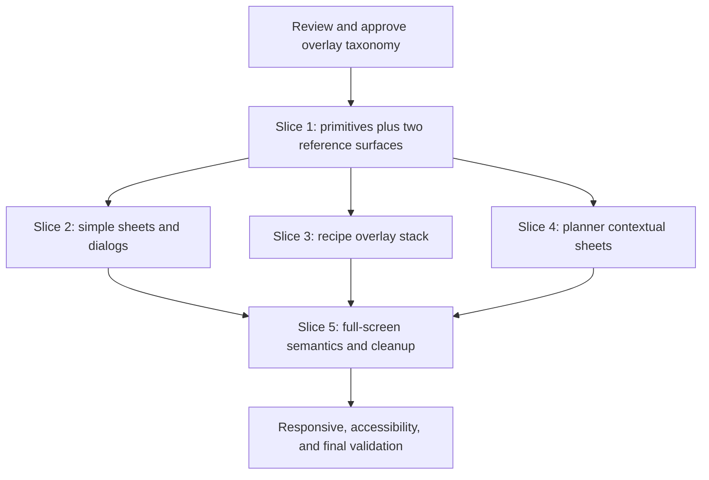

# Overlay Design System — Tasks

## Execution rules

- This is a UI-only standardization. Do not edit `specs/openapi.yaml`, generated clients, API projects, database files, or domain stores.
- Follow tests before implementation in every slice.
- Preserve all existing `data-testid` values and business behavior.
- Complete one slice at a time; do not launch the full migration as one change.
- Run Taskfile targets rather than raw lint, typecheck, or test commands when an equivalent target exists.
- Do not begin implementation until the four review gates in `design.md` are resolved.

## Dependency graph

Slices 2, 3, and 4 may run in parallel only after Slice 1 stabilizes the primitive API. Their assigned file sets must not overlap.

## Task 0 — Review and baseline

**Goal:** Freeze the approved taxonomy and establish evidence before changing shared UI.

- [ ] Resolve every review gate in `design.md` and record the decision under Notes / Decisions below.
- [ ] Run `task agent:audit AREA=overlay` and record relevant unit/E2E coverage and brittle-selector warnings.
- [ ] Re-run the overlay inventory with targeted search and confirm that no new overlay consumer has appeared.
- [ ] Verify that the generic `Modal` has no runtime consumers.
- [ ] Capture representative current-state screenshots or bounding-box measurements at 390, 768, and 1440 CSS pixels.
- [ ] Record any pre-existing failing tests before implementation.

**Done when:** taxonomy decisions are explicit, the surface inventory is current, and the existing test baseline is known.

**Escalate if:** an active feature spec requires an overlay classification that conflicts with this spec.

## Task 1 — Shared mechanics and reference surfaces

**Goal:** Prove one canonical bottom sheet and one canonical centered dialog while fixing the report-sheet breakpoint defect.

### Tests first

- [ ] Add focused tests for dialog naming, initial focus, focus cycling, Escape, backdrop dismissal, focus restoration, and body scroll locking.
- [ ] Add nested-root/reference-count tests for scroll locking even if nested consumer migration occurs later.
- [ ] Add reduced-motion coverage for bottom-sheet and centered-dialog variants.
- [ ] Update `RecipeImportIssueSheet` tests to assert bottom-sheet classification and stable behavior at `sm+`.
- [ ] Update `InviteLinkDialog` tests to assert centered-dialog classification and accessible semantics.

### Implementation

- [ ] Add the minimum shared overlay primitives under `pwa/src/components/ui/overlay/`.
- [ ] Add semantic overlay tokens through the existing Tailwind/CSS token mechanism.
- [ ] Migrate `RecipeImportIssueSheet` to `BottomSheet` without changing draft/save/resolve behavior or test IDs.
- [ ] Migrate `InviteLinkDialog` to `CenteredDialog` without changing copy/share behavior or test IDs.

### Validation

- [ ] Run focused component tests for primitives and both consumers.
- [ ] Run `task gate`.
- [ ] Manually verify both surfaces at 390, 768, and 1440 CSS pixels.
- [ ] Verify keyboard-only operation and reduced motion.

**Done when:** the report surface remains bottom-anchored at every width, Invite Link remains centered at every width, and shared mechanics pass focused tests.

**Escalate if:** correct focus management requires adding a new runtime dependency.

## Task 2 — Simple sheet and dialog migration

**Goal:** Standardize the low-risk standalone consumers.

### Tests first

- [ ] Extend existing tests for Recipe Filters, Family GOTO, Library Toast, Planner Nudge, and Quick Find with type and accessibility assertions.
- [ ] Add focus-restoration coverage to the action that opens each surface.
- [ ] Preserve existing state/action tests without weakening selectors.

### Implementation

- [ ] Migrate `RecipeFiltersSheet` to `BottomSheet`, preserving `md:hidden` and draft/apply/cancel behavior.
- [ ] Migrate the Family GOTO chooser to `BottomSheet`.
- [ ] Migrate the Library Toast action drawer to `BottomSheet`.
- [ ] Migrate Planner Nudge to `CenteredDialog`.
- [ ] Migrate Quick Find to shared centered-dialog mechanics while preserving its specialized card container and motion where compatible.
- [ ] Replace stark-white outer surfaces with the approved canonical surface.

### Validation

- [ ] Run focused tests for all five consumers.
- [ ] Run the existing Quick Find and planner interaction coverage.
- [ ] Verify no toast, navigation, or backdrop layer appears above the active surface.

**Done when:** the five surfaces use an explicit type, share accessibility mechanics, and preserve existing behavior.

**Escalate if:** Quick Find's card-flip interaction conflicts with reduced-motion or focus containment requirements.

## Task 3 — Recipe overlay stack

**Goal:** Standardize wide and nested recipe surfaces without losing recipe context.

### Tests first

- [ ] Add Recipe Detail tests for bottom anchoring, wide width, internal scrolling, initial focus, dismissal, and focus restoration.
- [ ] Add Recycle Bin tests for sheet semantics and focus containment.
- [ ] Add elevated PIN tests for nested dialog semantics, topmost Escape handling, focus isolation, and return to the triggering Delete control.
- [ ] Add report-over-detail tests proving that only the report sheet is keyboard-active and Recipe Detail state survives.
- [ ] Preserve save/edit/report/reimport/resolve/restore/purge behavior tests.

### Implementation

- [ ] Migrate `RecipeDetailSheet` to the wide `BottomSheet` variant.
- [ ] Migrate `RecycleBinSheet` to `BottomSheet`.
- [ ] Migrate elevated PIN confirmation to `CenteredDialog`.
- [ ] Use the semantic overlay layer scale for Recipe Detail, report sheet, Recycle Bin, and elevated PIN.
- [ ] Remove local z-index values made obsolete by the shared layer system.

### Validation

- [ ] Run focused Recipe Detail, report, Recycle Bin, and purge tests.
- [ ] Run the existing recipe-import-reporting E2E flow from `pwa`.
- [ ] Verify 320-pixel width, 200% zoom, long recipe content, and software-keyboard interaction.

**Done when:** recipe overlays compose correctly, preserve state, and no child surface is hidden or leaks focus to its parent.

**Escalate if:** keeping Recipe Detail mounted while modal-inactive cannot be made inert without breaking its current state lifecycle.

## Task 4 — Planner contextual sheets

**Goal:** Make Planning Pivot and Skip Recovery predictable bottom sheets at every width.

### Tests first

- [ ] Add type, semantics, focus, Escape, backdrop, and restoration assertions to both component suites.
- [ ] Add breakpoint regression assertions at 768 and 1440 CSS pixels.
- [ ] Preserve every planner action and two-step recovery transition test.

### Implementation

- [ ] Migrate `PlanningPivotSheet` to `BottomSheet`.
- [ ] Migrate `SkipRecoveryDialog` to `BottomSheet` without changing its public component name in this slice unless renaming is independently justified.
- [ ] Preserve the two components' shared Solar Earth hierarchy while adopting canonical sheet corners, safe-area spacing, and motion.
- [ ] Replace arbitrary layer values with semantic overlay layers.

### Validation

- [ ] Run focused Planning Pivot and Skip Recovery tests.
- [ ] Run the existing planner action/recovery E2E coverage.
- [ ] Verify primary choices remain within comfortable mobile reach.

**Done when:** both contextual choosers remain bottom-attached across breakpoints and all planner behavior is unchanged.

**Escalate if:** desktop content height makes a bottom-anchored layout unusable at a supported viewport.

## Task 5 — Full-screen semantics and cleanup

**Goal:** Complete the taxonomy without flattening specialized experiences.

### Tests first

- [ ] Add appropriate accessible naming and focus/dismissal tests for Cook Mode, Original Photos, and capture image viewing.
- [ ] Add context-restoration assertions where absent.
- [ ] Add a static or unit guard preventing new responsive type-switch classes in shared overlay primitives.

### Implementation

- [ ] Reuse only compatible shared root/layer mechanics in Cook Mode.
- [ ] Align Original Photos and capture image viewing on the approved lightbox semantics.
- [ ] Preserve the intentional dark media canvas exception.
- [ ] Repurpose generic `Modal` as a compatibility wrapper around `CenteredDialog`, or delete it, according to the approved review decision.
- [ ] Remove obsolete duplicated overlay classes and unused exports only after verifying all consumers.
- [ ] Add concise developer documentation for choosing an overlay type.

### Validation

- [ ] Run focused Cook Mode, Original Photos, and capture tests.
- [ ] Run `task agent:test:impact`.
- [ ] Verify there are no remaining accidental bottom/center breakpoint switches.

**Done when:** every inventoried surface has one explicit type and future contributors have a clear selection rule.

**Escalate if:** the generic `Modal` is consumed dynamically or outside the searchable PWA source.

## Task 6 — Final system validation

**Goal:** Verify the complete system as one coherent experience.

- [ ] Run the responsive representative-sheet/dialog E2E matrix at 320, 390, 768, and 1440 widths.
- [ ] Run automated accessibility checks for every migrated blocking overlay.
- [ ] Complete keyboard-only tests for standalone and nested overlays.
- [ ] Complete contrast checks against the final token values.
- [ ] Verify `prefers-reduced-motion` behavior.
- [ ] Verify 200% zoom, dynamic viewport height, bottom safe area, and software-keyboard reachability.
- [ ] Run `task test` because the shared primitives have broad impact.
- [ ] Run `task agent:finish` exactly once on the final worktree.
- [ ] Record passed, failed, and manual-only validation honestly in this file.

**Done when:** the full validation matrix passes, no API/domain behavior changed, and the implementation matches the approved taxonomy.

**Escalate if:** broad validation exposes a business-flow regression; fix it within the owning migration slice rather than weakening shared behavior.

## Notes / Decisions

- 2026-08-12: Initial review draft created from a source audit of existing PWA overlays.
- Pending: Recipe Detail desktop classification approval.
- Pending: Planning Pivot and Skip Recovery desktop classification approval.
- Pending: canonical cream-glass surface approval.
- Pending: generic `Modal` repurpose-versus-removal decision.

