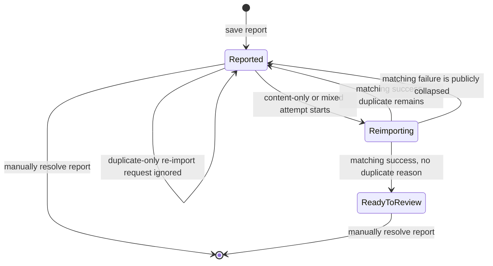

# Design: Duplicate Recipe Reporting and Grocery Reclassification Repair

## Overview

This package contains two independent workstreams that share no production files and may be executed separately after the spec is approved:

1. Extend the existing one-row-per-recipe issue seam with `duplicate` and conditional lifecycle rules.
2. Repair the grocery reclassification client-state gap without changing its established API or database seam.

No new table, endpoint, status, global store, or background workflow is introduced.

## Pre-mortem

| Failure | Preventive contract |
|---|---|
| OpenAPI accepts `duplicate`, but PostgreSQL rejects it | Update and test `schema.sql`, `compatibility.sql`, EF constraints, and runtime validation atomically. |
| Existing NAS databases keep the old constraint | Make compatibility detection explicitly replace constraints whose definition lacks `duplicate`. |
| A duplicate-only report starts re-import anyway | Guard attempt start before mutating any lifecycle field. |
| A mixed report is shown as fully ready after content repair | Successful transition branches on whether persisted reasons contain `duplicate`. |
| Synthesized recipes still hide the report action | Separate report-action eligibility from `canReimport`; pass content-reason eligibility into the sheet. |
| Cook Mode gains an irrelevant duplicate control | Keep contextual reasons fixed to ingredients/steps and expose duplicate only in recipe detail. |
| Grocery PATCH succeeds but the UI still appears broken | Update `weekStore.groceryItems` immediately after success and assert both source removal and destination insertion. |
| Two fast category taps resolve out of order | Disable choices for the pending normalized key. |
| SSE overwrites or never delivers the category | Do not depend on `grocery_updated`; normal schedule snapshots remain authoritative reconciliation. |
| Reclassification toggles or hides the item | Keep tag control separate, preserve checked state, and scope tests to the item row. |

## Workstream A — Duplicate recipe reporting

### Contract and SQL

The public enum becomes:

```yaml
RecipeImportIssueReason:
  type: string
  enum: [ingredients, steps, duplicate]
```

The canonical SQL constraint in `api/database/schema.sql` and the installed-database repair in `api/database/compatibility.sql` must be equivalent to:

```sql
CHECK (
    cardinality(reasons) > 0
    AND reasons <@ ARRAY['ingredients', 'steps', 'duplicate']::text[]
    AND cardinality(array_positions(reasons, 'ingredients'::text)) <= 1
    AND cardinality(array_positions(reasons, 'steps'::text)) <= 1
    AND cardinality(array_positions(reasons, 'duplicate'::text)) <= 1
)
```

The EF model constraint must express the same allowed set and uniqueness invariant. `compatibility.sql` must drop/recreate `recipe_import_reports_reasons_check` when `pg_get_constraintdef(oid) NOT LIKE '%duplicate%'`; checking only for `array_positions` would leave the current two-reason constraint installed.

No migration framework exists in this repository. `schema.sql` is the clean-install authority and `compatibility.sql` is the forward-upgrade authority; both are required execution-path dependencies.

### API validation

`RecipeImportReportService.ValidateAsync` normalizes, sorts, validates uniqueness, and then applies conditional eligibility:

```text
hasContentReason = reasons contains ingredients or steps
if hasContentReason and recipe.canReimport is false:
    reject through existing ineligible path
otherwise:
    accept
```

This allows duplicate-only reports on every recipe but does not allow `duplicate` to smuggle an ineligible content report through validation. The allowed-reason error names all three values.

### Lifecycle state machine



Internal mixed-report failure remains `reimport_failed`, preserving current diagnostics. Public mapping remains `reported`.

`MarkAttemptStartedAsync` must mutate only reports containing at least one content reason. `MarkSucceededAsync` must use persisted reasons in the guarded update:

- contains `duplicate` → internal `reported`;
- does not contain `duplicate` → internal `ready_to_review`.

Both relational bulk updates and tracked/InMemory branches require identical tests. A duplicate-only report does not acquire workflow ID, attempt time, success time, or error changes.

### UI contract

Recipe detail owns the universal entry point. Rename visible copy from import-specific wording to `Report issue` / `Review issue`, while retaining the existing sheet and API route.

The sheet receives a boolean such as `canReportContentIssues` derived from `recipe.canReimport`:

- `Duplicate` is always enabled.
- `Ingredients` and `Steps` are enabled only when content reporting is eligible.
- Existing ineligible content reasons already stored from older data remain visible during review but cannot be newly added to an ineligible recipe.
- Cook Mode continues to open the sheet contextually only for eligible ingredients/steps.

Mère-Designer review: the third reason belongs in the existing compact reason group, not in Cook Mode or a new flow. This adds one clear thumb-sized choice and no new dead end; manual resolution remains the next step for duplicates.

### Seam inventory

| Seam | Authorities/consumers | Required change |
|---|---|---|
| OpenAPI | `specs/openapi.yaml` | Add enum value and examples. |
| Clean database | `api/database/schema.sql` | Expand allowed/unique constraint. |
| Existing database | `api/database/compatibility.sql` | Reliably replace old constraint. |
| EF metadata | `RecipeDbContext.cs` | Match SQL invariant. |
| Runtime validation/lifecycle | `RecipeImportReportService.cs` | Conditional eligibility and transitions. |
| Backup/restore | `ManagementService` and tests | Prove transparent round trip. |
| Generated client | `pwa/src/lib/api/generated/models/index.ts` | Regenerate; never hand-edit. |
| PWA mapping/UI | recipe API mapping, action menu, detail sheet, issue sheet | Universal action and third reason. |
| Digital twin | `pwa/e2e/mock-api.ts` | Store/return all three reasons. |
| Contextual UI | `CooksMode.tsx` | Regression-only; no duplicate entry. |

## Workstream B — Grocery reclassification regression

### As-is tracer map

```mermaid
flowchart LR
    A[section-option tap] --> B[GroceryList.handleReclassify]
    B --> C[reclassifyIngredient fetch]
    C --> D[PATCH ingredient category]
    D --> E[IngredientCategoryService upsert]
    E --> F[RecomputeForIngredientAsync]
    F --> G[weekly_plans.grocery_items updated]
    G -. no grocery-item snapshot event .-> H[weekStore.groceryItems unchanged]
    H --> I[item remains in old rendered section]
```



The current component closes the picker after the request and explicitly performs no local state update. The current `grocery_updated` SSE handler updates only `plannerStore.groceryState` (checked flags), not `weekStore.groceryItems`. Existing component coverage asserts only that the API function was called and the picker closed. This is the regression blind spot.

### Minimal repair

Add one focused action to `weekStore`, for example:

```ts
reclassifyGroceryItem(normalizedKey: string, section: GrocerySection): void
```

It maps the current `groceryItems`, replaces only the matching item's `section`, and preserves all other fields and array order. `GroceryList.handleReclassify` calls it only after `reclassifyIngredient` resolves successfully.

State belongs in `weekStore` because `groceryItems` is already authoritative render state there. A component-local shadow array would create two owners and drift on schedule snapshots. No new SSE payload is needed: existing `applySnapshot` replaces `groceryItems` with the server value during normal reconciliation.

While a normalized key is pending, its section buttons are disabled and expose `aria-busy="true"` on the picker or row. On failure, no store action occurs, the original item remains, and the existing per-item error affordance is retained. The picker may close on failure only if retry remains one tap away; preferred behavior is to keep/reopen it so the error has an obvious next action.

### Race pre-mortem

- **Repeated taps:** pending-key guard prevents concurrent requests for one item.
- **Different items:** independent keys may update concurrently because each store action maps by `normalizedKey`.
- **Week navigation mid-request:** capture the request's starting `weekOffset`; apply the local update only if it still equals the loaded week when the response returns.
- **Later snapshot:** server snapshot overwrites optimistic sections and is authoritative.
- **SSE check-state event:** remains orthogonal and must not replace `groceryItems`.

## Mock contract

The existing category PATCH mock remains `204`, but E2E must maintain a category override by normalized key and return the changed section in the next mocked schedule response when the scenario exercises reconciliation. Component tests mock the API boundary and assert the immediate store/render update.

The import-report mock accepts request bodies containing `duplicate` and returns them unchanged in `RecipeDetailResponse`. It must also simulate duplicate-only lifecycle no-op and mixed-success returning public `reported` where lifecycle E2E covers those states.

## Testing matrix

| Layer | Duplicate reporting | Grocery regression |
|---|---|---|
| Static schema | Three-value SQL/EF parity and compatibility replacement | Existing route/schema unchanged. |
| API integration | Eligibility matrix, validation, save/update/delete | PATCH persists human category and recomputes. |
| Service unit | tracked + relational lifecycle branches | Existing recompute tests remain green. |
| Backup/restore | Duplicate-only and mixed round trip | No change. |
| Generated contract | Enum contains all three values | No change. |
| PWA unit | visibility, choice, draft, save, Cook Mode regression | Red-first immediate move, failure, pending, week race. |
| E2E | universal report action and duplicate lifecycle | Picker selection moves item and survives mocked reconciliation. |
| Integrity | generation, drift, API, unit, E2E gates | same final gates. |

## data-testid index

### Existing, preserved

- `import-issue-reason-ingredients`
- `import-issue-reason-steps`
- `import-issue-note-disclosure`
- `import-issue-note`
- `import-issue-save`
- `import-issue-resolve`
- `cooks-mode-report-ingredients`
- `cooks-mode-report-steps`
- `reclassify-btn` with `data-item-name`
- `section-picker`
- `section-option-<GrocerySection>`
- `reclassify-error`
- `aisle-section-<GrocerySection>`
- `grocery-item-checkbox` with `data-item-name`

### New

- `import-issue-reason-duplicate`
- `import-issue-content-ineligible` for the synthesized/non-reimportable explanation
- `reclassify-pending` scoped with `data-item-name`

No E2E interaction may use text, role, CSS, or positional selectors.

## Validation commands

Use Taskfile targets only:

1. `task agent:audit AREA=recipe-import-reporting`
2. `task agent:audit AREA=grocery`
3. `task gen:client:check`
4. `task agent:drift:schemas`
5. `task test:api`
6. `task test:unit`
7. `task test:e2e`
8. `task gate`
9. `task agent:finish` exactly once on the final worktree

If the local Playwright server cannot bind `127.0.0.1:3000`, report E2E as environment-blocked separately; do not alter product code to bypass it.
