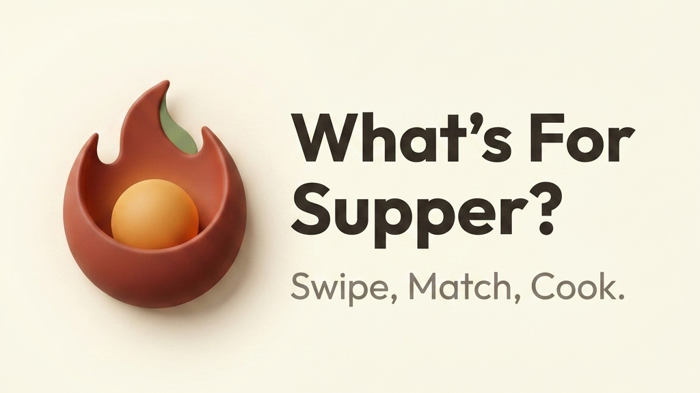
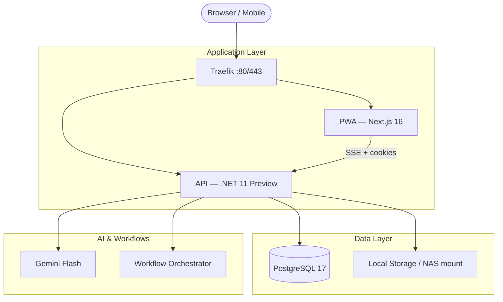

<p align="center">
  
</p>

<p align="center">
  <a href="LICENSE"></a>
  
  
  
  
</p>

---

## Why this exists

*"What's for supper?"* gets asked every single evening. Without a system, the answer is usually improvised, often repeated, and occasionally pizza again.

This project started as a real solution for a real household. The goal was not to build another recipe app — it was to turn that daily question from a source of stress into something the whole family participates in. Swipe through recipes together. Match on the ones everyone actually wants. Cook with confidence. The app handles planning, negotiation, grocery logistics, and step-by-step cooking guidance so the humans can focus on the meal.

The technical ambition grew alongside the product. WFS became a testbed for **contract-first, agent-assisted development** — a codebase designed from the start to be navigated and extended by human-AI pairs, using rigorous OpenAPI contracts, deterministic test gates, and agentic workflow orchestration. It runs today as a family self-hosted deployment on a home NAS, and the code that runs on that NAS is the same code in this repository.

---

## What it does

**What's For Supper** is a self-hosted, family-scale meal planning PWA. Install it once on a home server and every member of the household gets a shared, real-time view of the week's meals — on any device, with no accounts and minimal friction.

### The pillars

**1. Command Center (Home)**  
The home screen answers the question in two seconds. Tonight's recipe is front and centre with a one-tap path into Cook's Mode — a hands-free, step-by-step guide designed to be read from across the kitchen.

**2. Weekly Planner**  
Plan the full week, drag to reorder, and mark nights as cooked. The grocery list builds itself from the week's recipes and groups items by store aisle. Two people can shop the same list at the same time and see each other's checkmarks update in real time.

**3. Balance Indicator**  
Every recipe in the library is classified once against Canada's 2019 Food Guide using an AI call that happens in the background and is cached permanently. The planner shows a live balance indicator — no AI required at planning time, just deterministic scoring. When protein coverage is met, the Discovery stack silently shifts to surface more vegetable-forward recipes.

**4. Matchmaking Discovery**  
A swipe-based card stack for family voting. When enough household members vote for the same recipe, it surfaces as a suggestion in the planner. No group chats, no debates — the app builds consensus in the background.

**5. Zero-Friction Capture**  
Add recipes from a photo, a URL, or a description. Everything queues into an AI workflow pipeline (Gemini Flash) that extracts ingredients, synthesises a recipe, generates a hero image, categorises ingredients into grocery sections, and classifies the dietary profile — all without blocking the UI. Failed captures are preserved with a human-readable reason and can be retried from Settings.

**6. Personal Chef Search (RAG)**  
Search the way a tired parent actually thinks: "chicken pasta pesto tonight", "fish but quick", "find the salmon bowls the kids loved." The search page lives at `/recipes` and combines hybrid retrieval with an LLM-based re-ranking pass. When using **Agent Search** (the stars icon), the system fetches your current weekly menu and dietary balance goals to provide a decisive **Top Pick**. This pick includes a personalized **Planner Fit Note** explaining how the meal adds variety or balances your nutrition for the week. Search results are balanced into a clean 1+6 grid for a premium, low-friction experience.

**7. Recycle Bin and Library Recovery**  
Deleting a recipe is reversible. Soft delete sends it to the Recycle Bin where it can be restored in one tap. Permanent purge — which requires an elevated PIN — removes all DB records and disk assets atomically. A recipe assigned to an active planner slot cannot be deleted until it is removed from the plan first.

**8. Recipe Library Browse**  
An immersive, full-screen card browsing experience for the entire recipe library. It prioritizes recipes that haven't been cooked in a long time, helping families rediscover forgotten favourites. Built with smooth swipe navigation and integrated discoverability toggles, it mirrors the tactile ritual of flipping through a physical recipe box.

**9. Demo Mode (Showcase)**  
A stable, frozen environment for app showcases. When enabled, the app uses a master snapshot (`DATAROOT/demo/`), periodically resets user-generated data, and soft-disables AI cost-generating processors with a safety circuit breaker. The PWA automatically pre-populates the family passphrase and provides clear notices when expensive AI features are disabled.

---

## Architecture

WFS runs as a unified stack behind a **Traefik** reverse proxy. In production, a single domain serves both the PWA and the API — the browser connects to one origin and Traefik routes `/api/*` directly to the .NET container.



| Service | Technology | Role |
|---------|------------|------|
| **PWA** | Next.js 16 (App Router), TypeScript | Mobile-first frontend with real-time SSE sync |
| **API** | ASP.NET Core 11 Preview, C# 14, EF Core 11 Preview | Backend with agentic workflow orchestration |
| **DB** | PostgreSQL 17 | Structured data, JSONB recipe profiles |
| **Proxy** | Traefik | Unified routing, SSE header management |
| **AI** | Gemini Flash | Recipe extraction, synthesis, dietary classification |

### Real-time sync

Every planning action — assigning a recipe, checking off a grocery item, casting a vote — is pushed instantly to all connected devices over **Server-Sent Events**. No polling. No refresh. The family sees the same state.

For full event documentation, see [`docs/flows/data-flows/week-lifecycle.md`](docs/flows/data-flows/week-lifecycle.md).

### Security model (Hearth)

No accounts. Families share a single `HEARTH_SECRET` passphrase. Joining the app issues a signed `h_access` cookie. Every request is tied to a specific family member via `x-family-member-id`.

---

## Deployment

WFS runs in Docker. The production configuration targets a home NAS (Synology, Unraid, or any Docker-capable host) with optional Cloudflare Tunnel for remote access.

See **[DEPLOY.md](DEPLOY.md)** for the full deployment guide: Docker Compose setup, environment variables, Traefik configuration, and Cloudflare Tunnel integration.

**Minimum requirements:**
- Docker with Compose V2
- 2 GB RAM (API + DB + PWA)
- Local storage for recipe images (mapped via `DATA_ROOT`)
- A Google Gemini API key (free tier covers typical household usage)

---

## Development

WFS is built for humans who value high-integrity code and fast feedback loops. The repository is also optimized for **human-AI pair programming** using the agent doctrine in [`AGENT.md`](AGENT.md).

```bash
git clone https://github.com/AlexandreBrisebois/whats-for-supper.git
cd whats-for-supper
task init
```

### Essential commands

| Command | What it does |
|---------|--------------|
| `task up` | Start the full stack (PWA `:3000`, API `:9001`) |
| `task gate` | Fast check: lint, types, unit tests |
| `task review` | Full pre-commit gate: contracts + all tests |
| `task agent:drift` | Detect schema drift between OpenAPI spec and DTOs |
| `task logs:api` | Stream backend logs |
| `task dev:db:sync` | Refresh and re-seed the database |

For a full local dev walkthrough, see [`LOCAL_DEV_LOOP.md`](LOCAL_DEV_LOOP.md).

### Engineering doctrine

- **Contract-First** — `specs/openapi.yaml` is the source of truth. Nothing ships without a contract.
- **Test-First** — logic is preceded by tests, always.
- **Zero Drift** — continuous validation between OpenAPI spec, generated Kiota client, and backend DTOs.
- **Agent-First** — the repository includes a full suite of specialized agent skills under [`.agents/skills/`](.agents/skills/) for contract engineering, workflow authoring, drift detection, and more.

---

## Status

| Capability | Status | Notes |
|------------|--------|-------|
| Core architecture (Next.js 16 + .NET 11 Preview + Traefik) | ✅ Complete | |
| Hearth auth (HMAC, no accounts) | ✅ Complete | |
| Weekly planner with drag-and-drop | ✅ Complete | |
| Real-time SSE sync (family-wide, no polling) | ✅ Complete | |
| Cook's Mode (step-by-step, hands-free) | ✅ Complete | |
| Recipe capture (photo, URL, description) | ✅ Complete | |
| AI workflow orchestration (Gemini Flash) | ✅ Complete | |
| Dietary classification (Canada's Food Guide) | ✅ Complete | |
| Weekly balance indicator | ✅ Complete | |
| Discovery nudge via SSE | ✅ Complete | |
| Backup / restore (NAS-safe, LLM-skip on restore) | ✅ Complete | |
| Dreaming maintenance workflow (nightly prune, backup trigger, report, self-reschedule) | ✅ Complete | |
| NAS deployment (Synology / Unraid) | ✅ Running in production | Family self-hosted |
| Semantic recipe search (hybrid lexical + vector, planner-aware, family-fit) | ✅ Complete | |
| Recipe library management (edit, soft delete, restore, Recycle Bin, discovery toggle) | ✅ Complete | |
| Pantry/fridge/freezer photo search (inventory-led ingredient boost) | ⚠️ TODO  | |
| Agent super-search (long-form natural language → structured results) | ⚠️ TODO  | |
| Resilient search indexing workflow (pgvector, background retry, ADR 041) | ✅ Complete | |
| Failed Captures recovery (Settings queue, retry with idempotency guard) | ✅ Complete | |
| Recipe Library Browse (immersive card-flip library discovery) | ✅ Complete | |
| Canadian Food Guide Classification | ⚠️ TODO | [spec](.kiro/specs/cnf-data-ingestion) |
| Dietician Agent | ⚠️ TODO | Depends on Canadian Food Guide Classification, [spec](.kiro/specs/dietitian-agent-phase2) |
| Dreaming | ✅ Complete | [spec](.kiro/specs/dreaming) |
| Demo Mode | ✅ Complete | Depends on Dreaming, [spec](.kiro/specs/demo-mode) |
| Family Health Profiles | ⚠️ TODO | [spec](.kiro/specs/family-health-profiles) |

---

## Documentation

| Document | What it covers |
|----------|----------------|
| [`DEPLOY.md`](DEPLOY.md) | Docker, environment setup, Cloudflare Tunnel, NAS deployment |
| [`LOCAL_DEV_LOOP.md`](LOCAL_DEV_LOOP.md) | Full local development guide |
| [`AGENT.md`](AGENT.md) | Agent constitution — start here for AI-assisted contributions |
| [`docs/user-guide.md`](docs/user-guide.md) | User-facing feature guide |
| [`docs/flows/`](docs/flows/) | Data flows, user flows, and architecture diagrams |
| [`docs/flows/user-flows/recipe-search-and-library-recovery.md`](docs/flows/user-flows/recipe-search-and-library-recovery.md) | Search UX: input paths, planner mode, Recycle Bin, Failed Captures |
| [`docs/flows/data-flows/recipe-search-index-and-recovery.md`](docs/flows/data-flows/recipe-search-index-and-recovery.md) | Hybrid search pipeline, indexing workflow, backup/restore sidecar |
| [`docs/flows/data-flows/dreaming-maintenance-workflow.md`](docs/flows/data-flows/dreaming-maintenance-workflow.md) | Recurring Dreaming maintenance workflow, reports, and self-rescheduling |
| [`docs/flows/user-flows/dreaming-maintenance-operations.md`](docs/flows/user-flows/dreaming-maintenance-operations.md) | Operator flow for reviewing Dreaming reports and restoring the chain |
| [`api/docs/DIETARY_CATEGORIZATION.md`](api/docs/DIETARY_CATEGORIZATION.md) | AI usage, CFG classification, FOP flags |

---

## License

This repository is source-available under the Business Source License 1.1 (BUSL-1.1).

Production use is permitted only for personal, household, or family self-hosting, as described in the [LICENSE](LICENSE).

You may not sell, resell, sublicense, host for third parties, offer as a service, or otherwise operate this project as a commercial or third-party managed service without prior written permission.

On 2030-05-11, this repository will automatically convert to the MIT License.
