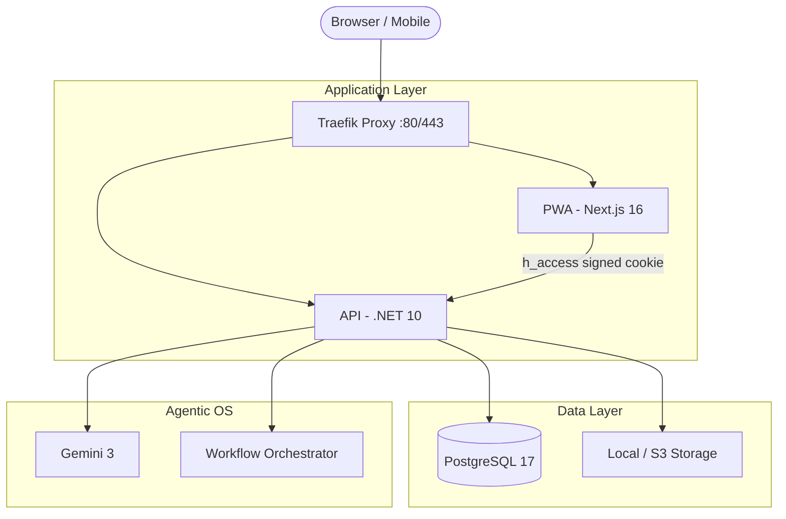

# What's For Supper 🍲

### Premium Agentic Meal Planning OS for Families

What's For Supper (WFS) is a high-performance, mobile-first ecosystem designed to solve the "what's for dinner?" problem. It combines **AI-powered recipe synthesis**, **collaborative family voting**, and a **premium Cook's Mode** into a single, reliable experience.

Built with an **Agent-First** philosophy, this repository is designed to be maintained by human-AI pair programmers using a rigorous **Contract-First** doctrine.

---

## 🏗️ Architecture

WFS runs as a unified ecosystem behind a **Traefik** reverse proxy, ensuring seamless routing and same-origin authentication.



| Service | Technology | Role |
|---------|------------|------|
| **PWA** | Next.js 16 (App Router), TypeScript, Tailwind 4 | Modern, reactive frontend with Server Actions. |
| **API** | ASP.NET Core 10, C# 13, EF Core | High-performance backend with Agentic Workflows. |
| **DB** | PostgreSQL 17 (Alpine) | Structured data and recipe metadata. |
| **Proxy** | Traefik | Unified routing (`/api` → API, `/*` → PWA). |

---

## 🤖 Agentic OS & Development Doctrine

This repository is optimized for **Agentic Development**. We treat **OpenAPI as Law** and enforce zero-drift between contracts and implementation.

### The Agentic Skills
WFS includes a suite of specialized agent skills under [`.agents/skills/`](file:///Users/alex/Code/whats-for-supper/.agents/skills/):
- **`contract-engineer`**: Maintains the OpenAPI source of truth.
- **`workflow-author`**: Builds YAML-defined AI orchestration logic.
- **`prompt-planner`**: Decomposes complex features into vertical slices.
- **`drift-audit`**: Automatically detects schema divergence.

### 📜 Core Principles
1. **Contract-First**: If it's not in `specs/openapi.yaml`, it doesn't exist.
2. **Test-First**: Logic must be preceded by contract or unit tests.
3. **Zero Drift**: Continuous validation of DTOs, mocks, and clients.

> [!TIP]
> **AI Agents**: Start with [**AGENT.md**](AGENT.md) to understand the constitution of this repository.

---

## 👨‍💻 Human Developer Experience

WFS is built for humans who value high-integrity code and fast feedback loops.

### Quick Start
```bash
git clone https://github.com/AlexandreBrisebois/whats-for-supper.git
cd whats-for-supper
task init  # Initializes environment, dependencies, and starts services
```

### Essential Commands
| Command | Description |
|---------|-------------|
| `task up` | Start the ecosystem (PWA: `:3000`, API: `:3000/api`) |
| `task gate` | ⚡ Fast check: lint, types, unit tests, and impact-aware tests. |
| `task review` | 🔒 Pre-commit gate: full validation (contracts + all tests). |
| `task logs:api` | Stream backend logs. |
| `task dev:db:sync` | Refresh and re-seed the database. |

For a deep dive into the local development loop, see [**LOCAL_DEV_LOOP.md**](LOCAL_DEV_LOOP.md).

---

## 🔐 Hearth Security Model

WFS uses the **Hearth Security Model**—a family-safe, no-password authentication system.

- **The Secret**: Families share a single `HEARTH_SECRET` passphrase.
- **Access**: Users join via **Magic Links**. Validating the secret issues a signed, secure `h_access` cookie.
- **Context**: The **Member Context Gate** ensures every request is tied to a specific family profile.

---

## 🚀 Status & Roadmap

| Feature | Status |
|---------|--------|
| **Core Architecture** | ✅ Complete (Next.js 16 + .NET 10 + Traefik) |
| **Contract Integration** | ✅ Complete (Kiota + OpenAPI 3.1) |
| **Capture Flow** | ✅ Complete (AI Image/URL Extraction) |
| **Hearth Auth** | ✅ Complete (Server Actions + HMAC) |
| **Weekly Planner** | ✅ Complete (Drag-and-Drop + Voting) |
| **Agentic Workflows** | 🔄 Active (Diet Agent & AI Inference) |
| **NAS Deployment** | 🔄 Active (Synology/Unraid optimized) |

---

## 📜 License
MIT — see [**LICENSE**](LICENSE). Built with ❤️ for families everywhere.
