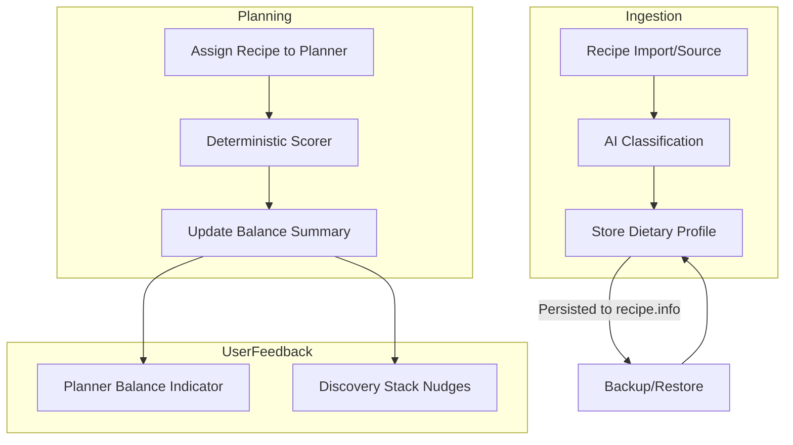

# Recipe Dietary Categorization

"What's For Supper" helps you plan balanced meals for your family using the 2019 Canada's Food Guide (CFG) as a foundation. This document explains how the system classifies recipes and helps you maintain a balanced weekly menu.

## 1. What gets classified and when

Every recipe in your library is classified automatically the first time it enters the system—whether you import it from a URL, create it via AI synthesis, or upload a photo.

*   **Once per recipe:** Classification happens exactly once. The result is cached permanently on your device (in the database and the `recipe.info` files).
*   **Background process:** Classification happens in the background. You can keep using the app while the system works on your new recipe.
*   **Re-classification:** A recipe is only re-classified if you explicitly choose to regenerate its description or if you re-import it.

## 2. Canada's Food Guide food groups

We use the 2019 Canada's Food Guide to help you visualize your plate. The app identifies which of the three core food groups are represented in each recipe:

*   **Vegetables and Fruits:** The foundation of a healthy diet. Most recipes will ideally have this as a primary or secondary component.
*   **Protein Foods:** Includes meat, poultry, and fish, but also plant-based options like lentils, beans, tofu, and nuts.
*   **Whole Grain Foods:** Grains that include all parts of the kernel. The app specifically looks for clear indicators like "brown rice," "whole wheat," or "quinoa" to give credit for this group.

A **"balanced week"** in "What's For Supper" means that across your 7 planned dinners, you have a diverse mix that meets specific frequency targets for these groups, ensuring you aren't over-relying on any single category (like having red meat every night).

## 3. The five balance targets

To help you stay on track, the app monitors five specific targets for your weekly dinner plan:

1.  **Protein Variety:** Include protein-rich meals (meat, fish, legumes, eggs) at least 3 times a week.
2.  **Veggie Boost:** Include vegetables or fruit in at least 4 of your 7 dinners.
3.  **Whole Grains:** Use whole grains (like brown rice or oats) in at least 2 dinners.
4.  **Plant-Based Power:** Include at least one purely plant-based protein dinner (beans, lentils, tofu) each week.
5.  **Avoid Repetition:** Try not to have more than 3 meals from the same primary food group in a row.

The **Balance Indicator** on your planner will turn green when all these targets are met. If they aren't, it will offer a friendly nudge on what to add next.

## 4. How the AI is used

We use Artificial Intelligence (specifically Gemini Flash) to perform the **initial classification** of a recipe.

*   **Logic vs. AI:** The AI is only used to understand the *identity* of the recipe (e.g., "This is an Italian Poultry dish with Whole Grains").
*   **No AI in Scoring:** The actual "Balance Score" and the recommendations you see on the planner are calculated by **pure code** using deterministic math. The AI does not decide if your week is balanced; the app's internal logic does, based on the CFG targets.
*   **Efficiency:** Classification is very lightweight (approx. 300-500 tokens per recipe) and happens only once per recipe, ever.

## 5. How your data is protected

Privacy and efficiency are core to our design:

*   **Minimal Data Sharing:** When classifying a recipe, we only send the recipe name, a short snippet of the description, and the list of ingredient names to the AI.
*   **No Personal Data:** Your name, family members' names, location, and planning habits are **never** sent to the AI.
*   **Local Persistence:** Once a recipe is classified, the result is stored in your local `recipe.info` files. This means that even if you reset the app or move your data to a new device, the classification is restored without ever needing to call the AI again.

## 6. Where nutrition data comes from

The app displays "High in Sodium," "High in Saturated Fat," or "High in Sugars" flags when that data is available.

*   **Source Sites:** This data is read directly from the nutrition facts published by the source website (if available in their structured data).
*   **No Guessing:** The app **never** guesses or infers nutrition values. If a recipe doesn't have nutrition data from its source (common for home blogs or synthesized recipes), these flags will simply be absent.
*   **Phase 2:** Future updates will integrate the Canadian Nutrient File (CNF) to provide more comprehensive estimates for recipes that lack published nutrition facts.

## 7. Data Flow Diagram

The following diagram shows how a recipe moves from import to your weekly balance indicator:

