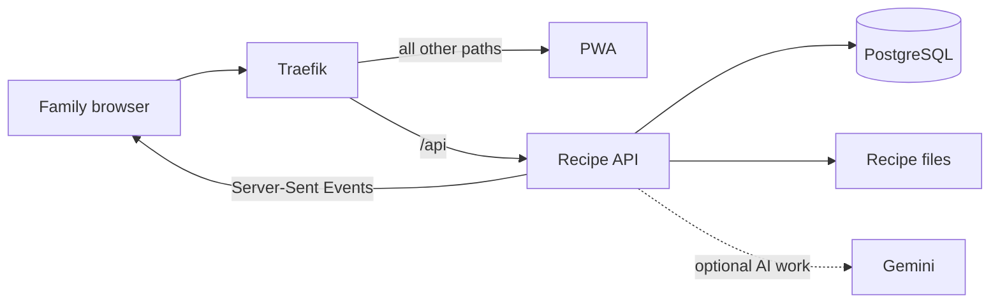

# Architecture

This is a concise technical reference for contributors and operators. It describes the current application shape, not a public installation path. For the release boundary, see the [Synology release plan](../.kiro/specs/01-public-synology-release/requirements.md).

## Application shape

- The PWA is the family-facing web application.
- The Recipe API owns household data, recipe workflows, planning, and grocery state.
- PostgreSQL stores relational data; recipe files are stored on persistent local storage.
- Traefik gives the browser one origin: `/api` reaches the API and other paths reach the PWA.
- Gemini supports recipe-processing work when it is configured; core household data remains local.

## Shared state and access

Planning, grocery, and voting changes are shared through Server-Sent Events, so household devices receive updates without manual refreshes. A household uses a shared `HEARTH_SECRET`; the app also records the active family member in cookies for requests and the event stream.

## Where to read next

- [Family guide](user-guide.md) for the household experience.
- [Week lifecycle](flows/data-flows/week-lifecycle.md) for the live planning state machine.
- [Recipe search and recovery flow](flows/user-flows/recipe-search-and-library-recovery.md) for detailed library behavior.
- [Local development guide](../LOCAL_DEV_LOOP.md) for contributor setup.
