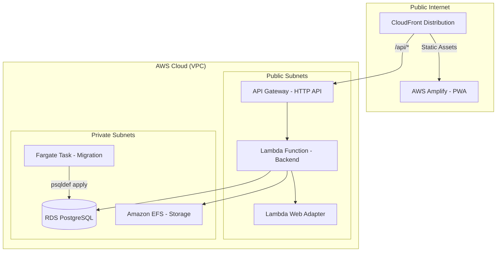
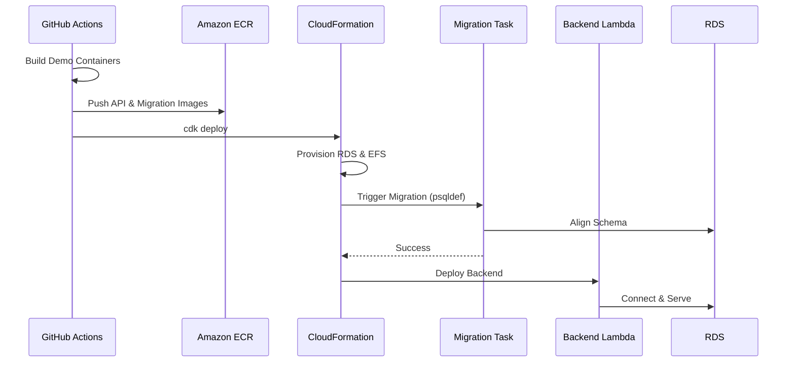

# AWS Serverless Deployment Guide

This guide describes the architecture, configuration, and deployment lifecycle for the "What's For Supper" application on Amazon Web Services (AWS).

## 🏗️ Architecture Overview

The application is built on a "Serverless-First" architecture designed for high availability, automatic scaling, and zero-maintenance overhead.

### Key Pillars
-   **Performance**: AWS Lambda with Web Adapter provides sub-second response times for typical API requests.
-   **Scalability**: All components (Lambda, RDS Aurora/Burstable, EFS) scale automatically based on demand.
*   **Security**: Sensitive data is stored in GitHub Secrets and injected only at deployment time. All database traffic is isolated within private subnets.

---

## 🚀 Deployment Flow (Path to Green)

The deployment is orchestrated via GitHub Actions and AWS CDK.

---

## 🛠️ Prerequisites

Before deploying, ensure the following **GitHub Secrets** are configured in your repository:

| Secret Name | Description |
| :--- | :--- |
| `AWS_ACCESS_KEY_ID` | AWS Credentials (or use OIDC) |
| `AWS_SECRET_ACCESS_KEY` | AWS Credentials (or use OIDC) |
| `GEMINI_API_KEY` | Google AI API Key |
| `HEARTH_SECRET` | Internal API Protection Key |
| `ELEVATED_ACTIONS_PIN` | Admin/Purge PIN |

---

## 📦 Environment Variables

The following variables are automatically mapped from your **NAS** environment to **AWS**:

### Backend (Lambda)
| Variable | AWS Source | NAS Parity |
| :--- | :--- | :--- |
| `DATA_ROOT` | `/mnt/data` (EFS) | `/data` |
| `POSTGRES_CONNECTION_STRING` | Calculated from RDS | Matches Postgres service |
| `DEMO_MODE` | `true` (CDK Default) | `false` |
| `APP_VERSION` | Git Tag (e.g., v1.2.3) | `TAG` |

### Frontend (Amplify)
| Variable | Value |
| :--- | :--- |
| `NEXT_PUBLIC_API_BASE_URL` | `/` (CloudFront Routed) |
| `NEXT_PUBLIC_COOKIE_DOMAIN` | `.srvrlss.dev` |

---

## 🔧 Troubleshooting

### Database Migrations
If the deployment fails during the `WfsMigrator` step:
1.  Check the **Amazon ECS** console under the `WfsMigrationCluster`.
2.  View the "Stopped" tasks and check the logs in **CloudWatch**.
3.  Common issues include incorrect `POSTGRES_USER` or `schema.sql` syntax errors.

### Lambda Cold Starts
If the first request to the API is slow, this is a standard Lambda cold start. For the "Demo" environment, we prioritize cost-efficiency over pre-warmed instances.

---

## ✅ Demo Deployment Verification Checklist

Run this checklist immediately after each Demo deployment:

1. Verify `/api/health` reports `demoMode: true`.
2. Verify `/api/management/status` reports:
   - `demoSnapshotReady: true`
   - `demoSnapshotMissing: false`
3. Verify `/api/management/status` shows a valid demo restore schedule:
   - `demoRestoreSeederHealthy: true`
   - `demoRestoreSeederErrorCode` is empty/null
4. Verify PWA Demo UX behavior from `/recipes`:
   - Clicking `demo-agent-search-toggle` shows `demo-ai-notice`
   - Clicking `demo-photo-search-toggle` shows `demo-photo-notice`
   - Agent input (`agent-search-input`) and photo capture popup (`inventory-capture-popup`) do not open in demo mode

If any check fails, treat the deployment as non-green and stop promotion.

---

*Last Updated: 2026-05-25*
