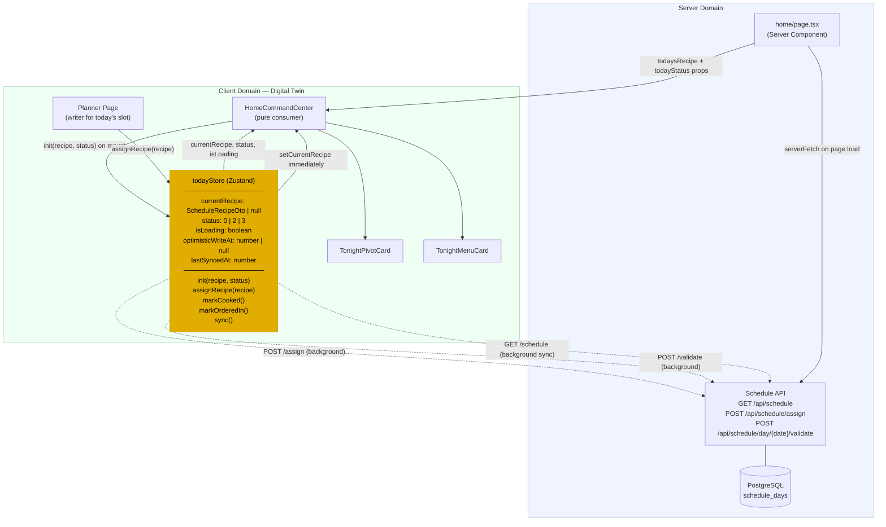
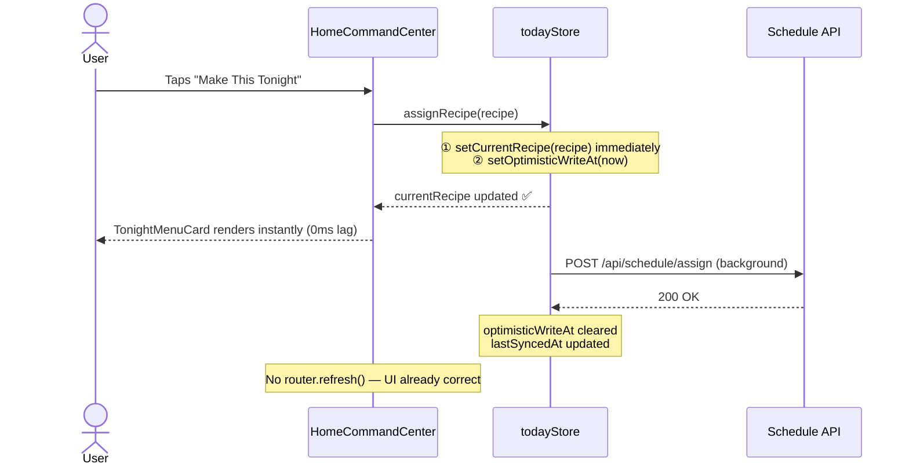
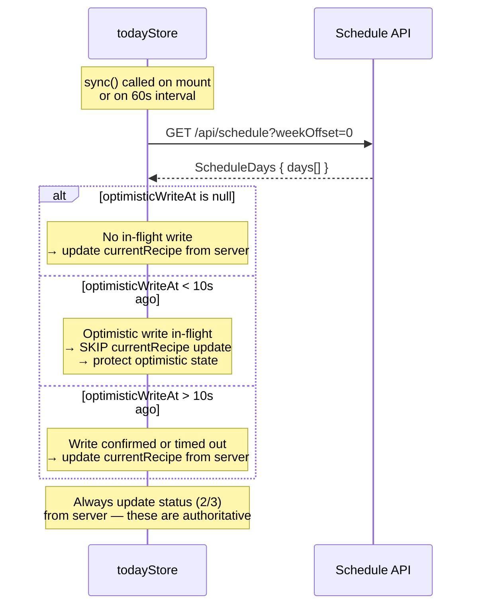
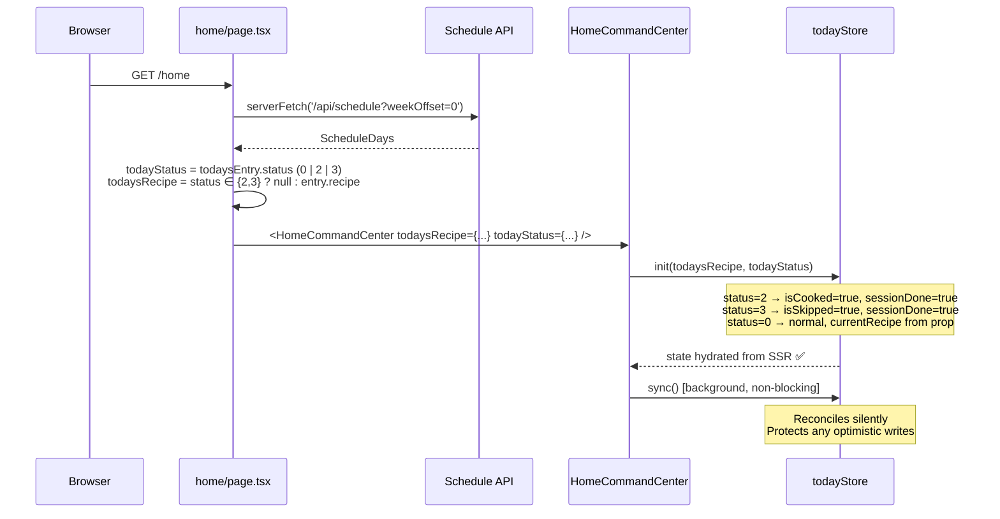

# Client Domain Model — Digital Twin Architecture

The `todayStore` is a Zustand store that acts as a **digital twin** of the server's "today" schedule day. It is the single source of truth for both `HomeCommandCenter` and the planner page. It accepts optimistic writes immediately (zero UI lag) and reconciles with the server silently in the background.

This is not a service worker, not an offline cache, and not related to `pwa-caching`. It is a Zustand store with optimistic-first mutations and background reconciliation.

Related spec: [`.kiro/specs/home-command-center-hardening/requirements.md`](../../.kiro/specs/home-command-center-hardening/requirements.md)

---

## Architecture Overview

---

## Optimistic Write Flow

---

## Background Sync Flow

---

## State Initialisation from SSR

---

## Client vs Server Domain Boundary

| Concern | Owner | Notes |
|---------|-------|-------|
| Today's recipe | `todayStore` (client) | Optimistic-first; server is the authority after sync |
| Today's status (0/2/3) | `todayStore` (client) | Seeded from SSR; server is always authoritative for 2/3 |
| GOTO recipe readiness | `HomeCommandCenter` (local state) | Polled from `GET /api/recipes/{id}/status`; not in todayStore |
| Week schedule (planner) | Planner page (local state) | todayStore only owns today's slot |
| Family settings | `familyStore` (Zustand) | Unchanged |
| Voting / lock state | `plannerStore` (Zustand) | Unchanged |
| SSR cache | Next.js / `serverFetch` | Initial page load only; not in critical path after mount |

---

## What Changed vs Previous Architecture

| Before | After |
|--------|-------|
| `HomeCommandCenter` had 6+ `useState` for today's state | `HomeCommandCenter` reads from `todayStore` |
| `router.refresh()` in every action handler (300–800ms lag) | `router.refresh()` removed from critical path |
| `syncRecipe()` could override optimistic state (Bug 1) | `sync()` protects writes < 10s old |
| Planner and home page had no shared state | Both read/write `todayStore` |
| `isSkipped`/`sessionDone` reset on reload (Bug 5) | `todayStatus` prop seeds store from SSR |
| `isScheduleRecipe()` passed `{ id: null }` (Bug 2) | Guard requires non-empty string `id` |
