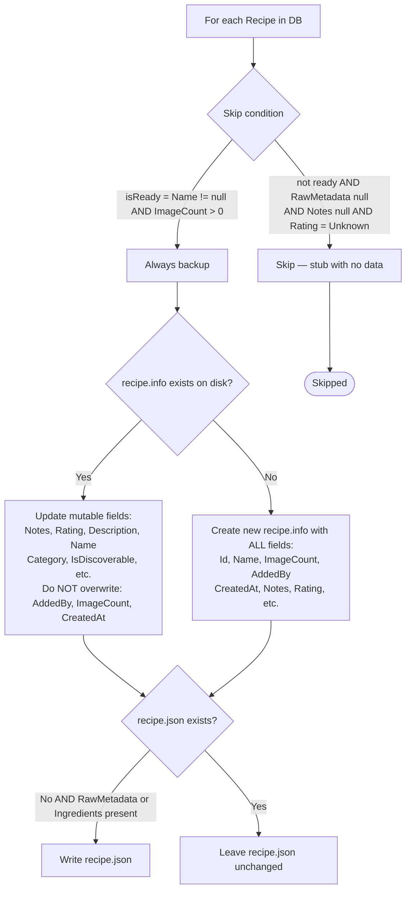
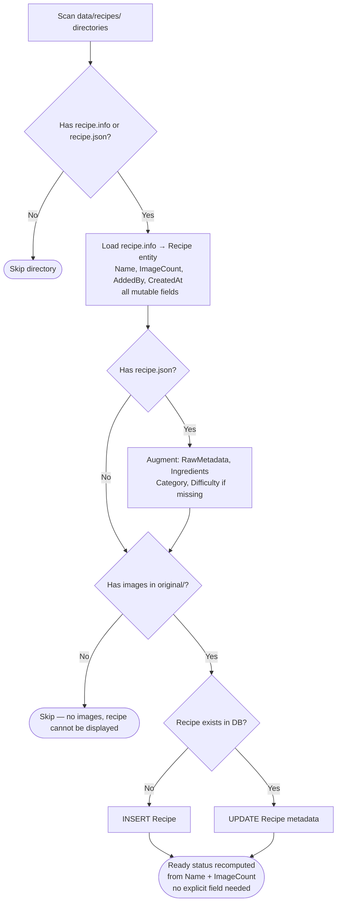

# Backup & Restore — Ready Status Data Flow

How recipe ready status survives a backup/restore cycle.

## Key design decision

Ready status is **not stored as an explicit field**. It is a computed property:

```
ready = Name != null/empty  AND  ImageCount > 0
```

`recipe.info` stores both `Name` and `ImageCount`, so ready status is **fully reconstructable from disk** after a restore.

## Backup flow

`POST /api/management/backup` → `ManagementService.BackupAsync()`



## Restore flow

`POST /api/management/seed` → `ManagementService.RestoreAsync()`



## Disaster recovery scope

`POST /api/management/disaster-recovery` → `ManagementService.DisasterRecoveryAsync()`

**Scope: family-member reconciliation only.** This endpoint:
- Scans `recipe.info` / `recipe.json` files for `addedBy` GUIDs
- Creates placeholder `FamilyMember` rows for any GUIDs not in the DB
- Does **not** restore recipe rows or modify ready status

Full recipe restoration (including ready status) is handled exclusively by `RestoreAsync()`.

## What recipe.info stores

| Field | Immutable? | Notes |
|-------|-----------|-------|
| `id` | Yes | Set at creation |
| `addedBy` | Yes | Set at creation from `X-Family-Member-Id` |
| `createdAt` | Yes | Set at creation |
| `imageCount` | Yes (on disk) | Mutable in DB via RecipeReady processor |
| `name` | No | Updated by backup |
| `description` | No | Updated by backup |
| `notes` | No | Updated by backup |
| `rating` | No | Updated by backup |
| `category` | No | Updated by backup |
| `isDiscoverable` | No | Updated by backup |
