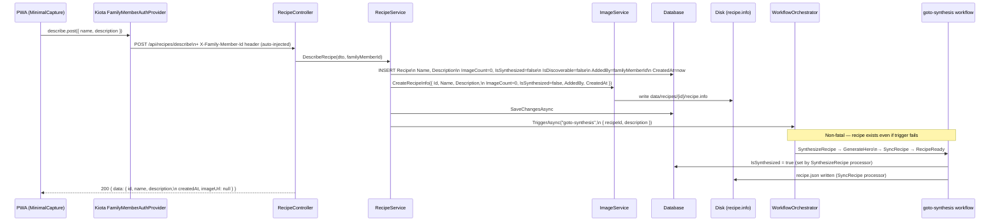

# Describe Path — Data Flow

How a recipe created via text description (`POST /api/recipes/describe`) flows through the system to become ready.

## Sequence

## Key facts

| Field | Set when | Value |
|-------|----------|-------|
| `AddedBy` | At creation | From `X-Family-Member-Id` header (nullable) |
| `CreatedAt` | At creation | `DateTimeOffset.UtcNow` |
| `ImageCount` | At creation | `0` — stays `0` for the entire describe path |
| `IsSynthesized` | After synthesis | `false` → `true` once `RecipeAgent.DoSynthesizeRecipeAsync` succeeds |
| `recipe.info` | At creation | Written immediately with all identity fields |
| `recipe.json` | After synthesis | Written by SyncRecipe processor |
| Status | After RecipeReady runs | `pending` → `ready` (gated on `IsSynthesized`, not `ImageCount`) |

## Header injection

The `X-Family-Member-Id` header is injected automatically by `FamilyMemberAuthProvider` in `pwa/src/lib/api/api-client.ts`. No manual header management is needed in components.
