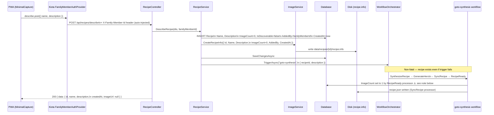

# Describe Path — Data Flow

How a recipe created via text description (`POST /api/recipes/describe`) flows through the system to become ready.

## Sequence

## Key facts

| Field | Set when | Value |
|-------|----------|-------|
| `AddedBy` | At creation | From `X-Family-Member-Id` header (nullable) |
| `CreatedAt` | At creation | `DateTimeOffset.UtcNow` |
| `ImageCount` | At creation → set to 1 by RecipeReady ⚠️ | `0` → `1` after workflow (see note) |
| `recipe.info` | At creation | Written immediately with all identity fields |
| `recipe.json` | After synthesis | Written by SyncRecipe processor |
| Status | After RecipeReady runs | `pending` → `ready` |

## Header injection

The `X-Family-Member-Id` header is injected automatically by `FamilyMemberAuthProvider` in `pwa/src/lib/api/api-client.ts`. No manual header management is needed in components.

## ⚠️ Known issue: RecipeReadyProcessor artificially inflates ImageCount

`RecipeReadyProcessor` (`api/src/RecipeApi/Services/Processors/RecipeReadyProcessor.cs:49–54`) sets `ImageCount = 1` when it is 0, as a workaround to satisfy the computed ready rule (`ImageCount > 0`).

**This is incorrect domain behaviour.** `ImageCount` is supposed to reflect the number of original images on disk, not be used as a readiness flag. A describe-path recipe has zero real images — its hero image (generated by `GenerateHero`) is not an "original" image uploaded by the user.

**Impact:** After a backup/restore cycle, a describe-path recipe will appear to have 1 image in `recipe.info`, even though no original image exists in `data/recipes/{id}/original/`. The restore logic skips recipes with no images in `original/`, so this inflated count may cause a mismatch.

**This should be addressed in a separate task** — the ready state for describe-path recipes should be gated on a different condition (e.g. a dedicated `isSynthesized` flag or a non-null `heroImagePath`), not on `ImageCount`.
