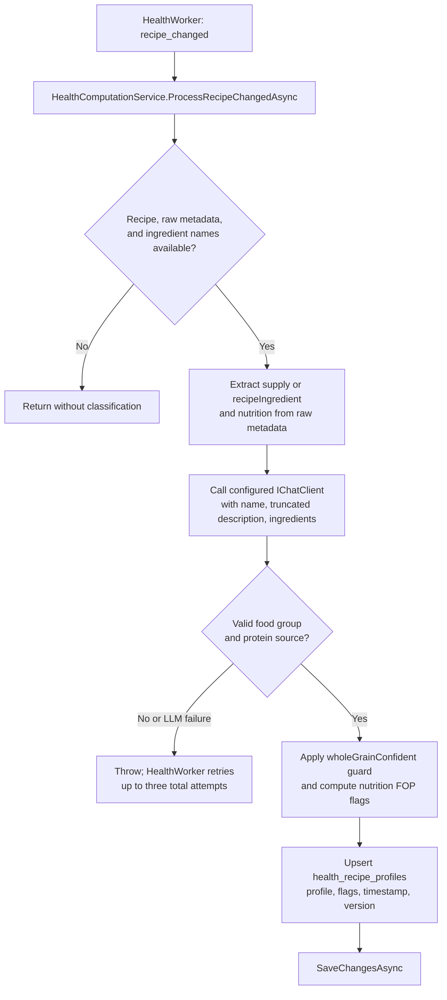
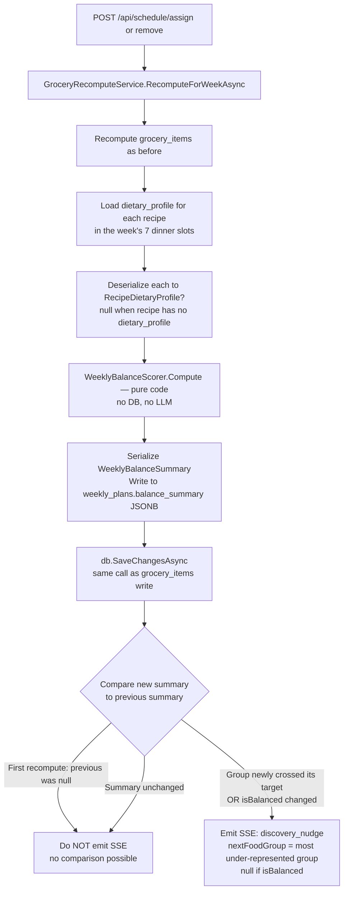

# Data Flow: Dietary Classification & Weekly Balance Scoring

**Feature:** Recipe Dietary Categorization (Phase 1 — Canada's Food Guide)
**Related docs:** [`recipe-readiness.md`](./recipe-readiness.md), [`week-lifecycle.md`](./week-lifecycle.md), [`backup-restore-readiness.md`](./backup-restore-readiness.md)
**Technical spec:** [`api/docs/DIETARY_CATEGORIZATION.md`](../../../api/docs/DIETARY_CATEGORIZATION.md)

---

## Overview

Dietary classification is event-driven. `HealthWorker` consumes pending `health_events` and delegates `recipe_changed` and `week_changed` events to [`HealthComputationService`](../../../api/src/RecipeApi/Services/HealthComputationService.cs). Recipe classification writes `health_recipe_profiles`; weekly scoring writes `health_week_summaries`.

**LLM boundary:** Each recipe computation with usable ingredients calls the configured `IChatClient`. There is no existing-profile cache guard in this service: subsequent events and retries can classify again. Balance scoring and nutrition-derived FOP flags use deterministic code.

---

## Classification Data Flow



`ProcessWeekChangedAsync` loads the week's seven dinner slots and their `health_recipe_profiles`, calls `WeeklyBalanceScorer.Compute`, and upserts the balance summary, FOP summary, and recomputation timestamp in `health_week_summaries`. These health tables are separate from the legacy `recipes.dietary_profile` and `weekly_plans.balance_summary` fields; this service does not update those legacy fields or write `recipe.info`.

---

## Balance Scoring Data Flow

### Legacy grocery balance writes

[`GroceryRecomputeService`](../../../api/src/RecipeApi/Services/GroceryRecomputeService.cs) retains legacy balance writes alongside the health service. `RecomputeForWeekAsync` is called on every recipe **assign** or **remove**. At the end of that method, after writing `grocery_items`, balance scoring runs in the same `SaveChangesAsync` call:



### WeeklyBalanceScorer counting rules

| Field | Counts when | Target |
|-------|------------|--------|
| `proteinDays` | `ProteinFoods` is primary OR secondary | ≥ 3 |
| `veggieDays` | `VegetablesAndFruits` is primary OR secondary | ≥ 4 |
| `grainDays` | `WholeGrains` is primary OR secondary **AND** `wholeGrainConfident = true` | ≥ 2 |
| `plantProteinDays` | `proteinSource` is `PlantProtein` or `Mixed` | ≥ 1 |
| `redMeatDays` | `proteinSource` is `RedMeat` | — (informational) |
| `maxConsecutiveSame` | Longest run of identical `primaryFoodGroup` values; nulls break the run | ≤ 3 |

`isBalanced = true` when **all five** targets are met. `recommendations` is empty when balanced.

### Null profile handling

A recipe with `dietary_profile = null` (not yet classified, or classification failed) is treated as `primaryFoodGroup: "Mixed"` and contributes **no credits** to any specific group. It does not break the scorer — it is counted as a day with an unclassified meal.

---

## API Response: `GET /api/schedule`

`ScheduleService.GetScheduleAsync` deserializes `weekly_plans.balance_summary` and includes it in `ScheduleDays` as the 7th field:

```
ScheduleDays {
  weekOffset, locked, status, days, groceryState, groceryItems,
  balanceSummary: WeeklyBalanceSummary | null   ← null when no recipes assigned yet
}
```

The PWA `weekStore` stores `balanceSummary` and passes it to the `<BalanceIndicator>` component on the planner page.

---

## FOP (Front-of-Package) Flags

FOP flags (`highInSodium`, `highInSaturatedFat`, `highInSugars`) are computed **deterministically** from schema.org `NutritionInformation` published by the recipe's source URL — they are **never** inferred or guessed by the LLM.

### Thresholds (Health Canada, 15% Daily Value per serving)

| Nutrient | Threshold |
|----------|-----------|
| Saturated fat | > 4.0 g |
| Sugars | > 15.0 g |
| Sodium | > 345.0 mg |

**`fopFlags = null` is the common case.** Most recipes (home blogs, synthesized, photo imports) have no schema.org nutrition markup. The health service leaves flags null when source nutrition is absent.

---

## Discovery Filter: `GET /api/discovery?cuisine=Italian`

`DiscoveryService.GetRecipesForDiscoveryAsync` accepts an optional `cuisine` parameter. When present, it applies a PostgreSQL JSONB `@>` containment query against `vw_discovery_recipes.dietary_profile`:

```sql
WHERE dietary_profile @> '{"cuisineType": "Italian"}'
```

The view includes `r.dietary_profile` from the `recipes` table. `DiscoveryRecipe.DietaryProfile` maps this column. The `cuisine` filter runs server-side; the client does not need to do any post-filtering.

> **Note:** The JSONB filter is skipped when using the in-memory test provider (EF Core InMemory does not support `JsonContains`). Integration tests that verify filtering run against the real PostgreSQL instance.
