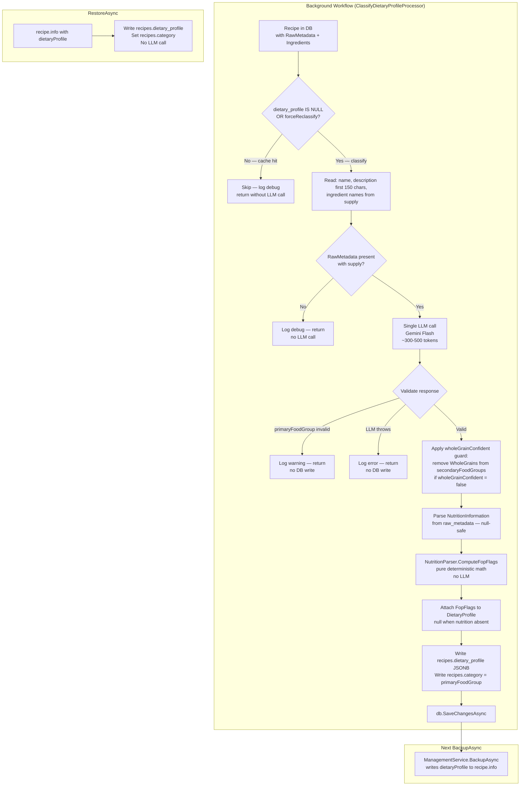
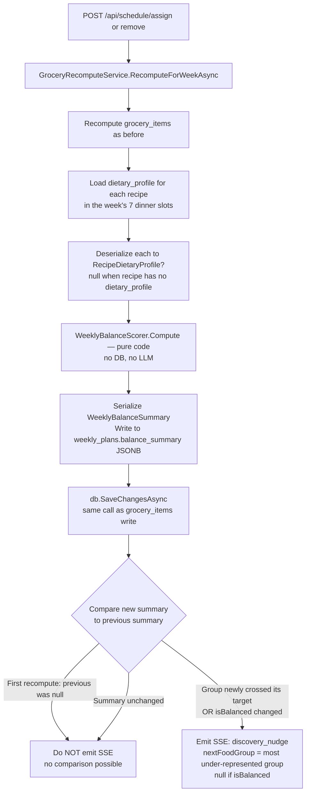

# Data Flow: Dietary Classification & Weekly Balance Scoring

**Feature:** Recipe Dietary Categorization (Phase 1 — Canada's Food Guide)
**Related docs:** [`recipe-readiness.md`](./recipe-readiness.md), [`week-lifecycle.md`](./week-lifecycle.md), [`backup-restore-readiness.md`](./backup-restore-readiness.md)
**Technical spec:** [`api/docs/DIETARY_CATEGORIZATION.md`](../../../api/docs/DIETARY_CATEGORIZATION.md)

---

## Overview

Dietary classification runs **once per recipe** at import time via a background workflow processor. The result is cached in the database and on disk (`recipe.info`). Balance scoring runs **on every assign/remove** — in-memory, deterministic, no LLM involved.

**LLM boundary:** The LLM is called exactly once per recipe to produce the `DietaryProfile`. All downstream logic — balance scoring, nudging, indicator rendering — is pure deterministic code.

---

## Classification Data Flow

### Full path: import → dietary_profile → recipe.info



### Token cost model

| Component | Tokens | Frequency |
|-----------|--------|-----------|
| System prompt | ~300 (cache-eligible) | Once per cache TTL |
| Recipe payload (name + description + ingredients) | ~150–400 | **Once per recipe, ever** |
| LLM response | ~80–120 | Once per recipe, ever |
| **Total per recipe** | **~230–520** | **Once. Cached forever.** |
| Balance scoring | **0** | Every assign/remove |

At Gemini Flash pricing: classifying 1,000 recipes ≈ **$0.04**.

---

## Balance Scoring Data Flow

### When it runs

`GroceryRecomputeService.RecomputeForWeekAsync` is called on every recipe **assign** or **remove**. At the end of that method, after writing `grocery_items`, balance scoring runs in the same `SaveChangesAsync` call:



### WeeklyBalanceScorer counting rules

| Field | Counts when | Target |
|-------|------------|--------|
| `proteinDays` | `ProteinFoods` is primary OR secondary | ≥ 3 |
| `veggieDays` | `VegetablesAndFruits` is primary OR secondary | ≥ 4 |
| `grainDays` | `WholeGrains` is primary OR secondary **AND** `wholeGrainConfident = true` | ≥ 2 |
| `plantProteinDays` | `proteinSource` is `PlantProtein` or `Mixed` | ≥ 1 |
| `redMeatDays` | `proteinSource` is `RedMeat` | — (informational) |
| `maxConsecutiveSame` | Longest run of identical `primaryFoodGroup` values; nulls break the run | ≤ 3 |

`isBalanced = true` when **all five** targets are met. `recommendations` is empty when balanced.

### Null profile handling

A recipe with `dietary_profile = null` (not yet classified, or classification failed) is treated as `primaryFoodGroup: "Mixed"` and contributes **no credits** to any specific group. It does not break the scorer — it is counted as a day with an unclassified meal.

---

## API Response: `GET /api/schedule`

`ScheduleService.GetScheduleAsync` deserializes `weekly_plans.balance_summary` and includes it in `ScheduleDays` as the 7th field:

```
ScheduleDays {
  weekOffset, locked, status, days, groceryState, groceryItems,
  balanceSummary: WeeklyBalanceSummary | null   ← null when no recipes assigned yet
}
```

The PWA `weekStore` stores `balanceSummary` and passes it to the `<BalanceIndicator>` component on the planner page.

---

## FOP (Front-of-Package) Flags

FOP flags (`highInSodium`, `highInSaturatedFat`, `highInSugars`) are computed **deterministically** from schema.org `NutritionInformation` published by the recipe's source URL — they are **never** inferred or guessed by the LLM.

### Thresholds (Health Canada, 15% Daily Value per serving)

| Nutrient | Threshold |
|----------|-----------|
| Saturated fat | > 4.0 g |
| Sugars | > 15.0 g |
| Sodium | > 345.0 mg |

**`fopFlags = null` is the common case.** Most recipes (home blogs, synthesized, photo imports) have no schema.org nutrition markup. Phase 2 CNF integration will fill these gaps via `forceReclassify`.

---

## Discovery Filter: `GET /api/discovery?cuisine=Italian`

`DiscoveryService.GetRecipesForDiscoveryAsync` accepts an optional `cuisine` parameter. When present, it applies a PostgreSQL JSONB `@>` containment query against `vw_discovery_recipes.dietary_profile`:

```sql
WHERE dietary_profile @> '{"cuisineType": "Italian"}'
```

The view includes `r.dietary_profile` from the `recipes` table. `DiscoveryRecipe.DietaryProfile` maps this column. The `cuisine` filter runs server-side; the client does not need to do any post-filtering.

> **Note:** The JSONB filter is skipped when using the in-memory test provider (EF Core InMemory does not support `JsonContains`). Integration tests that verify filtering run against the real PostgreSQL instance.
