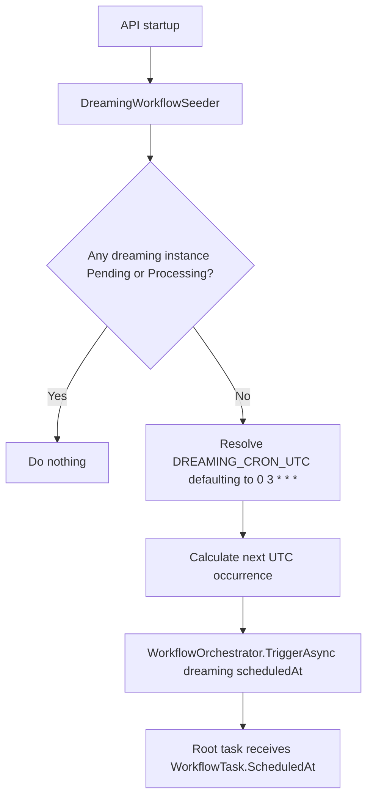
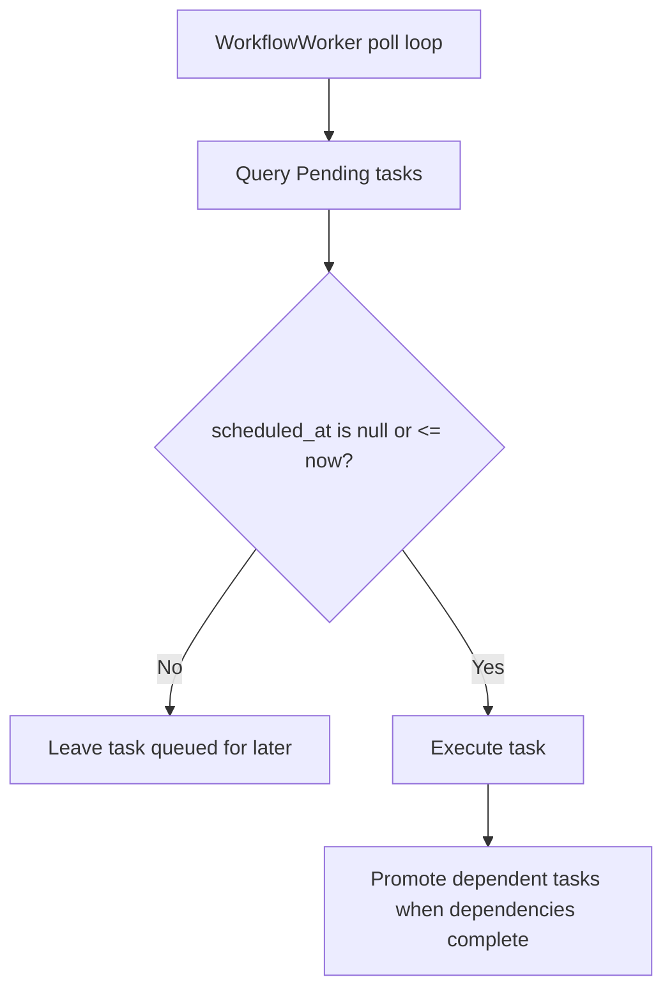
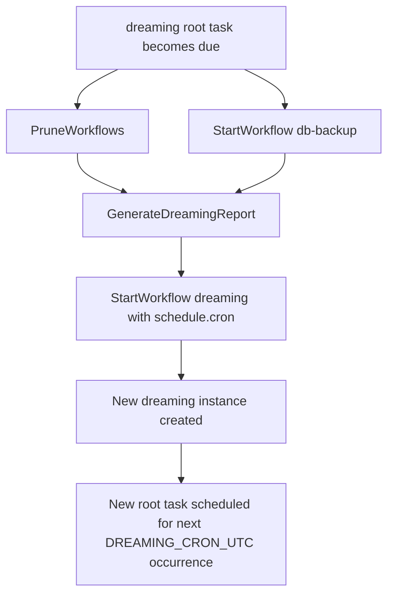

# Dreaming Maintenance Workflow Data Flow

How the recurring Dreaming workflow keeps workflow history lean, flushes backup state to disk, and leaves a human-readable maintenance report.

## Core idea

Dreaming is not a special scheduler outside the workflow system. It is a normal YAML workflow that ends by starting a new `dreaming` workflow instance for the next configured UTC cron occurrence.

The recurring schedule is configured by:

```env
DREAMING_CRON_UTC=0 3 * * *
```

If unset, the default is `0 3 * * *` — every day at 03:00 UTC.

## Startup seed flow

On API startup, the Dreaming seeder ensures the chain exists.



## Scheduled execution flow

The worker already understands delayed task execution through `WorkflowTask.ScheduledAt`.



The workflow instance itself does not need a `scheduled_at` column. Scheduling lives on the root runnable task, matching the existing retry/backoff model.

## Dreaming workflow flow

`api/src/RecipeApi/Workflows/dreaming.yaml`



## Task responsibilities

| Task | Processor | Responsibility |
|------|-----------|----------------|
| `prune` | `PruneWorkflows` | Delete completed/failed workflow instances older than 7 days. |
| `backup` | `StartWorkflow` | Start the existing `db-backup` workflow instead of duplicating backup logic. |
| `report` | `GenerateDreamingReport` | Write `DATA_ROOT/reports/dreaming-yyyy-MM-dd.md`. |
| `reschedule` | `StartWorkflow` | Start a new `dreaming` instance scheduled by `DREAMING_CRON_UTC`. |

## Report output

Reports are written to:

```text
DATA_ROOT/reports/dreaming-yyyy-MM-dd.md
```

Each report includes:

- pruned workflow instance count,
- pruned workflow task count,
- latest `db-backup` status,
- workflows that failed in the last 24 hours,
- workflows that have been pending or processing for more than 1 hour.

## Failure behavior

If `prune`, `backup`, `report`, or `reschedule` fails, normal workflow retry/failure behavior applies.

The most important failure is the final `reschedule` task. If it fails permanently, the recurring chain stops. The last report and workflow telemetry become the human-visible signal that Dreaming needs attention.

## Configuration boundary

`DREAMING_CRON_UTC` is interpreted as UTC only. Local timezone and DST behavior are intentionally out of scope for this version.
