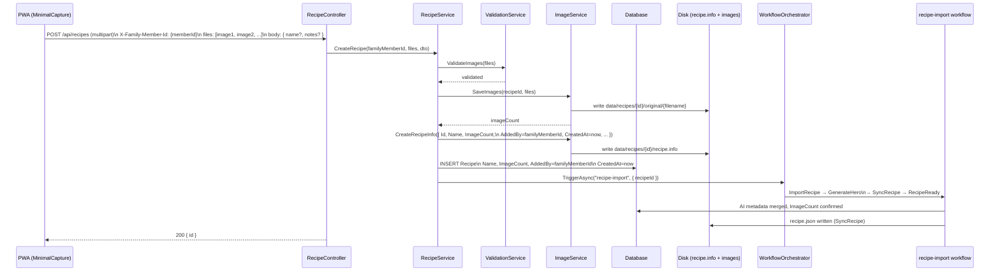

# Photo Upload Path — Data Flow

How a recipe created via photo upload (`POST /api/recipes`) flows through the system to become ready.

## Sequence

## Key contrast with describe path

| Aspect | Photo upload | Describe (text) |
|--------|-------------|-----------------|
| `recipe.info` written | Immediately at upload | Immediately at POST /describe |
| `ImageCount` at creation | `n` (actual image count) | `0` |
| `ImageCount` after workflow | Unchanged (already > 0) | Stays `0` — readiness gated on `IsSynthesized` instead |
| Workflow | `recipe-import` | `goto-synthesis` |
| `recipe.json` | Written by SyncRecipe | Written by SyncRecipe |
| Status path | Already ready if Name set | Pending until RecipeReady runs |
