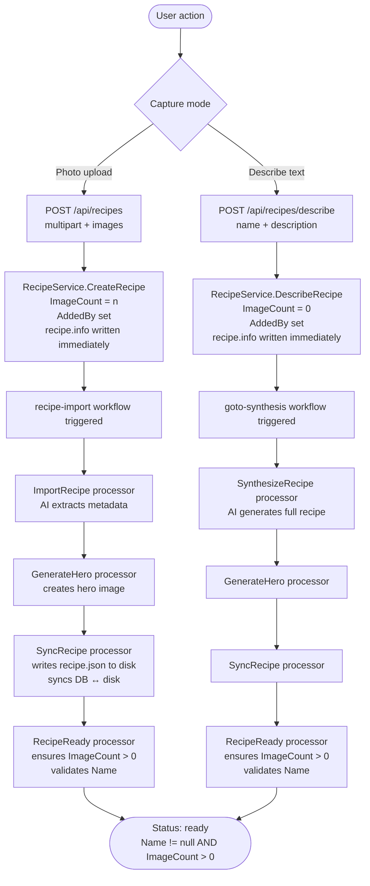

# Recipe Readiness — Data Flow

How a recipe transitions from `pending` to `ready` in the What's For Supper system.

## Computed rule

A recipe is **ready** when:

```
Name != null/empty  AND  ImageCount > 0
```

This is **not stored** in the database. It is computed on every call to `GET /api/recipes/{id}/status` via `RecipeService.GetRecipeStatus()`.

## RecipeReadyProcessor

`api/src/RecipeApi/Services/Processors/RecipeReadyProcessor.cs`

Invoked as the final step in both synthesis workflows:

- `goto-synthesis` workflow (describe path)
- `recipe-import` workflow (photo-upload path)

```
RecipeReadyProcessor.ExecuteAsync(task)
  ├── If ImageCount == 0 → set ImageCount = 1, save  ⚠️ see note below
  └── If Name is null/empty → log warning (recipe stays "pending")
```

> ⚠️ **Known issue:** Setting `ImageCount = 1` when it is 0 is incorrect for the describe path. `ImageCount` should reflect the number of original images uploaded by the user, not serve as a readiness flag. A describe-path recipe has no original images; its hero is AI-generated. This workaround should be replaced with a dedicated readiness signal. See [describe-path.md](describe-path.md) for full context.

## The two paths to ready



## Status query

`GET /api/recipes/{id}/status` → `RecipeService.GetRecipeStatus()`

```csharp
var status = !string.IsNullOrWhiteSpace(recipe.Name) && recipe.ImageCount > 0
    ? "ready"
    : "pending";
```

Returns `RecipeStatusDto { Id, Status, ImageCount }`.
