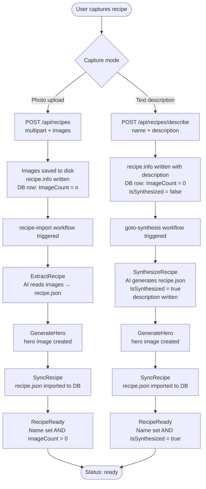

# Recipe Readiness — Data Flow

How a recipe transitions from the moment of capture (image upload or text description) all the way to `ready`.

## Domain definition

A recipe is **ready** when the full capture-to-import pipeline has completed for its path:

**Photo-upload path:**
1. User uploads images → stored in `data/recipes/{id}/original/`, `recipe.info` written, DB row inserted (`ImageCount > 0`)
2. `ExtractRecipe` — AI reads the images and produces `recipe.json`
3. `GenerateHero` — hero image created
4. `SyncRecipe` — `recipe.json` imported to DB (name, ingredients, metadata)
5. `RecipeReady` — validates Name is set and `ImageCount > 0` → **ready**

**Describe path:**
1. User submits name + description → `recipe.info` written with description, DB row inserted (`ImageCount = 0`, `IsSynthesized = false`)
2. `SynthesizeRecipe` — AI generates full `recipe.json` from description; sets `IsSynthesized = true`; description generated
3. `GenerateHero` — hero image created
4. `SyncRecipe` — `recipe.json` imported to DB (name, ingredients, metadata)
5. `RecipeReady` — validates Name is set and `IsSynthesized = true` → **ready**

## Computed rule

The ready state is computed on every call to `GET /api/recipes/{id}/status`. It is **not stored** in the database.

```
Photo-upload:  Name != null/empty  AND  ImageCount > 0
Describe:      Name != null/empty  AND  IsSynthesized = true
```

## Full flow — capture to ready



## RecipeReadyProcessor

`api/src/RecipeApi/Services/Processors/RecipeReadyProcessor.cs`

The final step in both workflows. It validates the upstream work is complete and logs a warning if not. It does **not** mutate any fields — `ImageCount` is set at upload time, `IsSynthesized` is set by `RecipeAgent.DoSynthesizeRecipeAsync`.

## Status query

`GET /api/recipes/{id}/status` → `RecipeService.GetRecipeStatus()`

```csharp
var isReady = (!string.IsNullOrWhiteSpace(recipe.Name) && recipe.ImageCount > 0)
           || (!string.IsNullOrWhiteSpace(recipe.Name) && recipe.IsSynthesized);
var status = isReady ? "ready" : "pending";
```

Returns `RecipeStatusDto { Id, Name, Status, ImageCount, IsSynthesized }`.
