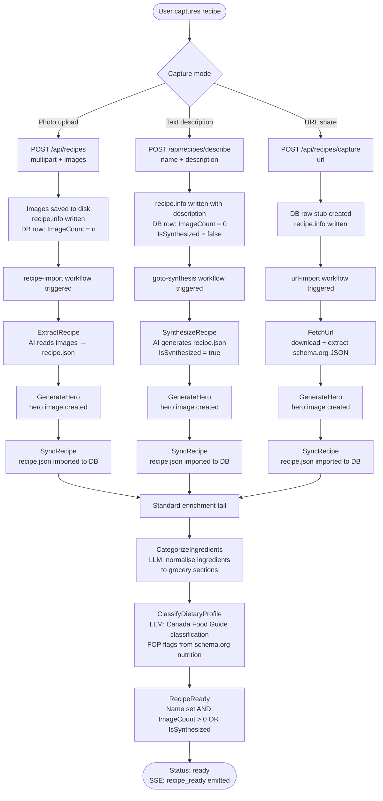

# Recipe Readiness — Data Flow

How a recipe transitions from the moment of capture (image upload or text description) all the way to `ready`.

## Domain definition

A recipe is **ready** when the full capture-to-import pipeline has completed for its path:

**Photo-upload path:**
1. User uploads images → stored in `data/recipes/{id}/original/`, `recipe.info` written, DB row inserted (`ImageCount > 0`)
2. `ExtractRecipe` — AI reads the images and produces `recipe.json`
3. `GenerateHero` — hero image created
4. `SyncRecipe` — `recipe.json` imported to DB (name, ingredients, metadata)
5. `CategorizeIngredients` — LLM normalises ingredient names to grocery sections
6. `ClassifyDietaryProfile` — LLM classifies against Canada's Food Guide; FOP flags computed from schema.org nutrition
7. `RecipeReady` — validates Name is set and `ImageCount > 0` → **ready**

**Describe path (goto-synthesis):**
1. User submits name + description → `recipe.info` written with description, DB row inserted (`ImageCount = 0`, `IsSynthesized = false`)
2. `SynthesizeRecipe` — AI generates full `recipe.json` from description; sets `IsSynthesized = true`
3. `GenerateHero` — hero image created
4. `SyncRecipe` — `recipe.json` imported to DB (name, ingredients, metadata)
5. `CategorizeIngredients` — LLM normalises ingredient names to grocery sections
6. `ClassifyDietaryProfile` — LLM classifies against Canada's Food Guide
7. `RecipeReady` — validates Name is set and `IsSynthesized = true` → **ready**

**URL import path:**
1. User shares a recipe URL → DB row stub created, `recipe.info` written
2. `FetchUrl` — downloads page, extracts schema.org JSON-LD
3. `GenerateHero` — hero image created
4. `SyncRecipe` — extracted metadata imported to DB
5. `CategorizeIngredients` — LLM normalises ingredient names to grocery sections
6. `ClassifyDietaryProfile` — LLM classifies against Canada's Food Guide; FOP flags from schema.org nutrition if published
7. `RecipeReady` — validates readiness → **ready**

## Computed rule

The ready state is computed on every call to `GET /api/recipes/{id}/status`. It is **not stored** in the database.

```
Photo-upload:  Name != null/empty  AND  ImageCount > 0
Describe:      Name != null/empty  AND  IsSynthesized = true
URL import:    Name != null/empty  AND  ImageCount > 0
```

## Full flow — capture to ready

All three import workflows share the same enrichment tail that runs **after** the recipe is synced to the database:

```
→ CategorizeIngredients   (LLM: normalise ingredient names into grocery sections)
→ ClassifyDietaryProfile  (LLM: classify against Canada's Food Guide, compute FOP flags)
→ RecipeReady             (validates readiness gate, emits SSE recipe_ready)
```

`recipe-description-regeneration` is the only exception: it runs `ClassifyDietaryProfile` (with `forceReclassify: true`) but does **not** run `CategorizeIngredients` or `RecipeReady`.


```mermaid
flowchart TD
    A([User captures recipe]) --> B{Capture mode}

    B -->|Photo upload| C[POST /api/recipes\nmultipart + images]
    B -->|Text description| D[POST /api/recipes/describe\nname + description]
    B -->|URL share| E[POST /api/recipes/capture\nurl]

    C --> C1[Images saved to disk\nrecipe.info written\nDB row: ImageCount = n]
    D --> D1[recipe.info written with description\nDB row: ImageCount = 0\nIsSynthesized = false]
    E --> E1[DB row stub created\nrecipe.info written]

    C1 --> G[recipe-import workflow triggered]
    D1 --> H[goto-synthesis workflow triggered]
    E1 --> I[url-import workflow triggered]

    G --> G1[ExtractRecipe\nAI reads images → recipe.json]
    G1 --> G2[GenerateHero\nhero image created]
    G2 --> G3[SyncRecipe\nrecipe.json imported to DB]

    H --> H1[SynthesizeRecipe\nAI generates recipe.json\nIsSynthesized = true]
    H1 --> H2[GenerateHero\nhero image created]
    H2 --> H3[SyncRecipe\nrecipe.json imported to DB]

    I --> I1[FetchUrl\ndownload + extract schema.org JSON]
    I1 --> I2[GenerateHero\nhero image created]
    I2 --> I3[SyncRecipe\nrecipe.json imported to DB]

    G3 --> TAIL[Standard enrichment tail]
    H3 --> TAIL
    I3 --> TAIL

    TAIL --> T1[CategorizeIngredients\nLLM: normalise ingredients\nto grocery sections]
    T1 --> T2[ClassifyDietaryProfile\nLLM: Canada Food Guide classification\nFOP flags from schema.org nutrition]
    T2 --> T3[RecipeReady\nName set AND ImageCount > 0 OR IsSynthesized]

    T3 --> R([Status: ready\nSSE: recipe_ready emitted])
```

## RecipeReadyProcessor

`api/src/RecipeApi/Services/Processors/RecipeReadyProcessor.cs`

The final step in all import workflows. It validates the upstream work is complete and logs a warning if not. It does **not** mutate any fields — `ImageCount` is set at upload time, `IsSynthesized` is set by `RecipeAgent.DoSynthesizeRecipeAsync`.

## Status query

`GET /api/recipes/{id}/status` → `RecipeService.GetRecipeStatus()`

```csharp
var isReady = (!string.IsNullOrWhiteSpace(recipe.Name) && recipe.ImageCount > 0)
           || (!string.IsNullOrWhiteSpace(recipe.Name) && recipe.IsSynthesized);
var status = isReady ? "ready" : "pending";
```

Returns `RecipeStatusDto { Id, Name, Status, ImageCount, IsSynthesized }`.

## Enrichment processors

| Processor | Workflow(s) | What it writes |
|-----------|-------------|----------------|
| `CategorizeIngredients` | recipe-import, url-import, goto-synthesis | Grocery section per ingredient into `ingredient_categories` |
| `ClassifyDietaryProfile` | all four (forceReclassify on description-regen) | `recipes.dietary_profile` (JSONB), `recipes.category` |
| `RecipeReady` | recipe-import, url-import, goto-synthesis | Emits `recipe_ready` SSE event |
