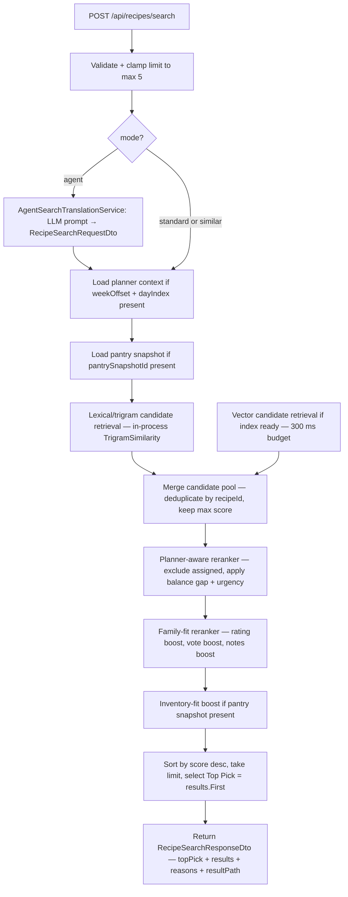
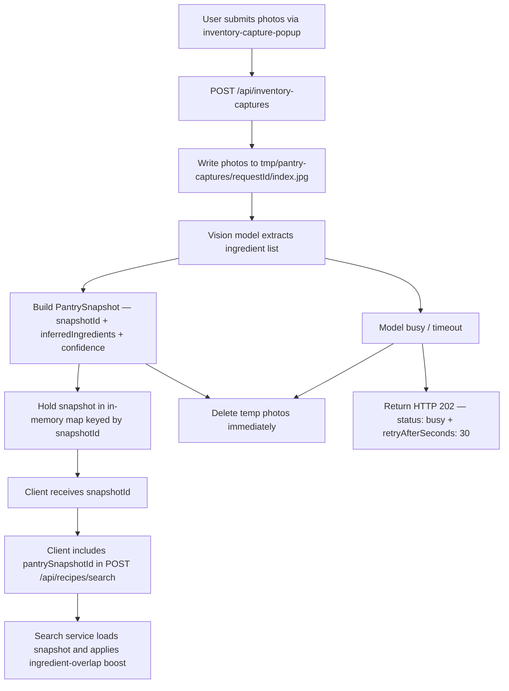
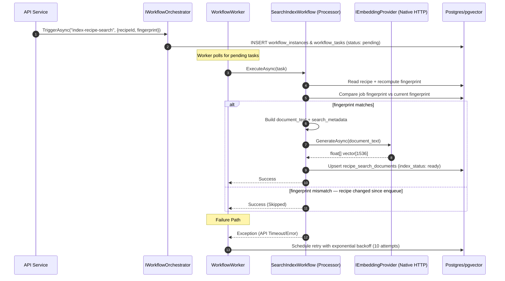
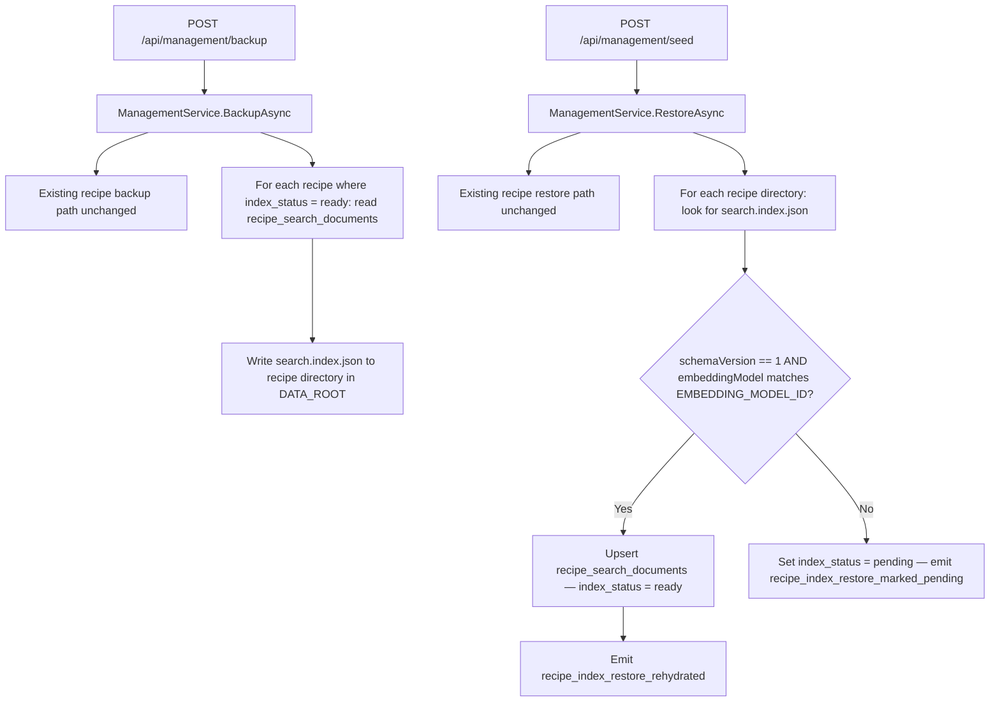
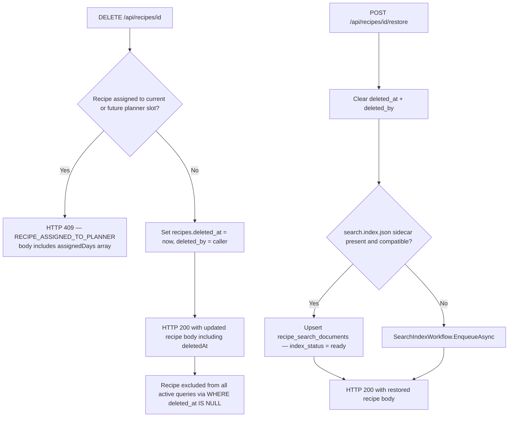
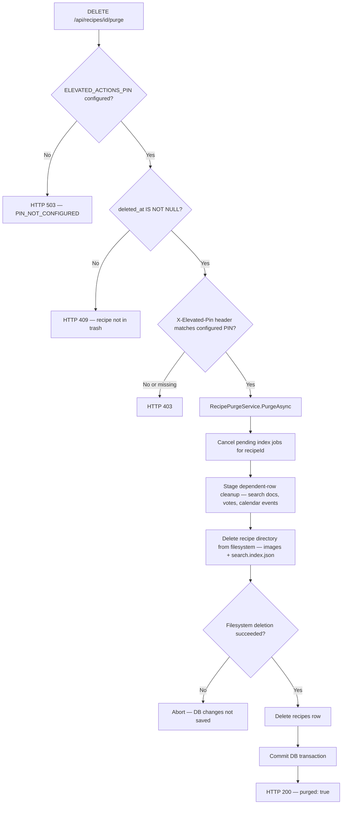
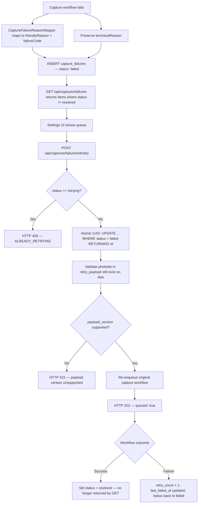
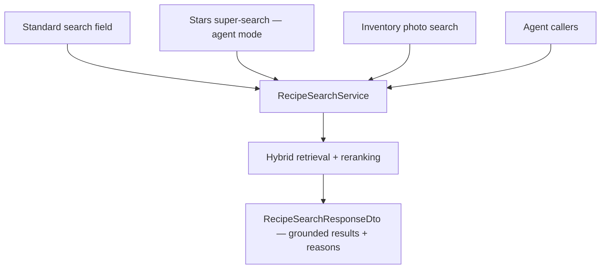

# Data Flow: Recipe Search Index And Recovery

**Related spec:** `.kiro/specs/semantic-recipe-search-v2/`

This document defines the data flow for:
- hybrid recipe search (lexical + vector),
- planner-aware and family-fit reranking,
- agent-mode super-search (server-side translation),
- pantry/fridge/freezer photo inventory search,
- vector indexing workflow (`SearchIndexWorkflow`),
- backup/restore-compatible index persistence (`search.index.json` sidecar),
- recycle-bin soft delete and hard delete purge,
- failed capture persistence and retry.

---

## Overview

Every search path — standard field, agent super-search, inventory photo, similar-recipe, and agent callers — flows through the same `RecipeSearchService`. There is one truth source for ranking. Callers may set different request fields (`mode`, `similarToRecipeId`, `pantrySnapshotId`) but they receive the same `RecipeSearchResponseDto`.

The implementation is staged:
1. Lexical/fuzzy retrieval (trigram similarity in-process)
2. Planner-aware and family-fit reranking
3. Vector indexing seam (`SearchIndexWorkflow`, `recipe_search_documents` table)
4. Backup/restore-compatible index persistence (`search.index.json` sidecar)
5. Hybrid retrieval (lexical + pgvector merged)
6. Recovery systems (Recycle Bin, Failed Captures)

That sequence keeps the product shippable at every step.

---

## Hybrid Search Pipeline



### Retrieval: lexical/trigram

Candidate scoring is computed entirely in-process (no external text-search service):
- `TrigramSimilarity(query, name)` → weighted 0.4
- `TrigramSimilarity(query, notes)` → weighted 0.3 (+ `NotesMatchBoost = 0.10` if score ≥ 0.3)
- `TrigramSimilarity(query, documentText)` → weighted 0.2
- Final score: `max(nameScore, notesScore, documentScore)` before modifiers
- Candidates below `MinimumCandidateScore = 0.20` are dropped from the pool
- Empty query: all non-deleted recipes are included as default candidates (score = 0)

`documentText` is built as:
```
<name>. <description>. Ingredients: <comma-joined>. Notes: <notes>.
```

### Retrieval: vector (pgvector)

- Column: `recipe_search_documents.embedding vector(1536)`
- Cosine similarity via pgvector.
- Budget: **300 ms** per request. If exceeded: skip vector path, set `resultPath = "fallback-lexical"`, emit `recipe_search_fallback_served` telemetry.
- `index_status` must be `ready` for a recipe to participate in vector retrieval.
- Soft-deleted recipes (`deleted_at IS NOT NULL`) are always excluded.
- Returns up to `limit × 3` candidates; merged with lexical pool, higher score kept.

### `resultPath` values

| Value | Meaning |
|-------|---------|
| `lexical-only` | No vector retrieval attempted (no embeddings configured or available) |
| `hybrid` | Both lexical and vector candidates contributed |
| `fallback-lexical` | Vector retrieval timed out or failed; lexical results served |

---

## Ranking: Score Modifiers

All score constants are named constants in `RecipeSearchService` — not magic numbers.

### Family-fit modifiers (applied to all searches)

| Signal | Modifier | Constant |
|--------|----------|----------|
| `rating == 3` (Love) | `+0.15` | `BoostLove` |
| `rating == 2` (Like) | `+0.08` | `BoostLike` |
| `rating == 1` (Dislike) | `−0.10` | `BoostDislike` |
| Positive discovery votes (normalised) | `+min(0.15, voteCount × 0.05)` | `BoostVotesMax / BoostVotesRate` |
| Notes match (score ≥ 0.3) | `+0.10` | `NotesMatchBoost` |

### Planner-fit modifiers (only when `weekOffset` + `dayIndex` provided)

| Signal | Modifier |
|--------|----------|
| Recipe closes weekly veggie gap (`VeggieDays < 4`) | `+0.20` |
| Recipe closes weekly protein gap (`ProteinDays < 3`) | `+0.20` |
| Recipe closes weekly grain gap (`GrainDays < 2`) | `+0.20` |
| Recipe closes plant-protein gap (`PlantProteinDays < 1`) | `+0.20` |
| Recipe `totalTime ≤ 30 min` AND query implies urgency | `+0.10` |
| Recipe already assigned in target week | Excluded entirely |

### Inventory-fit modifier (only when `pantrySnapshotId` provided)

```
+min(0.20, overlapRatio × 0.25)
where overlapRatio = matchedIngredients / totalIngredients
```

### Top Pick rule

Top Pick = `results.First()` after scoring and sort. It must have a non-null `plannerFitNote` when planner context is present. If no explicit note was assigned, the fallback is `"Not yet planned this week"`.

Every active modifier appears as a `RecipeSearchReasonDto` entry in the result's `reasons` array, with a `source` enum and a human-readable `label`.

---

## Agent-Mode Translation

When `mode: "agent"` is set, `AgentSearchTranslationService` translates the free-form `query` string into a structured `RecipeSearchRequestDto` using a server-side LLM prompt. The translated request then flows through the identical search pipeline — no separate retrieval branch, no separate ranking logic. The caller receives the same `RecipeSearchResponseDto` shape regardless of mode.

The translation is a thin service boundary: it may rewrite `query`, set `filters`, or infer `weekOffset`/`dayIndex` from the text. It does not fork ranking or maintain state.

---

## Inventory Photo Search Pipeline



The pantry snapshot is **request-scoped and in-memory only**. It is never persisted to the database, never included in backup/restore, and never retained between sessions. In-memory entries expire after 60 seconds (TTL). If the API process restarts, orphaned entries are gone naturally.

---

## Search Document Indexing

### `source_fingerprint` definition

The fingerprint is the SHA-256 hex digest of the following canonical JSON string (fields sorted alphabetically, values as JSON):

```json
{
  "category": "<value or null>",
  "description": "<value or null>",
  "difficulty": "<value or null>",
  "dietaryProfile": "<serialized or null>",
  "ingredients": ["<sorted array of strings>"],
  "isDiscoverable": true,
  "name": "<value>",
  "notes": "<value or null>",
  "rating": 0,
  "recipeId": "<uuid>",
  "totalTime": "<value or null>"
}
```

This exact field set and sort order is the single source of truth, implemented in `SearchFingerprintService`. Any deviation produces an incompatible fingerprint and a silent correctness bug.

### Index enqueue trigger points

A `SearchIndexWorkflow` workflow is triggered when a recipe is:
- created,
- updated in: `name`, `description`, `ingredients`, `notes`, `rating`, `isDiscoverable`, `dietaryProfile`, `category`, `totalTime`,
- restored from the Recycle Bin.

The trigger uses the `IWorkflowOrchestrator` to enqueue an `index-recipe-search` workflow.

---

## Search Index Workflow

Search indexing is now a first-class workflow managed by the `WorkflowWorker`. This provides built-in resilience, exponential backoff retries, and centralized observability.



### `index_status` transitions

```
pending → indexing  (job starts)
indexing → ready    (success)
indexing → failed   (embedding provider error or DB write conflict)
ready → stale       (re-enqueue detects fingerprint changed before indexing ran)
stale → indexing    (stale job picked up)
```

### Failure handling

| Failure | Action |
|---------|--------|
| Embedding provider timeout/error | `index_status = failed`; emit `recipe_index_job_failed` |
| DB write conflict | Retry once; if it fails again, `index_status = failed` |
| Hard-deleted recipe (`deleted_at IS NOT NULL`) | Job exits without writing |
| Stale fingerprint | Job exits without writing; no error raised |

Recipes with `embedding IS NULL` or `index_status != ready` are still searchable lexically via `document_text`.

---

## Backup And Restore: Search Index Sidecar



### `search.index.json` sidecar schema

```json
{
  "schemaVersion": 1,
  "recipeId": "<uuid>",
  "documentText": "<normalized text>",
  "searchMetadata": {},
  "embedding": [0.0],
  "embeddingModel": "<EMBEDDING_MODEL_ID>",
  "embeddingVersion": "<version or null>",
  "sourceFingerprint": "<sha256-hex>",
  "exportedAt": "<ISO 8601>"
}
```

Compatibility check on restore: `schemaVersion == 1` AND `embeddingModel == configured EMBEDDING_MODEL_ID`. Mismatch on either → mark `index_status = pending`, do not upsert stale vectors.

### Why this matters

Disaster recovery must not require a full re-embed pass before search becomes useful. Recipes restored with compatible sidecar artifacts are immediately lexically AND semantically searchable. Recipes without compatible sidecars are lexically searchable immediately and semantically searchable after the background backfill job completes.

---

## Soft Delete And Restore Flow



### Active query exclusion rule

**All** queries returning recipes to active surfaces must include:

```sql
WHERE recipes.deleted_at IS NULL
```

This applies to: library listing, search candidate retrieval, discovery sources, planner suggestion/fill-the-gap. Global query filter on `RecipeDbContext` enforces this; `IgnoreQueryFilters()` is used only in purge and trash list paths.

---

## Hard Delete Purge Flow



`RecipePurgeService` removes known dependent rows explicitly before removing the recipe row, including `recipe_search_documents`, `recipe_votes`, and `calendar_events`. This keeps hard delete resilient even if cascade behavior differs between the EF model and the backing database. Filesystem cleanup runs **before** the DB save. If the filesystem step fails, the DB row is not touched — the recipe stays in the trash and the error is surfaced. This prevents half-deletes.

---

## Failed Capture Persistence And Retry



### Retry idempotency

The `status = retrying` guard is a single `UPDATE … WHERE status = 'failed' RETURNING id` — not a read-then-write. Two concurrent taps of the Retry button produce exactly one workflow enqueue.

### `retry_payload` versioning

```json
{
  "version": 1,
  "sourceType": "url | photos | describe",
  "url": "string | null",
  "description": "string | null",
  "photoIds": ["string"] | null
}
```

Implementations must check `payload_version` before reconstructing the workflow request. If photos referenced by `photoIds` are missing on disk, the retry fails gracefully with an updated `friendlyReason`.

---

## Caller Unification



Do not build separate ranking logic for UI and agent callers. The caller requests different `mode` values, but the same `RecipeSearchService` answers all of them.

---

## Telemetry Events

All events are structured log entries via `ISearchTelemetry` (default impl: `LoggingSearchTelemetry`).

| Event | Payload |
|-------|---------|
| `recipe_search_requested` | `{ mode, hasPlanner, hasFilters, hasPantry }` |
| `recipe_search_completed` | `{ mode, resultPath, resultCount, topPickPresent, durationMs }` |
| `recipe_search_fallback_served` | `{ reason: "vector_timeout \| vector_unavailable" }` |
| `recipe_search_empty_results` | `{ mode, filtersApplied }` |
| `recipe_index_job_started` | `{ recipeId, fingerprint }` |
| `recipe_index_job_completed` | `{ recipeId, durationMs }` |
| `recipe_index_job_failed` | `{ recipeId, error }` |
| `recipe_index_job_stale` | `{ recipeId, reason: "fingerprint_mismatch" }` |
| `recipe_index_restore_rehydrated` | `{ recipeId }` |
| `recipe_index_restore_marked_pending` | `{ recipeId, reason: "missing \| incompatible" }` |
| `pantry_photo_processing_started` | `{ requestId, photoCount }` |
| `pantry_photo_processing_completed` | `{ requestId, durationMs, ingredientCount }` |
| `pantry_photo_processing_busy` | `{ requestId }` |

Latency targets (initial defaults, to be tuned after first production telemetry pass):

| Path | Target p95 |
|------|-----------|
| Lexical-only | ≤ 350 ms |
| Hybrid (lexical + vector) | ≤ 800 ms |
| Agent-mode | ≤ 1200 ms |
| Pantry-photo assisted | ≤ 15 s (or HTTP 202 busy) |
| Vector budget inside request | ≤ 300 ms |

---

## Primary Failure Modes

| Failure | Expected behavior |
|---------|-------------------|
| Vector provider unavailable | Lexical search still returns results (`fallback-lexical`) |
| Vector lookup exceeds 300 ms budget | Lexical fallback served, telemetry records fallback |
| Indexing failed for one recipe | Recipe still searchable lexically |
| Stale index job completes late | Worker exits without overwriting newer state |
| Restored backup missing search sidecar | Recipe restores, `index_status = pending`, lexically searchable immediately |
| Restored backup has incompatible sidecar | Recipe restores, `index_status = pending`, reindex scheduled |
| Recipe soft-deleted | Excluded from all active surfaces via global query filter |
| Elevated PIN missing or invalid for purge | HTTP 403 — dangerous action safely denied |
| Elevated PIN env var not configured | HTTP 503 — purge unavailable until configured |
| Filesystem cleanup fails during purge | Operation surfaces error, DB row not touched |
| Capture retry already in progress | HTTP 409 — second enqueue blocked by CAS guard |

---

## Blind Spots To Watch

1. Query-state loss after detail close is primarily a UX problem but often starts as a data-flow ownership bug. `openDetailRecipeId` in page state must never clear `topPick` or `results`.
2. Hard delete without explicit file cleanup can leave orphaned disk state — filesystem first, then DB.
3. Restore without reindex can reintroduce a recipe invisible to semantic search — enqueue is the fallback.
4. If capture failures rely only on SSE or transient stores, Settings recovery will not survive reload. The `capture_failures` DB table is the durable source.
5. `source_fingerprint` algorithm must stay in `SearchFingerprintService` — never reimplemented elsewhere. Two independent implementations will silently diverge.
6. Changing `EMBEDDING_MODEL_ID` without a full reindex produces a mixed-model index that will return inconsistent similarity scores.
