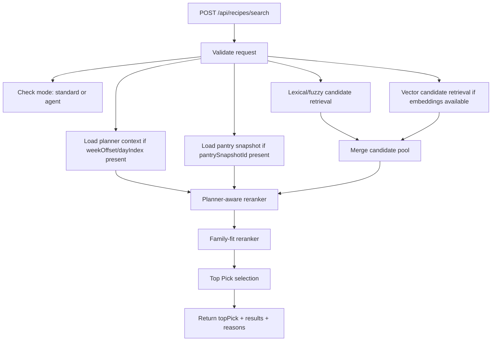
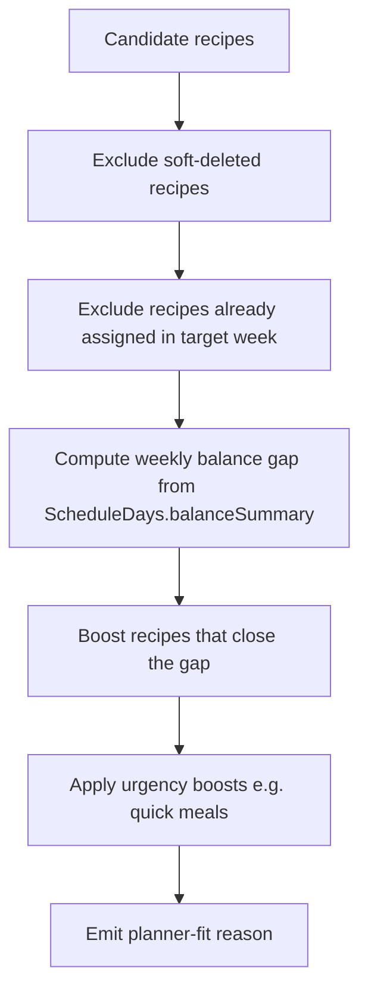
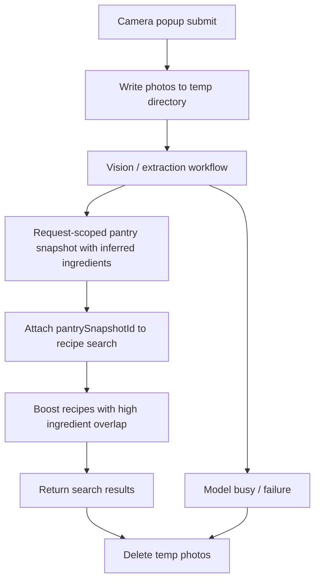
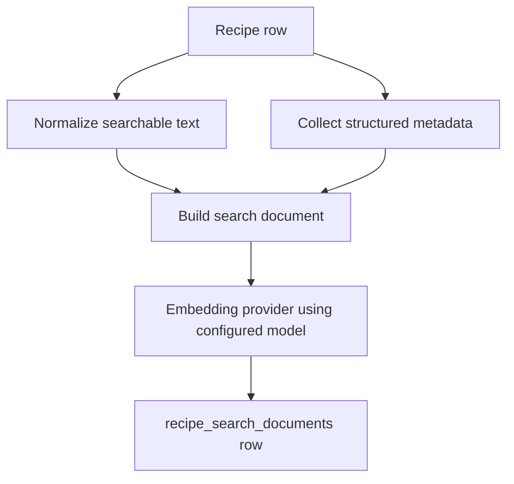
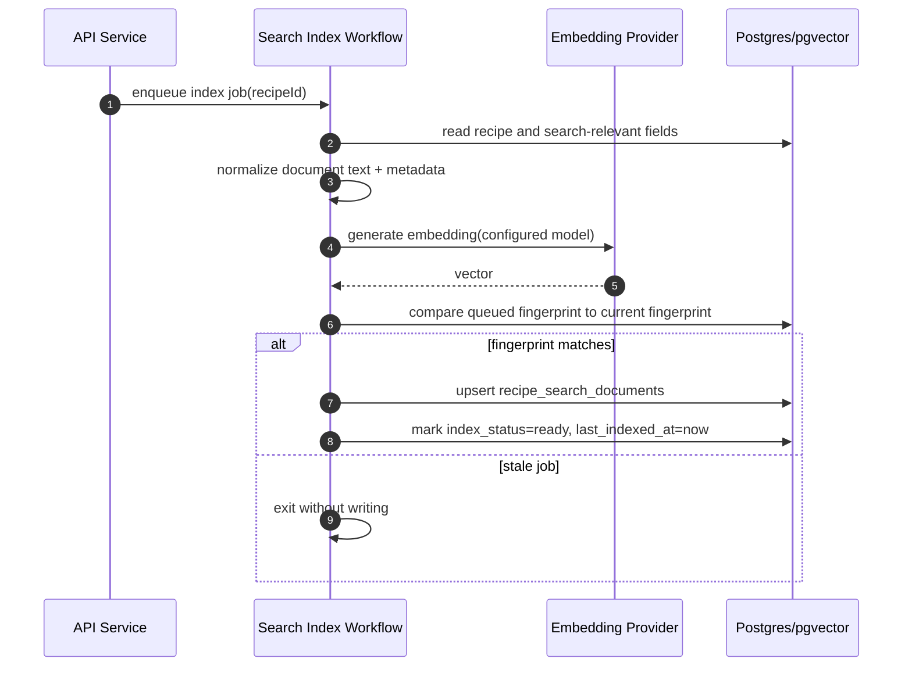
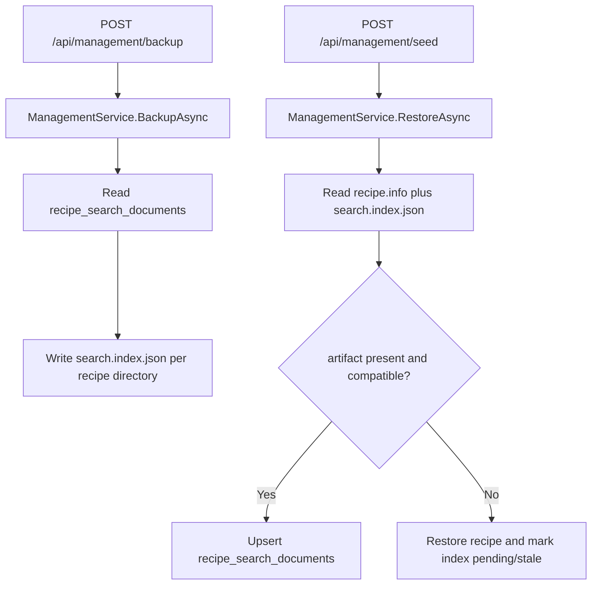
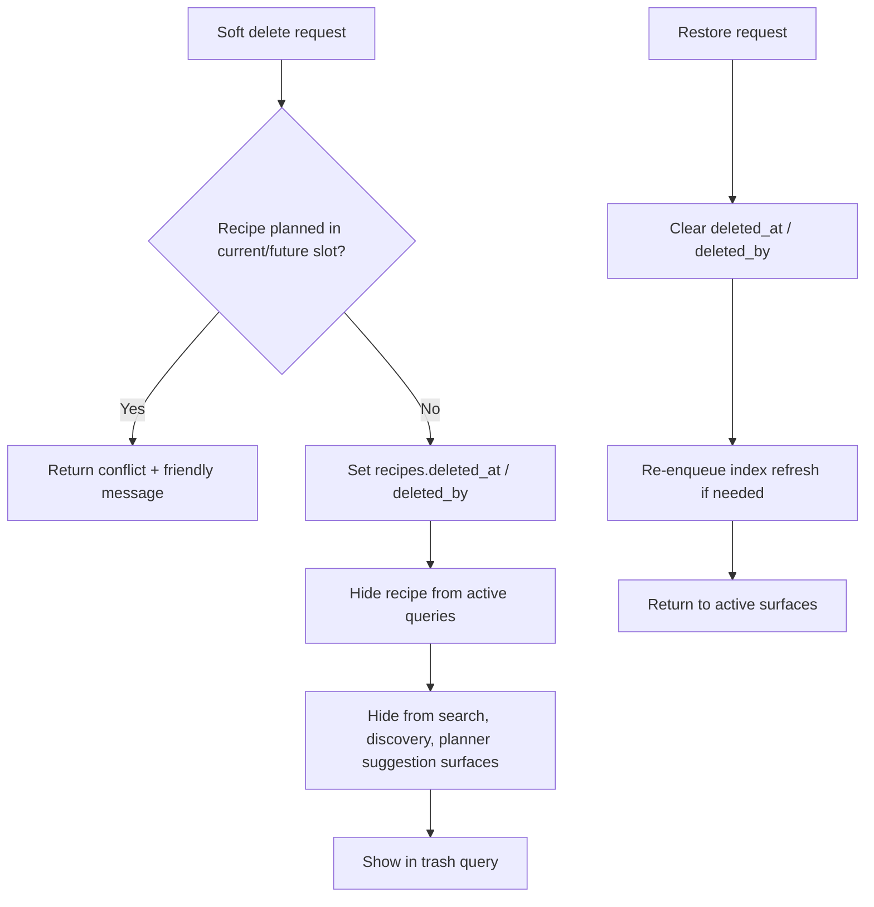
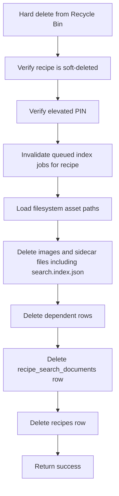
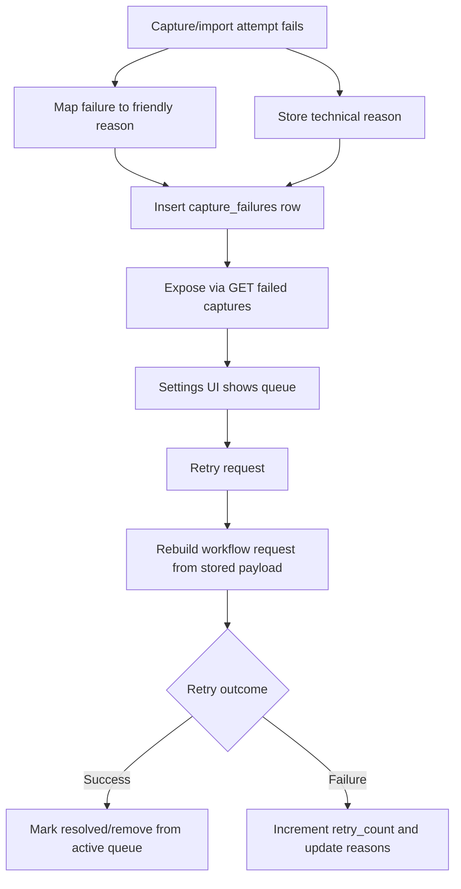
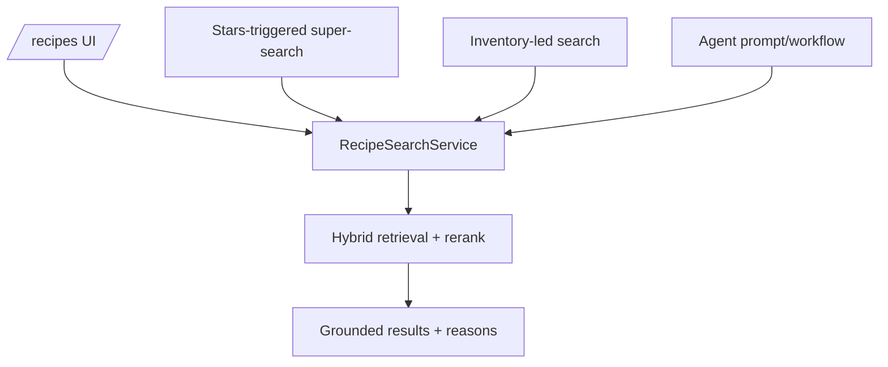

# Data Flow: Recipe Search Index And Recovery

**Related spec:** `.kiro/specs/semantic-recipe-search/`

This document defines the intended data flow for:
- hybrid recipe search,
- stars-triggered agent-mode super-search,
- pantry/fridge/freezer photo inventory search,
- vector indexing workflow,
- planner-aware reranking,
- recycle-bin soft delete / hard delete,
- failed capture persistence and retry.

---

## Overview

This feature should share one grounded search service across standard search, agent-mode super-search, inventory-led search, and agent callers.

The implementation is deliberately staged:
1. lexical/fuzzy retrieval,
2. planner-aware reranking,
3. vector indexing seam,
4. backup/restore-compatible index persistence,
5. hybrid retrieval,
6. recovery systems.

That sequence keeps the product shippable at every step.

---

## Hybrid Search Pipeline

### Retrieval stages

#### Lexical/fuzzy retrieval

Primary sources:
- recipe name,
- description,
- ingredients,
- notes,
- category/dietary metadata.

Implementation candidates:
- `pg_trgm` similarity,
- full-text ranking,
- weighted text columns.

#### Vector retrieval

Primary source:
- `recipe_search_documents.embedding`

Vector retrieval should be optional per query execution. When unavailable, the pipeline must continue with lexical candidates only.

### Request budget rule

- Vector lookup gets a 300ms budget inside the request path.
- If that budget is exceeded, the request should complete using lexical candidates for that execution and emit fallback telemetry.

---

## Planner-Aware Reranking

### Inputs

- `weekOffset`
- `dayIndex`
- current week assignments
- `WeeklyBalanceSummaryDto`
- query semantics (`quick`, `fresh`, `comfort`, etc.)

### Output

A planner-fit score that participates in final ranking and explains why a result became `Top Pick`.

---

## Inventory Photo Search Pipeline

This path should support pantry, fridge, and freezer photos without becoming a separate recipe-capture flow.

The pantry snapshot is request-scoped only. The feature does not retain pantry-photo history, search history, or pantry snapshot history, and these temporary artifacts are excluded from backup and restore.

---

## Search Document Indexing

### Document shape

A search document should combine raw searchable text and structured signals.

### Suggested search document inputs

- `name`
- `description`
- `ingredients`
- `notes`
- `difficulty`
- `totalTime`
- `category`
- `dietaryProfile`
- `rating`
- `isDiscoverable`
- `lastCookedDate`
- discovery/family-interest signals

### Trigger points

Enqueue or refresh index when:
- recipe created,
- notes updated,
- rating updated,
- discoverable status changed,
- dietary profile changes,
- recipe restored from Recycle Bin.

Jobs are keyed by `recipeId + source_fingerprint`. Duplicate jobs for unchanged content are safe no-ops.

### Durable artifact

Each indexed recipe should also have a `search.index.json` sidecar artifact written during management backup so the semantic index can be restored without a new embedding call.

---

## Index Workflow

### Failure handling

If indexing fails:
- `index_status` should become `failed`,
- lexical search should still work,
- the document can be retried later.

If indexing remains `pending` or `stale` for more than 10 minutes, operational instrumentation should treat the index as unhealthy.

If a job fingerprint is stale, it should exit without changing current DB or disk state.

---

## Backup And Restore Management Flow

### Restore rules

- Restore should not block recipe recovery when the search artifact is absent.
- Restore should not re-call the embedding provider when the saved artifact is compatible.
- Model/version mismatch should degrade to pending reindex, not hard failure.
- Restored recipes should remain lexically searchable immediately, even while semantic rehydration is still pending.
- Restore establishes the current valid search state, so older queued jobs may not overwrite restored artifacts.

---

## Soft Delete And Restore Flow

### Query rule

All active recipe query paths must exclude `deleted_at IS NOT NULL`, including:
- library listing,
- search candidate retrieval,
- discovery sources,
- planner default/suggestion/search sources.

---

## Hard Delete Purge Flow

### Safety note

This purge must be owned by a dedicated service. The operation should not be a casual controller-level delete.

---

## Failed Capture Persistence And Retry

### Stored payload rules

The retry payload should preserve enough information to rerun the import but should avoid unnecessary sensitive data duplication.

---

## Caller Unification: UI, Inventory Search, And Agent

### Rule

Do not build separate ranking logic for UI and agent. The caller may request different formatting, but not a different truth source.

---

## Primary Failure Modes

| Failure mode | Expected behavior |
|---|---|
| vector provider unavailable | lexical search still returns results |
| vector lookup exceeds request budget | lexical fallback is served and telemetry records fallback |
| indexing failed for one recipe | recipe still searchable lexically |
| stale index job completes late | worker exits without overwriting newer state |
| restored backup missing search artifact | recipe restores and remains lexically searchable until reindex |
| restored backup has incompatible search artifact | recipe restores and index is marked pending/stale |
| recipe is soft-deleted | excluded from active surfaces, visible in trash |
| elevated PIN missing or invalid for purge | dangerous action is denied safely |
| hard delete filesystem cleanup fails | operation surfaces failure and does not silently half-delete |
| capture retry fails again | failed capture row remains visible with updated reason |

---

## Instrumentation Baseline

The feature should emit structured telemetry for:
- search duration,
- search mode,
- result path (`lexical-only`, `hybrid`, `fallback-lexical`),
- empty-result rate,
- top-pick generation success,
- index job duration,
- index job success/failure,
- queue depth and counts of `pending`, `stale`, `failed`,
- pantry-photo processing duration and busy/failure rate,
- restore artifact compatibility failures.

These defaults should seed a broader app-wide instrumentation pass later.

---

## Test Map

### Unit

- search document building
- ranking boost calculations
- planner-fit scoring
- friendly failure mapping

### Integration

- search endpoint with lexical retrieval
- hybrid retrieval fallback behavior
- management backup/restore round-trip for semantic index
- delete/restore/purge lifecycle
- failed capture persistence and retry

### E2E

- planner search selection loop
- restore from trash loop
- failed capture retry loop

---

## Blind Spots To Watch

1. Query-state loss after detail close is primarily a UX problem but often starts as a data-flow ownership bug.
2. Hard delete without explicit file cleanup can leave orphaned disk state.
3. Restore without reindex can reintroduce a recipe that is invisible to semantic search.
4. If capture failures rely only on SSE or transient stores, Settings recovery will not survive reload.
5. Search-index artifact version drift can silently degrade restore quality if compatibility rules are not explicit.
