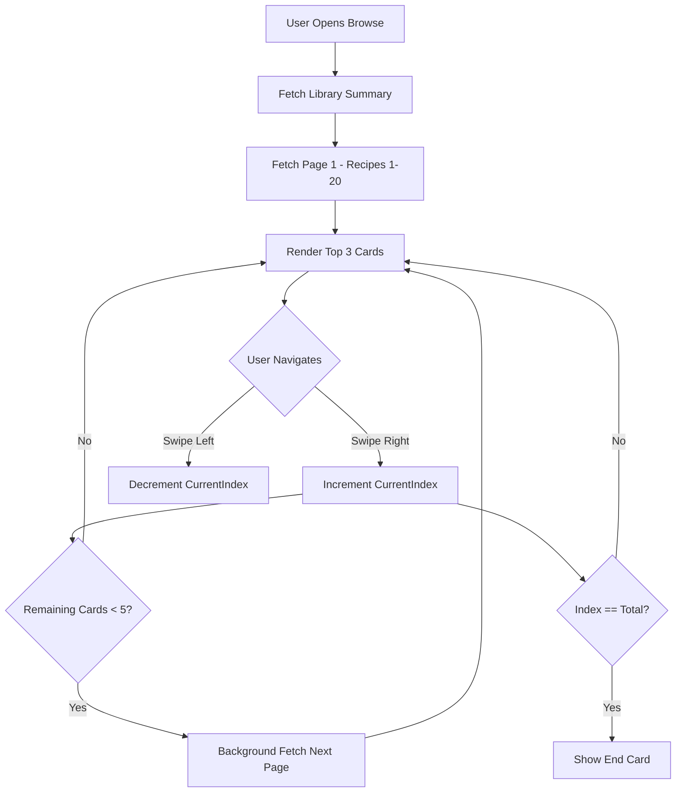

# Data Flow: Recipe Stack Browse

This document describes how data is retrieved, paged, and managed within the Recipe Stack Browse feature.

## Data Retrieval Logic

The browse stack uses a dedicated pagination and sorting strategy to ensure a smooth, exploratory experience without loading the entire library into memory.

### 1. Library Summary
On mount, the PWA fetches a lightweight summary to provide immediate context to the user.

- **Endpoint**: `GET /api/recipes/library-summary`
- **Payload**:
  ```json
  {
    "data": {
      "total": 156,
      "neverCooked": 42,
      "ratings": { "love": 20, "like": 80, "dislike": 5, "unrated": 51 }
    }
  }
  ```
- **Purpose**: Populates the "Total" part of the `{position} / {total}` indicator immediately.

### 2. Explore Ordering
Recipes are fetched in pages using a specific sort order designed for rediscovery.

- **Endpoint**: `GET /api/recipes?order=explore&page=N&limit=20`
- **Sort Logic**: `lastCookedDate ASC NULLS FIRST`
  1. `NULL` lastCookedDate (Never cooked)
  2. Earliest `lastCookedDate` (Oldest cooked)
- **Exclusions**: Always excludes soft-deleted recipes (`deletedAt IS NULL`).

## Paging & Pre-fetching Flow



## State Management

The `browseStackStore` (Zustand) manages the lifecycle of the stack data:

| State Variable | Role |
|----------------|------|
| `recipes` | The currently loaded set of `RecipeDto` objects. |
| `currentIndex` | The 0-based pointer to the front card. |
| `totalCount` | The total number of recipes in the library (from summary). |
| `isLoading` | Prevents redundant background fetches during pre-fetching. |

### Optimistic Updates
When a user toggles "Discoverable" from the stack:
1. The store updates the local `RecipeDto` immediately.
2. A `PATCH /api/recipes/{id}` request is sent in the background.
3. If the request fails, the store reverts the local state to its previous value.

## Performance Optimizations
- **Virtual Stack**: Only the top 3-4 recipes from the `recipes` array are rendered in the DOM to keep Framer Motion animations fluid.
- **Background Loading**: Pre-fetching occurs when the user is 5 cards away from the end of the current buffer, ensuring zero wait time between pages for typical browsing speeds.
- **Static Summary**: The total count is fetched once and assumed stable during the session.
